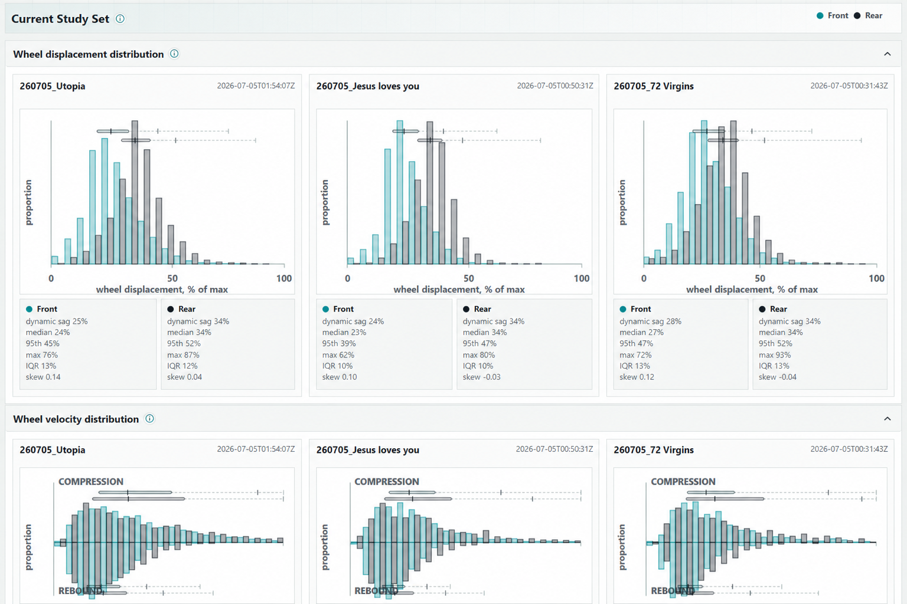
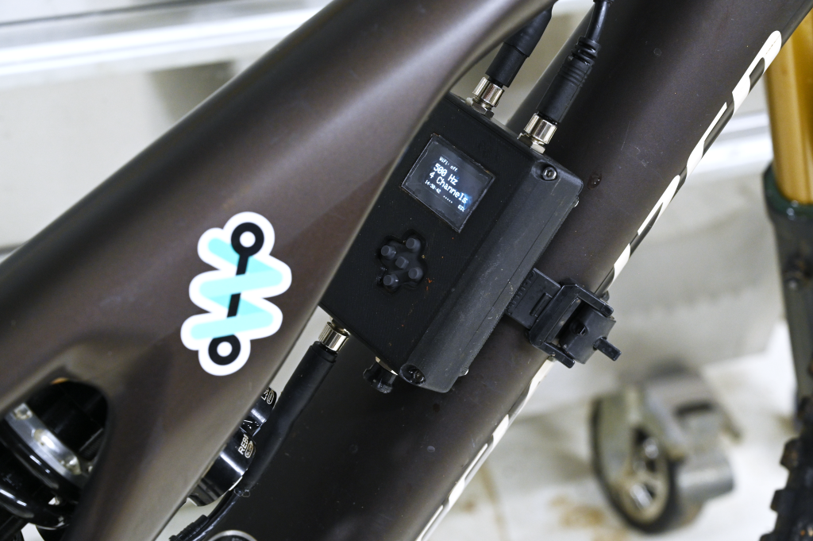
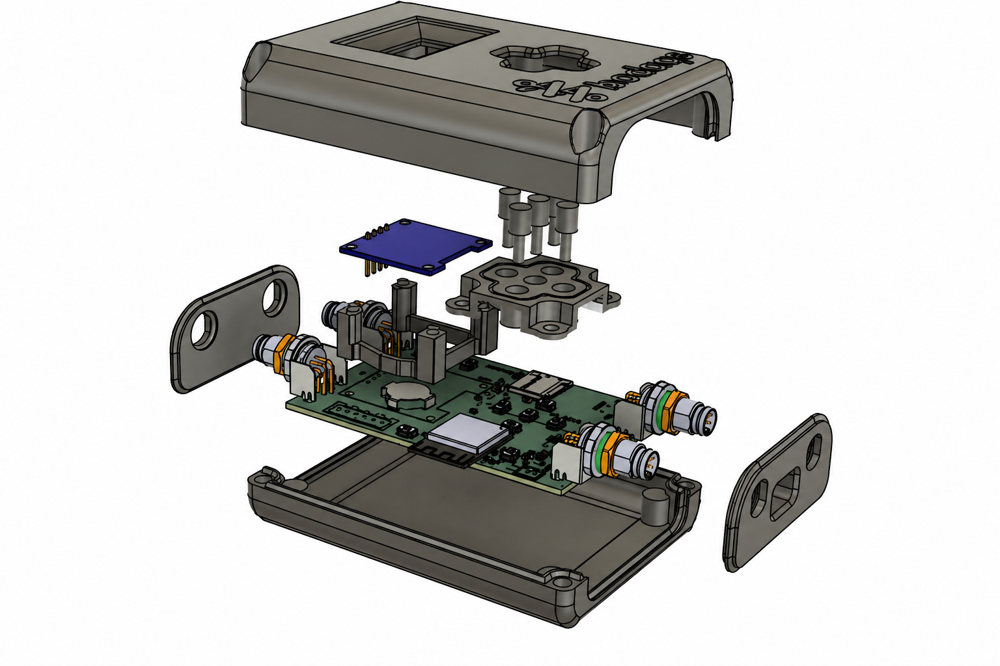
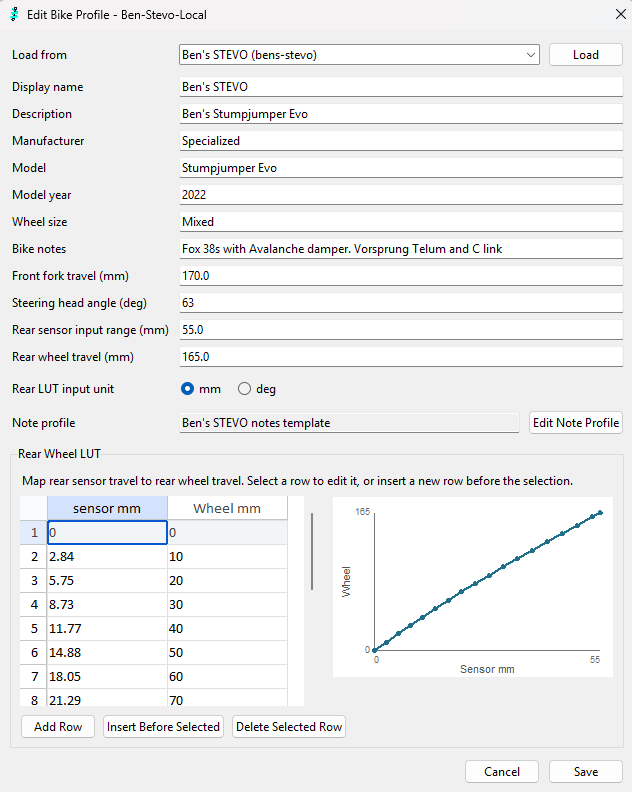

<table>
  <tr>
    <td width="50%">
      
    </td>

   <td width="50%">
      
    </td>
  </tr>
  <tr>
    <td width="50%">
      
    </td>
    <td width="50%">
      
    </td>
  </tr>
</table>

Current releases [here](https://github.com/benconnor1972/BODAQS/blob/main/RELEASES.md)

# Bicycle Open Data Acquisition System

BODAQS (Bicycle open data acquisition system) is an open-source, build-it-yourself data collection
and analysis system for mountain bikes, designed to be accessible to anyone with some DIY skills and a curiosity about what their bike is actually doing.

Data acquisition is ubiquitous in motorsport, and it's making its way into mountain-bike racing too. But for the engineering-minded (or budget-constrained), the choice is often between costly professional systems or consumer tools that keep the underlying data hidden.

BODAQS aims to offer an alternative: hardware that can be built with basic soldering skills using widely available parts; software with deep functionality and a structure designed for long-term expansion; and analysis built on powerful, free tools — alongside mounting and mechanical designs that can be 3D printed at home or produced at low cost. 

The project provides **open designs** for the hardware, software, analysis tools, and mechanical parts needed to collect and analyze mountain-bike data. It follows a build-it-yourself ethos, emphasising simplicity and low cost **without compromising functionality**.

## The problem with mountain bike (suspension) tuning

For most riders, suspension setup is a vibe-based, iterative guessing game: adjust a click, do a
run, wonder if that made things better or just 'different', repeat to exhaustion.

At the sharp end of gravity racing, teams with the budget chase these problems using data - but at a high cost. A few consumer products - notably Shockwiz, now owned by SRAM - have bridged the gap with a product that can provide meaningful suspension insight for most riders and be set up in under twenty minutes. But ShockWiz is a closed system: the algorithm is proprietary, the data never leaves the device, and if you run a coil shock, you're out of luck.

For the rider who wants to go deeper, wants to do more with the data, or whose coil setup isn't
supported,the choice has been: trust a black box, go all in on professional equipment, or go
without.

## The device

The BODAQS logger is a compact, hackable, open-source data logger you build yourself from widely available
components using basic soldering skills and a 3D printer. It records inputs from suspension and other sensors, at up to 1000Hz, and stores the data as standard CSV files readable by almost anything. The device can connect to wifi to allow settings to be edited or log files downloaded using any device with a web browser.

A small OLED screen and keypad make it simple to use, and an optional
handlebar-mounted button lets you tag moments of interest mid-ride — a heavy landing, a sketchy
section — so they're easy to find later.

The full design is open: PCB schematics and layouts, firmware, case, sensor mounts and more are all available to build, hack, and improve. There's a full bill of materials, build guide and advice on where to purchase the parts required.

## The software

Recording data is an engineering problem. Deciding what it means is the harder part, and the part that actually matters for tuning.

The BODAQS software comprises two main components:

the Import Manager imports data from one or more loggers via file copy or WiFi, applies bike geometry information, does pre-processing calculations, matches GPS data from external devices and manages setup notes. The processed files live in your personal run library.
the BODAQS Workbench gives you the visualization tools to dig deep into what your bike is doing.
The whole package can be installed on your computer and run with or without an internet connection.

## Who it's for

BODAQS is designed to scale with the user — in both the build, and the analysis.

If you're new to data acquisition, the hardware guide walks you through assembling the
logger, and you'll have something real to look at after your first ride with a couple of sensors - or even just one. 

If you're a top-end rider, mechanic or suspension shop with your own battle-tested ideas on how a bike should be set up, you'll have something you can use to test out and validate your own ideas and work, race faster, or to add value to your customers. 

If you're a tinkerer, engineer, developer, data scientist or uncategorised nerd, you can contribute to the project. Code, designs, ideas, feedback - it's all welcome.

## Enough of the pitch - where's this thing actually at?

**TL;DR:** we've got a pretty usable first-generation system that runs from end to end: From sourcing and building your logger to analyzing your runs. There's still lots to do, but we think it can add value for most people in its current state.

- The hardware works well within the limits of what we have tested and we think the user experience is pretty good. 
- The system supports analog potentiometers for suspension displacement, AS5600 (12-bit) and AS5048B (14-bit) rotary encoders for measuring linkage rotation, and GPS (either dedicated receiver or integrating data from Garmin devices).
- We have our own end-to-end software solution that you can download and test out, as well as a [hosted demo](https://demo.bodaqs.net/). We're also compatible with [data.syn.bike](https://data.syn.bike) if you prefer to see your data presented that away.
- We have [sourcing](https://bodaqs.net/logger-build-guide/bodaqs-a8/sourcing-hardware/), [building](https://bodaqs.net/logger-build-guide/bodaqs-a8/building-the-logger/), and [user](https://bodaqs.net/user-guide/) guides.
- We have published packages for the [hardware](https://github.com/benconnor1972/BODAQS/tree/main/hardware/releases) and the [3d printed parts](https://github.com/benconnor1972/BODAQS/tree/main/mechanical/Case/a8_v1_0)
- We have a set of Jupyter Lab [analysis notebooks](https://github.com/benconnor1972/BODAQS/releases) for exploratory data analysis. The back end code is organised in Python modules and there is a documented [API](https://github.com/benconnor1972/BODAQS/blob/main/docs/analysis/contracts/BODAQS_Public_API_Contract_v0.md). 

What we're working on:
- Further development of the software. There is lots we want to do!
- Extending the range of supported sensors. We've gone heavy (overkill?) on our software design to make integration of additional sensor types simple, so now is the time to cash in. Our next priorities are wheel speed sensors and inertia-motion units.
- Collecting build feedback from our beta testers. We're looking for people who want to help with this!
- Getting the system under some faster riders - in the end, we want to do *data analysis*, not just build hardware and software.

## Ethos and inspiration

This project exists for many reasons but three specific precursors stand out:
 - ShockWiz: Nigel Wade's ground-breaking product, now owned by SRAM, is in a category of one: mountain bike suspension analysis products that can be set up by an average user in under 20 minutes and provide useful feedback to the vast majority of riders. I was a happy ShockWiz user for many years and probably still would be if I hadn't discovered coil suspension. An elegant product that extracts maximum insight from minimum hardware, with a simplicity that hides some very clever engineering.
 - Sufni: The first open-source mountain bike data acquisition project to cross my path. For a variety of reasons I decided to take a different path rather than build one, but it provided the seed of the idea and the use of Lego for sensor mounting deserves a credit of its own.
 - RepRap: The movement that gave birth to cheap and ubiquitous 3D printing wasn't driven by market analysis by some big corporation, but by people who wanted a thing they couldn't buy (at a reasonable price). The community development and sharing ethos persists to this day and the products available are massively better and cheaper than what was available just a few years ago.
