import { Aside, Badge} from '@astrojs/starlight/components';
import Lede from '../../../components/Lede.astro';

<Lede>
You will need to source a range of parts to build your BODAQS data logger.
A small selection of common tools is also required.
Some parts are optional or have budget and premium options.
</Lede>

<Aside type={"caution"} title="Model 4 Version Proto E SMD"  icon="seti:config">
    The following materials are for the Model 4 (4 analog inputs) prototype revision E SMD hardware revision.
    If you're building a different revision, some parts may differ.
</Aside>

## Printed circuit board
The printed circuit board (PCB) is custom-designed for this project. It is obtained by ordering it from a PCB fabricator or from someone else who has already done so.

{/* TODO */}
[Details to come – ordering a PCB directly]

{/* TODO */}
[Details to come – ordering a PCB from bodaqs.net]

<Aside>
 - If you order directly, consider pooling with your friends. The per-unit price and freight cost falls quickly for more than one unit
  - If you order directly, consider tipping bodaqs.net Ordering from me is a premium option as stocking, handling, postage etc takes time and I’m only one person.
</Aside>

## Electronic parts
#### Sparkfun ESP32 Thing Plus S3 development board.
  Make sure you purchase the correct variant: there are a wide range of ESP32 development boards even within the Sparkfun range. The correct board is [this one](https://www.sparkfun.com/sparkfun-thing-plus-esp32-s3.html). These are available from hobby electronics shops around the world, or from major global electronic distributors like Digikey and Mouser.
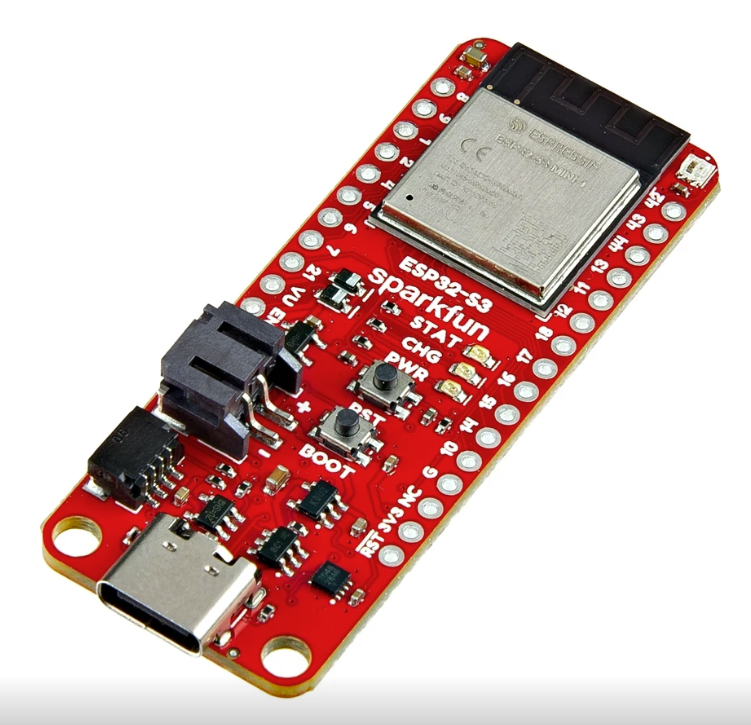

#### 0.96” OLED display
  These displays, based on an SSD1306 driver chip, are a commodity item and many vendors sell functionally equivalent versions. They do vary slightly in the physical dimensions of the board however, and some versions may require minor case modifications to install. [This vendor](https://www.aliexpress.com/item/1005009067594342.html) is one of many selling the module the case was built around. If the vendor posts an illustration like the one shown here, it’s probably the same one. If you buy something different, don’t worry – it can probably be installed with only minor modifications.
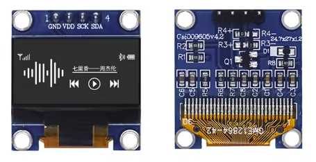
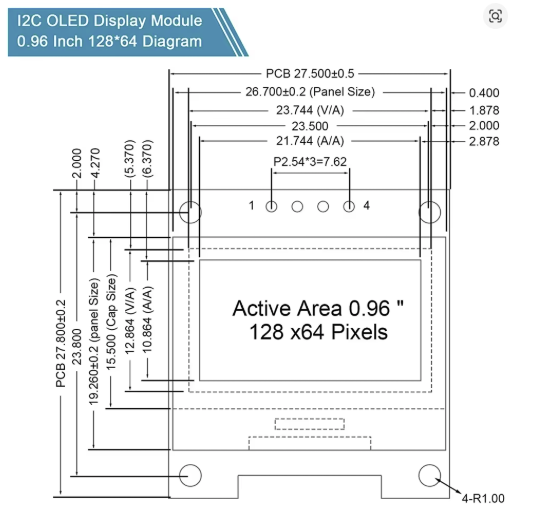

#### 5-key membrane keypad
  This is another commodity item available from many vendors on AliExpress, Amazon and Ebay, like [this one](https://www.aliexpress.com/item/1005006245093356.html). Search for variations of “5 button membrane keypad” or “5 key matrix keyboard”.
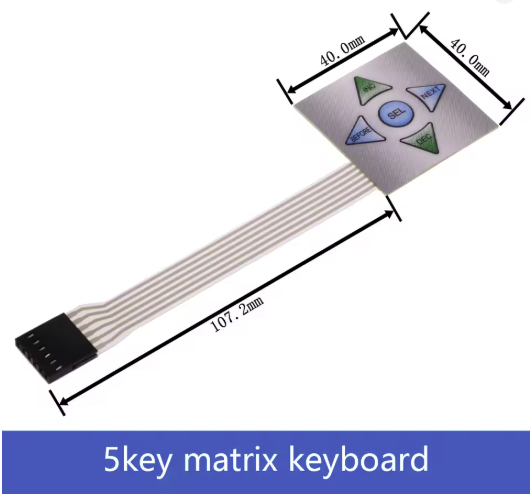

#### Li-ion battery
  The Li-ion battery is 18650 size, with JST-PH 2 pin connector. 18650 Li-ion cells are widely available as replacement parts from AliExpress, Amazon, Ebay and local vendors. For our purposes, all are equally good. However, make sure that:
    - The battery is an 18650
    - The battery’s capacity exceeds about 1000mAh
    - The battery comes with a 2-wire JST-PH connector. Some batteries are sold with JST-XH or SM-2P connectors, which are not the same and will not fit.
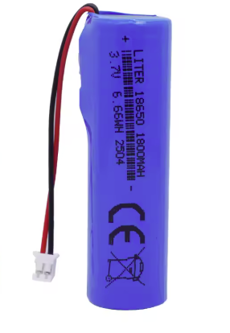

<Aside type={"caution"} title="Always check polarity before connecting">
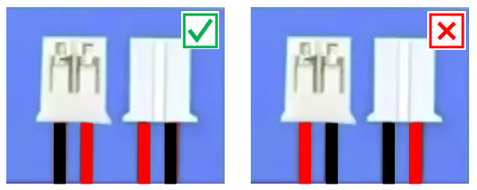
  Not all battery connectors are wired with the same polarity. Check and double check that the positive and negative leads from your battery are correctly oriented. If they are not oriented as shown, gently lift the tabs on the plastic connector housing with a needle or the edge of a craft knife, withdraw the leads and re-install them in the correct positions. If the leads are not color-coded, then test the cell with a multi-meter to determine positive and negative.

  **Do not connect a battery with the incorrect or unknown polarity as it will probably damage the development board.**

</Aside>

 #### QWIIC connector cable.
  The exact variation doesn’t matter: it just needs the QWIIC connector on one end. You will be cutting it and soldering the other ends into the OLED display. Available from AliExpress, Amazon and Ebay, or from major global electronic distributors like Digikey and Mouser.
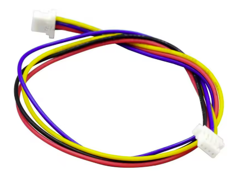

### Connectors

The BODAQS 4 logger has 6 external connectors: 4 analog inputs, one I2C bus and one connector for a handlebar-mounted switch. The connectors specified are DIN EN / IEC 61076-2-104 connectors, often referred to as M8 metal circular connectors.
- The 4 analog inputs and 1 remote switch use male 3-pin connectors, Amphenol 8-03PMMS-SH7001
- The I2C bus connection uses a male 4-pin connector, Amphenol 8-04PMMS-SH7001

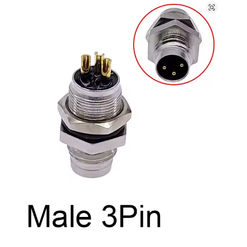
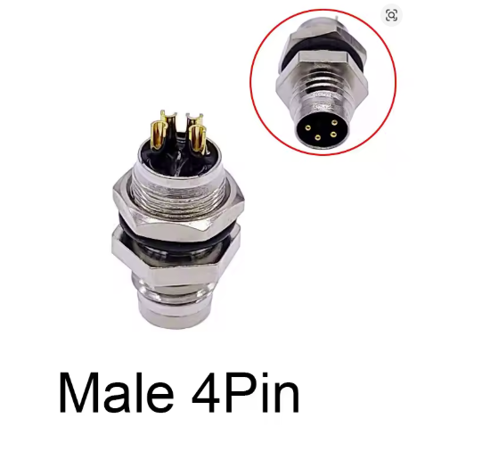

<Aside  title="Optional">
  Not all the connectors need to be installed. If you are only intending to run two analog inputs (linear pots for suspension, say) and don’t want a handlebar-mounted switch, you could build the logger with just two connectors.
  - The **premium** option for connectors is name brand connectors from TE Connectivity or Amphenol.
  - The **budget** option is AliExpress. 
  If you go premium, the connectors might be the most expensive part of your logger!
</Aside>

#### Plugs for the connectors.
These need to match the connectors. It is easiest to buy these as sealed cable tails and solder them to your sensor wires. There are many Amphenol options, or search for M8 connectors on AliExpress, Amazon or e-bay and look for something like the picture.
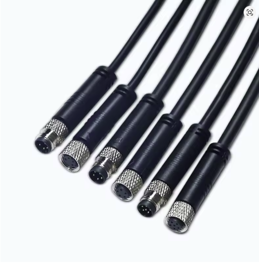

##  3D printed parts
The logger case is 3d printed and comprises four parts: a top and bottom part and two end pieces. The case can be printed on any modern 3D printer.

If you have a 3D printer, or know someone who does, you can print the parts yourself. Otherwise you can almost certainly find a local business that will print the parts for you. If you are ordering PCBs from JLCPCB or PCBway you could consider having them printed by the vendor at the same time.

<Aside title="Optional">
  Variants of the case end pieces are available should you not wish to install the full set of connectors.
</Aside>

### Notes on 3d printing the parts:
- Recommended material: PETG. Virtually any material will work as the mechanical stresses on the case are low. However the design contains some small flexures that, if printed in a brittle material and cycled often, will probably break.
- Preferred print orientation for the case top and bottom is vertical with supports. This will ensure that the flexures are not compromised by layer lines.
{/* TODO */}
The design files and STLs are available here [link to be added] and ready-to-print plates for BambuLab printers are here [link to be added]

### Sensors
The best starting set of sensors is two linear potentiometers (pots).
These sensors change their resistance according to how far they are compressed or extended, which makes them useful for measuring suspension movement.
Linear pots are available from a range of suppliers including major international electronics distributors, specialist suppliers of instrumentation, motorsport suppliers and manufacturers.
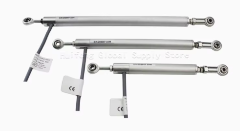

The most economical way to buy linear pots is on AliExpress.
There are numerous options, but I personally use [these items](https://www.aliexpress.com/item/1005008810289538.html).
Others report Miran KPM12 pots to be good value. When buying your linear pots, pay attention to:

- **Travel:**  Your pots must have more travel than what you are measuring. If in doubt go a size up, but no more than needed as longer pots can be harder to mount.
- **Physical dimensions:** Especially diameter. Around 12mm is ideal. Larger diameter pots get harder to mount.
- **Mountings:** Ideally the pot has spherical bearings (rose joints) at both ends
- **Resistance:** You want pots with 2-10 k-ohm full-range resistance.

### Tools
The following tools are <Badge variant="danger" text="Required" /> or <Badge text="Recommended" variant="caution"/>

#### Soldering iron
<Badge variant="danger" text="Required" /> You will be soldering pin headers into a PCB and short wires to connectors, so you will need a soldering iron suitable for electronics use and some solder around 0.8mm diameter.
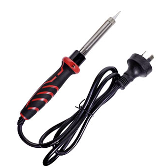
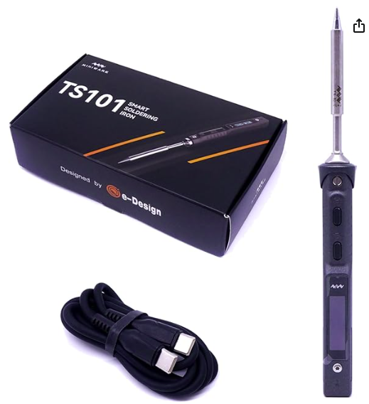

<Aside  title="Optional">
 The premium soldering iron option is a TS101 or Pinecil USB smart soldering iron. These feature a high power output, rapid heatup, and can be run with a lightweight cable, which makes them excellent for fine work. However, budget options can do the job just fine.
</Aside>

#### Side cutters
<Badge variant="danger" text="Required" /> You should get a small flush-cut set intended for electronics rather than a larger set intended for more general electrical work.
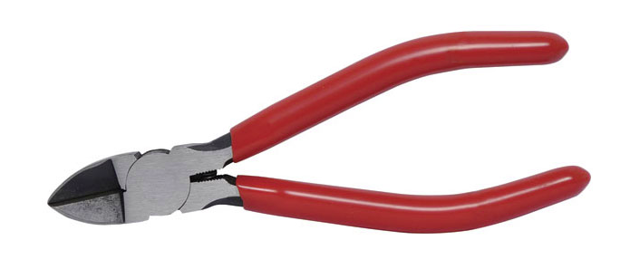

#### 2.5mm allen key
<Badge variant="danger" text="Required" /> For fitting the case together. If you don't have a decent set of allen keys, you can pick a set up from almost any hardware store

#### Wire strippers
<Badge text="Recommended" variant="caution"/> You can strip wire with side cutters if you are careful, or your teeth if you are a maniac, but these make it much easier.
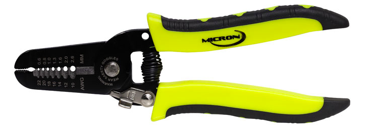

#### Multi-meter
<Badge text="Recommended" variant="caution"/> For polarity & continuity testingm and fault finding. Even a basic model is sufficient for the needs of this project. Not needed if everything goes perfectly.
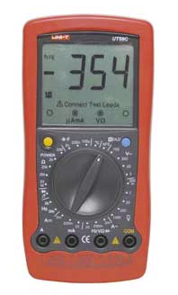

#### Miniature hot air gun
<Badge text="Recommended" variant="caution"/> For heating shrink-sleeve. A match, cigarette lighter, or glossy print of the author (price on request) can be used instead if necessary.

### Minor components and consumables
In addition, you will need:
- Some light-gauge (22, 24 or 26 gauge) hookup wire, preferably in four colors – less than a metre in total. You can get this from electronics hobby shops, online, or scavenge it from an old network cable.
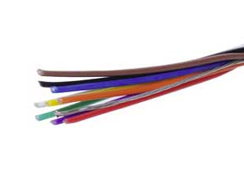
- 2.5mm shrink-sleeve for covering soldered joints
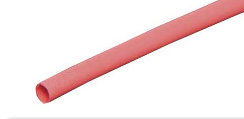
- Silicone sealant, for waterproofing

- 4 M3x16 socket-head cap screws and nuts to hold the case together
- (Optional but recommended): a small section of thin, transparent rigid plastic for waterproofing the screen. I cut up an old visor for this.

## Bill of Materials

| Qty | Item                                        | DigiKey                                                                                                  | AliExpress                                                          |
|-----|---------------------------------------------|----------------------------------------------------------------------------------------------------------|---------------------------------------------------------------------|
| 2   | Header strip pin for nav pad and UART       | —                                                                                                        | —                                                                   |
| 1   | SparkFun ESP32-S3 Thing Plus                | [DigiKey](https://www.digikey.com.au/en/products/detail/sparkfun-electronics/24408/22606864)             | —                                                                   |
| 1   | 0.96" OLED display (128×64, SSD1306)        | —                                                                                                        | [AliExpress](https://www.aliexpress.com/item/1005008738379315.html) |
| 1   | 5-key membrane keypad                       | —                                                                                                        | [AliExpress](https://www.aliexpress.com/item/1005006245093356.html) |
| 1   | QWIIC cable (50mm)                          | [DigiKey](https://www.digikey.com.au/en/products/detail/sparkfun-electronics/14427/7652740)              | [AliExpress](https://www.aliexpress.com/item/1005009291263030.html) |
| 1   | LiPo battery, 1000mAh+, 2-pin JST-PH        |                                                                                                          | —                                                                   |
| 2   | Linear potentiometers (75mm and 200mm)      |                                                                                                          | [AliExpress](https://www.aliexpress.com/item/1005008810289538.html)  |
| 5   | M8 back panel mount connector, 3-pin male   | [DigiKey](https://www.digikey.com/en/products/detail/amphenol-ltw/8-03PMMS-SH7001/7616639)               | [AliExpress](https://www.aliexpress.com/item/32840940523.html)      |
| 5   | M8 plug and cable tail, 3-pin female        | —                                                                                                        | [AliExpress](https://www.aliexpress.com/item/1005005615414536.html) |
| 1   | M8 back panel mount connector, 4-pin male   | [DigiKey](https://www.digikey.com.au/en/products/detail/amphenol-ltw/8-04PMMS-SH7001/7616711)            | [AliExpress](https://www.aliexpress.com/item/32840940523.html)      |
| 1   | M8 plug and cable tail, 4-pin female        | —                                                                                                        | [AliExpress](https://www.aliexpress.com/item/1005005615414536.html) |

