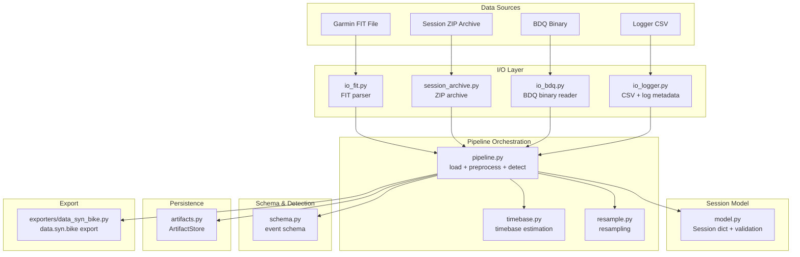
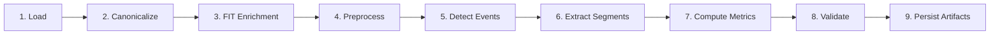
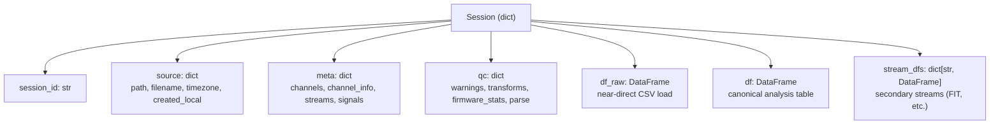
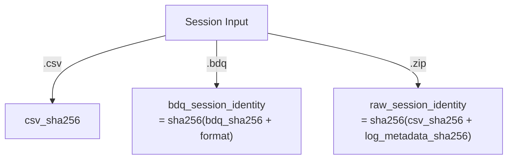

# Design: Analysis Data Pipeline

> **Backfilled** — this design doc documents an existing system as it currently
> behaves. It is not a forward design. Code is the source of truth; this doc
> describes what the code does.

## Problem Statement

The BODAQS Analysis Data Pipeline ingests raw bicycle telemetry from multiple
source formats (logger CSV, BDQ compact binary, Garmin FIT), normalizes them into
a canonical in-memory Session model, applies signal preprocessing (zeroing,
scaling, filtering, motion derivation, velocity/acceleration), optionally
enriches with GPS/watch data from FIT files, detects events and computes
metrics, and persists everything to a deterministic on-disk artifact layout for
notebook consumption. It exists to make bicycle suspension and motion analysis
reproducible across notebooks without shared kernel state.

## Background

BODAQS (Bicycle Open Data Acquisition System) is a custom ESP32-based logger
that records suspension travel, wheel motion, IMU, and other sensors at high
sample rates. The firmware writes either CSV logs (with optional JSON log
metadata sidecar) or self-contained BDQ compact binary archives. Riders may also
wear Garmin watches that produce FIT files containing GPS, speed, and altitude.

The analysis pipeline evolved from notebook-embedded code into a modular Python
package (`analysis/bodaqs_analysis/`). Key contracts are documented under
`docs/analysis/contracts/`:

- `BODAQS_Session_Schema_v0_1.md` — the v0 Session dict contract
- `BODAQS_Time_Handling_Contract_v0.md` — Option A trigger-grid time model
- `BODAQS_analysis_artifacts_specification_v0_2.md` — on-disk artifact layout
- `BODAQS_Event_Schema_Spec_v1_Full.md` — event detection schema
- `BODAQS_Metrics_Table_Contract_v0_2.md` — metrics table contract

The pipeline uses a plain-dict Session model (v0) rather than a class hierarchy,
prioritizing flexibility as firmware and analysis evolve.

## Goals

- **Multi-format ingestion**: Load logger CSV, BDQ binary, and session ZIP
  archives into a unified Session dict.
- **Canonical time axis**: Every session has a `time_s` column that is finite
  and monotonic non-decreasing, with per-stream timebase metadata.
- **Reproducible preprocessing**: All transforms (zeroing, scaling, filtering,
  motion derivation, VA) are recorded in `qc.transforms` so results are
  traceable.
- **FIT enrichment**: Optionally attach Garmin FIT GPS/speed data as a secondary
  stream and resample onto the primary time grid.
- **Event detection and metrics**: Run schema-driven event detection, extract
  segments, and compute metrics with contract validation.
- **Deterministic artifacts**: Persist sessions, events, and metrics to a
  canonical on-disk layout (Parquet/JSON/YAML) with manifests and SHA-256
  provenance.
- **Export to external tools**: Export processed sessions to the data.syn.bike
  CSV format.

## Non-Goals

- **Real-time/streaming processing**: The pipeline is batch-oriented; it loads
  entire sessions into memory.
- **Distributed execution**: Single-process, single-machine.
- **Database storage**: All persistence is file-based (Parquet/JSON/YAML); no
  SQL or document database.
- **Automatic schema inference**: Event schemas are user-provided YAML files;
  the pipeline does not generate them.
- **UI/visualization**: The pipeline produces data; visualization is handled by
  separate widget/dashboard code.
- **Firmware configuration**: The pipeline consumes logger output; it does not
  configure the logger.

## Open Questions

- **`update_manifest_description` references undefined `store`** — discovered in
  `artifacts.py:575`. The function body uses `store.read_json(path)` but `store`
  is not a parameter or closure variable. This appears to be dead/broken code.
  *(unverified intent — needs review)*
- **`_freeze_schema_yaml_for_event_type` references undefined `store` and
  `SCHEMA_PATH`** — discovered in `artifacts.py:297`. Same pattern: uses globals
  that are not in scope. Appears to be dead code superseded by
  `write_events_partitioned_by_schema_id`. *(unverified intent — needs review)*
- **First-row drop in `_keep_strictly_increasing_time_rows`** — discovered in
  `io_logger.py:~700`. After deduplication, the function drops the first row
  (`out = out.iloc[1:].copy()`). The comment says "Preserve the historical
  diff() > 0 behavior." This silently discards one sample per session.
  *(legacy behavior — may be removed in future cleanup)*
- **`active_mask_qc` stored in `session["df"]` but not in signal registry** —
  intentional per code comment (`ACTIVE_MASK_COL` comment), but consumers may not
  expect a QC column inside the analysis dataframe. *(intentional)*

## System Invariants

- **INV-1**: `session["df"]` must have a `time_s` column (or a `time_s` index)
  that is finite and monotonic non-decreasing. Enforced by `validate_session`
  and `_validate_time_vector`.
- **INV-2**: `session["meta"]["streams"]` must be present and non-empty when
  `session["df"]` is present. Enforced by `validate_session`.
- **INV-3**: `session["meta"]["streams"]["primary"]` must exist and be
  `kind == "uniform"`. Enforced by `validate_session`.
- **INV-4**: Uniform streams must have `sample_rate_hz`, `dt_s`, and
  `jitter_frac` (all finite, positive where applicable). Enforced by
  `_validate_stream_meta_entry`.
- **INV-5**: Zeroing is never implicit or silent. All zeroing decisions are
  recorded in `qc.transforms.zeroed`. Enforced by design in
  `_preprocess_loaded_session`.
- **INV-6**: All preprocessing transforms (zeroing, scaling, filtering, motion
  derivation, VA, activity mask) are recorded in `qc.transforms`. Enforced by
  design.
- **INV-7**: Events satisfy `start_idx <= trigger_idx <= end_idx`. Enforced by
  `validate_events_df`.
- **INV-8**: Events satisfy `start_time_s <= trigger_time_s <= end_time_s`.
  Enforced by `validate_events_df`.
- **INV-9**: `(session_id, event_id)` pairs are unique in `events_df`. Enforced
  by `validate_events_df`.
- **INV-10**: `metrics_df` must not contain window/trigger columns
  (`start_idx`, `end_idx`, `start_time_s`, `end_time_s`, `trigger_idx`).
  Enforced by `validate_metrics_df`.
- **INV-11**: `metrics_df` columns must be identity columns, `m_*`-prefixed
  metrics, or `d_*`-prefixed diagnostics. Enforced by `validate_metrics_df`.
- **INV-12**: BDQ files validate CRC32 on the file header and every chunk.
  Corrupt chunks stop parsing and are recorded as detected errors. Enforced by
  `_read_file_header` and `_iter_chunks`.
- **INV-13**: Session ZIP archives contain exactly one `.csv` and one `.json`
  member at the archive root, with matching filename stems. Enforced by
  `read_session_archive_contract`.
- **INV-14**: FIT timestamps are coerced to UTC before overlap matching and
  time_s computation. Enforced by `_coerce_timestamp`.
- **INV-15**: Resampling uses linear interpolation with no extrapolation by
  default (out-of-range targets produce NaN). Enforced by
  `resample_to_time_grid`.
- **INV-16**: Artifact JSON writes are atomic (write to `.tmp` then
  `os.replace`). Enforced by `ArtifactStore.write_json`.
- **INV-17**: Run and session artifact directories are protected from overwrite
  unless `force=True`. Enforced by `ensure_run_is_new` and
  `ensure_session_is_new`.
- **INV-18**: Session log metadata (sidecar) of kind `"session"` must describe
  every CSV column; unknown columns raise `ValueError`. Generic sidecars skip
  unknown columns with warnings. Enforced by `_bind_sidecar_columns`.
  *(intentional)*

## High-Level Architecture



### Pipeline Stages



**Stage 1 — Load**: `load_session` (CSV), `load_bdq_session` (BDQ), or
`prepare_session_input` (ZIP archive) produces a Session dict with `df_raw`,
`df`, initial `meta`, and `qc`.

**Stage 2 — Canonicalize**: `load_and_canonicalize` infers units from column
headers, canonicalizes signal names, and builds the signals registry.

**Stage 3 — FIT Enrichment**: `enrich_session_with_fit` finds overlapping FIT
files by absolute time window, selects one (via bindings or policy), parses it,
attaches as a secondary stream, and optionally resamples GPS/speed columns onto
the primary time grid.

**Stage 4 — Preprocess**: `_preprocess_loaded_session` applies in order:
canonicalize signals → build GPS route stream → materialize logger calibrations
→ zero signals → apply bike-profile transforms → scale/normalize → motion
derivation → Butterworth smoothing → velocity/acceleration → activity mask →
register timebase → validate session → rebuild signal registry.

**Stage 5 — Detect Events**: `detect_events_from_schema` runs schema-driven
trigger detection on the preprocessed dataframe.

**Stage 6 — Extract Segments**: `extract_segments` slices event windows from the
dataframe per schema_id.

**Stage 7 — Compute Metrics**: `compute_metrics_from_segments` computes metrics
per segment bundle.

**Stage 8 — Validate**: `validate_metrics_df` cross-checks metrics against
events.

**Stage 9 — Persist**: `ArtifactStore` writes Parquet dataframes, JSON
metadata/manifests, and YAML schemas to the canonical layout.

## Data Model

### Session (v0 dict contract)



### Source Identity



### Artifact Layout (v0.2)

```
artifacts/
runs/
  <run_id>/
    manifest.json
    sessions/
      <session_id>/
        manifest.json
        source/
          input.csv
          input.sha256
        session/
          df.parquet
          meta.json
          streams/
            <stream_name>/
              df.parquet
              meta.json
        events/
          <schema_id>/
            events.parquet
            schema.yaml
        metrics/
          <schema_id>/
            metrics.parquet
```

## Component Contracts

### io_bdq.py — BDQ Binary Reader

**Contract shape**: Accepts a `.bdq` file path. Returns `BdqReadResult` (header,
metadata, channel_schema, data_chunks, detected_errors) or a `pd.DataFrame`.

**Behavioral guarantees**:
- Validates file magic (`BDQLOG\x00\x01`) and chunk magic (`BDQC`).
- CRC32-validates every chunk; corrupt chunks stop iteration and are recorded.
- Decodes metadata, channel_schema, and final_summary as JSON.
- `bdq_to_dataframe` produces a DataFrame with `time_s` (derived from
  `sample_id` and `sample_period_us`), `sample_id`, and signal columns renamed
  to canonical form (`<field>_dom_<domain> [<unit>]`).
- `bdq_to_log_metadata` maps embedded BDQ metadata into the logger log metadata
  shape so the rest of the pipeline can consume it uniformly.

**State ownership**: Stateless. Reads entire file into memory.

**Error semantics**:
- Wrong magic bytes → `ValueError`.
- Truncated header/chunk → recorded as detected error, parsing stops.
- CRC mismatch → recorded as detected error, parsing stops.
- Missing metadata/channel_schema chunk → `ValueError` in `bdq_to_dataframe`.
- Unsupported storage type → `ValueError`.

### io_logger.py — Logger CSV Reader

**Contract shape**: Accepts a CSV path and optional log metadata (sidecar) path.
Returns `(DataFrame, Optional[sidecar_dict], Optional[resolved_path])`.

**Behavioral guarantees**:
- Detects delimiter (comma vs semicolon) if not specified by sidecar.
- When a sidecar is present: binds CSV columns to canonical analysis names using
  `csv_ref` (by header or index). Session sidecars require all columns described;
  generic sidecars skip unknowns with warnings.
- Canonicalizes time to `time_s` (seconds from first sample). Priority:
  sidecar time hints → `timestamp_ms` → `ts_ms`/`time_ms` → `time_s`/`t`/`time`/`ts`
  → `timestamp` (clock string).
- Time repair: drops non-finite times, stable-sorts, deduplicates, and drops
  the first row *(legacy behavior — may be removed in future cleanup)*.
- Cleans numeric columns by stripping non-numeric characters.
- Parses legacy `# run_stats_begin/end` footer blocks for firmware QC.

**State ownership**: Stateless.

**Error semantics**:
- No usable time column → `ValueError`.
- Session sidecar with unknown CSV columns → `ValueError`.
- Required sidecar column missing from CSV → `ValueError`.
- Multiple generic sidecars found → `ValueError`.
- No generic sidecar found (when configured) → `FileNotFoundError`.
- Clock string parse failure → `ValueError` (from `parse_clock_column_to_datetime`).

### io_fit.py — FIT File Parser

**Contract shape**: Accepts a FIT file path or bytes. Returns `(DataFrame, meta_dict)`
or inspection summary dict.

**Behavioral guarantees**:
- Requires the optional `fitparse` package.
- Coerces all timestamps to UTC.
- Converts semicircles to degrees for lat/lon.
- Canonical column names: `gps_fit_<field>_dom_world [unit]`.
- `find_overlapping_fit_files` scans a directory for `.fit`/`.FIT` files and
  returns those with time overlap to the session window.
- `select_fit_candidate` resolves ambiguity via bindings file, `latest_start`,
  or `largest_overlap` policy.
- `parse_fit_stream` produces a DataFrame with `time_s` (relative to session
  start), `timestamp`, and allowed field columns.

**State ownership**: Stateless. Computes SHA-256 of FIT file for provenance.

**Error semantics**:
- `fitparse` not installed → `ImportError`.
- No usable record timestamps → `ValueError`.
- Multiple overlapping FIT files with no binding → `ValueError`.
- Binding doesn't match any candidate → `ValueError`.

### pipeline.py — Pipeline Orchestration

**Contract shape**: `load_session(csv_path) → Session dict`.
`preprocess_session(session_or_path, schema_path) → {session, schema, events, segments, metrics}`.

**Behavioral guarantees**:
- `load_session`: loads CSV + sidecar, builds Session dict with `df_raw`, `df`,
  `meta`, `qc`. Applies log metadata, infers filename-stem time anchor if no
  absolute anchor exists.
- `load_bdq_session`: loads BDQ, converts to DataFrame + log metadata, builds
  Session.
- `load_and_canonicalize`: load + canonicalize signal names + build signals
  registry (no preprocessing).
- `enrich_session_with_fit`: finds, selects, parses, and resamples FIT data.
  Configurable failure policy (`raise` or `warn`).
- `_preprocess_loaded_session`: applies the full preprocessing chain (see
  Stage 4 above). Order is significant: zeroing before bike-profile transforms,
  scaling after transforms, VA after filtering.
- `preprocess_resolved`: orchestrates FIT enrichment + preprocessing + event
  detection + segment extraction + metrics computation + validation.
- `preprocess_session`: top-level entry point. Loads session (CSV/BDQ/existing),
  resolves schema and bike profile, delegates to `preprocess_resolved`.

**State ownership**: Mutates the Session dict in place during preprocessing.
Returns a result dict with session, schema, events, segments, metrics.

**Error semantics**:
- Missing `normalize_ranges` and `bike_profile` → `ValueError`.
- Both `log_metadata_path` and `sidecar_path` provided → `ValueError`.
- FIT enrichment failure with `failure_policy=warn` → QC warning, continues
  without FIT data.
- FIT enrichment failure with default policy → exception propagates.
- `validate_session` failure → `ValueError` (preprocessing aborts).
- `validate_metrics_df` failure → `ValueError` (preprocessing aborts).

### model.py — Session Model & Validation

**Contract shape**: TypedDicts for documentation. `validate_session(session)`
raises `ValueError` on contract violations.

**Behavioral guarantees**:
- `validate_session`: checks required keys (`session_id`, `source`, `meta`,
  `qc`), `df` is a DataFrame, `time_s` exists, `meta.streams` is non-empty,
  `meta.streams.primary` is uniform, and all stream time vectors are finite and
  monotonic.
- `validate_signals_registry_shape`: checks `meta.signals` is a dict, keys match
  df columns, and each entry has `kind`, `unit`, `domain`, `op_chain`.
- `validate_events_df`: checks required columns, `(session_id, event_id)`
  uniqueness, index/time ordering invariants, and optional df bounds.
- `validate_metrics_df`: checks required columns, uniqueness, forbidden window
  columns, allowed column classes, and cross-checks against events_df.

**State ownership**: Stateless validators.

**Error semantics**: All violations raise `ValueError` with human-readable
messages. Empty dataframes are allowed (no-op).

### schema.py — Event Schema

**Contract shape**: `parse_event_schema(value) → dict`. Accepts mapping, YAML
text/bytes, or path.

**Behavioral guarantees**:
- Parses YAML into a dict.
- `basic_validate` returns a list of issues (empty if OK). Checks: `events`
  list exists, each event has `sensors`, `trigger` with valid `type`, naming
  suffixes include disp/vel/acc, debounce blocks, metric_conditions.
- `summarize_events` produces a per-event summary DataFrame.

**State ownership**: Stateless.

**Error semantics**:
- Non-mapping YAML → `ValueError`.
- Unsupported type → `TypeError`.

### artifacts.py — ArtifactStore

**Contract shape**: `ArtifactStore(root: Path)`. Methods return `Path` or write
files.

**Behavioral guarantees**:
- Canonical paths: `runs/<run_id>/sessions/<session_id>/session/df.parquet`,
  `meta.json`, `streams/<name>/df.parquet`, `events/<id>/events.parquet`,
  `metrics/<id>/metrics.parquet`.
- DataFrames written as Parquet (zstd compression, no index).
- Metadata written as JSON (sorted keys, pretty-printed, atomic write).
- `write_events_partitioned_by_schema_id` / `write_metrics_partitioned_by_schema_id`
  partition by `schema_id` and freeze the schema YAML alongside events.
- `copy_raw_input_to_source` copies the raw input and writes a `.sha256` sidecar.
- `ensure_run_is_new` / `ensure_session_is_new` raise `ArtifactOverwriteError`
  if outputs already exist (unless `force=True`).

**State ownership**: Stateless (paths are computed from `root`).

**Error semantics**:
- Overwrite without `force` → `ArtifactOverwriteError`.
- Missing events_df required columns → `ValueError`.
- Missing aux source file → `FileNotFoundError`.

### session_archive.py — Session Archive

**Contract shape**: `prepare_session_input(path) → contextmanager yielding
PreparedSessionInput`.

**Behavioral guarantees**:
- `.zip` archives: extracts CSV + JSON to a temp dir, returns
  `PreparedSessionInput` with `input_kind="archive"`.
- `.bdq` files: returns `PreparedSessionInput` with `input_kind="bdq"`.
- `.csv` files: returns `PreparedSessionInput` with `input_kind="csv"`.
- `session_input_identity` computes identity: `raw_session_identity` (archives),
  `bdq_session_identity` (BDQ), or `csv_sha256` (CSV).
- Archive members must be at the root (no subdirectories), relative paths, no
  `..` segments.

**State ownership**: Creates temp directories for archive extraction.

**Error semantics**:
- Archive without exactly 2 members → `ValueError`.
- CSV/JSON stem mismatch → `ValueError`.
- Unsafe member path → `ValueError`.

### timebase.py — Timebase Estimation

**Contract shape**: `estimate_uniform_timebase(df, time_col, sample_rate_hz)
→ TimebaseInfo`.

**Behavioral guarantees**:
- If `sample_rate_hz` provided: uses it directly, jitter=0.
- Otherwise: estimates dt from median of positive time deltas, computes jitter
  as `std(dt) / median(dt)`.
- `register_stream_metadata` stores per-stream metadata in
  `session["meta"]["streams"][stream_name]`.
- `register_stream_timebase` computes and stores timebase, adds QC warning if
  jitter exceeds tolerance (default 5%).

**State ownership**: Mutates `session["meta"]["streams"]` and `session["qc"]`.

**Error semantics**:
- Time column missing → `ValueError`.
- Fewer than 2 samples → `ValueError`.
- Non-finite time → `ValueError`.
- Non-monotonic time → `ValueError`.
- No positive deltas → `ValueError`.

### resample.py — Resampling

**Contract shape**: `resample_to_time_grid(df_src, src_time_col, target_time_s,
columns, method, max_gap_s) → (DataFrame, meta)`.

**Behavioral guarantees**:
- Linear interpolation onto target time grid.
- No extrapolation by default (out-of-range → NaN).
- `max_gap_s` suppresses interpolation across source gaps larger than the limit.
- Returns per-column stats (`n_source`, `n_output`, `n_gap_rejected`).
- `resample_stream_onto_trigger_grid` is a convenience wrapper that records QC
  provenance in `session["qc"]["resampling"]`.

**State ownership**: Stateless (wrapper mutates session QC).

**Error semantics**:
- Missing source time column → `ValueError`.
- Source time too short (<2 samples) → `ValueError`.
- Non-finite source time → `ValueError`.
- Unsupported method → `ValueError`.
- Non-positive `max_gap_s` → `ValueError`.

### exporters/data_syn_bike.py — Data Syn Bike Export

**Contract shape**: `export_data_syn_bike_resolved(session, export_config) →
{format, session_id, exports, summary}`.

**Behavioral guarantees**:
- Picks front/rear raw columns from signal registry or column-name fallback.
- Scales raw counts to ADC range (configurable bit count, inversion, full-scale).
- Resamples GPS lat/lon/speed from primary or secondary stream onto region time
  grid.
- Optionally drops inactive rows and/or splits by activity regions.
- Produces headerless CSV files with columns: Sample Time, Front Raw, Rear Raw,
  Long, Lat, Speed.
- `data_syn_bike_manual_settings` computes the manual import settings
  (travel ranges, leverage rate) for data.syn.bike.

**State ownership**: Stateless.

**Error semantics**:
- Session not a mapping → `ValueError`.
- Missing `time_s` → `ValueError`.
- Unsupported `time_format` → `ValueError`.
- Unsupported `sample_count_origin` → `ValueError`.
- GPS resample failure → blank columns with error metadata.

## Failure Modes

| Failure Mode | Trigger | Current Behavior | Handled? |
|---|---|---|---|
| BDQ corrupt chunk | CRC mismatch or bad magic | Parsing stops, error recorded in `detected_errors`, QC warning appended | YES |
| BDQ missing metadata chunk | File has no metadata chunk | `ValueError` in `bdq_to_dataframe` | YES |
| CSV no time column | No `timestamp_ms`, `timestamp`, or numeric time column | `ValueError` in `canonicalize_logger_dataframe` | YES |
| CSV non-monotonic time | Time values out of order | Stable-sorted, deduplicated, first row dropped, warning logged | YES |
| CSV non-finite time | NaN/Inf in time column | Rows dropped, warning logged | YES |
| Session sidecar unknown column | CSV column not described by session sidecar | `ValueError` in `_bind_sidecar_columns` | YES |
| Generic sidecar unknown column | CSV column not described by generic sidecar | Column skipped, warning recorded | YES |
| Missing log metadata | No same-stem JSON, no generic configured | Falls back to legacy header parsing | YES |
| Multiple generic sidecars | Multiple generic JSON files found | `ValueError` (must select one explicitly) | YES |
| FIT file missing | `fit_dir` path doesn't exist | `find_overlapping_fit_files` returns `[]` | YES |
| FIT no overlapping files | No FIT file overlaps session time | QC warning `fit_import_no_overlapping_files` | YES |
| FIT multiple overlapping | Multiple FIT files match, no binding | `ValueError` (or QC warning if `failure_policy=warn`) | YES |
| FIT no absolute time anchor | Session has no `t0_datetime`/`created_local` | QC warning `fit_import_skipped_missing_absolute_time_anchor` | YES |
| FIT parse failure | `fitparse` error or bad FIT file | Exception propagates (or QC warning if `failure_policy=warn`) | YES |
| High timebase jitter | `jitter_frac > 0.05` | QC warning recorded in `session["qc"]["time"]["warnings"]` | YES |
| Firmware dropped samples | `firmware_stats.samples_dropped > 0` | QC warning `firmware_samples_dropped:N` appended | YES |
| Artifact overwrite | Run/session directory already exists | `ArtifactOverwriteError` (unless `force=True`) | YES |
| Archive bad structure | ZIP without exactly 1 CSV + 1 JSON | `ValueError` in `read_session_archive_contract` | YES |
| Archive unsafe path | Member path with `..` or subdirectories | `ValueError` in `_root_member_path` | YES |
| Validation failure | `validate_session` or `validate_metrics_df` fails | `ValueError`, preprocessing aborts | YES |
| `update_manifest_description` called | Function uses undefined `store` variable | `NameError` at runtime | NO |
| `_freeze_schema_yaml_for_event_type` called | Function uses undefined `store`/`SCHEMA_PATH` | `NameError` at runtime | NO |

## Cross-Cutting Concerns

### Observability

- Python `logging` module used throughout (not print). Loggers are module-level
  (`logging.getLogger(__name__)`).
- QC warnings are accumulated in `session["qc"]["warnings"]` as strings.
- Structured QC sub-dicts: `qc.transforms` (per-transform metadata),
  `qc.parse` (ingest diagnostics), `qc.firmware_stats` (logger QC),
  `qc.fit_import` (FIT enrichment status), `qc.activity_mask` (activity policy),
  `qc.resampling` (resampling provenance).
- Timebase jitter warnings stored in `qc.time.warnings`.

### Provenance

- SHA-256 hashing for raw inputs (`copy_raw_input_to_source`), FIT files
  (`_sha256_file`), session archives (`sha256_file`), and BDQ files.
- Source identity: `raw_session_identity` (CSV+JSON hash), `bdq_session_identity`
  (BDQ hash), or `csv_sha256` (bare CSV).
- Session manifests record `source.path`, `source.sha256`, `aux_sources` (FIT
  files with SHA-256).
- Event schemas are frozen as YAML alongside events.
- Run manifests record `git_sha`, `pipeline_config`, `created_at`.

### Backwards Compatibility

- `sidecar_path` / `generic_sidecar_paths` parameters are accepted as deprecated
  aliases for `log_metadata_path` / `generic_log_metadata_paths` throughout.
- `_SIDECAR_BINDING_KEY` is stored alongside `_LOG_METADATA_BINDING_KEY` in log
  metadata.
- `parse_run_stats_footer` supports legacy `# run_stats_begin/end` footer blocks
  from older firmware.
- Artifact layout version `0.2` is recorded in run manifests.
- Session schema is versioned as `v0` (dict-based, intentionally lightweight).

### Concurrency

- No explicit locking or thread safety. The pipeline is designed for
  single-threaded notebook/server use.
- `ArtifactStore` writes are atomic (tmp + rename) but there is no
  cross-process lock on artifact directories.
- `ImportAgentLock` (in `import_agent.py`, outside this sphere) provides file
  locking for the import manager, but the pipeline itself does not lock.
