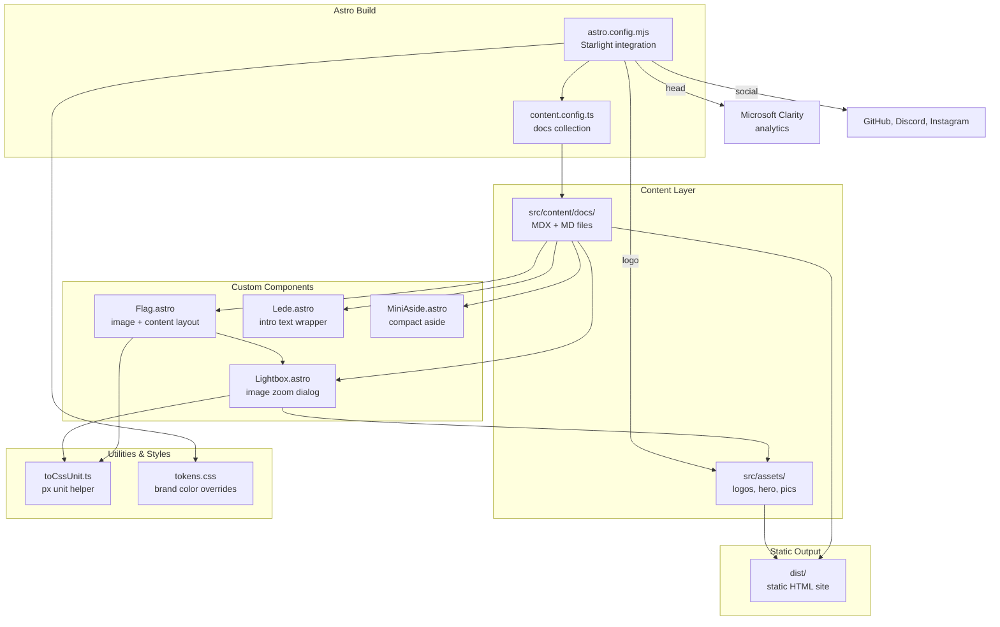
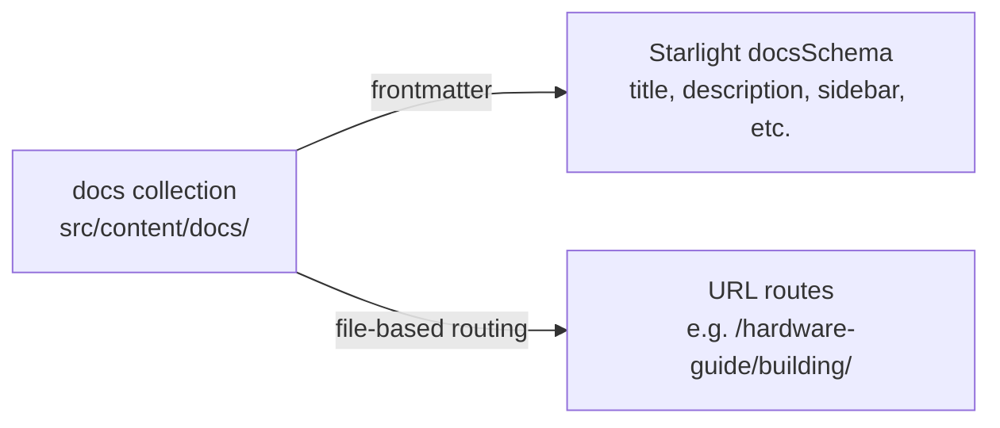
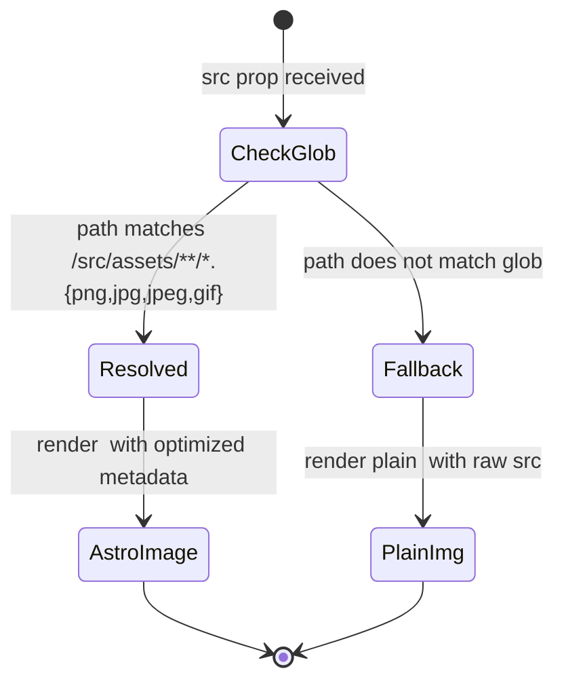

# Design: BODocs Site

> **Backfilled** — this design doc documents an existing system as it currently
> behaves. It is not a forward design. Code is the source of truth; this doc
> describes what the code does.

## Problem Statement

The BODocs Site is the public-facing documentation website for the BODAQS
(Bicycle Open Data Acquisition System) project. It exists to publish build
guides, setup instructions, and user documentation for the open-source mountain
bike data acquisition system, accessible at `https://bodaqs.net`. The site is
built with Astro and Starlight, treating documentation content as a first-class
content collection with custom components for image-heavy instructional pages.

## Background

The BODAQS project spans firmware, analysis software, hardware, and mechanical
designs (see `agents.md` for the full repository layout). The `bodocs/` folder
is treated as a separate sub-project within the monorepo — it has its own
`package.json`, its own dependencies, and its own build process. Per `agents.md`,
"Contents of this folder are not expected to be edited when working on firmware
or analysis tasks, except for documentation updates."

The site was scaffolded from the Starlight Starter Kit (the `README.md` is still
the default starter template). It has since been customized with a custom logo,
brand color tokens, four custom Astro components for instructional content
layouts, and a content structure organized into four guide sections plus an
archive.

## Goals

- Publish BODAQS documentation as a static website at `https://bodaqs.net`
- Organize content into navigable guide sections (hardware, software, user, archive)
- Provide image-rich instructional pages with lightbox zoom and image-beside-text layouts
- Apply BODAQS branding (custom logo, teal accent color) to the Starlight theme
- Collect anonymous usage analytics via Microsoft Clarity
- Support both light and dark themes with appropriate logo and color variants

## Non-Goals

- The site does not host or serve the BODAQS analysis software, firmware, or notebooks
- The site does not provide interactive analysis tools (it links to external tools like data.syn.bike)
- The site does not have user accounts, authentication, or server-side state
- The site does not have automated tests for its components or utilities
- The site does not define a custom deploy pipeline within the `bodocs/` folder (build output is `dist/`; deployment is external)
- The site does not internationalize content (English only)

## Open Questions

- The Instagram social link in `astro.config.mjs` is labeled `'Discord'` but links to Instagram — is this a copy-paste error or intentional? — discovered in `astro.config.mjs:24`
- `BODAQS_JupyterLab_Getting_Started_Windows.md` exists at the `bodocs/` root but is not part of the content collection (not served by the site). Is it a draft source file for `setup-python-and-jlab.mdx`? — discovered in `bodocs/` root
- The `Lightbox` component's `import.meta.glob` only matches lowercase image extensions (`{png,jpg,jpeg,gif}`), but some assets use uppercase extensions (e.g., `logformat.JPG`, `Build-4E.JPG`). Is the fallback to plain `` intentional? — discovered in `src/components/Lightbox.astro:16`
- The `README.md` is still the default Starlight starter template. Should it be replaced with project-specific content? — discovered in `bodocs/README.md`

## System Invariants

- **INV-1**: All documentation content is served from a single `docs` content collection defined in `src/content.config.ts` using Starlight's `docsLoader()` and `docsSchema()`.
- **INV-2**: Content files must be `.md` or `.mdx` files located under `src/content/docs/` to be included in the site.
- **INV-3**: The sidebar structure is explicitly configured in `astro.config.mjs` with one manual entry (`what-is-bodaqs`) and four autogenerate-from-directory entries (`hardware-guide`, `software-guide`, `user-guide`, `archive`).
- **INV-4**: The site URL is `https://bodaqs.net` (set via `site` in `astro.config.mjs`).
- **INV-5**: The `toCssUnit` function converts numbers to pixel strings (`${v}px`) and passes strings through unchanged.
- **INV-6**: The `Lightbox` component resolves images via `import.meta.glob` matching `/src/assets/**/*.{png,jpg,jpeg,gif}` (lowercase extensions only); non-matching `src` values fall back to a plain `` element without Astro image optimization. *(unverified intent — needs review)*
- **INV-7**: The `Lightbox` component generates a random DOM ID per instance using `Math.random().toString(36).slice(2, 8)` prefixed with `lb-`.
- **INV-8**: The `Flag` component renders as a flex column on viewports < 600px and flex row on viewports ≥ 600px.
- **INV-9**: The `Lede` component renders at 1.2em font size on mobile and 1.5em on viewports ≥ 600px.
- **INV-10**: The `MiniAside` component hides Starlight's default aside title (`.starlight-aside__title { display: none }`) and renders a custom bold title paragraph instead.
- **INV-11**: Custom CSS tokens override Starlight defaults: `--sl-content-width: 60rem`, `--sl-color-text-accent: #00FEDE` (dark theme), `#008775` (light theme).
- **INV-12**: TypeScript path aliases `@src/*`, `@components/*`, `@assets/*` map to `./src/*`, `./src/components/*`, `./src/assets/*` respectively.
- **INV-13**: Microsoft Clarity analytics is injected via a head script with project ID `w9v4spkbez`.
- **INV-14**: The build output directory is `dist/` (Astro default), which is excluded from the TypeScript `include` via `exclude: ["dist"]`.
- **INV-15**: The `Lightbox` component uses the HTML Popover API (`<dialog>` with `command`/`commandfor` attributes) for show/close behavior, with `closedby="any"` to allow dismissal by clicking anywhere.

## High-Level Architecture

The site is a static Astro build. `astro.config.mjs` configures the Starlight
integration, which provides the page layout, sidebar, search, and theme
infrastructure. Content is authored as MDX/MD files in `src/content/docs/`,
organized into four guide directories plus top-level pages. Custom components
are imported per-page in MDX frontmatter. The `Lightbox` component is the most
complex — it uses Vite's `import.meta.glob` at build time to resolve image
paths and conditionally renders Astro's optimized `<Image>` component or a
plain `` fallback.

## Data Model

The site has no runtime data model — it is a static site. The only "data" is
the content collection and build-time image resolution.

### Content Collection Model

Each content file has Starlight frontmatter (at minimum `title`). Optional
fields include `description`, `sidebar.order`, `template` (e.g., `splash`), and
`hero` configuration for splash pages. Files in autogenerate directories are
automatically added to the sidebar; ordering is controlled by `sidebar.order`
frontmatter.

### Image Resolution Model (Lightbox)

## Component Contracts

### Flag.astro

**Contract shape**: Accepts `src` (string), `alt` (string), `thumbnailWidth` (string | number, default 200), `maxWidth` (string | number, optional). Renders a default slot for content.
**Behavioral guarantees**: Renders a Lightbox thumbnail on the left and slot content on the right (row layout ≥ 600px, column layout < 600px). The thumbnail width is constrained to `min(thumbnailWidth, 100%)`.
**State ownership**: Stateless. Delegates image rendering to `Lightbox`.
**Error semantics**: No error handling. If `src` is empty or invalid, the behavior is determined by `Lightbox` (which falls back to a broken ``).

### Lede.astro

**Contract shape**: Accepts a default slot. No props.
**Behavioral guarantees**: Wraps slot content in a `.lede` div with larger font sizing (1.2em mobile, 1.5em ≥ 600px).
**State ownership**: Stateless.
**Error semantics**: None. Pure presentational wrapper.

### Lightbox.astro

**Contract shape**: Accepts `src` (string), `alt` (string), `class` (string, optional), `thumbnailWidth` (string | number, default 200), `maxWidth` (string | number, default '90vw'). Exports a `Props` interface.
**Behavioral guarantees**: Renders a thumbnail button that opens a `<dialog>` popover showing the full-size image. Uses `import.meta.glob` to resolve images from `/src/assets/**/*.{png,jpg,jpeg,gif}` at build time. If the `src` matches a glob key, renders Astro's `<Image>` component (with optimization); otherwise renders a plain ``. Generates a random ID per instance for dialog targeting. Clicking the full-size image closes the dialog.
**State ownership**: Stateless. The dialog open/close state is managed by the browser's Popover API via `command`/`commandfor` attributes.
**Error semantics**: If `src` does not match any glob entry, `resolvedImage` is `null` and the component falls back to a plain `` with the raw `src` value. No error is thrown. If the `src` is a broken path, the browser renders a broken image icon.

### MiniAside.astro

**Contract shape**: Accepts `title` (string, optional), `type` ('note' | 'tip' | 'caution' | 'danger', optional). Renders a default slot.
**Behavioral guarantees**: Wraps Starlight's `Aside` component. Hides the default aside title (`.starlight-aside__title`) via CSS. If `title` is provided, renders it as a bold paragraph before the slot content. Removes default content margin.
**State ownership**: Stateless.
**Error semantics**: No validation of `type`. If an invalid `type` is passed, it is forwarded to Starlight's `Aside` component, which determines behavior.

### toCssUnit (utility)

**Contract shape**: `toCssUnit(v: string | number): string` — accepts a string or number, returns a string.
**Behavioral guarantees**: If `v` is a number, returns `${v}px`. If `v` is a string, returns it unchanged.
**State ownership**: Stateless pure function.
**Error semantics**: No error handling. Any input is returned as-is (numbers get `px` suffix, strings pass through).

## Failure Modes

| Failure Mode | Trigger | Current Behavior | Handled? |
|-------------|---------|-----------------|----------|
| Lightbox with uppercase extension image | `src` points to a `.JPG` or `.PNG` file (e.g., `/src/assets/pics/logformat.JPG`) | `import.meta.glob` does not match; falls back to plain `` without Astro image optimization | YES (graceful fallback, but no optimization) |
| Lightbox with non-existent src | `src` path does not match any glob entry and is not a valid URL | Falls back to `` with broken `src`; browser shows broken image icon | NO |
| Content file with invalid frontmatter | MDX/MD file has missing `title` or invalid schema fields | Astro/Starlight build fails with validation error | YES (build-time error) |
| Missing image referenced in content | MDX file imports or references a non-existent image | Build error (Astro image pipeline) or broken `` at runtime | PARTIAL (build-time for optimized images, runtime for fallback) |
| Instagram social link mislabeled | `astro.config.mjs` social entry has `label: 'Discord'` but `href` points to Instagram | UI renders "Discord" label for the Instagram link | NO *(unverified intent — needs review)* |
| Empty `src` in Flag component | `src=""` passed to Flag (observed in `user-guide/index.mdx` Zero calibration section) | Lightbox receives empty `src`; `import.meta.glob` returns no match; renders `` | NO |
| Build with missing dependencies | `npm install` / `pnpm install` not run | Build fails with module resolution errors | YES (build-time error) |
| TypeScript type errors | Component props don't match interfaces | `astro check` reports errors; build may still succeed (Astro does not type-check by default during `astro build`) | PARTIAL |

## Cross-Cutting Concerns

### Branding
The site applies BODAQS branding through three mechanisms: a custom SVG logo
(light and dark variants) that replaces the text title, a teal accent color
(`#00FEDE` dark / `#008775` light) overriding Starlight's default, and a
widened content width (60rem vs Starlight default). These are configured in
`astro.config.mjs` (logo) and `src/styles/tokens.css` (colors, width).

### Analytics
Microsoft Clarity is injected as an inline script in the `<head>` of every
page via the `head` option in `astro.config.mjs`. The project ID is
`w9v4spkbez`. The script is loaded asynchronously. No consent banner is
implemented.

### Observability
There is no error tracking, logging, or monitoring configured within the site
code. The only observability is via Microsoft Clarity's external dashboard.

### Security
The site is static HTML with no server-side processing, no form handling, and
no user input. The only external script is Microsoft Clarity. Social links
point to external sites (GitHub, Discord, Instagram). There is no CSP
configuration in the Astro config.

### Backwards Compatibility
The site has no versioning or backwards compatibility concerns — it is a
static documentation site. Content is versioned via git. There is no API
surface to maintain.
