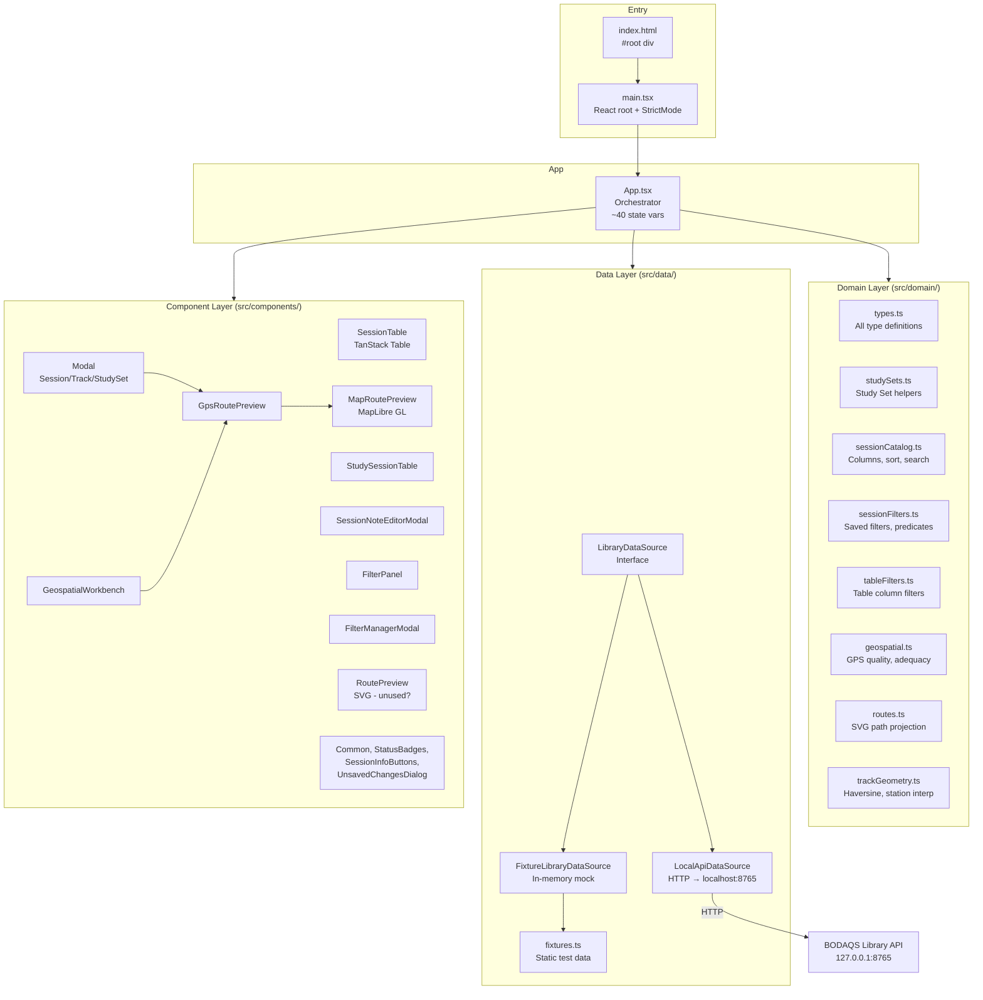
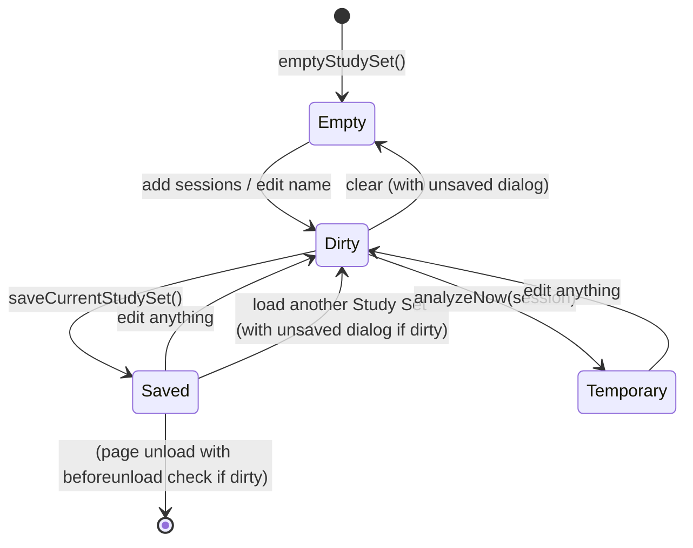
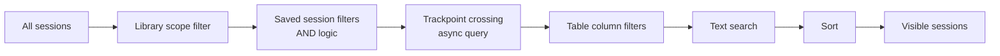

# Design: Cohort Workbench Prototype

> **Backfilled** — this design doc documents an existing system as it currently
> behaves. It is not a forward design. Code is the source of truth; this doc
> describes what the code does.

## Problem Statement

The Cohort Workbench Prototype is a React/TypeScript single-page application
that provides a browser-based workbench for browsing BODAQS processed libraries,
inspecting session catalogs, building Study Sets (named analysis scopes), and
managing geospatial tracks and trackpoint filters. It exists to prove the
product shape of a browser-first BODAQS application before wiring it to a
production Python Library API service. The prototype runs against either a
local HTTP API (`LocalApiDataSource`) or built-in fixture data
(`FixtureLibraryDataSource`) with automatic fallback.

## Background

The prototype was scaffolded with Vite + React + TypeScript and evolved from an
initial layout skeleton into a multi-module application with domain logic, a
data-source boundary, and ~14 React components. Key context:

- The BODAQS project is moving from notebook-driven analysis toward a
  browser-first application. The prototype proves the UI and interaction model.
- A Python Library API service (FastAPI on `127.0.0.1:8765`) is being built in
  parallel. The prototype's `LocalApiDataSource` talks to it; the
  `FixtureLibraryDataSource` provides offline development data.
- The directory name still uses "cohort" from the initial scaffold; user-facing
  UI and contracts use "Study Set".
- Related docs: `docs/analysis/web-app/BODAQS_Web_Application_Prototype_Handoff.md`,
  `docs/analysis/web-app/BODAQS_Web_Application_Roadmap.md`,
  `docs/analysis/web-app/Python_Library_Adapter_Implementation_Plan.md`.

## Goals

- Provide a two-panel workbench: Library Browser (left) and Study Set Builder
  (right), each independently collapsible.
- Browse session catalogs with visible-column controls, search, sorting,
  multi-select, and per-column filters.
- Build, edit, save, load, and clear Study Sets with dirty-change tracking and
  unsaved-changes dialogs.
- Support Study Set-local groupings (overlapping, named, colored).
- Manage reusable tracks: create from primary session GPS, add/delete
  trackpoints, attach to Study Sets, delete tracks.
- Run async trackpoint crossing filters with polling and paged results.
- Inspect session notes, QC, GPS, and metadata in modals; edit and save session
  notes through the data source.
- Render GPS routes on an interactive MapLibre GL map with OSM tiles, source
  selection, and resize.
- Maintain a `LibraryDataSource` interface boundary so the backing data source
  can change without rewriting UI components.
- Fall back from local API to fixture data automatically on startup failure.

## Non-Goals

- The prototype does not perform analysis, charting, or time-series
  visualization (reserved for future phases).
- It does not import, preprocess, or write raw logger data.
- It does not persist Study Sets to disk directly — persistence goes through
  the data source interface.
- It does not implement user authentication or multi-user collaboration.
- It does not provide a general-purpose filter query engine — trackpoint
  crossing is the only async filter predicate implemented.
- It does not support browser-local file access or static bundle deployment
  modes (future phases).
- It does not implement track CRUD through the fixture data source's
  `listTrackMatches` (the fixture returns pre-computed match summaries).

## Open Questions

- The trackpoint filter polling in `App.tsx` caps at 120 attempts × 500 ms
  (60 s) with no user-facing timeout message. If the query is still running
  after 60 s, polling silently stops. Is this intentional? — discovered in
  `App.tsx` trackpoint filter `useEffect`.
- The `GeospatialWorkbench` trackpoint query caps at 40 attempts × 300 ms
  (12 s), a different limit from `App.tsx`. Is this intentional or a copy-paste
  inconsistency? — discovered in `GeospatialWorkbench.tsx:runTrackpointQuery`.
- `RoutePreview.tsx` (SVG-based route preview) does not appear in the render
  tree. Is it legacy code awaiting removal? — discovered in
  `src/components/RoutePreview.tsx`.
- The `lockedColumns` array in `sessionCatalog.ts` is empty. No columns are
  actually locked. Is this a placeholder for future behavior? — discovered in
  `sessionCatalog.ts:55`.
- The `eslint-disable-next-line react-hooks/incompatible-library` comment in
  `SessionTable.tsx` suppresses a TanStack Table hook warning. Is this safe?
  — discovered in `SessionTable.tsx`.

## System Invariants

- **INV-1**: Session identity is `libraryId|||sessionKey` (the `candidateId` /
  `sessionRefId` format). This is used consistently for selection, Study Set
  references, and track match lookups.
- **INV-2**: Session key is `runId::sessionId`. This is the canonical
  human-readable session identifier.
- **INV-3**: A Study Set cannot be saved without a trimmed display name and at
  least one session. The `saveCurrentStudySet` function enforces this.
- **INV-4**: Groupings are Study Set-local. They may overlap (a session can
  belong to multiple groupings). Removing a session from a Study Set also
  removes it from all groupings; empty groupings are automatically pruned.
- **INV-5**: Tracks are reusable library-level objects, not Study Set state.
  Study Sets reference tracks by ID only.
- **INV-6**: "Analyze now" creates an unsaved, temporary, one-session Study Set
  with provenance starting with `"Temporary one-session Study Set"`. The
  `isTemporaryStudySet` function detects this.
- **INV-7**: Dirty tracking compares normalized Study Sets via
  `JSON.stringify`. The `studySetsEqual` function normalizes both Study Sets
  (trims names, sorts nothing, deep-compares sessions/groupings/tracks) and
  compares their JSON strings.
- **INV-8**: Revision numbers increment on each save. Both
  `FixtureLibraryDataSource` and `LocalApiDataSource` (via the API) enforce
  this. New Study Sets start at revision 1.
- **INV-9**: Prototype-origin saved filters (`origin: 'prototype_saved'`)
  cannot be deleted. The `deleteSessionFilter` function throws if the filter
  origin is not `'api_saved'`.
- **INV-10**: Column normalization always prepends locked columns first, then
  user-selected columns, deduplicating. Currently `lockedColumns` is empty, so
  this is a no-op prefix. (unverified intent — needs review)
- **INV-11**: The data source fallback is one-directional: on startup, if the
  local API health check fails, the app switches to fixture data. There is no
  automatic reconnection to the local API after fallback.
- **INV-12**: The `beforeunload` event is intercepted when the current Study
  Set is dirty, prompting the user before leaving the page.
- **INV-13**: Changing the library root is blocked when the current Study Set
  is dirty. The user must save, discard, or clear first.
- **INV-14**: The filtering pipeline applies in a fixed order: library scope →
  saved session filters (including async trackpoint crossing) → table column
  filters → text search → sort. Each stage narrows the candidate set.
- **INV-15**: Session selection supports three gestures: plain click (replace
  selection), Ctrl/Cmd-click (toggle), Shift-click (range from anchor). The
  last selected session becomes the "primary" session used for GPS preview.

## High-Level Architecture

### Key Design Decisions Visible in the Code

1. **Single-orchestrator pattern**: `App.tsx` owns all state and passes props
   down. No context providers, no state management library. This keeps the
   data flow explicit but makes `App.tsx` very large (~1750 lines).

2. **Data source boundary**: The `LibraryDataSource` interface defines
   required and optional methods. Optional methods (marked with `?`) are
   feature-detected at call sites with `if (dataSource.method)` checks. This
   allows the fixture data source to omit capabilities the local API has.

3. **Snake_case ↔ camelCase mapping**: `LocalApiDataSource` maps API
   snake_case JSON to domain camelCase types via dedicated `map*` functions.
   `FixtureLibraryDataSource` works directly in domain types.

4. **TanStack Table with manual sorting**: `SessionTable` uses
   `@tanstack/react-table` for rendering but sets `manualSorting: true`,
   delegating sort logic to `App.tsx` via the `sortSessions` domain function.

5. **MapLibre GL for maps**: `MapRoutePreview` uses MapLibre GL with OSM
   raster tiles. `RoutePreview` provides a simpler SVG fallback but is not
   currently rendered.

## Data Model

### SessionRecord

The central entity. Represents one processed BODAQS session.

| Field | Type | Description |
|-------|------|-------------|
| `libraryId` | `string` | Library this session belongs to |
| `runId` | `string` | Run identifier (e.g. `run_2026-05-24T09-12-01_AWST`) |
| `runName` | `string` | Human-readable run name |
| `sessionId` | `string` | Session identifier within the run |
| `sessionKey` | `string` | `runId::sessionId` |
| `name` | `string` | Display label |
| `startedAt` | `string` | ISO timestamp |
| `bike` | `string` | Bike name from note projection |
| `rider` | `string` | Rider name from note projection |
| `durationMin` | `number` | Duration in minutes |
| `distanceKm` | `number` | Distance in kilometers |
| `noteStatus` | `NoteStatus` | `missing` / `draft` / `edited` |
| `qcLevel` | `QcLevel` | `ok` / `warning` / `alert` |
| `qcAlerts` | `string[]` | QC alert labels |
| `preprocessingProfile` | `string` | Profile name |
| `firmware` | `string` | Firmware version |
| `eventSchema` | `string` | Event schema ID/display name |
| `sourceArchive` | `string` | Source archive filename |
| `signals` | `string[]` | Available signal display names |
| `gps` | `[number, number][]` | Inline GPS coordinates (lon, lat) |
| `gpsSummary` | `SessionGpsSummary` | GPS quality/source metadata |

### StudySet

Named analysis scope. The primary user-created object.

| Field | Type | Description |
|-------|------|-------------|
| `id` | `string \| null` | `null` for unsaved; slug-derived ID after first save |
| `displayName` | `string` | User-provided name |
| `revision` | `number` | Incremented on each save (starts at 1) |
| `saved` | `boolean` | `true` after save, `false` after any edit |
| `sessions` | `StudySessionRef[]` | Explicit session references |
| `groupings` | `StudyGrouping[]` | Study Set-local named buckets |
| `trackIds` | `string[]` | References to reusable tracks |
| `provenance` | `string` | Human-readable provenance label |

### StudySessionRef

| Field | Type | Description |
|-------|------|-------------|
| `libraryId` | `string` | Library ID |
| `sessionKey` | `string` | `runId::sessionId` |
| `runId` | `string` | Run ID |
| `sessionId` | `string` | Session ID |
| `label` | `string` | Display label |

### StudyGrouping

| Field | Type | Description |
|-------|------|-------------|
| `id` | `string` | Slug-derived unique ID |
| `name` | `string` | User-provided short name |
| `color` | `string` | Hex color from `groupingColors` palette |
| `sessionRefs` | `string[]` | `sessionRefId` values (`libraryId|||sessionKey`) |

### TrackRecord

Reusable library-level GPS path with trackpoints.

| Field | Type | Description |
|-------|------|-------------|
| `id` | `string` | Track ID |
| `name` | `string` | Display name |
| `revision` | `number` | Revision number |
| `points` | `[number, number][]` | GPS coordinates (lon, lat) |
| `trackpoints` | `TrackpointRecord[]` | Named stations along the track |
| `matchSummaries` | `SessionTrackMatchRecord[]` | Per-session match results |
| `source` | `object \| undefined` | Origin session metadata |

### Study Set State Machine

### Filtering Pipeline State Machine

## Component Contracts

### App.tsx — Main Orchestrator

**Contract shape**: Owns all application state (~40 `useState` hooks), creates
data source instances, renders the two-panel layout and all modals.

**Behavioral guarantees**:
- On mount, attempts to connect to `LocalApiDataSource`; on failure, falls back
  to `FixtureLibraryDataSource`.
- Maintains dirty tracking via `studySetsEqual(currentStudySet, lastCommittedStudySet)`.
- Intercepts `beforeunload` when dirty.
- Polls trackpoint match queries (500 ms interval, max 120 attempts).
- Blocks library root changes when dirty.

**State ownership**: All state — libraries, sessions, tracks, study sets,
filters, UI collapse states, modals, selection, sort, search.

**Error semantics**: All async errors are caught and surfaced as `statusMessage`
strings. No errors propagate to React error boundaries.

### LibraryDataSource — Data Source Interface

**Contract shape**: Interface with required methods (`listLibraries`,
`listSessions`, `listTracks`, `listStudySets`, `saveStudySet`) and optional
methods (filter CRUD, track CRUD, trackpoint queries, GPS points, session
notes — all marked with `?`).

**Behavioral guarantees**: Callers feature-detect optional methods with
`if (dataSource.method)` before calling. Both implementations return
domain-typed objects.

**Error semantics**: Both implementations throw `Error` on failure. The
`LocalApiDataSource` throws with HTTP status + parsed error message. The
`FixtureLibraryDataSource` throws for not-found queries.

### LocalApiDataSource — HTTP Client

**Contract shape**: Implements `LibraryDataSource` via `fetch()` calls to
`http://127.0.0.1:8765/api/v1/*`. Maps snake_case JSON to domain types.

**Behavioral guarantees**:
- Base URL from `VITE_BODAQS_LIBRARY_API_URL` env var or defaults to
  `http://127.0.0.1:8765`.
- All requests include `Content-Type: application/json`.
- Non-OK responses throw `Error` with parsed `error.message` or HTTP status.
- `listSessions` fetches all library catalogs in parallel via `Promise.all`.

**Error semantics**: Throws `Error` with message from API error envelope or
HTTP status text. Does not retry.

### FixtureLibraryDataSource — In-Memory Mock

**Contract shape**: Implements `LibraryDataSource` with in-memory arrays and
Maps. Provides mock persistence with revision tracking.

**Behavioral guarantees**:
- Study Set saves generate slug-based IDs via `slugify` + `uniqueId`.
- Trackpoint match queries complete synchronously (status `'completed'`
  immediately) using pre-computed `matchSummaries` from fixture tracks.
- Session note saves update the in-memory session's `bike`, `rider`, and
  `noteStatus` fields.
- All data is cloned on read/write to prevent external mutation.

**Error semantics**: Throws `Error` for not-found trackpoint queries. Does not
simulate network latency.

### SessionTable — Catalog Table

**Contract shape**: Receives sessions, columns, filters, sort state, and
selection state as props. Calls back on sort, filter, select, and inspect.

**Behavioral guarantees**:
- Uses `@tanstack/react-table` for row model with `manualSorting: true`.
- Column filter menus are click-outside dismissible.
- Row selection supports click, Ctrl/Cmd-click (toggle), Shift-click (range).
- Keyboard: Enter selects, Space toggles.

**Error semantics**: None — all data is pre-validated by the parent.

### GeospatialWorkbench — Track & Trackpoint Manager

**Contract shape**: Receives primary session, current Study Set, tracks, and
data source. Manages local form state for track/trackpoint creation.

**Behavioral guarantees**:
- Creates tracks from primary session GPS via `dataSource.loadSessionGpsPoints`
  + `dataSource.saveTrack`.
- Adds trackpoints at a station distance, clipping to `[0, track.lengthM]`.
- Trackpoint position is interpolated via `pointAtStationM` (Haversine-based).
- Runs trackpoint match queries with polling (300 ms, max 40 attempts).
- Shows GPS adequacy summary for the current Study Set.

**Error semantics**: All errors caught and shown as local `message` state.

### GpsRoutePreview / MapRoutePreview — Map Components

**Contract shape**: `GpsRoutePreview` loads GPS points from the data source,
manages source selection and map resize. Delegates rendering to
`MapRoutePreview`.

**Behavioral guarantees**:
- `GpsRoutePreview` falls back to catalog GPS (`session.gps`) if
  `loadSessionGpsPoints` is unavailable or fails.
- `MapRoutePreview` creates a MapLibre GL map with OSM raster tiles on first
  render. Uses `ResizeObserver` to handle container resize.
- Route lines and trackpoint markers are rendered as GeoJSON sources/layers.
- Map auto-fits to visible points with padding.

**Error semantics**: GPS load errors fall back to catalog data with an error
status message. Map initialization errors are not caught.

### SessionNoteEditorModal — Note Editor

**Contract shape**: Receives session and data source. Loads, edits, and saves
session notes.

**Behavioral guarantees**:
- Loads note from data source on mount; falls back to a generated note from
  session data if loading fails or data source lacks `loadSessionNote`.
- Renders template fields grouped by section, with fallback labels for
  unknown fields.
- Supports field types: string, text, int, float, bool, enum, multi_enum,
  date.
- On save, calls `dataSource.saveSessionNote` and propagates the updated
  session record to the parent via `onSaved`.

**Error semantics**: Load and save errors are shown as local error messages.
The draft is preserved on save failure.

### FilterManagerModal — Filter Builder

**Contract shape**: Receives saved filters, tracks, and write capability.
Provides visual and advanced JSON filter editing.

**Behavioral guarantees**:
- Visual builder supports AND/OR joins with multiple conditions.
- Each condition maps to a `SessionFilterField` with field-specific operators.
- Trackpoint crossing conditions configure track, trackpoints, match mode,
  tolerance, and min count.
- Advanced mode accepts raw predicate JSON with validation.
- Mode switching converts between visual and JSON representations.

**Error semantics**: Parse errors during mode switching or save are shown as
local status messages.

## Failure Modes

| Failure Mode | Trigger | Current Behavior | Handled? |
|-------------|---------|-----------------|----------|
| Local API unavailable on startup | `getHealth()` throws | Falls back to `FixtureLibraryDataSource`, shows status message | YES |
| Local API catalog fetch fails | `listSessions()` throws | Caught in startup `loadDefaultData`, falls back to fixture | YES |
| Study Set save fails | `saveStudySet()` throws | Error message shown in status bar, current Study Set preserved | YES |
| Session note save fails | `saveSessionNote()` throws | Error shown in modal, draft preserved | YES |
| GPS points load fails | `loadSessionGpsPoints()` throws | Falls back to catalog GPS array, shows error status | YES |
| Trackpoint query create fails | `createTrackpointMatchQuery()` throws | Query state set to `'failed'` with error message | YES |
| Trackpoint query polling timeout (App.tsx) | 120 polls × 500 ms = 60 s elapsed | Polling silently stops, query remains in last polled status | NO |
| Trackpoint query polling timeout (GeoWorkbench) | 40 polls × 300 ms = 12 s elapsed | Shows `"Trackpoint query is {status}."` message | PARTIAL |
| Library root change fails | `setLibrariesRoot()` throws | Error shown in status bar, current state preserved | YES |
| Track save fails | `saveTrack()` throws | Error shown in GeospatialWorkbench message | YES |
| Track delete fails | `deleteTrack()` throws | Error shown in GeospatialWorkbench message | YES |
| MapLibre map initialization fails | MapLibre constructor throws | Not caught — would crash the component | NO |
| Filter predicate JSON parse fails | Invalid JSON in advanced mode | Parse error shown as status message | YES |
| Data source lacks optional method | Feature-detected method is undefined | UI gracefully disables the feature (e.g., no save button) | YES |
| beforeunload with dirty Study Set | User attempts to leave page | `beforeunload` event prevented, browser shows confirmation | YES |
| Concurrent Study Set revision conflict | API returns revision conflict error | Error message shown in status bar, current Study Set preserved | PARTIAL |

## Cross-Cutting Concerns

### Security
- No authentication or authorization. The local API is expected to be on
  `127.0.0.1` only.
- No input sanitization or XSS prevention beyond React's default escaping.
- Library root path is user-entered and sent to the API without validation.

### Observability
- All status messages are shown in a single header status bar. There is no
  structured logging, no telemetry, no error tracking.
- Errors are surfaced as human-readable strings with no error codes or
  correlation IDs.
- The `connectionMode` state (`'local-api'` or `'fixture'`) is shown in the
  Library Selector section.

### Performance
- `listSessions` in `LocalApiDataSource` fetches all library catalogs in
  parallel. For many libraries, this could create many concurrent requests.
- Trackpoint query polling uses `setTimeout` with 500 ms intervals. No
  exponential backoff.
- `studySetsEqual` uses `JSON.stringify` for deep comparison — O(n) in Study
  Set size, called on every render.
- MapLibre map is created once and updated via GeoJSON source `setData`.
  Markers are fully recreated on each update (cleared and rebuilt).

### Browser Compatibility
- Uses modern React 19, Vite 8, TypeScript 6.
- MapLibre GL requires WebGL support.
- `PointerEvent` API used for map resize and row selection gestures.
- `ResizeObserver` used for map container resize.
- No polyfills or browser compatibility configuration.

### Build & Tooling
- Vite for dev server and production build.
- `tsc -b && vite build` for production build.
- ESLint with `typescript-eslint`, `react-hooks`, and `react-refresh` plugins.
- No test framework installed (Vitest and Playwright mentioned as future
  additions in the handoff doc).
- TypeScript strict mode with `noUnusedLocals`, `noUnusedParameters`,
  `noFallthroughCasesInSwitch`.
