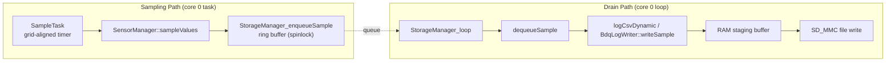
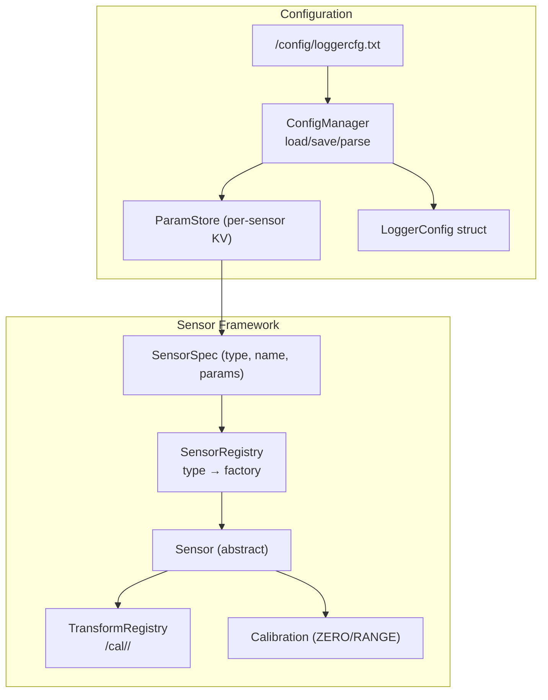
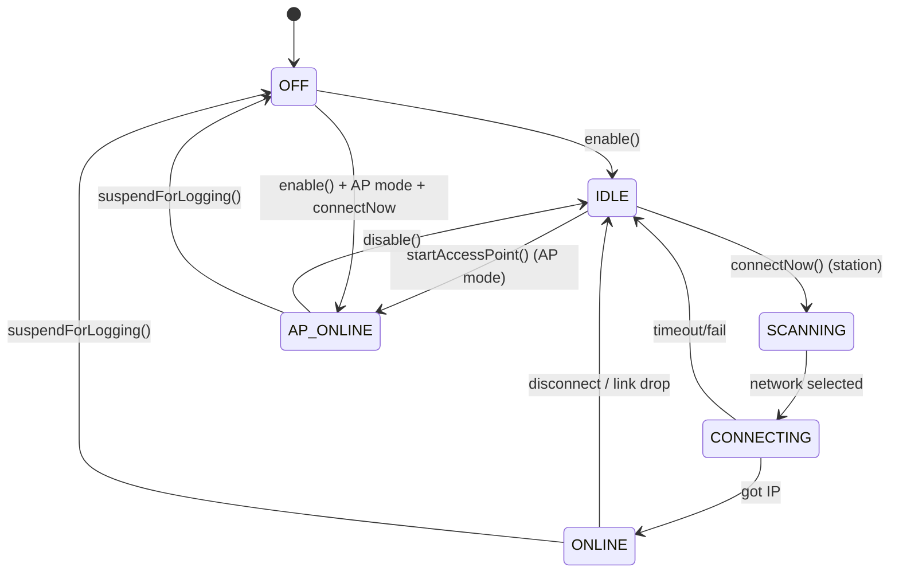
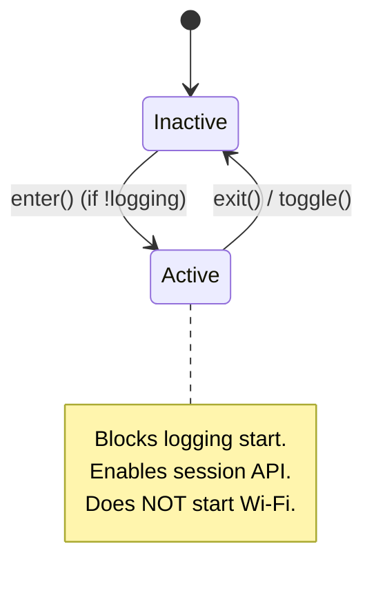

# Design: ESP32 Logger Firmware

> **Backfilled** — this design doc documents an existing system as it currently
> behaves. It is not a forward design. Code is the source of truth; this doc
> describes what the code does.

## Problem Statement

BODAQS (Bicycle Open Data Acquisition System) is a mountain-bike data
acquisition project. The ESP32 Logger Firmware is the embedded firmware that
runs on a SparkFun ESP32 Thing Plus (and now a BODAQS S3 Mini N4R2 board) to
sample suspension, angle, string-pot, and GPS sensors at up to 500 Hz, write
self-describing log files to an SD card, and later upload completed sessions
to a desktop import agent over Wi-Fi. The firmware also provides an on-device
OLED menu, button-driven controls, and a web UI for configuration and file
management. It exists because a purpose-built logger can guarantee
deterministic sample timing, survive power loss, and produce analysis-ready
artifacts without a laptop in the field.

## Background

The firmware evolved from a simple analog-potentiometer logger into a
multi-sensor, multi-format platform. Key historical decisions visible in the
code:

- **Arduino framework + PlatformIO build.** The project uses the Arduino-ESP32
  core (3.3.0 tested) with PlatformIO environments. Two serial transport
  variants exist (USB CDC and UART). Build flags select the board profile and
  firmware version (`BODAQS_FW_VERSION`, currently `0.4.0`).
- **SDMMC-only storage.** The old SPI/SdFat backend and `ThingPlus_A` prototype
  profile were retired. All file I/O goes through Arduino `SD_MMC`.
- **Board profile abstraction.** Hardware wiring (pins, I2C buses, ADCs,
  buttons, display, fuel gauge, RTC) is declared in `BoardProfile.cpp` as
  static structs. Four profiles ship: `BODAQS 4D`, `BODAQS 4D (UART as I2C1)`,
  `BODAQS 4F`, and `BODAQS V1RC3` (a.k.a. `BODAQS S3 Mini N4R2`).
- **Three log formats.** `bodaqs_standard` (headed CSV + JSON metadata + ZIP
  archive), `syn_bike_raw` (headerless CSV for a third-party tool), and
  `bodaqs_compact_binary` (self-contained `.bdq` binary with embedded metadata
  and channel schema).
- **Wi-Fi upload API.** A local-first HTTP API (`/api/v1/*`) lets a desktop
  import agent discover, list, download, acknowledge, and clean up sessions.
  Station and access-point modes expose the same endpoints.
- **USB serial download was explored and parked** due to reliability issues;
  Wi-Fi upload is the active transfer path.

Related docs: `docs/firmware/BDQ_v1_format.md` (binary log parser contract),
`docs/firmware/WiFi_Upload_API_v1.md` (upload API contract),
`docs/firmware/SD_Card_Architecture.md`, `docs/firmware/BODAQS_Transforms_Framework_v2.md`,
`docs/firmware/Firmware_Versioning_Policy.md`.

## Goals

What the system currently achieves, inferred from code behavior:

- Sample configured sensors at a fixed rate (10–1000 Hz; tested to 100 Hz,
  targeting 500 Hz) with deterministic, grid-aligned timestamps.
- Write log files to SD card in one of three formats, with run-quality
  statistics captured in metadata.
- Produce self-describing artifacts: CSV headers name columns with units; JSON
  sidecars carry calibration, schema, and QC stats; `.bdq` files embed metadata
  and channel schema.
- Archive completed CSV sessions into a ZIP (CSV + JSON) and remove loose
  sources so the ZIP is the canonical import artifact.
- Provide a web UI for file browsing, configuration editing, sensor
  add/remove, and transform selection.
- Provide a REST API for a desktop import agent to list, download,
  acknowledge, and clean up sessions — gated by explicit upload mode.
- Provide an OLED menu system for logging, upload, sensor muting, calibration,
  sample rate, log format, Wi-Fi mode, and device actions.
- Provide button-driven controls with configurable bindings (button + event →
  action).
- Support Wi-Fi station and access-point modes with mDNS discovery in station
  mode.
- Manage power: fuel gauge monitoring, analog rail control, deep sleep on idle
  timeout, battery-low logging refusal.
- Keep sensor construction deterministic so UI indices match config indices.
- Fall back safely when transforms are missing or invalid (identity transform,
  logging continues).

## Non-Goals

What the system currently does NOT do, inferred from absent code paths:

- Does not stream live data over Wi-Fi; only completed sessions are
  transferable.
- Does not expose partially open logs for download.
- Does not support USB mass storage or reliable USB serial file download
  (parked).
- Does not perform cloud synchronization.
- Does not support multi-turn tracking on AS5048B/AS5600 angle sensors (only
  AS5600 string-pot sensors unwrap across turns).
- Does not apply sample-time smoothing/EMA to analog pot samples (raw sample
  used directly).
- Does not dynamically reload transforms at runtime (loaded once per boot;
  reload requires a web API call or restart).
- Does not automatically force the logger into upload mode from the desktop
  agent (user must enter it on-device or via web UI).
- Does not treat `buttonN.*` legacy config entries as stable input (board
  profile defines physical buttons).
- Does not use an external RTC on legacy boards (hard-wired to `RTC_INTERNAL`
  unless the board profile declares an RV3028, as V1RC3 does).
- Does not compress, bit-pack, or delta-encode `.bdq` samples.
- Does not store per-sample wall-clock timestamps in `.bdq` (fixed-rate
  timebase with session-start anchor).

## Open Questions

Unresolved questions discovered during backfill — things the code doesn't make
clear:

- **OQ-1**: The `g_sdTrackEnabled` / `g_sdWriteSinceLastSample` debug flags in
  `StorageManager` are wired but their consumer is unclear — discovered in
  `StorageManager.cpp`. *(unverified intent — needs review)*
- **OQ-2**: `SensorManager` is documented as "static utilities" but also owns
  live sensor object pointers; the ownership boundary between
  `SensorManager` and `ConfigManager` for sensor lifecycle is implicit —
  discovered in `SensorManager.h`/`main.cpp`. *(unverified intent — needs
  review)*
- **OQ-3**: The `s_pot1` (primary pot) member in `LoggingManager` is declared
  but unused — discovered in `LoggingManager.cpp`. *(legacy behavior — may be
  removed in future cleanup)*
- **OQ-4**: `BODAQS_BRINGUP_DIAGNOSTICS`, `BODAQS_ADC_DEBUG_PROBE`,
  `BODAQS_AS5048_LIBRARY_PROBE`, and `BODAQS_GPS_UART_PROBE` compile-time
  modes short-circuit normal boot; their intended use workflow is not
  documented in code comments — discovered in `main.cpp`. *(unverified intent
  — needs review)*
- **OQ-5**: The `log_format=bodaqs_CSV` value in the Prototype F config does
  not match any of the three parsed enum values; the parser's fallback
  behavior for unknown log format strings is not obvious from the config
  alone — discovered in `Configs/Prototype F/loggercfg.txt`. *(unverified
  intent — needs review)*
- **OQ-6**: `CalCapture.cpp` is only 1057 bytes and appears to be a thin
  wrapper; its relationship to `CalibrationWizard` and `CaptureUtils` is
  unclear — discovered in `CalCapture.cpp`. *(unverified intent — needs
  review)*
- **OQ-7**: The sample task is created with `xTaskCreatePinnedToCore(..., 0)`
  (core 0) but the inline comment says "core 1 keeps WiFi (often core 0) from
  interfering as much" — discovered in `LoggingManager.cpp:317`. *(unverified
  intent — needs review)*

## System Invariants

The invariants the code currently enforces. Classification flags applied per
backfill ambiguity resolution.

- **INV-1**: Logging and the web server are mutually exclusive. Starting
  logging stops the web server and suspends Wi-Fi; the web server cannot start
  while logging is active (`LoggingManager::start`, `WebServerManager::canStart`).
- **INV-2**: Logging and upload mode are mutually exclusive. Logging refuses
  to start while upload mode is active; upload mode cannot be entered while
  logging is active (`LoggingManager::start`, `UploadModeManager::enter`).
- **INV-3**: Mark events are only recorded while logging is active
  (`LoggingManager::mark` enqueues; `ButtonActions` routes mark only when
  running).
- **INV-4**: `sample_id` is the first CSV column and `mark` is the last
  (`StorageManager::startLog` prepends `sample_id,`; `logCsvDynamic` appends
  `,mark\n`).
- **INV-5**: Log filenames are `YYMMDD_HHMMSS.<ext>` when RTC is valid, else
  `LOGnnnn.<ext>` fallback (`StorageManager::startLog`).
- **INV-6**: Sensor construction order is deterministic — UI indices match
  config spec indices (`SensorManager::buildSensorsFromConfig` iterates
  `ConfigManager::sensorCount()` in order).
- **INV-7**: Missing or unknown transforms fall back to identity without
  blocking logging (`Sensor::attachTransform`, `TransformRegistry::get`).
- **INV-8**: Transform identity is by `meta.id`, not filename; no
  canonicalization at runtime (`TransformRegistry`, `BODAQS_Transforms_Framework_v2.md`).
- **INV-9**: Config writes are blocked while logging or upload mode is active
  (`WebServerManager` route guards).
- **INV-10**: Session archives (ZIP) are generated only after both CSV and
  JSON are closed; the ZIP is written to `.zip.tmp` then renamed; loose CSV/JSON
  are removed after successful archiving (`StorageManager::createSessionArchive_`).
- **INV-11**: Compact binary (`.bdq`) sessions do not generate a JSON sidecar
  or ZIP archive; the `.bdq` file is self-contained (`StorageManager::stopLog`,
  `BdqLogWriter`).
- **INV-12**: Upload API session list/download/delete endpoints return `409`
  when upload mode is inactive (`Routes_Api.cpp`).
- **INV-13**: Session cleanup requires prior acknowledgement
  (`UploadSessionCleanup` callers check `acknowledged`).
- **INV-14**: The sample task is pinned to core 0 at priority 3 with a 4096-byte
  stack (`LoggingManager::start` → `xTaskCreatePinnedToCore` with `xCoreID=0`).
  *(unverified intent — needs review: the code comment says "core 1" but the
  actual `xCoreID` argument is `0`; the code is documented as-is)*
- **INV-15**: Sample timestamps are grid-aligned:
  `ts_ms = t0_ms + sampleCount * intervalMs` (`LoggingManager::sampleOnce_`).
- **INV-16**: The sample queue is a fixed-capacity ring buffer; overflow
  increments `samplesDropped` and discards the sample
  (`StorageManager_enqueueSample`).
- **INV-17**: `logger_id` is derived from `logger_name` by trimming whitespace
  and replacing filename-unsafe characters with underscores; empty result
  falls back to `BODAQS` (`ConfigManager::loggerId`).
- **INV-18**: `session_id` is `<logger_id>__<session_stem>` (double underscore
  separator) (`UploadSessionScanner`).
- **INV-19**: mDNS `_bodaqs-logger._tcp` on port 80 is advertised only in
  station mode when online (`WiFiManager::startMdns_`).
- **INV-20**: AP mode does not use mDNS; the PC confirms identity via
  `/api/v1/device` after connecting (`WiFiManager`, `WiFi_Upload_API_v1.md`).
- **INV-21**: The OLED menu takes modal ownership via `UI::setModal(true)` on
  open and releases it on close; `DisplayManager::loop` exits early when modal
  (`MenuSystem`, `DisplayManager`).
- **INV-22**: Human timestamps are written as local time-of-day `HH:MM:SS.mmm`;
  fast timestamps are integer epoch milliseconds (`StorageManager::logCsvDynamic`).
  *(legacy behavior — date lives in filename, not CSV column; may change in
  future)*
- **INV-23**: `saveTextFile` uses atomic write-then-rename: write to `.tmp`,
  rename existing to `.bak`, rename `.tmp` to final, remove `.bak`
  (`StorageManager_saveTextFile`).
- **INV-24**: SD card removal during logging stops logging and unmounts SD
  (`StorageManager_loop` detect-pin polling).
- **INV-25**: The upload ack index is `/upload_index.ndjson`; the `.ndjson`
  extension keeps it out of same-stem session discovery
  (`UploadAckIndex::indexPath`).
- **INV-26**: Battery-low or analog-rail-fault conditions refuse logging start
  (`PowerManager::canStartLogging`, `LoggingManager::start`).
- **INV-27**: Wi-Fi is suspended synchronously when logging starts and resumed
  after logging stops (`WiFiManager::suspendForLogging`/`resumeAfterLogging`).
- **INV-28**: The sample rate is capped by the slowest synchronous sensor's
  `maxSampleRateHz()` and by external ADC throughput
  (`LoggingManager::start`, `AnalogInputManager::configureFromConfig`).

## High-Level Architecture

```mermaid
graph TD
    subgraph Boot["Boot (main.cpp setup)"]
        BoardSelect["BoardSelect<br/>SelectBoard(BoardID)"]
        Power["PowerManager::begin"]
        Storage["StorageManager_begin"]
        Config["ConfigManager::begin/load"]
        RTC["RTCManager_begin"]
        I2C["I2CManager::begin"]
        Analog["AnalogInputManager::begin"]
        Sensors["SensorManager::begin<br/>buildSensorsFromConfig<br/>finalizeBegin"]
        WiFi["WiFiManager::begin"]
        Upload["UploadModeManager::begin"]
        Web["WebServerManager::begin"]
        Logging["LoggingManager::begin"]
        Display["DisplayManager::begin"]
        UI["UI::begin"]
        Buttons["ButtonActions::begin<br/>ButtonBindingTable::initFromConfig"]
        Menu["MenuSystem::begin"]
    end

    BoardSelect --> Power --> Storage --> Config
    Config --> RTC --> I2C --> Analog --> Sensors
    Sensors --> WiFi --> Upload --> Web --> Logging
    Logging --> Display --> UI --> Buttons --> Menu
```







Key design decisions visible in the code:

- **Static namespaced APIs.** Most managers (`StorageManager_*`,
  `SensorManager::`, `RTCManager_*`, `WiFiManager::`, etc.) use free functions
  or static methods rather than instances. This avoids heap allocation and
  simplifies cross-module calls but creates implicit global coupling.
- **Producer-consumer sampling.** A FreeRTOS task (pinned to core 0 via
  `xCoreID=0`, though the code comment claims core 1) samples sensors and
  enqueues rows into a fixed-capacity ring buffer protected by a spinlock.
  The main loop (also core 0) drains the queue and writes to SD. This decouples
  sample timing from SD write latency. *(unverified intent — needs review)*
- **Board profile as hardware abstraction layer.** All pin assignments, bus
  configs, and peripheral presence are declared in `BoardProfile.cpp`. The
  firmware never hardcodes pins outside this struct.
- **ParamPack as config bridge.** Each sensor receives a read-only
  `ParamPack` view into `ConfigManager`-owned `ParamStore` storage. This avoids
  copying config and keeps a single source of truth.
- **Three log formats share one sampling path.** `StorageManager` branches on
  `LogFormat` at write time; the sampling task is format-agnostic.

## Data Model

### Boot State Machine

```mermaid
stateDiagram-v2
    [*] --> BoardSelect: setup()
    BoardSelect --> PowerInit: PowerManager::begin
    PowerInit --> StorageInit: StorageManager_begin
    StorageInit --> ConfigLoad: ConfigManager::load
    ConfigLoad --> RTCInit: RTCManager_begin
    RTCInit --> SensorBuild: SensorManager::buildSensorsFromConfig
    SensorBuild --> Ready: finalizeBegin + UI + Menu
    Ready --> [*]
```

### Logging State Machine

```mermaid
stateDiagram-v2
    [*] --> Idle
    Idle --> Starting: LoggingManager::start
    note right of Starting
        Checks: upload mode off,
        battery OK, SD ready.
        Stops web server + Wi-Fi.
        Opens log file, writes header.
        Starts SampleTask (pinned to core 0).
    end note
    Starting --> Running: success
    Starting --> Idle: failure (toast + status)
    Running --> Stopping: LoggingManager::stop
    note right of Stopping
        Drains queue, flushes buffer,
        writes metadata + ZIP (CSV),
        writes final summary (.bdq),
        releases buffers, resumes Wi-Fi.
    end note
    Stopping --> Idle
    Running --> Stopping: SD card removed
```

### Wi-Fi State Machine



### Upload Mode State Machine



### Log File Lifecycle

| Phase | bodaqs_standard | syn_bike_raw | bodaqs_compact_binary |
|-------|-----------------|--------------|----------------------|
| Start | Open `.CSV`, write header | Open `.CSV`, no header | `BdqLogWriter::begin` (file header + metadata + schema chunks) |
| Sample | Buffer CSV rows, flush periodically | Buffer headerless rows | Pack frames, flush data chunks periodically |
| Stop | Drain, flush, close | Drain, flush, close | Drain, flush, `BdqLogWriter::end` (final summary chunk) |
| Post-close | Write `.json` metadata, create `.zip`, remove loose CSV/JSON | No metadata, no ZIP | No sidecar, no ZIP |

### Session Identity

- `logger_id` = sanitized `logger_name` (trim, replace unsafe chars with `_`,
  fallback `BODAQS`).
- `session_stem` = `YYMMDD_HHMMSS` (local) or `LOGnnnn` fallback.
- `session_id` = `<logger_id>__<session_stem>`.

### Persistent State on SD Card

| Path | Purpose | Owner |
|------|---------|-------|
| `/config/loggercfg.txt` | Global + sensor config | `ConfigManager` |
| `/cal/<sensor_name>/` | Transform files (`.lut.csv`, `.poly.json`, etc.) | `TransformRegistry` |
| `/YYMMDD_HHMMSS.CSV` | Log file (standard/syn_bike) | `StorageManager` |
| `/YYMMDD_HHMMSS.json` | Log metadata sidecar | `LogMetadataWriter` |
| `/YYMMDD_HHMMSS.zip` | Session archive (CSV+JSON) | `ZipArchiveWriter` |
| `/YYMMDD_HHMMSS.bdq` | Compact binary log | `BdqLogWriter` |
| `/upload_index.ndjson` | Upload acknowledgement index | `UploadAckIndex` |
| `/uploaded/` | Moved-uploaded session directory | `UploadSessionCleanup` |

## Component Contracts

### BoardProfile / BoardSelect

**Contract shape**: `SelectBoard(BoardID)` sets global `board::gBoard` pointer;
`GetBoardProfile(id)` / `GetBoardProfileByName(name)` return `const BoardProfile&`.
**Behavioral guarantees**: Four profiles ship (4D, 4D-UartI2C1, 4F, V1RC3).
Unknown ID falls back to 4D. Each profile declares storage, display, buttons,
fuel gauge, RTC, analog inputs, I2C/SPI/UART buses, external ADCs, indicators,
current-limit switch, and perf knobs (queue depth, ring buffer bytes).
**State ownership**: Owns static `const BoardProfile` instances; `gBoard` is a
read-only global pointer.
**Error semantics**: If `gBoard` is null after `SelectBoard`, `main.cpp` enters
an infinite loop (fatal halt).

### ConfigManager

**Contract shape**: `begin(filename)`, `load(LoggerConfig&)` → `bool`,
`save(const LoggerConfig&)` → `bool`, `get()` → `const LoggerConfig&`,
`loggerId()` → `String`. Per-sensor accessors: `getParam/getIntParam/
getFloatParam/getBoolParam(index, key, out)`.
**Behavioral guarantees**: Loads `loggercfg.txt` (line-oriented `key=value`,
`#` comments). Merges with defaults. `save()` writes all keys deterministically.
Manages up to `MAX_SENSORS` (16) `SensorSpec` entries, each with a `ParamPack`
backed by a `ParamStore` (max 32 keys, 24-byte key, 32-byte value).
**State ownership**: Owns the `LoggerConfig` singleton and all `ParamStore`
storage. `ParamPack` is a non-owning view.
**Error semantics**: Load failure uses defaults and logs a warning. Save uses
atomic write-then-rename (`.tmp` → `.bak` → final). Per-sensor KV capacity
overflow drops extra pairs silently.

### SensorManager

**Contract shape**: `begin(cfg)`, `buildSensorsFromConfig(cfg)`,
`registerSensor(Sensor*)`, `finalizeBegin()`, `count()`, `get(i)`,
`getMuted/setMuted(idx, bool)`, `sampleValues(out, max, written)`,
`buildHeader(out, n, humanTs)`, `dynamicColumnCount()`.
**Behavioral guarantees**: Constructs sensors in config order via
`SensorRegistry` factories. Muted sensors still tick but are skipped in log
output. `dynamicColumnCount()` returns the total emitted column count across
all active (non-muted) sensors. `synchronousMaxSampleRateHz()` returns the
minimum `maxSampleRateHz()` across synchronous sensors (0 = no cap).
**State ownership**: Owns live `Sensor*` pointers (static array). Does not own
config.
**Error semantics**: Out-of-range index access returns false/nullptr. Unknown
sensor type logs a warning and skips construction.

### Sensor (abstract base)

**Contract shape**: `begin()`, `sampleValues(out, max)`, `columnCount()`,
`getColumnName(idx, out, cap)`, `muted()/setMuted(bool)`, `outputMode()/
setOutputMode(OutputMode)`, `attachTransform(registry)`, calibration lifecycle
(`beginCalibration/updateCalibration/finishCalibration`).
**Behavioral guarantees**: `OutputMode::RAW` bypasses transforms. `LINEAR`
applies offset/scale. `POLY`/`LUT` apply the selected transform after
linearization. `applyTransform(x)` returns `x` if no transform attached
(identity). `describeColumn` and `describeSensorMetadata` produce structured
descriptors for CSV headers and JSON metadata.
**State ownership**: Owns calibration state, output mode, selected transform
ID, units label. Non-owning pointer to `OutputTransform`.
**Error semantics**: Transform not found → identity fallback. Calibration with
degenerate span → `recompute()` returns false.

### SensorRegistry

**Contract shape**: `registerType(type, key, label, paramDefsFn, createFn,
calMask)`, `lookup(type)` → `const SensorTypeInfo*`, `typeKey(type)`,
`typeLabel(type)`, `supportedCalMask(type)`.
**Behavioral guarantees**: Maps `SensorType` enum to a factory function and
parameter schema. Registered types: `AnalogPot`, `AS5600StringPotAnalog`,
`AS5600StringPotI2C`, `AS5048BAngleI2C`, `AS5600AngleI2C`, `DANF10NGps`.
**State ownership**: Static registry table.
**Error semantics**: Unknown type returns nullptr.

### TransformRegistry

**Contract shape**: `loadForSensor(sensorId, fs)` → `bool`, `get(sensorId,
id)` → `const OutputTransform*`, `identity()` → `OutputTransform*`,
`list(sensorId)` → `vector<TransformMeta>`, `reload(sensorId, fs)`.
**Behavioral guarantees**: Scans `/cal/<sensorId>/` for `.lut.csv`,
`.poly.json`, `.poly.cfg`, `.poly.txt`, `.poly` files. Indexes by `meta.id`.
Missing directory → skip without error. ID collision → last-loaded wins, no
warning.
**State ownership**: Owns `unique_ptr<OutputTransform>` per sensor per ID.
**Error semantics**: Parse failure → transform not indexed. `get()` returns
nullptr if not found; caller falls back to identity.

### StorageManager

**Contract shape**: `begin(boardProfile)`, `setSampleRate(hz)`,
`getSampleIntervalMs()`, `setBufferSize(bytes)`, `startLog()` → `bool`,
`stopLog()`, `loop()`, `enqueueSample(id, ts, values, n, mark)` → `bool`,
`loadTextFile(path, out)` → `bool`, `saveTextFile(path, data)` → `bool`,
`cardDetected()`, `isMounted()`, `readyForLogging()`, `remountIfPresent()`,
`lastStatus()`.
**Behavioral guarantees**: Owns SDMMC mount/unmount. Allocates sample queue
(`queue_depth` from board perf profile) and write buffer (`ring_buffer_bytes`)
only during logging sessions; releases them after. Drains queue with a 5 ms
per-loop budget. Flushes staging buffer every 5 s or at 90% full. On stop:
drains remaining queue, flushes, writes metadata (if enabled), creates ZIP
archive (CSV format only), removes loose sources. Polls card-detect pin every
500 ms if present; stops logging on removal.
**State ownership**: Owns SD mount state, log file handle, sample queue, write
buffer, session metadata (path, stem, timestamps, row count, flush stats).
**Error semantics**: Mount failure → `lastStatus()` reflects cause. Queue full
→ sample dropped, `samplesDropped++`. Log open failure → toast "SD open fail",
returns false. Metadata/ZIP failure → logs warning, loose files may remain.

### LoggingManager

**Contract shape**: `begin(cfg)`, `start()` → `bool`, `stop()`,
`isRunning()` → `bool`, `loop()`, `mark()`, `setSampleRateHz(hz)`.
**Behavioral guarantees**: `start()` checks upload mode, battery, SD readiness;
stops web server + suspends Wi-Fi; caps sample rate by synchronous sensor max;
opens log file; starts `SampleTask` pinned to core 0 (priority 3, 4096-byte
stack; code comment claims core 1 but `xCoreID=0`).
`stop()` signals task, drains, closes log, resumes Wi-Fi, reports late-tick
stats. `mark()` enqueues a mark timestamp into an 8-slot ring; the next sample
consumes it. Sample timestamps are grid-aligned: `ts = t0 + count * interval`.
**State ownership**: Owns run state, sample count, mark queue, task handle,
late-tick stats.
**Error semantics**: Start refusal → toast + status + return false. Late
samples increment `s_lateTicks`/`s_missedSampleSlots`; missed slots advance
`sampleCount` to maintain grid alignment.

### BdqLogWriter

**Contract shape**: `begin(file, info)` → `bool`, `writeSample(id, ts, values,
n, mark)` → `bool`, `flushDataChunk()` → `bool`, `flushFile()`, `end(info)` →
`bool`, `reset()`, `isActive()`, `frameSizeBytes()`, `pendingFrameCount()`,
`samplesWritten()`, `dataChunksWritten()`.
**Behavioral guarantees**: Writes BDQ v1 format (file header → metadata chunk
→ channel schema chunk → data chunks → optional final summary chunk). Frames
are fixed-size, little-endian. Storage type chosen per column: `int32` for
unwrapped raw, `uint16` for wrapped/native raw, `float32` for calibrated.
NaN/infinity/overflow → `SAMPLE_FLAG_SENSOR_ERR`. Flushes data chunk when
pending frames reach `framesPerChunk` or on `flushDataChunk()`. Target chunk
size 2048 bytes.
**State ownership**: Owns column layout, frame buffer, chunk payload, sequence
counter, sample/chunk counts.
**Error semantics**: `begin` failure → returns false, caller closes file.
`end` failure → logs warning, file may lack final summary (still parseable).

### LogMetadataWriter

**Contract shape**: `build(ctx, out)` → `bool`,
`metadataPathForCsv(csvPath)` → `String`.
**Behavioral guarantees**: Builds a JSON metadata string with session info,
sensor descriptors, column schema, calibration, and `qc.run_stats` (samples
dropped, queue max/depth, flush count/max/avg/total, buffer size). Metadata
path is same-stem `.json`.
**State ownership**: Stateless; reads from `SensorManager` and `LogMetadataContext`.
**Error semantics**: Build failure → returns false.

### ZipArchiveWriter

**Contract shape**: `createStoreOnly(destinationPath, entries, count, error)` →
`bool`.
**Behavioral guarantees**: Creates a store-only (no compression) ZIP archive.
Refuses to overwrite existing files; caller writes `.tmp` and renames. Entries
contain source path and archive name.
**State ownership**: Stateless.
**Error semantics**: Failure → returns false with error string.

### WiFiManager

**Contract shape**: `begin(isLoggingFn)`, `loop()`, `enable()/disable()`,
`connectNow()`, `startConfiguredMode()`, `disconnect()`, `maybeConnectForRTC()`,
`forceRtcSync()`, `status()` → `WiFiStatus`, `isNetworkUp()`,
`localAddress()`, `networkName()`, `hostname()`, `refreshDiscovery()`,
`suspendForLogging()`, `resumeAfterLogging()`, `noteUserActivity()`.
**Behavioral guarantees**: Non-blocking state machine: `OFF → IDLE →
SCANNING → CONNECTING → ONLINE` (station) or `OFF → IDLE → AP_ONLINE` (AP).
Station mode scans, selects best network by RSSI (floor -90 dBm), connects
with 12 s timeout. AP mode starts `WiFi.softAP()` with configured SSID/password
(default `BODAQS` / `bodaqslogger`). mDNS started only in station-online state.
`suspendForLogging()` tears down radio synchronously; `resumeAfterLogging()`
restores prior enabled state. Idle timeout (configurable) disables Wi-Fi after
inactivity. RTC sync attempted on boot if RTC invalid and auto-time enabled.
**State ownership**: Owns Wi-Fi state, enabled flag, connect intent, target
SSID/BSSID, cached online info, mDNS state, RTC sync retry counters.
**Error semantics**: Scan/connect timeout → returns to IDLE. RTC sync failure
→ retries up to 3 times with 5 s delay. Link drop → deadline-based offline
transition.

### WebServerManager

**Contract shape**: `begin(isLoggingFn)`, `attachConfig(cfg)`, `start()` →
`bool`, `stop()`, `loop()`, `isRunning()` → `bool`, `canStart()` → `bool`.
**Behavioral guarantees**: Lightweight HTTP server (port 80). Routes: `/`
(redirect to `/files`), `/files` (SD browser + upload mode controls),
`/config` (GET/POST global + sensor config), `/config/sensors` (add/remove),
`/config/buttons`, `/api/v1/device`, `/api/v1/status`,
`/api/v1/upload-mode/*`, `/api/v1/sessions`, `/api/v1/session/archive`,
`/api/v1/session/data`, `/api/v1/session/ack`, `/api/v1/session/delete`,
`/api/transforms/*`, file actions (`/download`, `/delete`, `/upload`, etc.).
Config edits and SD mutations blocked while logging or upload mode active.
Downloads always allowed. `canStart()` false while logging active.
**State ownership**: Owns `WebServer` instance, route registrations, config
pointer.
**Error semantics**: Start while logging → refused. Config save failure →
error response. Path validation rejects traversal.

### UploadModeManager

**Contract shape**: `begin(isLoggingFn)`, `isActive()` → `bool`,
`canEnter()` → `bool`, `enter()` → `bool`, `exit()`, `toggle()` → `bool`,
`stateLabel()` → `const char*`.
**Behavioral guarantees**: Transport-neutral runtime guard. `enter()` fails if
logging active. `exit()` always succeeds. Does not start Wi-Fi.
**State ownership**: Owns active flag.
**Error semantics**: `enter()` while logging → returns false.

### UploadSessionScanner

**Contract shape**: `scan(directory, out, capacity, summary)` → `uint16_t`,
`findBySessionId(sessionId, out, directory)` → `bool`.
**Behavioral guarantees**: Finds complete ZIP-backed CSV sessions and loose
`.bdq` sessions. `.zip.tmp` files ignored as importable but counted in summary.
`.bdq` sessions report `data_format=bdq`. Reads ack flags from `UploadAckIndex`.
**State ownership**: Stateless; reads SD card.
**Error semantics**: Oversized/truncated output → summary flags set.

### UploadAckIndex

**Contract shape**: `markSessionAcknowledged(record, error)` → `bool`,
`findSessionAcknowledgement(sessionId, out, error)` → `bool`,
`applyAcknowledgementStatuses(lookups, count, error)` → `bool`,
`isSessionAcknowledged(sessionId)` → `bool`, `indexPath()` → `const char*`.
**Behavioral guarantees**: Persists to `/upload_index.ndjson`. Idempotent
(duplicate acks not appended). Corrupt lines skipped. Oversized index refused.
**State ownership**: Stateless; reads/writes SD file.
**Error semantics**: Corrupt line → skipped. Oversized → refused with error.

### UploadSessionCleanup

**Contract shape**: `cleanupSession(session, mode, result)` → `bool`,
`parseMode(text, out)` → `bool`, `modeKey(mode)` → `const char*`.
**Behavioral guarantees**: `MoveToUploaded` moves ZIP to `/uploaded/`; loose
CSV/JSON moved if present. `Delete` removes ZIP; loose CSV/JSON removed if
present. Treats loose files as optional legacy companions.
**State ownership**: Stateless; mutates SD card.
**Error semantics**: Partial failure → result flags set, returns false. Caller
must require upload mode + prior acknowledgement.

### RTCManager

**Contract shape**: `begin(source)` / `begin(rtcProfile)`,
`setTimezone(tz)`, `getTimezone()`, `loop()`, `getTimestamp()`,
`getFastTimestamp()`, `getDateTimeString()`, `getEpochMs()`, `getEpoch()`,
`isHumanReadable()`, `setHumanReadable(bool)`, `hasValidTime()`,
`usingExternalRtc()`, `syncNetworkTime(...)`, `syncFromHttp(url)`,
`waitForSNTP(timeout)`, `invalidateInternalTime()`.
**Behavioral guarantees**: Internal ESP32 RTC or external RV3028 (V1RC3
profile). NTP sync (station only) with HTTP fallback. Timezone via
`configTzTime()`. Human mode: `HH:MM:SS.mmm`; fast mode: epoch ms. Valid time
check rejects epochs before 2020.
**State ownership**: Owns source selection, timezone string, human-readable
flag, external RTC read state.
**Error semantics**: Invalid time → `hasValidTime()` false, fallback filename.
NTP failure → HTTP fallback to built-in URLs.

### PowerManager

**Contract shape**: `begin(board)`, `sleepOnEnterEXT0()`, `noteActivity()`,
`loop()`, `setCpuFreqForLogging()`, `restoreCpuFreqAfterLogging()`,
`fuelGaugeBegin(addr, wire)`, `fuelGaugeLoop()`, `fuelGaugeOk()`,
`batterySocPercent()`, `batteryVoltage()`, `batteryLow()`,
`setAnalogRailEnabled(bool)`, `analogRailEnabled()`, `analogRailFaultActive()`,
`canStartLogging()` → `bool`.
**Behavioral guarantees**: MAX17048 fuel gauge polling. Analog rail enable/disable
(board-profile `enable_pin`). Deep sleep on `nav_enter` EXT0 wake. Idle timeout
sleep. CPU frequency boost during logging. `canStartLogging()` false if battery
low or analog rail fault.
**State ownership**: Owns fuel gauge state, analog rail state, fault latch,
activity timestamp, sleep config.
**Error semantics**: Fuel gauge absent → `fuelGaugeOk()` false. Rail fault →
latched, `canStartLogging()` false.

### ButtonManager

**Contract shape**: `register(pin, mode, debounceMs, cb)`,
`register(pin, mode, debounceMs, cb, activeLow, pullup)`, `loop()`,
`read(pin)` → `ButtonEvent`, `setPollingEnabled(bool)`,
`setPollIntervalMs(ms)`, `setPressActivityCallback(cb)`,
`setDebounceAll(ms)`.
**Behavioral guarantees**: Poll or interrupt mode. Debounce per button.
Events: `PRESSED`, `RELEASED`, `HELD` (~800 ms), `CLICK`, `DOUBLE_CLICK`.
Interrupt mode posts `PRESSED` from ISR; `HELD` synthesized in loop. Activity
callback fires on any press.
**State ownership**: Owns button array, debounce timers, event flags.
**Error semantics**: Pin without interrupt capability → use poll mode.

### ButtonBindingTable / ButtonActions

**Contract shape**: `ButtonBindingTable::initFromConfig(cfg)`,
`handleButtonEvent(buttonIndex, ev)`. `ButtonActions::begin()`,
`registerButtons()`, `invoke(action, ev)`, mark override stack
(`pushMarkOverride`/`popMarkOverride`).
**Behavioral guarantees**: Maps `(buttonId, event)` → `ActionId` from config
bindings (up to 24). Actions: `logging_toggle`, `mark_event`, `web_toggle`,
`upload_mode_toggle`, `menu_nav_*`, `menu_select`, `sleep`. Mark overrides
allow wizards (calibration) to intercept mark events temporarily (LIFO stack).
**State ownership**: Binding table owns button→action map. Override stack owns
handler list.
**Error semantics**: Unknown binding → ignored. Override table full → handle 0.

### MenuSystem

**Contract shape**: `begin(cfg)`, `setIdleCloseMs(ms)`, `isActive()`,
`requestOpen()`, `requestClose()`, `requestSleep()`, `loop()`, `navUp/Down/
Left/Right()`, `select()`, `onNav(dir, ev)`, `handleAction(action, ev)`,
`onMark()`.
**Behavioral guarantees**: States: `Inactive → Main → Settings → SensorsList
→ RatePicker → LogFormatPicker → WiFiModePicker → UploadStatus → CalibSensors
→ CalibDetail → SagHelper → Health → About`. Short-press Enter opens;
long-press Enter or Left closes. Auto-close after idle timeout (default 300 s
in `main.cpp`). Calls `UI::setModal(true)` on open, `false` on close. Sensors
list toggles mute via `SensorManager`. About screen shows firmware version,
board profile, build timestamp.
**State ownership**: Owns menu state, selection index, idle timer, modal flag.
**Error semantics**: Nav actions when inactive → toasts.

### UI / DisplayManager

**Contract shape (UI)**: `begin(cfg)`, `configure(cfg)`, `loop()`,
`println(serial, oled, target, level, toastMs, toastSize)`, `status(line)`,
`toast(text, ms, size)`, `clear(target)`, `beginModal()`, `endModal()`,
`isModal()`.
**Contract shape (DisplayManager)**: `begin(cfg, disp, wire)` → `bool`,
`loop()`, `setStatusLine(line)`, `setFooterLine(line)`, `toast(text, ms,
size)`, `available()`, `clear()`, `setBrightness(b)`.
**Behavioral guarantees**: `UI` routes messages to Serial and/or OLED by
target and level. `status()` is a sticky top line. `toast()` is transient.
`DisplayManager::loop()` exits early when `UI::isModal()` is true. OLED is
SSD1306 over I2C.
**State ownership**: `UI` owns target/level config, modal flag, toast state.
`DisplayManager` owns OLED device, status/footer lines, brightness.
**Error semantics**: No OLED → `DisplayManager::available()` false, UI still
routes to Serial.

### I2CManager

**Contract shape**: `begin(board)`, `available(busIndex)` → `bool`,
`bus(busIndex)` → `TwoWire*`, `profile(busIndex)`, `lock(wire, timeoutMs)`,
`unlock(wire)`.
**Behavioral guarantees**: Initializes up to 2 I2C buses from board profile.
Provides bus pointers and a lock/unlock for concurrent access.
**State ownership**: Owns `TwoWire` instances.
**Error semantics**: Bus not present → `available()` false, `bus()` nullptr.

### AnalogInputManager

**Contract shape**: `begin(board)`, `available(ain)` → `bool`,
`inputIsExternal(ain)` → `bool`, `pinForAin(ain)` → `int8_t`,
`readCounts(ain, out)` → `bool`, `configureFromConfig(cfg, hz)` → `uint16_t`,
`effectiveSampleRateHz()`, `requestedSampleRateHz()`,
`activeChannelCount(adcIdx)`, `configuredDataRateSps(adcIdx)`,
`beginSample()`, `endSample()`.
**Behavioral guarantees**: Maps `ain` ordinal to GPIO pin (internal ADC) or
external ADC channel (ADS1220 on V1RC3). `configureFromConfig` scans
configured unmuted analog sensors and selects an effective rate each external
ADC can service. `beginSample`/`endSample` bracket a sample so external ADC
channels convert once per row.
**State ownership**: Owns analog input config, external ADC state, effective
rate cache.
**Error semantics**: Unavailable `ain` → `available()` false. External ADC
not present → falls back to internal.

### IndicatorManager

**Contract shape**: `begin(board)`, `ledOn()`, `ledOff()`, `hasLed()` → `bool`.
**Behavioral guarantees**: LED on during logging, off when stopped. No-op if
board has no LED.
**State ownership**: Owns LED pin, active-high flag.
**Error semantics**: No LED → `hasLed()` false, `ledOn/Off` no-op.

### DebugLog / DebugTrace

**Contract shape (DebugLog)**: `Log_setEnabled(bool)`, `Log_setLevel(lvl)`,
`Log_would(lvl)`, macros `LOGE/LOGW/LOGI/LOGD/LOGT` and tagged variants.
**Contract shape (DebugTrace)**: `TRACE(msg)` macro.
**Behavioral guarantees**: Compile-time level gate (`BODAQS_LOG_LEVEL`,
default `DEBUG`) + runtime level override. Tagged logging via `LOGx_TAG(tag,
fmt, ...)`. `TRACE` logs timestamped messages at DEBUG level when
`TRACE_ENABLED=1`.
**State ownership**: Owns runtime enabled flag and level.
**Error semantics**: Logs below threshold are compiled out.

## Failure Modes

How the system currently fails. Includes both handled and unhandled modes.

| Failure Mode | Trigger | Current Behavior | Handled? |
|-------------|---------|-----------------|----------|
| SD card missing at boot | No card inserted | `mountSdmmc_` fails, `lastStatus="mount failed"`, logging refused | YES |
| SD card removed during logging | Card-detect pin goes absent | Logging stopped, SD unmounted, toast "SD removed" | YES |
| SD card removed (no detect pin) | Card pulled with no detect wiring | Writes fail silently; file corruption possible | NO |
| SD mount fails after removal | Card reinserted but mount fails | `remountIfPresent` returns false, status reflects failure | YES |
| Sample queue overflow | Producer faster than consumer | Sample dropped, `samplesDropped++` | YES |
| Log file open fails | Filename collision or FS error | Toast "SD open fail", start returns false | YES |
| RTC invalid at log start | No NTP, no external RTC, fresh boot | `LOGnnnn` fallback filename, timestamps continue with fallback | YES |
| Wi-Fi connect timeout | Bad credentials, AP unreachable | Returns to IDLE after 12 s | YES |
| Wi-Fi link drop | Signal loss, AP reboot | Deadline-based offline transition | YES |
| NTP sync failure | No network, blocked NTP | HTTP fallback to built-in URLs | YES |
| Transform file parse error | Corrupt `.lut.csv` / `.poly.json` | Transform not indexed, identity fallback | YES |
| Transform ID mismatch | `output_id` doesn't match any `meta.id` | Identity fallback, logging continues | YES |
| Transform directory missing | No `/cal/<sensor>/` | Skip without error, identity fallback | YES |
| Calibration degenerate span | `r0 == r1` | `recompute()` returns false, calibration not applied | YES |
| I2C sensor read failure | Sensor disconnected, bus error | Last good raw retained, warning logged once | YES |
| I2C bus not present | Board profile has no bus | `bus()` nullptr, sensor warns "no bus" | YES |
| Battery low | Fuel gauge below threshold | `canStartLogging()` false, start refused | YES |
| Analog rail fault | Current-limit switch fault | Latched, `canStartLogging()` false | YES |
| Config file missing | No `loggercfg.txt` | Defaults used, warning logged | YES |
| Config save failure | SD write error, short write | Atomic rename aborted, `.bak` restored, returns false | YES |
| Metadata write failure | SD full or error | Warning logged, loose CSV may remain | YES |
| ZIP archive failure | ZipArchiveWriter error | Temp file removed, loose CSV/JSON remain | YES |
| BDQ writer begin failure | File header write error | File closed, start returns false | YES |
| BDQ writer end failure | Final summary write error | Warning logged, file lacks summary (still parseable) | YES |
| Upload ack index corrupt | Bad NDJSON line | Corrupt line skipped, listing continues | YES |
| Upload ack index oversized | Index too large to scan | Refused, diagnostic logged | YES |
| Session cleanup partial failure | Some files move/delete fail | Result flags set, returns false | YES |
| Sample task stack overflow | Stack too small | Watchdog/task crash (unhandled) | NO |
| Heap exhaustion | Large queue/buffer allocation | `new (nothrow)` returns nullptr, fallback to direct writes | YES |
| Power loss during log | Battery dies mid-session | File may be truncated; `.bdq` chunks before failure are valid; CSV may have partial last row | PARTIAL |
| mDNS begin failure | Name conflict, resource limit | mDNS not started, warning logged | YES |
| Web server start while logging | Logging active | `canStart()` false, start refused | YES |
| Config edit while logging | POST /config during logging | Rejected with error | YES |
| Unknown sensor type in config | Type string not recognized | Warning logged, sensor skipped | YES |
| External ADC not present | V1RC3 without ADS1220 | Falls back to internal ADC if available | YES |

## Cross-Cutting Concerns

### Observability

- **DebugLog** provides compile-time + runtime level-gated logging with tags
  (`[Storage]`, `[WiFi]`, `[BOOT]`, `[RTC]`, etc.). Default level is `DEBUG`
  in development; production builds can lower it via `-DBODAQS_LOG_LEVEL`.
- **DebugTrace** logs timestamped function-entry markers at DEBUG level.
- **Run statistics** (`samples_dropped`, `queue_max`, `queue_depth`,
  `flush_count`, `flush_max_ms`, `flush_avg_ms`, `flush_total_ms`,
  `buffer_size`) are written to JSON metadata under `qc.run_stats` and to the
  `.bdq` final summary chunk.
- **Late-tick stats** (`lateTicks`, `maxLagMs`, `missedSampleSlots`) are
  logged on logging stop.
- **1 Hz production diagnostic** logs samples/s from the sample task.

### Concurrency

- Sample task pinned to core 0 (priority 3) produces; main loop (also core 0)
  consumes. *(unverified intent — needs review: code comment claims core 1 but
  `xCoreID=0`)*
- Sample queue protected by `portMUX_TYPE` spinlock (`portENTER/EXIT_CRITICAL`).
- Mark queue is single-producer/single-consumer with volatile head/tail.
- I2C access serialized via `I2CManager::lock/unlock`.
- GPS sensor uses a mutex-protected snapshot updated by a dedicated task.

### Power Management

- Deep sleep on idle timeout (`auto_sleep_idle_min`), EXT0 wake on `nav_enter`.
- CPU frequency boosted during logging (`setCpuFreqForLogging`).
- Analog rail disabled before sleep or when battery too low.
- Wi-Fi idle timeout (`wifi_idle_timeout_min`) disables radio after inactivity.

### Backwards Compatibility

- Legacy `_ms` config keys accepted on load for idle timeouts (migrated to
  `_min`).
- Legacy `invert` boolean still emitted in metadata alongside `direction`
  string for angle sensors.
- Legacy `buttonN.*` config entries ignored (board profile defines buttons).
- Legacy sensor type names (e.g., `analog_potentiometer`) accepted as
  compatibility shims; only explicit stable keys are canonical.
- `use_external_rtc` config key accepted but startup uses board profile RTC
  type (V1RC3 uses RV3028; legacy boards use internal).

### Security

- No authentication on web UI or API (assumes trusted local network).
- AP mode password default `bodaqslogger` (8–63 chars required by ESP32).
- Path traversal validation in file browser routes.
- HTML escaping in `HtmlUtil`.
- No HTTPS/TLS.

### Build Configuration

- PlatformIO environments: `thingplus_s3_usb_uartserial`,
  `thingplus_s3_usb_cdcserial`, `thingplus_s3_usb_cdcserial_uart_i2c1`,
  `thingplus_s3_usb_cdcserial_bodaqs_4f`.
- Build flags select board profile (`BODAQS_BOARD_PROFILE`) and firmware
  version (`BODAQS_FW_VERSION`).
- Compile-time probes: `BODAQS_AS5048_LIBRARY_PROBE`,
  `BODAQS_GPS_UART_PROBE`, `BODAQS_BRINGUP_DIAGNOSTICS`,
  `BODAQS_ADC_DEBUG_PROBE` — short-circuit normal boot for diagnostics.
- C++20 (`-std=gnu++2a`), `no_ota.csv` partition table.
- Library deps: Adafruit BusIO/GFX/SSD1306, ArduinoJson, SparkFun u-blox GNSS v3.
