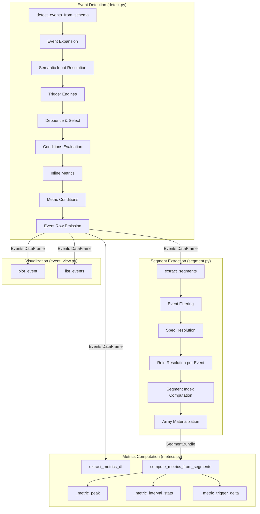

# Design: Event Detection & Metrics

> **Backfilled** — this design doc documents an existing system as it currently
> behaves. It is not a forward design. Code is the source of truth; this doc
> describes what the code does.

## Problem Statement

BODAQS records bicycle suspension telemetry (displacement, velocity, acceleration)
at high sample rates. The Event Detection & Metrics system transforms raw
time-series data into structured, comparable event instances — each representing
a physical occurrence such as a rebound, compression, or bottom-out. It detects
events using schema-defined trigger engines, extracts aligned waveform segments
around those events, computes scalar metrics from the segments, and provides
visualization tooling. The system exists to turn continuous sensor streams into
discrete, reproducible, cross-event-comparable measurements.

## Background

The system evolved from Jupyter notebook analysis code into a Python package
(`bodaqs_analysis`). Several legacy patterns remain:

- `detect.py` retains a `_require_inputs()` fallback that reads from Python
  globals (`data_rs`, `data`, `schema`) for notebook compatibility.
- `event_view.py` is explicitly notebook-oriented, requiring global variables
  (`EVENTS_DF`, `event_analysis_df`, `EVENT_SCHEMA`) and using legacy column
  names (`t0_index`, `start_index`, `end_index`, `t0_time`).
- `detect.py` computes metrics inline during detection (`_compute_metrics`) in
  addition to the SegmentBundle-based path in `metrics.py`
  (`compute_metrics_from_segments`). These are two parallel metric computation
  paths with overlapping but not identical functionality.

The system is governed by four formal contracts:

- [Event Schema Specification v0.2.0](../analysis/contracts/BODAQS_Event_Schema_Spec_v1_Full.md) —
  defines trigger engines, conditions DSL, window semantics, metrics DSL
- [Event Table Contract v0.1.2](../analysis/contracts/BODAQS_Event_Table_Contract_v0_1_3_draft.md) —
  defines the output schema of `detect_events_from_schema()`
- [Metrics Table Contract v0.2](../analysis/contracts/BODAQS_Metrics_Table_Contract_v0_2.md) —
  defines the output schema of metrics computation
- [SegmentBundle Contract v0.1.1](../analysis/contracts/BODAQS_SegmentBundle_Contract_v0_1_1.md) —
  defines the intermediate data structure produced by `extract_segments()`

## Goals

- Detect physical events from suspension telemetry using schema-defined trigger
  engines (threshold crossing, local extrema, phased threshold crossing)
- Support semantic input resolution via the signal registry — no hardcoded
  column names
- Support event expansion across semantic contexts (e.g., rear/front) via the
  `expand` field
- Extract aligned, fixed-length waveform segments around detected events
- Compute scalar metrics from segments (peak, interval_stats, trigger_delta)
- Produce contract-compliant Events Table and Metrics Table DataFrames
- Provide notebook-oriented event visualization

## Non-Goals

- The system does not perform signal preprocessing (filtering, resampling,
  motion derivation) — that is handled upstream by `pipeline.py`,
  `preprocess_filters.py`, `motion_derivation.py`, etc.
- The system does not persist artifacts to disk — that is handled by
  `artifacts.py`
- The system does not perform cross-session aggregation — that is handled by
  `library/aggregations.py`
- `event_view.py` does not use the SegmentBundle path; it operates directly on
  the session DataFrame with legacy column names
- The system does not support variable-length segments within a bundle
  (SegmentBundle Contract non-goal)

## Open Questions

- **Two parallel metric paths**: `detect.py:_compute_metrics()` computes metrics
  inline during detection, while `metrics.py:compute_metrics_from_segments()`
  computes metrics from SegmentBundles. The inline path supports additional
  metric types (`integral`, `time_above`) and interval_stats ops (`peak`,
  `time_above`) not present in the SegmentBundle path. Which path is canonical?
  — discovered in `detect.py` L1130–1380 and `metrics.py` L117–300
  *(unverified intent — needs review)*
- **NumPy version inconsistency**: `detect.py` uses `np.trapezoid` (NumPy 2.0+),
  while `metrics.py` uses `np.trapz` (deprecated in NumPy 2.0). Which NumPy
  version is targeted? — discovered in `detect.py` L1170 and `metrics.py` L295
  *(unverified intent — needs review)*
- **`SKIP_EVENTS` global**: `detect_events_from_schema` checks for a
  `SKIP_EVENTS` global set to skip events by ID. Is this still used?
  — discovered in `detect.py` L1493 *(unverified intent — needs review)*
- **`event_view.py` column names**: The viewer uses legacy column names
  (`t0_index`, `start_index`, `end_index`, `t0_time`, `win_pre_s`,
  `win_post_s`) that do not match the current Event Table Contract. Is this
  module still actively used or is it superseded? — discovered in
  `event_view.py` L97–219 *(legacy behavior — may be removed in future cleanup)*

## System Invariants

- **INV-1**: Every event row has a unique `(session_id, event_id)` pair.
  Enforced by `model.py:validate_events_df()`.
- **INV-2**: `start_idx <= trigger_idx <= end_idx` for every event row.
  Enforced by `model.py:validate_events_df()`.
- **INV-3**: `start_time_s <= trigger_time_s <= end_time_s` for every event row.
  Enforced by `model.py:validate_events_df()`.
- **INV-4**: `session_id` must be present in `meta` and is injected into every
  event row. Missing `session_id` raises `ValueError`. Enforced by
  `detect.py:detect_events_from_schema()`.
- **INV-5**: Each semantic input role must resolve to exactly one signal. Zero
  matches skip the event instance; multiple matches raise `ValueError`.
  Enforced by `detect.py:_resolve_inputs_from_event_inputs()`.
- **INV-6**: Events must define semantic `inputs`. Events without `inputs`
  raise `ValueError`. Enforced by `detect.py:_expand_event_instances()`.
- **INV-7**: SegmentBundle data arrays have shape `(n_valid_segments, n_samples)`.
  Enforced by `metrics.py:compute_metrics_from_segments()`.
- **INV-8**: Metrics DataFrame columns are prefixed `m_` (metrics) or `d_`
  (debug). Forbidden columns: `start_idx`, `end_idx`, `start_time_s`,
  `end_time_s`, `trigger_idx`. Enforced by `model.py:validate_metrics_df()`.
- **INV-9**: `time_s` must be present, numeric, finite, and monotonic
  non-decreasing in the session DataFrame. Enforced by
  `segment.py:_validate_df_timebase()`.
- **INV-10**: `extract_segments` processes one schema_id at a time. Multiple
  schema_ids raise `ValueError`. Enforced by
  `segment.py:_resolve_effective_spec()`.
- **INV-11**: Role resolution in segment extraction is per-event-row, using the
  event's `signal_col` to inherit semantic context (end, domain). Enforced by
  `segment.py:_resolve_roles_to_columns_per_eventrow()`.
- **INV-12**: Ambiguous role resolution (tied candidates) raises `ValueError`.
  Enforced by `segment.py:_pick_column_for_role()`.
- **INV-13**: Metric conditions fail closed — missing metrics or NaN values
  cause the condition to fail, rejecting the event candidate. Enforced by
  `detect.py:_apply_metric_conditions()`.
- **INV-14**: Events DataFrame is sorted by `["schema_id", "trigger_idx"]`
  before return. Enforced by `detect.py:detect_events_from_schema()`.
- **INV-15**: `params_hash` is a SHA-256 hash of the resolved event definition
  plus schema version. Enforced by `detect.py:_hash_event_params()`.
- **INV-16**: `detector_version` is always `"schema/v0"`. Hardcoded in
  `detect.py:detect_events_from_schema()`. *(unverified intent — needs review)*

## High-Level Architecture



### Pipeline Flow

```
load_session → preprocess_session → detect_events_from_schema → extract_segments → compute_metrics_from_segments
```

The SegmentBundle Contract establishes a clean separation: metrics must not
re-slice `session["df"]`, reinterpret event timing, or depend on detection
schema logic. Metrics operate only on SegmentBundles.

However, `detect_events_from_schema` also computes metrics inline (via
`_compute_metrics`), creating a second path where metrics are embedded directly
in the Events DataFrame.

## Data Model

### Events DataFrame (Event Table Contract v0.1.2)

Produced by `detect_events_from_schema()`. One row per detected event instance.

**Required columns**: `session_id`, `event_id`, `schema_id`, `schema_version`,
`event_name`, `signal`, `signal_col`, `start_idx`, `end_idx`, `trigger_idx`,
`start_time_s`, `end_time_s`, `trigger_time_s`, `detector_version`,
`params_hash`

**Secondary trigger columns**: `{trigger_id}_time_s`, `{trigger_id}_idx` for
each resolved secondary trigger.

**Optional columns**: `signals`, `segment_id`, `tags`, `score`, `qc_flags`,
`meta`, `trigger_datetime`, `{role}_at_trigger`

**Inline metric columns**: `m_*` and `d_*` columns from `_compute_metrics()`

### SegmentBundle (SegmentBundle Contract v0.1.1)

Produced by `extract_segments()`. A plain Python `dict`:

```
SegmentBundle
├─ spec       # resolved extraction specification
├─ events     # filtered event table (input)
├─ segments   # per-segment metadata and QC
├─ data       # aligned sample arrays (wide / matrix form)
└─ qc         # summary quality information
```

**`spec`**: `anchor`, `window`, `grid`, `roles`, `role_to_col` (None, per-event
mode), `role_to_col_mode` ("per_event_row"), `output`

**`segments`**: DataFrame with columns: `event_row`, `valid`, `reason`,
`trigger_time_s`, `trigger_idx`, `start_idx`, `end_idx_excl`, `req_start_idx`,
`req_end_idx_excl`, `n_expected`, `role_to_col`

**`data`**: Dict mapping roles + time arrays to NumPy arrays of shape
`(n_valid_segments, n_samples)`. Always includes `t_rel_s` and optionally
`time_s`.

### Metrics DataFrame (Metrics Table Contract v0.2)

Produced by `compute_metrics_from_segments()` or `extract_metrics_df()`.

**Required columns**: `session_id`, `event_id`

**Recommended identity columns**: `schema_id`, `schema_version`, `event_name`,
`signal`, `signal_col`, `segment_id`, `trigger_time_s`, `trigger_datetime`,
`tags`

**Metric columns**: All prefixed `m_`

**Debug columns**: All prefixed `d_`

**Forbidden columns**: `start_idx`, `end_idx`, `start_time_s`, `end_time_s`,
`trigger_idx`

### Event Schema (Input)

YAML-defined schema parsed by `schema.py:parse_event_schema()`. Contains:
- `defaults`: window, debounce
- `events`: list of EventDef, each with `id`, `label`, `inputs`, `expand`,
  `trigger`, `secondary_triggers`, `preconditions`, `postconditions`, `window`,
  `metrics`, `metric_conditions`, `tags`, `segment_defaults`

## Component Contracts

### detect_events_from_schema — `detect.py`

**Contract shape**: `(df: DataFrame, schema: dict, meta: dict, event_ids: list[str]|None) → DataFrame`

Accepts a preprocessed session DataFrame, an event schema, and session metadata.
Returns an Events DataFrame conforming to the Event Table Contract v0.1.2.

**Behavioral guarantees**:
- Expands events via `expand` field (semantic context expansion)
- Resolves semantic inputs via the signal registry (`meta["signals"]`)
- Detects triggers using the appropriate trigger engine
- Applies debounce clustering and scoring
- Evaluates preconditions and postconditions
- Computes inline metrics (if defined in schema)
- Evaluates metric conditions (post-metric filtering)
- Validates the output via `model.validate_events_df()`
- Sorts output by `["schema_id", "trigger_idx"]`
- Sets `globals()["EVENTS_DF"]` for notebook compatibility

**State ownership**: Stateless. Sets `globals()["EVENTS_DF"]` as a side effect
for notebook compatibility.

**Error semantics**:
- Missing `session_id` in meta → `ValueError` (hard failure)
- Unresolvable input role (zero matches) → Event instance skipped with warning
- Ambiguous input role (multiple matches) → `ValueError` (hard failure)
- Unknown trigger type → Warning, event skipped
- Invalid dt → Warning, time-based features degraded
- `SKIP_EVENTS` global → Events listed in global are skipped silently

### Trigger Engines — `detect.py`

#### simple_threshold_crossing (`_trigger_threshold_crossing`)

**Contract shape**: `(df, dt, ev, base_t0_sec=None) → list[dict]`

Detects directional threshold crossings using an armed/disarmed state machine.

**Behavioral guarantees**:
- Rising crossing: `y[i-1] < value` and `y[i] >= value`
- Falling crossing: `y[i-1] > value` and `y[i] <= value`
- Hysteresis re-arms after signal exits `value ± hysteresis`
- `dir`: rising, falling, or either (independent armed states)
- `trigger_strength = |y[i] - y[i-1]|`
- Optional displacement value attached when `disp` input is available
- Search window restricts candidate indices
- `zero_crossing` is a legacy alias that sets `value=0.0`

**Error semantics**: Missing signal column → `KeyError`. Empty series → empty
list.

#### local_extrema (`_trigger_local_extrema`)

**Contract shape**: `(df, dt, ev, base_t0_sec=None) → list[dict]`

Detects local maxima or minima using SciPy `find_peaks` (preferred) or a
deterministic fallback algorithm.

**Behavioral guarantees**:
- SciPy path: `find_peaks(y, prominence=..., distance=...)` for maxima;
  `find_peaks(-y, ...)` for minima
- Fallback path: sign-change detection in slope, manual prominence estimation
  using local window, manual distance filtering
- `trigger_strength` = prominence (SciPy) or local-baseline difference (fallback)
- `trigger_value` = signal value at extremum
- Edge ignore discards triggers near boundaries
- Search window restricts candidate indices

**Error semantics**: Missing signal column → `KeyError`. Empty series → empty
list. SciPy unavailable → fallback algorithm used silently.

#### phased_threshold_crossing (`_trigger_phased_threshold_crossing`)

**Contract shape**: `(df, dt, ev, base_t0_sec=None) → list[dict]`

State-machine detector enforcing progression through ordered signal bands with
dwell times.

**Behavioral guarantees**:
- Bands: `neg`, `zero`, `pos`, each with `min`, `max`, `dwell_samples`
- Phase sequences: `neg_zero_pos`, `pos_zero_neg`, `zero_pos`, `zero_neg`,
  `pos_zero`, `neg_zero`, `neg_pos`, `pos_neg`
- `dir` is a backward-compatibility alias: rising→`neg_zero_pos`,
  falling→`pos_zero_neg`, either→both
- `phase_sequence` may be a list; results merged by `t0_index`
- Phase runs must be adjacent (next phase starts on immediately following sample)
- `cross_samples` enforces minimum dwell in the final band
- `trigger_point`: `zero_start`, `zero_center` (default), `zero_end`,
  `final_start`
- Direct sequences (`neg_pos`, `pos_neg`) have no zero run; align to first
  sample of final band
- `trigger_strength` = duration of final band run
- Optional smoothing via `search.smooth_ms`
- State resets on band violation

**Error semantics**: Missing signal column → `KeyError`. Empty series → empty
list.

### Debounce & Selection — `detect.py`

#### _debounce_and_select

**Contract shape**: `(cands, dt, min_gap_s, prefer_key, prefer_abs, prefer_max) → list[dict]`

Clusters candidates by temporal proximity and selects one representative per
cluster.

**Behavioral guarantees**:
- `gap_s` converted to samples: `round(gap_s / dt)`
- Clusters formed where `|i[k+1] - i[k]| < min_gap_samples`
- Scoring: `score = candidate[prefer_key]`; if `prefer_abs`, `score = |score|`
- Winner: `max(score)` if `prefer_max`, else `min(score)`
- No debounce if `gap_s <= 0` or `dt` invalid

**Error semantics**: No errors raised. Empty input → empty output.

#### _pick_secondary_candidate

**Contract shape**: `(st_cands, base_t0_sec, search_cfg) → dict|None`

Selects one secondary trigger candidate relative to a base trigger.

**Behavioral guarantees**:
- Filters by relative delay window `[min_delay_s, max_delay_s]`
- `direction`: forward (earliest), backward (latest), auto (infer from delays)
- Auto: both ≥0 → forward; both ≤0 → backward; crosses zero → closest
- Missing base time → earliest candidate

**Error semantics**: No errors raised. Empty input → `None`.

### Conditions Evaluation — `detect.py`

#### _apply_conditions

**Contract shape**: `(df, dt, ev, t0_idx, inputs_map) → bool`

Evaluates preconditions and postconditions for an event candidate.

**Behavioral guarantees**:
- `within_s` defines a relative time window `[start, end]` around `t0_idx`
- `any_of`: at least one test must pass
- `all_of`: all tests must pass
- Test types: `range` (all samples within bounds), `delta` (change relative to
  trigger value), `peak` (extremum comparison)
- `delta` computes `seg - y[t0_idx]` and applies cmp to max/min of the delta
- Missing signal in `inputs_map` → test fails (returns `False`)
- Empty segment → test fails

**Error semantics**: Missing `cmp` key → `ValueError`. Missing signal → test
fails silently.

### Segment Extraction — `segment.py`

#### extract_segments

**Contract shape**: `(df, events, meta, schema, request) → SegmentBundle`

Extracts aligned, fixed-length waveform segments around detected events.

**Behavioral guarantees**:
- Validates `time_s` (present, numeric, finite, monotonic non-decreasing)
- Filters events by `schema_id`, `event_name`, or `tags_any`
- Resolves effective spec from schema `segment_defaults` + request overrides
- Resolves roles per-event-row using the event's `signal_col` for semantic
  context inheritance (end, domain)
- Role resolution uses registry-first matching with op_chain normalization
  (`op_zeroed` → `zeroed`)
- Scoring: quantity (+2), unit (+1), kind (+1), `primary_analysis` (+100),
  `secondary_analysis` (+20), primary signal col (+10), fewer ops preferred
- Computes segment indices via `searchsorted` on `time_s`
- Clipping: `start_idx = max(0, req_start_idx)`, `end_idx_excl = min(n, req_end_idx_excl)`
- Materializes arrays in wide form `(n_valid, n_expected)` with padding
- Time grids (`time_s`, `t_rel_s`) are built from a global dt estimate, then
  overwritten with exact timestamps in the "have" region
- `t_rel_s` is relative to the segment anchor time
- Padding: `nan` (fill with NaN), `edge` (fill with zeros), `drop` (invalidate)
- QC summary: `n_total`, `n_valid`, `n_invalid`, `reasons` dict

**State ownership**: Stateless.

**Error semantics**:
- Missing `time_s` → `ValueError`
- Non-monotonic `time_s` → `ValueError`
- Unresolvable role → `ValueError`
- Ambiguous role (tied candidates) → `ValueError`
- Multiple schema_ids → `ValueError`
- No roles resolved → `ValueError`
- Empty events → returns empty SegmentBundle (no error)

### Metrics Computation — `metrics.py`

#### extract_metrics_df (legacy path)

**Contract shape**: `(events_df, id_cols=None) → DataFrame`

Projects `m_*` and `d_*` columns from an events DataFrame.

**Behavioral guarantees**:
- Requires `session_id` and `event_id` columns
- Selects all `m_*` and `d_*` columns
- Preserves identity columns (session_id, event_id, schema_id, etc.)
- Excludes forbidden columns (`start_idx`, `end_idx`, `start_time_s`, `end_time_s`)
- Empty input → empty DataFrame

**Error semantics**: Missing `session_id` or `event_id` → `ValueError`.

#### compute_metrics_from_segments (SegmentBundle path)

**Contract shape**: `(bundle, schema, strict=True) → DataFrame`

Computes schema-defined metrics from a SegmentBundle.

**Behavioral guarantees**:
- Filters to valid segments only
- Aligns event rows to data order via `event_row`
- Validates data shapes: `t_rel_s` must be 2D `(n_seg, n_samp)`, all role arrays
  must match `(n_seg, n_samp)`
- Estimates `dt_s` from `t_rel_s` (median of finite diffs)
- Resolves schema event definition by `schema_id` or `event_name`
- Computes metrics in schema-defined order
- Each metric is independent (no inter-metric dependencies)
- Metric conditions evaluated after all metrics computed (in detect.py path only;
  this function does not evaluate metric_conditions)

**Metric types**:
- `peak`: `np.nanargmax`/`np.nanargmin`, optional `return_time`
- `interval_stats`: resolves trigger times, converts to relative grid indices,
  optional smoothing, ops: mean, max, min, range, delta, integral
- `trigger_delta`: difference between trigger anchors (seconds or samples),
  optional `abs`, optional `return_debug`

**State ownership**: Stateless. `MetricsContext` is a frozen dataclass.

**Error semantics**:
- Strict mode: missing triggers → `ValueError`; unsupported metric type →
  `ValueError`; non-prefixed column → `ValueValue`
- Non-strict: missing triggers → NaN; unsupported metric type → skipped;
  non-prefixed column → auto-prefixed with `m_`
- Invalid bundle structure → `ValueError`
- Invalid `t_rel_s` shape → `ValueValue`
- Non-positive `dt_s` → `ValueError`

### Event Visualization — `event_view.py`

#### plot_event

**Contract shape**: Keyword-only function requiring global variables
`EVENTS_DF`, `event_analysis_df`, `EVENT_SCHEMA`.

**Behavioral guarantees**:
- Picks event row by `row_index` or `(event_id, occurrence)`
- Slices session DataFrame using legacy columns (`start_index`, `end_index`,
  `t0_index`)
- Aligns time to t=0 at trigger
- Resolves disp/vel/acc inputs from the event row's `signal` and `signal_col`
  (best-effort, trigger role only)
- Plots one panel per available signal (disp, vel, acc)
- Draws vertical lines at primary trigger (t=0) and secondary trigger offsets
- Prints metric values if `show_metrics=True`
- Optionally saves figure to `save_path`

**State ownership**: Reads from Python globals. No state modified.

**Error semantics**: Missing globals → `RuntimeError`. No disp/vel/acc columns
→ `RuntimeError`. Invalid slice bounds → `IndexError`.

*(legacy behavior — may be removed in future cleanup)*

#### list_events

**Contract shape**: `(events=None, max_rows=20) → None`

Prints a compact event listing using legacy columns (`event_id`, `t0_time`,
`start_index`, `end_index`).

*(legacy behavior — may be removed in future cleanup)*

## Failure Modes

| Failure Mode | Trigger | Current Behavior | Handled? |
|---|---|---|---|
| Missing session_id | `meta` lacks `session_id` | `ValueError` raised, detection aborts | YES |
| Unresolvable input role | Semantic selector matches zero signals | Event instance skipped with warning log | YES |
| Ambiguous input role | Semantic selector matches multiple signals | `ValueError` raised, detection aborts | YES |
| Unknown trigger type | `trigger.type` not in allowed set | Warning logged, event skipped | YES |
| Invalid dt | `meta["dt"]` missing or ≤0; cannot estimate from `time_s` | Warning logged, time-based features degraded (distances, edge ignore) | PARTIAL |
| All-non-finite trigger series | Trigger column is entirely NaN | Warning logged, event proceeds (may produce no candidates) | PARTIAL |
| Flat trigger series | Trigger column min == max | Warning logged, event proceeds | YES |
| SciPy unavailable | `scipy.signal.find_peaks` import fails | Fallback algorithm used silently for `local_extrema` | YES |
| Condition test missing `cmp` | `test["cmp"]` is None | `ValueError` raised | YES |
| Missing condition signal | Test references signal not in `inputs_map` | Test fails (returns `False`), candidate rejected | YES |
| Empty condition window | `within_s` produces empty slice | Test fails, candidate rejected | YES |
| Unresolvable segment role | No registry entry matches RoleSpec | `ValueError` raised | YES |
| Ambiguous segment role | Tied candidates after scoring | `ValueError` raised | YES |
| Non-monotonic time_s | `time_s` decreases | `ValueError` raised in segment extraction | YES |
| Segment window exceeds data bounds | Requested window extends past DataFrame edges | Clipped to available range; padding applied per `OutputSpec.pad` | YES |
| Empty segment after clipping | `end_idx_excl <= start_idx` after clipping | Segment marked invalid with reason "empty segment after clipping" | YES |
| Missing trigger_time_s in strict metrics | `trigger_time_s` column absent or NaN | `ValueError` (strict) or NaN (non-strict) | YES |
| Invalid t_rel_s shape | `t_rel_s` not 2D or wrong first dimension | `ValueError` raised | YES |
| Non-positive dt_s in metrics | Median diff of `t_rel_s` ≤ 0 | `ValueError` raised | YES |
| Missing schema event definition | No event def matches `schema_id` or `event_name` | `ValueError` (strict) or empty metrics (non-strict) | YES |
| event_view.py globals not set | `EVENTS_DF` etc. not in globals | `RuntimeError` raised | YES |
| event_view.py legacy columns missing | Events DF uses contract names, not legacy | `KeyError` at runtime | NO |
| Multiple schema_ids in segment extraction | Events from different schemas passed together | `ValueError` raised | YES |
| `SKIP_EVENTS` global set | Global dict contains event IDs | Those events skipped silently | YES |
| Metric condition references missing metric | `metric` name not in computed values | Condition fails (fail-closed), candidate rejected | YES |

## Cross-Cutting Concerns

### Observability

- Python `logging` module used throughout `detect.py` and `segment.py`
- Logger names: `bodaqs_analysis.detect`, `bodaqs_analysis.segment`
- Debug-level logging for candidate counts, debounce parameters, rejection reasons
- Warning-level for skipped events, invalid dt, flat/non-finite trigger series
- Info-level for final event count summary
- No logging in `metrics.py` or `event_view.py`

### Backwards Compatibility

- `threshold_crossing` accepted as legacy alias for `simple_threshold_crossing`
- `zero_crossing` accepted as legacy alias (sets `value=0.0`)
- `dir` field in `phased_threshold_crossing` is a backward-compatibility alias
  for `phase_sequence`
- `t0_index` accepted as legacy alias for `trigger_idx` in
  `_resolve_trigger_idx()`
- `event_view.py` uses entirely legacy column names
  *(legacy behavior — may be removed in future cleanup)*
- `detect.py:_require_inputs()` falls back to globals for notebook compatibility
  *(legacy behavior — may be removed in future cleanup)*

### Determinism

- Event detection is deterministic: same input → same output
- Debounce clustering is deterministic (sorted by `t0_index`)
- Role resolution scoring is deterministic (sorted by score, ties raise error)
- Segment extraction is deterministic (`searchsorted` on monotonic `time_s`)
- Metrics computation is deterministic (vectorized NumPy operations)
- `params_hash` provides a content hash of the effective schema for traceability

### Performance

- Trigger detection iterates sample-by-sample in Python (threshold crossing,
  phased threshold crossing) — O(n) per event definition
- `local_extrema` uses SciPy vectorized `find_peaks` when available
- Segment extraction uses `searchsorted` for index lookup — O(n log n)
- Metrics computation uses vectorized NumPy operations
- `_reduce_interval` and `_delta_interval` in metrics.py iterate per-segment in
  Python — O(n_seg × window_size) per op
- No parallelism or caching
