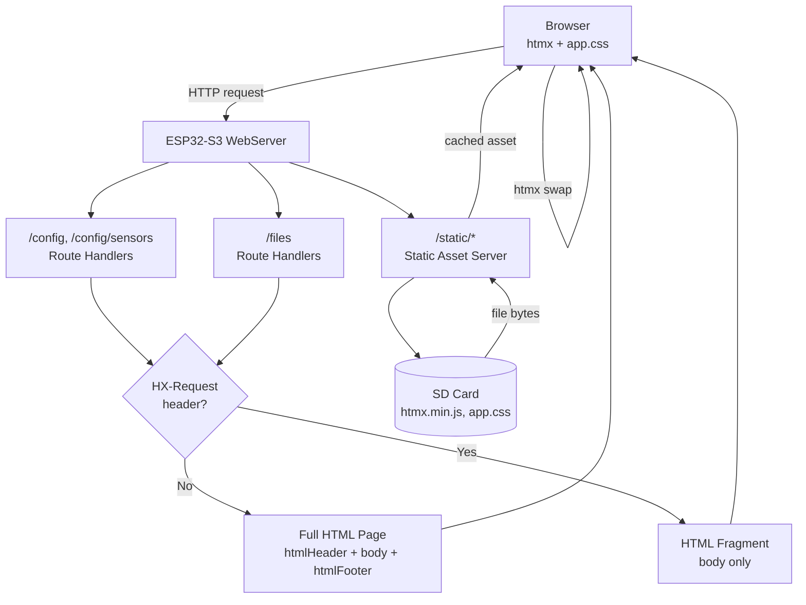

# htmx Web UI Migration — Design Doc

## Problem Statement

The BODAQS data logger's web UI is server-rendered HTML generated inline in C++ strings. Every form submission triggers a full page reload — the browser POSTs, the ESP32 regenerates the entire HTML page (~8–15 KB), and the browser re-renders from scratch. This loses scroll position, flashes the screen, and feels sluggish on mobile. The config page alone has 5 WiFi network slots with static IP fields, making the page long and the reload penalty severe. We need to eliminate full page reloads without exceeding the ESP32-S3's flash, RAM, and single-threaded HTTP constraints.

## Background

The logger runs on a SparkFun ESP32-S3 Thing Plus with 8 MB flash. The partition table (`no_ota.csv`) allocates 2 MB to the app partition (currently 1.43 MB used, ~570 KB free) and 1.79 MB to an unused SPIFFS partition. Free heap is ~300 KB after WiFi and sensor initialization. The web server (`WebServerManager`) is single-threaded — one request at a time. All HTML is generated inline in C++ via `HtmlUtil::htmlHeader()` / `htmlFooter()` and route handlers in `Routes_Config.cpp`, `Routes_Files.cpp`, and `Routes_Api.cpp`. Responses are streamed in 2 KB chunks via `ChunkedHtmlResponse` and `HttpFileSender::sendText()`. No gzip. No SPIFFS. No static file serving. The SD card is mounted and accessible via `SD_MMC`.

Related code:
- `firmware/src/HtmlUtil.cpp` — shared HTML header/footer, inline CSS, nav bar
- `firmware/src/Routes_Config.cpp` — `/config`, `/config/sensors`, `/config/sensor?id=N`
- `firmware/src/Routes_Files.cpp` — `/files` file browser
- `firmware/src/HttpFileSender.cpp` — chunked text response, SD file serving with Range support
- `firmware/src/WebServerManager.cpp` — server lifecycle, route registration

## Goals

- **G1 — No full page reloads on form submit:** Saving config or sensor settings updates only the changed portion of the page. Verify: submit any form on `/config` or `/config/sensor`, browser URL does not change, scroll position is preserved, no white flash.
- **G2 — Static assets served and cached:** htmx.js (~14 KB) and app.css (~5 KB) are served from the logger and cached by the browser. Verify: first page load fetches `htmx.min.js` and `app.css`; subsequent page loads do not re-fetch them (HTTP 304 or `from disk cache`).
- **G3 — Graceful degradation:** Every page works without JavaScript. Verify: disable JS in browser, navigate to `/config`, submit form — form POSTs normally and page reloads with result.
- **G4 — No regression in memory envelope:** Peak heap usage during request handling does not increase. Verify: `ESP.getFreeHeap()` before and after a config page load is within ±2 KB of baseline.
- **G5 — Flash footprint under 20 KB:** New C++ code for static file serving and fragment detection adds < 20 KB to the firmware binary. Verify: `firmware.bin` size delta < 20 KB.
- **G6 — Mobile-responsive layout:** Config and sensor pages are usable on a 375px-wide phone screen without horizontal scrolling. Verify: open `/config` in browser DevTools at 375px width, all form fields are visible and tappable.

## Non-Goals

- **Not building a SPA** — htmx is progressive enhancement, not a client-side framework. The server remains the source of truth and continues to render HTML.
- **Not adding JSON APIs** — htmx consumes HTML fragments. The existing `/api/*` JSON endpoints stay as-is; no new JSON serialization is needed for the config/sensor pages.
- **Not adding a build step** — no npm, no bundler, no transpiler. htmx.min.js and app.css are static files placed on the SD card or SPIFFS.
- **Not replacing the OLED menu system** — the `MenuSystem.cpp` display/UX is separate and unaffected.
- **Not adding gzip compression** — pre-gzipped assets are a future optimization. For now, uncompressed assets are small enough (~19 KB total) that the transfer cost is acceptable.
- **Not touching the `/api/*` JSON endpoints** — those serve the desktop analysis app and are out of scope.

## Resolved Questions

| # | Question | Decision | Rationale |
|---|----------|----------|-----------|
| 1 | Serve static assets from SD card or SPIFFS? | **SD card** | Already mounted, `sendSdFile` exists with Range support. Zero new filesystem code. SD card removable but degrades gracefully — forms still work without JS/CSS. |
| 2 | Keep minimal inline CSS as fallback, or all CSS in app.css? | **All in app.css** | Simpler `htmlHeader()`. If SD card is absent, page is unstyled but forms remain functional (raw HTML with browser defaults). The config pages are simple forms — usable without CSS, just ugly. |
| 3 | Self-host htmx or load from CDN? | **Self-hosted** | Logger operates in AP mode with no internet. CDN would fail for AP mode users. 14 KB on SD card is negligible. |

---

## Change Surface

| Category | Items |
|----------|-------|
| **New components** | Static Asset Server (serves `/static/*` from SD card), Fragment Responder (detects htmx requests and returns HTML fragments instead of full pages) |
| **Modified components** | `HtmlUtil.cpp` (header includes htmx script + CSS link, CSS extracted to `app.css`), `Routes_Config.cpp` (form handlers return fragments on htmx requests), `Routes_Files.cpp` (file operations use htmx swaps), `WebServerManager.cpp` (register `/static/*` route) |
| **Deprecated components** | None — full-page rendering is retained as fallback |
| **External contracts changed** | None — same URLs, same form fields, same POST semantics. htmx requests add `HX-Request: true` header but routes that don't check it behave identically. |
| **Data model changed** | None |
| **Rollout required** | No — firmware flash update. No migration. |

---

## Constraints

| Constraint | Source | Impact |
|-----------|--------|--------|
| ESP32-S3, ~570 KB free app flash | Partition table + current binary | New C++ code must be compact; static assets must not go in app flash |
| ~300 KB free heap | ESP32-S3 RAM after WiFi/sensor init | No large in-memory buffers; keep 2 KB chunk pattern |
| Single-threaded WebServer | ESP32 WebServer library | One HTTP request at a time; browser must not fire parallel requests |
| 2 KB chunked response buffers | `ChunkedHtmlResponse`, `HttpFileSender` | Fragment responses must stream in chunks, same as today |
| No gzip support | Current HTTP server | Assets served uncompressed; keep them small |
| SD card may be absent | Hardware reality | Static asset serving must degrade gracefully |
| WiFi in AP mode has no internet | Access Point mode | Cannot load htmx from CDN; must serve locally |

## Scale Envelope

| Dimension | Expected | Headroom target |
|-----------|----------|-----------------|
| Concurrent HTTP clients | 1 | 1 (hardware limit) |
| Page size (full HTML) | 8–15 KB | 20 KB |
| Fragment response size | 200 bytes – 2 KB | 5 KB |
| Static asset size (total) | ~19 KB | 50 KB |
| Page load time (first, no cache) | < 2s | < 1s |
| Page load time (cached assets) | < 500ms | < 200ms |

> Cached assets use `Cache-Control: max-age=31536000` with `?v=<firmware-version>` in the URL.
> The browser makes **zero requests** for cached assets — not even 304 revalidation.
> Cache invalidates automatically when firmware version changes.

---

## Actors & User Stories

### Actors

| Actor | Description |
|-------|-------------|
| **Logger operator** | Person connecting to the logger's WiFi (AP or STA mode) and opening the web UI in a browser. Typically on a phone or laptop at the bike. Wants to configure sensors, start/stop logging, download files. |
| **Browser** | The HTTP client. May or may not have JavaScript enabled. May cache static assets. |

### User Stories

- **US1:** As a logger operator, I save config changes without the page reloading, so that I don't lose my place in a long form.
- **US2:** As a logger operator, I see inline success/error feedback after saving, so that I know the save worked without scanning the whole page.
- **US3:** As a logger operator, I configure sensors on my phone, so that the form fields fit the screen and are tappable.
- **US4:** As a logger operator, I delete a file from the SD card without the page reloading, so that the file list updates in place.
- **US5:** As a logger operator with JS disabled, I can still use every page, so that the logger works in restricted browser environments.

---

## System Invariants

- **INV-1:** Every page is fully functional without JavaScript. htmx enhances; it does not replace. Forms POST normally and the server returns full pages when `HX-Request` header is absent.
- **INV-2:** Static assets (htmx.js, app.css) are served with `Cache-Control: max-age=31536000` (1 year) and a `?v=<firmware-version>` query string in the URL. The browser caches them indefinitely for a given firmware version. When firmware is updated, the version string changes, the URL changes, and the browser fetches fresh assets automatically. Verify: first page load fetches `htmx.min.js?v=0.4.1` and `app.css?v=0.4.1`; subsequent loads use cache (zero requests); after firmware update to 0.4.2, browser fetches `?v=0.4.2` versions.
- **INV-3:** No response exceeds the existing memory envelope. Fragment responses use the same 2 KB chunked streaming as full-page responses. No response body is buffered in full in heap.
- **INV-4:** Config editing remains locked during logging or upload mode. htmx requests receive a 200 response with an `.alert-warn` fragment (htmx v2.0 does not swap 4xx response bodies by default); non-htmx requests receive the same 423 plain text as today.
- **INV-5:** The server handles one request at a time. htmx is configured with `hx-sync` where needed to prevent overlapping requests.

---

## High-Level Architecture

### System Diagram



### Component Responsibilities

| Component | Responsibility | Owns |
|-----------|---------------|------|
| **Static Asset Server** | Serves `/static/*` files from SD card with caching headers and Range support | Static file path mapping, cache headers |
| **Fragment Responder** | Detects htmx requests via `HX-Request` header and routes response to fragment or full-page path | Fragment vs full-page decision logic |
| **HtmlUtil (modified)** | Renders HTML shell with `<script>` and `<link>` tags for htmx/CSS; all CSS extracted to `app.css` | HTML header/footer, nav bar |
| **Route Handlers (modified)** | Form POST handlers return fragments when `HX-Request: true`, full pages otherwise | Form processing, validation, config persistence |

### Key Design Decisions

**Decision:** Serve static assets from SD card, not SPIFFS.
**Alternatives considered:** SPIFFS partition (1.79 MB unused), PROGMEM (embedded in firmware binary), CDN.
**Rationale:** SD card is already mounted. `HttpFileSender::sendSdFile` already supports Range requests and chunked streaming. SPIFFS would require partition initialization code and a filesystem library. PROGMEM would consume app flash (only 570 KB free). CDN is unavailable in AP mode. SD card risk: if absent, assets don't load and forms degrade to normal POST (INV-1).

**Decision:** Detect htmx requests via `HX-Request` header, not a separate URL scheme.
**Alternatives considered:** Separate `/fragments/config` URLs, query param `?fragment=1`.
**Rationale:** htmx automatically sends `HX-Request: true` on every request. Same URL serves both full and fragment responses. No route duplication. Graceful degradation is automatic — non-htmx requests get full pages.

**Decision:** Extract all CSS to `app.css` on SD card. No inline CSS fallback.
**Alternatives considered:** Keep minimal inline CSS (~500 bytes) as fallback, all CSS inline (current approach).
**Rationale:** Simpler `htmlHeader()`. If SD card is absent, `app.css` doesn't load and the page is unstyled — but the forms are simple enough (labels, inputs, fieldsets, buttons) that browser default rendering is still functional. The user can still read labels, fill fields, and submit. Ugly but usable. Not worth the complexity of maintaining two stylesheets.

**Decision:** Use `hx-sync` on forms that could trigger overlapping requests.
**Alternatives considered:** Let htmx queue requests naturally, disable submit button via JS.
**Rationale:** The ESP32 WebServer is single-threaded. If the user clicks Save twice quickly, the second request queues behind the first. htmx's default behavior sends the second request after the first completes, which is correct. But for safety, `hx-sync` with `replace` strategy ensures only the latest request is sent.

---

## Design Language

### Color Palette

```css
:root {
  /* Brand palette */
  --shadow-grey:  #212227;  /* near-black — primary text, dark surfaces */
  --dim-grey:     #637074;  /* medium grey — secondary text, borders, disabled */
  --lavender-grey: #8693ab; /* muted purple-grey — primary accent, active states */
  --powder-blue:  #aab9cf;  /* light blue-grey — hover, secondary accent */
  --pale-sky:     #bdd4e7;  /* light blue — surface backgrounds, highlights */

  /* Semantic status colors (complement the brand palette) */
  --status-success-bg: #e7f5e7;
  --status-success-fg: #2d6a2d;
  --status-success-bd: #8bc34a;
  --status-error-bg:   #ffe7e7;
  --status-error-fg:   #8b2020;
  --status-error-bd:   #e57373;
  --status-warn-bg:    #fff3cd;
  --status-warn-fg:    #665500;
  --status-warn-bd:    #ffe08a;
}
```

### Semantic Role Mapping

| Token | Hex | Role | Used for |
|-------|-----|------|----------|
| `--shadow-grey` | `#212227` | Primary text, dark surfaces | Body text, nav bar background, footer, table headers |
| `--dim-grey` | `#637074` | Secondary text, borders | Labels hints (`<small>`), field borders, disabled inputs, htmx loading indicator |
| `--lavender-grey` | `#8693ab` | Primary accent | Primary button background, active nav link, selected row indicator, `<legend>` text |
| `--powder-blue` | `#aab9cf` | Secondary accent, hover | Button hover, input focus border, link hover |
| `--pale-sky` | `#bdd4e7` | Surface highlight | Fieldset background, table zebra striping, card background |

### Typography

```css
body {
  font-family: system-ui, -apple-system, "Segoe UI", Roboto, Arial, sans-serif;
  font-size: 14px;
  line-height: 1.5;
  color: var(--shadow-grey);
}
```

No custom fonts. System-ui is already in use and adds zero bytes. The 1.5 line height (up from 1.35) improves readability on mobile.

### Spacing Scale

```css
:root {
  --space-xs: 4px;
  --space-sm: 8px;
  --space-md: 12px;
  --space-lg: 16px;
  --space-xl: 24px;
}
```

All padding, margin, and gap values use these tokens. This keeps the UI compact (ESP32 pages are dense) while remaining consistent.

### Component Examples

#### Page shell (nav bar + title)

```css
.titlebar {
  font-size: 1.5em;
  font-weight: 700;
  color: var(--shadow-grey);
  margin: 0 0 var(--space-xs) 0;
}

.netbar {
  font-size: 0.9em;
  color: var(--dim-grey);
  margin: 0 0 var(--space-md) 0;
}

.topnav {
  margin: 0 0 var(--space-lg) 0;
  padding: var(--space-sm) var(--space-md);
  background: var(--shadow-grey);
  border-radius: 8px;
}

.topnav a {
  color: var(--pale-sky);
  margin-right: var(--space-md);
  text-decoration: none;
}

.topnav a:hover {
  color: #fff;
  text-decoration: underline;
}
```

#### Fieldsets and form rows

```css
fieldset {
  margin: var(--space-lg) 0;
  padding: var(--space-md) var(--space-lg);
  border: 1px solid var(--dim-grey);
  border-radius: 8px;
  background: var(--pale-sky);
}

legend {
  font-weight: 700;
  color: var(--lavender-grey);
  padding: 0 var(--space-xs);
}

.row {
  margin: var(--space-sm) 0;
  display: flex;
  align-items: center;
  flex-wrap: wrap;
  gap: var(--space-sm);
}

label {
  min-width: 160px;
  font-weight: 500;
  color: var(--shadow-grey);
}

input, select {
  padding: var(--space-xs) var(--space-sm);
  border: 1px solid var(--dim-grey);
  border-radius: 4px;
  font-size: 0.95em;
  color: var(--shadow-grey);
  background: #fff;
}

input:focus, select:focus {
  border-color: var(--powder-blue);
  outline: none;
  box-shadow: 0 0 0 2px rgba(170, 185, 207, 0.3);
}

input:disabled, select:disabled {
  opacity: 0.5;
  background: var(--dim-grey);
}

small {
  color: var(--dim-grey);
  font-size: 0.85em;
}
```

#### Buttons

```css
button {
  padding: var(--space-sm) var(--space-md);
  border: 1px solid var(--dim-grey);
  border-radius: 6px;
  background: var(--lavender-grey);
  color: #fff;
  font-size: 0.95em;
  cursor: pointer;
}

button:hover {
  background: var(--powder-blue);
  color: var(--shadow-grey);
}

button:disabled {
  background: var(--dim-grey);
  opacity: 0.6;
  cursor: not-allowed;
}
```

#### Alerts (success / error / warning)

```css
.alert-ok {
  background: var(--status-success-bg);
  border: 1px solid var(--status-success-bd);
  color: var(--status-success-fg);
  padding: var(--space-sm) var(--space-md);
  border-radius: 6px;
}

.alert-err {
  background: var(--status-error-bg);
  border: 1px solid var(--status-error-bd);
  color: var(--status-error-fg);
  padding: var(--space-sm) var(--space-md);
  border-radius: 6px;
}

.alert-warn {
  background: var(--status-warn-bg);
  border: 1px solid var(--status-warn-bd);
  color: var(--status-warn-fg);
  padding: var(--space-sm) var(--space-md);
  border-radius: 6px;
}
```

#### Tables (sensor list, file browser)

```css
table {
  width: 100%;
  border-collapse: collapse;
}

th {
  background: var(--shadow-grey);
  color: var(--pale-sky);
  text-align: left;
  padding: var(--space-sm) var(--space-md);
  font-size: 0.85em;
  text-transform: uppercase;
  letter-spacing: 0.5px;
}

td {
  padding: var(--space-sm) var(--space-md);
  border-bottom: 1px solid var(--dim-grey);
}

tbody tr:nth-child(even) {
  background: rgba(189, 212, 231, 0.3); /* pale-sky at 30% */
}

tbody tr:hover {
  background: var(--pale-sky);
}
```

#### htmx loading indicator

```css
.htmx-indicator {
  display: none;
}

.htmx-request .htmx-indicator {
  display: inline-block;
  color: var(--dim-grey);
  font-size: 0.85em;
}

.htmx-request.htmx-indicator {
  display: inline-block;
}
```

Usage in HTML:

```html
<button type="submit">
  Save
  <span class="htmx-indicator">Saving...</span>
</button>
```

#### Mobile responsive

```css
@media (max-width: 480px) {
  body { margin: var(--space-sm); font-size: 15px; }

  .row { flex-direction: column; align-items: flex-start; }
  label { min-width: 0; }

  .topnav { display: flex; flex-wrap: wrap; gap: var(--space-sm); }
  .topnav a { margin-right: 0; }

  fieldset { padding: var(--space-sm); }
  th, td { padding: var(--space-xs); font-size: 0.85em; }
}
```

At 375px width, form rows stack vertically (label above input), the nav bar wraps, and table cells compress. This makes the config page fully usable on a phone.

### Visual Summary

```
┌─────────────────────────────────────────────┐
│  BODAQS data logger: MyLogger          ████ │  ← titlebar (shadow-grey text)
│  Network: AP / BODAQS-Logger  IP: 192.168.4.1│  ← netbar (dim-grey text)
├─────────────────────────────────────────────┤
│  Files    General    Sensors                 │  ← topnav (shadow-grey bg, pale-sky links)
├─────────────────────────────────────────────┤
│  ┌─ General ─────────────────────────────┐  │
│  │  Logger name  [_________________]     │  │  ← fieldset (pale-sky bg)
│  │  Sample rate  [_______] Hz            │  │     legend (lavender-grey)
│  │                                        │  │
│  │  Log format:                          │  │
│  │       ○ BODAQS CSV  ○ binary          │  │
│  │                                        │  │
│  │              [ Save  Saving... ]       │  │  ← button (lavender-grey bg)
│  └───────────────────────────────────────┘  │
│                                              │
│  ┌─ Network & NTP ───────────────────────┐  │
│  │  Wi-Fi mode  [Station ▾]               │  │
│  │  AP SSID     [BODAQS-Logger]           │  │
│  │  AP password [••••••••••]              │  │
│  └───────────────────────────────────────┘  │
└─────────────────────────────────────────────┘
```

---

## Component Contracts

### Static Asset Server — `firmware/src/Routes_Static.cpp` (new)

**Depends on:** `HttpFileSender`, `SD_MMC`
**Size:** S

#### Contract shape

- **Exposes:** HTTP GET handler for `/static/*` path prefix
- **Consumes:** SD card filesystem (`SD_MMC`)
- **Data in:** URL path after `/static/` (e.g., `htmx.min.js`, `app.css`)
- **Data out:** File contents with correct `Content-Type`, `Cache-Control: max-age=31536000`, `Accept-Ranges: bytes`

#### Behavioral guarantees

- Maps `/static/<filename>` to `/www/<filename>` on SD card (fixed prefix, no path traversal)
- Rejects any path containing `..`, `/`, or `\` after the prefix strip — returns 404
- Returns 404 if SD card not mounted or file not found
- Sets `Cache-Control: max-age=31536000` on all responses (1 year — safe because URL includes `?v=<firmware-version>`, so cache invalidates automatically on firmware update)
- Ignores query string when resolving the file on SD card (strips everything after `?`)
- Sets `Content-Type` based on extension: `.js` → `application/javascript`, `.css` → `text/css`, `.html` → `text/html`
- Delegates to `HttpFileSender::sendSdFile` for Range support and chunked streaming

#### State ownership

- **Owns:** Nothing (stateless request handler)
- **Reads from:** SD card filesystem
- **Side effects:** None

#### Error semantics

| Error class | When | Caller must |
|-------------|------|-------------|
| 404 Not Found | File not on SD card, or SD card not mounted | Browser falls back to inline CSS / no-JS mode |
| 403 Forbidden | Path contains `..` or directory separator | Browser treats as missing asset |

#### Spec directives

- [ ] Exact route registration in `WebServerManager::setupRoutes()`
- [ ] Path sanitization rules (reject `..`, `/`, `\` in filename)
- [ ] Content-Type mapping for `.js`, `.css`
- [ ] Cache-Control header value (`max-age=31536000`)
- [ ] Query string stripping (ignore `?v=...` when resolving file on SD card)
- [ ] Behavior when SD card is not mounted
- [ ] Acceptance criteria: given SD card with `/www/htmx.min.js`, when GET `/static/htmx.min.js?v=0.4.1`, then 200 with `application/javascript` and `Cache-Control: max-age=31536000`

---

### Fragment Responder — `firmware/src/HtmlUtil.cpp` (modified)

**Depends on:** `WebServer` (for header access)
**Size:** S

#### Contract shape

- **Exposes:** `bool isHtmxRequest(WebServer& srv)` — returns true if `HX-Request: true` header present
- **Exposes:** `String htmlFragment(const String& body)` — renders body without `<html>`, `<head>`, `<script>`, `<link>` tags
- **Exposes:** `String htmlRespond(WebServer& srv, const String& title, const String& body)` — convenience: returns fragment if `isHtmxRequest(srv)`, full page (header + body + footer) otherwise
- **Consumes:** `WebServer` request headers
- **Data in:** Request headers, page title, HTML body content
- **Data out:** Complete HTML document or HTML fragment

#### Behavioral guarantees

- `isHtmxRequest()` returns true if and only if the `HX-Request` header is present and set to `true`
- `htmlFragment()` returns only the body content — no `<html>`, `<head>`, `<script>`, or `<link>` tags
- `htmlRespond()` returns a fragment if `isHtmxRequest()` is true, or a full page (header + body + footer) if false
- Both functions use the same 2 KB chunked streaming pattern

#### State ownership

- **Owns:** Nothing (stateless helpers)
- **Reads from:** `WebServer` request headers, `ConfigManager` (for logger name, WiFi status in nav bar)
- **Side effects:** None

#### Error semantics

| Error class | When | Caller must |
|-------------|------|-------------|
| N/A | Pure functions | N/A |

#### Spec directives

- [ ] Exact function signatures
- [ ] Header name comparison (case-insensitive)
- [ ] Fragment output format (no head tags, no nav bar — nav bar is in the shell)
- [ ] Full page output format (identical to current `htmlHeader` + `htmlFooter`)
- [ ] Acceptance criteria: given request with `HX-Request: true`, when `isHtmxRequest()`, then returns true; given request without header, returns false

---

### HtmlUtil (modified) — `firmware/src/HtmlUtil.cpp`

**Depends on:** `ConfigManager`, `WiFiManager`
**Size:** M

#### Contract shape

- **Exposes:** `htmlHeader(title)` (modified) — now includes `<script src="/static/htmx.min.js">` and `<link rel="stylesheet" href="/static/app.css">` in `<head>`
- **Exposes:** `htmlFooter()` (unchanged)
- **Exposes:** `htmlFragment(title, body)` (new) — body-only response for htmx swaps
- **Consumes:** Same as current
- **Data in:** Same as current
- **Data out:** Full HTML page (with htmx/CSS links) or HTML fragment

#### Behavioral guarantees

- `htmlHeader()` output is identical to current output plus two new tags in `<head>`: `<script src="/static/htmx.min.js?v=<version>" defer>` and `<link rel="stylesheet" href="/static/app.css?v=<version>">` where `<version>` is `FirmwareInfo::version()`
- The `<script>` tag has `defer` attribute so it doesn't block rendering
- The `<link>` tag has `rel="stylesheet"` — browser fetches CSS in parallel
- All CSS is in `app.css` — no inline `<style>` block in `htmlHeader()`. If SD card is absent, page renders with browser default styles (unstyled but functional).
- `app.css` contains the full stylesheet (current inline CSS + responsive improvements + htmx indicator styles)

#### State ownership

- **Owns:** Nothing
- **Reads from:** `ConfigManager`, `WiFiManager`
- **Side effects:** None

#### Error semantics

| Error class | When | Caller must |
|-------------|------|-------------|
| N/A | Pure HTML generation | N/A |

#### Spec directives

- [ ] Exact `<script>` and `<link>` tag format (including `?v=<FirmwareInfo::version()>` query string)
- [ ] No inline `<style>` block in `htmlHeader()` (all CSS in `app.css`)
- [ ] `app.css` implements the Design Language section: brand palette CSS custom properties, semantic status colors, typography, spacing scale, and all component examples (nav bar, fieldsets, form rows, buttons, alerts, tables, htmx indicator, mobile responsive breakpoint)
- [ ] Fragment output format
- [ ] Acceptance criteria: given SD card absent, when page loads, then forms are functional with browser default styles; given SD card present, when page loads, then `app.css` renders full styling per design language

---

### Route Handlers (modified) — `firmware/src/Routes_Config.cpp`, `firmware/src/Routes_Files.cpp`

**Depends on:** `HtmlUtil`, `ConfigManager`, `HttpFileSender`
**Size:** M (config), S (files)

#### Contract shape

- **Exposes:** Same URL routes (`/config`, `/config/sensors`, `/config/sensor`, `/files`)
- **Consumes:** `HX-Request` header from `WebServer`
- **Data in:** Same form fields as today
- **Data out:** Full HTML page (non-htmx) or HTML fragment (htmx)

#### Behavioral guarantees

- GET handlers: return full page (htmx doesn't change initial page load — the shell is the full page)
- POST handlers: if `HX-Request: true`, return only the result fragment (success banner, error message, updated fieldset); if absent, return full page with result (current behavior)
- Form field names and values are identical — no change to POST body
- Config locking (423 response) works identically for htmx and non-htmx requests
- htmx form tags include `hx-post="<url>"`, `hx-target="#<container>"`, `hx-swap="innerHTML"`

#### State ownership

- **Owns:** Nothing (request handlers)
- **Reads from:** `ConfigManager`, `SensorManager`, `WebServer` request args/headers
- **Side effects:** Config persistence (same as today)

#### Error semantics

| Error class | When | Caller must |
|-------------|------|-------------|
| 423 Locked | Logging or upload mode active | htmx: 200 with `.alert-warn` fragment (htmx v2.0 doesn't swap 4xx bodies); non-htmx: 423 plain text (current) |
| 400 Bad Request | Validation error | htmx swaps error fragment; non-htmx gets full page with error banner |
| 500 Internal | Save failure | htmx swaps error fragment; non-htmx gets full page with error banner |

#### Spec directives

- [ ] Which forms get `hx-*` attributes and what targets/swaps they use
- [ ] Fragment response format for success (e.g., `<div class='alert-ok'>Saved.</div>`)
- [ ] Fragment response format for errors (e.g., `<div class='alert-err'>Error: ...</div>`)
- [ ] Config lock behavior under htmx
- [ ] Acceptance criteria per route: given htmx request, when POST save, then 200 with fragment; given non-htmx request, when POST save, then 303 redirect to full page

---

## Delivery Strategy

### Phases

| Phase | Components | Delivers | Gate (assertion) |
|-------|-----------|----------|-----------------|
| 1 — Static Asset Infrastructure | Static Asset Server, `app.css` file, `htmx.min.js` on SD card | `/static/*` route serves cached files from SD; `htmlHeader()` includes `<script>` and `<link>` tags with `?v=<firmware-version>` | GET `/static/htmx.min.js?v=0.4.1` returns 200 with `application/javascript` and `Cache-Control: max-age=31536000`; `firmware.bin` size delta < 5 KB |
| 2 — Config Page htmx | `Routes_Config.cpp` POST handlers return fragments; form tags get `hx-*` attributes; `HtmlUtil` fragment helper | Saving general config updates page without reload; inline success/error feedback | POST `/config` with `HX-Request: true` returns fragment (no `<html>` tag); POST without header returns full page (current behavior); scroll position preserved on save |
| 3 — Sensor Pages htmx | `Routes_Config.cpp` sensor POST handlers return fragments; sensor editor form gets `hx-*` | Saving sensor config updates in place; sensor list table updates without reload | POST `/config/sensor?id=0` with `HX-Request: true` returns fragment; sensor list reflects changes after save without full reload |
| 4 — Files Page htmx | `Routes_Files.cpp` file operations use htmx swaps | File delete updates list in place; file download triggers without page reload | Delete file via htmx → file row removed from table without full page reload; download works via direct link (no htmx needed) |
| 5 — CSS Polish | `app.css` responsive layout, htmx loading indicators, mobile optimization | All pages usable on 375px-wide screen; loading spinner on htmx requests | Open `/config` at 375px width in DevTools → no horizontal scroll; all fields tappable; `htmx-indicator` visible during request |

### Minimum viable slice

Phase 1 + Phase 2. After these, the highest-impact page (general config) has no-reload saves and cached static assets. The sensor and files pages continue to work with full-page reloads until later phases. This delivers the core UX win (no reload on the longest, most complex form) with minimal code change.

### Feature flags & rollback

- No feature flags needed. htmx is progressive enhancement — if the `<script>` tag fails to load, forms work as normal POSTs.
- Rollback: revert firmware to previous build. No data migration, no state to clean up.

---

## Failure Modes

### Overview

| Failure | Blast Radius | Detection | Mitigation | Invariants Affected |
|---------|-------------|-----------|------------|---------------------|
| SD card absent | Static assets don't load (no JS, no CSS) | `SD_MMC.cardType() == CARD_NONE` | Forms work as normal POSTs with browser default styles; page reloads on submit | INV-1, INV-2 |
| htmx.js fails to load (corrupt file) | No partial swaps | Browser console error | Forms degrade to normal POSTs | INV-1 |
| Fragment response too large | Heap pressure | `ESP.getFreeHeap()` monitoring | 2 KB chunked streaming (same as today) | INV-3 |
| Browser fires overlapping requests | Second request queues | WebServer single-threaded | `hx-sync` on forms; htmx queues by default | INV-5 |
| Config lock during htmx request | Edit blocked | 200 with `.alert-warn` fragment (htmx); 423 plain text (non-htmx) | htmx swaps warn fragment into target div | INV-4 |

### Detailed Scenarios

#### SD card absent — static assets unavailable

**Trigger:** Logger boots without SD card inserted.
**Detection:** `SD_MMC.cardType() == CARD_NONE` at boot. `/static/*` route returns 404.
**Behavior:** Browser receives 404 for `htmx.min.js` and `app.css`. htmx never initializes — forms submit as normal POSTs with full page reloads. No CSS loads — page renders with browser default styles (unstyled but functional: labels, inputs, fieldsets, buttons all work).
**Caller sees:** Functional but unstyled page. Forms work, page reloads on submit.
**Recovery:** Insert SD card with `/www/htmx.min.js` and `/www/app.css`. Refresh browser.

#### Browser fires overlapping requests

**Trigger:** User clicks Save twice quickly on a slow connection.
**Detection:** WebServer processes one request at a time; second request queues.
**Behavior:** htmx's default behavior sends the second request after the first completes. `hx-sync="this:replace"` on the form ensures only the latest request is sent, dropping the first if it's still in flight.
**Caller sees:** One save confirmation, not two.
**Recovery:** None needed.

### Unmitigated Risks

- **SD card wear from static asset reads:** If the browser doesn't cache (e.g., incognito mode), htmx.js is re-read from SD card on every page load. Mitigated by `Cache-Control: max-age=31536000` with version-keyed URLs, but incognito bypasses cache. Risk accepted — SD card wear from 14 KB reads is negligible compared to log file writes.

---

## Alternatives Considered

### Full SPA (React/Vue + JSON API)

**Approach:** Build a client-side SPA with React or Vue. Add JSON serialization endpoints for all config data. Serve the SPA bundle from SD card.
**Why rejected:** 80–100 KB minified bundle. ESP32-S3 single-threaded server would queue 3–4 serialized requests on first load. Requires JSON API work for all config endpoints. Requires a build step (npm/Vite). Overkill for 3 pages. The initial load would feel slower than the current server-rendered HTML.

### Preact / Petite-Vue + JSON API

**Approach:** Lightweight reactive framework (Preact ~10 KB or Petite-Vue ~6 KB) with JSON API endpoints.
**Why rejected:** Still requires JSON serialization of config data (new endpoints, new code). Still requires a build step for JSX/templates. Still 3–4 serialized requests on first load. htmx achieves the same UX win (no page reloads) with zero build step and zero JSON API work.

### Improved CSS only (no JS)

**Approach:** Extract CSS to `app.css`, make it responsive, but keep full-page reloads.
**Why rejected:** Doesn't address the core UX problem (page reload on every form submit). Scroll position loss and screen flash remain. Only solves the mobile layout issue, not the interaction model.

---

## Cross-Cutting Concerns

### Security

No new attack surface. The `/static/*` route serves files from a fixed SD card directory (`/www/`) with path traversal protection (reject `..`, `/`, `\`). No user input is used in file paths. Config locking (423 during logging/upload) works identically for htmx and non-htmx requests. No new authentication or authorization changes.

### Privacy

No user data processed. The logger serves its own config UI to the operator. No analytics, no tracking, no third-party requests. htmx is self-hosted from the logger's SD card, not loaded from a CDN.

### Observability

- **Logs:** Existing `LOGD_TAG("WEB", ...)` in `WebServerManager` continues to log all requests. Static asset requests are logged with 200/404 status. Fragment responses are logged identically to full-page responses.
- **Metrics:** Existing `/__health` endpoint continues to report request counts (`reqTotal`, `req2xx`, `req4xx`). No new metrics needed.
- **Traces:** N/A (embedded system, no distributed tracing).

### Backwards Compatibility

No breaking changes. Same URLs, same form fields, same POST semantics. Browsers without JavaScript get the current experience (full-page reloads). Browsers with JavaScript get enhanced UX (partial swaps). The `HX-Request` header is additive — routes that don't check it behave identically. No API version bump needed.

---

## Appendices

- htmx documentation: https://htmx.org/docs/
- htmx size: ~14 KB minified, zero dependencies
- Current firmware binary: 1,497,728 bytes (1.43 MB) of 2,097,152 bytes (2 MB) app partition
- SPIFFS partition: 1,916,928 bytes (1.79 MB), currently unused
- Free heap: ~300 KB after WiFi and sensor initialization
- Partition table: `no_ota.csv` (app0: 2 MB, spiffs: 1.79 MB)

### Design Artifacts

Standalone HTML files that render the design language in a browser. Open directly — no server required.

| File | What it shows |
|------|---------------|
| [`artifacts/htmx-web-ui-migration/01-design-language-showcase.html`](artifacts/htmx-web-ui-migration/01-design-language-showcase.html) | All components: color swatches, nav bar, alerts, fieldsets, form rows, buttons, tables, htmx indicator, locked state, mobile preview at 375px |
| [`artifacts/htmx-web-ui-migration/02-config-page-mockup.html`](artifacts/htmx-web-ui-migration/02-config-page-mockup.html) | Full `/config` page with general settings, network/NTP, WiFi slots, htmx form attributes, and simulated fragment responses (success/error/locked) |
| [`artifacts/htmx-web-ui-migration/03-sensors-page-mockup.html`](artifacts/htmx-web-ui-migration/03-sensors-page-mockup.html) | `/config/sensors` list table, add-sensor form, and full sensor editor (front_susp) with all field sections: Basic, Output, Usage, Calibration, Wrapping |
