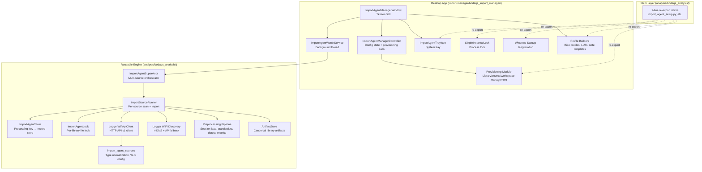
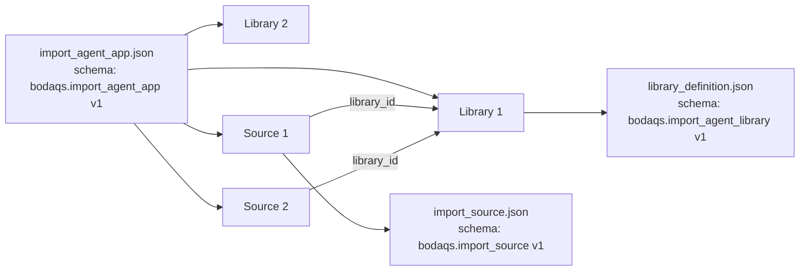
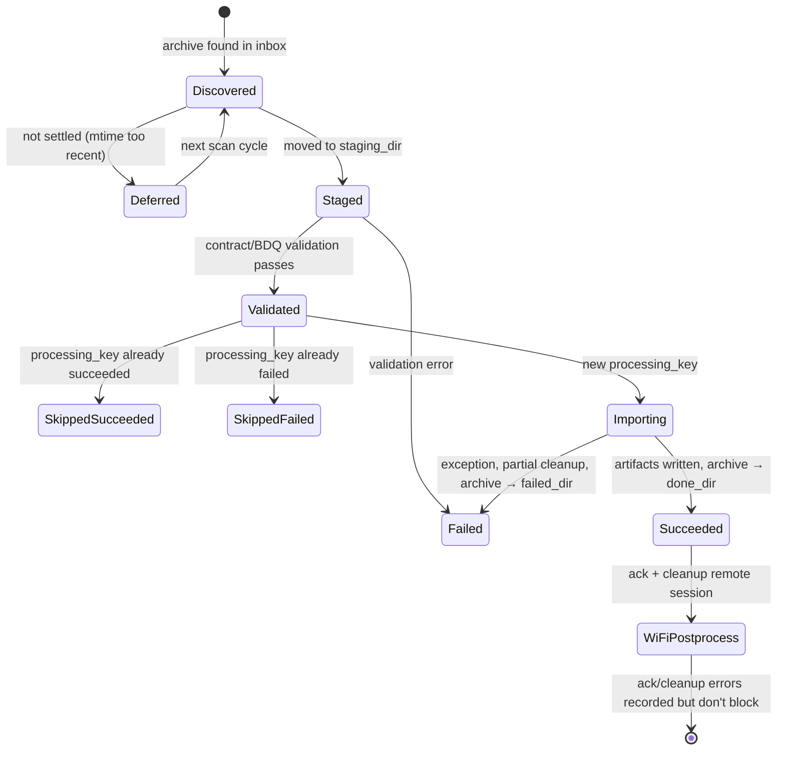
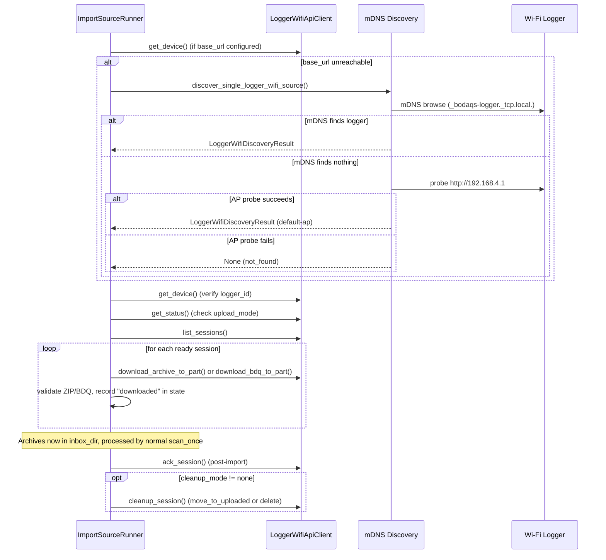

# Design: BODAQS Import Manager

> **Backfilled** — this design doc documents an existing system as it currently
> behaves. It is not a forward design. Code is the source of truth; this doc
> describes what the code does.

## Problem Statement

BODAQS data loggers produce session archives (ZIP or BDQ files) that must be
imported into a local library, preprocessed through the BODAQS analysis
pipeline, and written as canonical artifacts. Users should not need to run
Python or understand the analysis toolchain. The Import Manager provides a
desktop GUI that provisions libraries and sources, watches for completed logger
sessions (local archives or Wi-Fi logger transfers), runs the preprocessing
pipeline, and writes processed artifacts — all local-first, with no cloud or
database dependencies.

## Background

The system evolved from a CLI-only archive watcher (`bodaqs_analysis.import_agent`)
into a desktop application. The architecture note at
`import-manager/docs/Architecture.md` describes the intended three-layer split
(import engine, desktop shell, installer/provisioner). The current codebase
implements all three layers. The reusable engine modules live in
`analysis/bodaqs_analysis/import_agent*.py`, but several of those files are
7-line shims that re-export from `import-manager/bodaqs_import_manager/` (the
actual implementations). The `bodaqs_analysis/__init__.py` uses a lazy
`__getattr__` export map that inserts `import-manager/` onto `sys.path` on
demand, allowing the analysis package to serve as the unified import surface for
both library code and packaged desktop builds.

The release is at `0.1.1-alpha` (Windows). A CLI utility (`bodaqs_import_agent_cli.py`)
still exists in the repo but is no longer shipped in the GUI installer.

## Goals

- Provide a Tkinter desktop GUI for creating libraries, sources, and managing
  the import lifecycle without requiring Python knowledge.
- Support two source types: local filesystem archives (`*.zip`, `*.bdq`) and
  Wi-Fi logger sources using the BODAQS Wi-Fi Upload API v1.
- Run the BODAQS preprocessing pipeline (session loading, signal
  standardization, event detection, metrics) on imported sessions.
- Write canonical library artifacts (session DataFrames, manifests, events,
  metrics) following the existing `ArtifactStore` contract.
- Optionally generate data.syn.bike export files and draft session notes on
  import.
- Support background watch mode with system tray integration and start-at-login.
- Enforce single-instance behavior per app configuration.
- Provide mDNS discovery of Wi-Fi logger sources with fallback to the default AP
  address (`http://192.168.4.1`).

## Non-Goals

- Cloud storage import sources are not implemented (mentioned in architecture
  note as future).
- Serial/USB logger import is not implemented.
- macOS and Linux packaging is planned but not shipped (Windows-only alpha).
- The installer is not code-signed.
- Old sessions are not backfilled when data.syn.bike export is enabled.
- FIT enrichment is best-effort and does not block otherwise successful imports.
- The GUI installer no longer ships the standalone CLI utility.

## Open Questions

- **OQ-1**: `include_events` and `include_metrics` are hardcoded to `True` in
  `load_import_source_config()` — the config file values for these fields are
  ignored. Is this intentional? — discovered in `import_agent.py:808-809`
- **OQ-2**: `require_upload_mode` in `LoggerWifiSourceConfig` is always set to
  `True` in `parse_logger_wifi_source_config()` regardless of the config value.
  Is this intentional? — discovered in `import_agent_sources.py:106`
- **OQ-3**: `run_tz_label` defaults to `"AWST"` in `ImportSourceConfig.__post_init__`
  but provisioning writes `"LOCAL"`. Which is the intended default? — discovered
  in `import_agent.py:528` vs `import_agent_provisioning.py`
- **OQ-4**: The `data_syn_bike_export` `raw_scale_mode` is silently overridden
  from `"calibrated_full_scale"` to `"processed_wheel_travel"` in
  `_library_data_syn_bike_export_config()`. Is this a permanent migration or
  temporary? — discovered in `import_agent.py:152-155`
- **OQ-5**: The shim modules in `analysis/bodaqs_analysis/` use `from ... import *`
  which may not re-export all symbols. Is this pattern stable? — discovered in
  all `import_agent_*.py` shims

## System Invariants

- **INV-1**: Every config file has a `schema` and `version` field that is
  validated on load. Mismatched schema or version raises `ValueError`.
  (Schemas: `bodaqs.import_source` v1, `bodaqs.import_agent_app` v1,
  `bodaqs.import_agent_library` v1, `bodaqs.import_agent_state` v1,
  `bodaqs.import_agent.lock`)
- **INV-2**: Source IDs must be unique within an app config. Duplicate source
  IDs raise `ValueError` during validation.
- **INV-3**: Library IDs must be unique within an app config. Duplicate library
  IDs raise `ValueError` during validation.
- **INV-4**: Every managed source must reference a valid `library_id` that
  exists in the app config's libraries list. Unknown library IDs raise
  `ValueError`.
- **INV-5**: A library cannot be removed while any source still targets it.
  `remove_import_agent_library` raises `ValueError` listing the linked sources.
- **INV-6**: The import processing key is a SHA-256 hash of `input_kind`,
  `raw_session_identity`, `preprocess_profile_sha256`,
  `bike_profile_sha256`, `include_events`, `include_metrics`, and
  `logger_timezone`. The same processing key is never imported twice (unless
  `force_reprocess` is set).
- **INV-7**: The import agent lock (`import_agent.lock`) is an exclusive
  file-based lock per library artifacts directory. It uses `O_CREAT | O_EXCL`
  for atomic creation and is automatically cleared if stale (older than 12
  hours).
- **INV-8**: The single-instance lock (`SingleInstanceLock`) uses OS-level file
  locking (`msvcrt` on Windows, `fcntl` on Unix) per app config path. Only one
  Import Manager process can run per app config.
- **INV-9**: Wi-Fi logger sources require the logger's `logger_id` to match the
  configured `logger_id`. Identity mismatch raises `ValueError`.
- **INV-10**: Wi-Fi session transfer requires the logger to be in upload mode.
  If not in upload mode, the source is skipped with status
  `waiting_upload_mode`.
- **INV-11**: Archive patterns always include `*.bdq` and `*.BDQ` when `*.zip`
  is present, enforced by `_normalize_archive_patterns()`.
- **INV-12**: Filesystem archives must be "settled" (file mtime age ≥
  `settle_time_s`, default 15s) before import. Wi-Fi-downloaded archives are
  always considered settled.
- **INV-13**: Directory deletion is guarded: `_delete_directory_tree` and
  `_delete_library_artifacts_dir` refuse to delete paths outside the managed
  root or paths that are the root itself.
- **INV-14**: Renaming a library or source changes only the display name — IDs,
  paths, import history, and artifact locations are preserved.
- **INV-15**: Session note auto-attach requires both `template_path` and
  `setup_preset_path` to be configured. `ImportSourceConfig.__post_init__`
  raises `ValueError` if `attach_on_import` is `True` without both paths.
- **INV-16**: The bike setup preset's `template_id` must match the session note
  template's `template_id`. Mismatch raises `ValueError` during draft note
  creation. *(unverified intent — needs review)* — the `template_version` match
  is only checked when the preset specifies a version.
- **INV-17**: The Wi-Fi API client validates response `schema` fields against
  expected values (e.g., `bodaqs.logger.device`, `bodaqs.logger.status`) and
  enforces `api_version == 1`.

## High-Level Architecture

### Component Responsibilities

| Component | Location | Responsibility |
|-----------|----------|----------------|
| ImportAgentManagerWindow | `import_agent_setup.py` | Tkinter GUI: manager tab, provision tab, context menus, dialogs, event loop polling |
| ImportAgentManagerController | `import_agent_setup.py` | Thin wrapper over provisioning functions; holds app config state |
| ImportAgentWatchService | `import_agent_setup.py` | Background daemon thread running `supervisor.scan_due()` in a loop |
| ImportAgentSupervisor | `import_agent.py` | Multi-source orchestrator: scan_source_once, scan_all_once, scan_due, watch, snapshot |
| ImportSourceRunner | `import_agent.py` | Per-source: discover archives, build candidates, import_candidate, WiFi acquisition, postprocess |
| ImportAgentState | `import_agent.py` | JSON-backed key→record store for processing keys and WiFi remote state |
| ImportAgentLock | `import_agent.py` | Best-effort exclusive file lock per library artifacts dir |
| LoggerWifiApiClient | `import_agent_logger_wifi.py` | HTTP client for BODAQS Wi-Fi Upload API v1 |
| Logger WiFi Discovery | `import_agent_logger_wifi_discovery.py` | mDNS discovery via zeroconf, AP fallback probe |
| Provisioning | `import_agent_provisioning.py` | App config, library/source provisioning, workspace sync, update functions |
| Profile Builders | `import_agent_profile_builders.py` | Bike profile form values, LUT management, session note template builders |
| SingleInstanceLock | `import_agent_single_instance.py` | OS-level file lock per app config path |
| ImportAgentTrayIcon | `import_agent_tray.py` | pystray-based system tray icon with menu actions |
| Windows Startup | `import_agent_startup.py` | Windows registry Run key management for auto-start |

### Shim Pattern

Six modules in `analysis/bodaqs_analysis/` (`import_agent_setup.py`,
`import_agent_provisioning.py`, `import_agent_profile_builders.py`,
`import_agent_single_instance.py`, `import_agent_startup.py`,
`import_agent_tray.py`) are 7-line shims that call `_ensure_import_manager_path()`
to insert `import-manager/` onto `sys.path`, then `from bodaqs_import_manager.X import *`.
The `bodaqs_analysis/__init__.py` also has a lazy `__getattr__` export map that
resolves symbols from `bodaqs_import_manager.*` on first access. This allows
`from bodaqs_analysis import ImportAgentAppConfig` to work in both development
and packaged contexts.

## Data Model

### Configuration Files

**App Config** (`import_agent_app.json`):
- `sources_root`, `libraries_root`: absolute paths
- `libraries[]`: `library_id`, `display_name`, `artifacts_dir`, `data_syn_bike_export_enabled`
- `sources[]`: `source_id`, `display_name`, `source_root`, `library_id`, `source_type`, `enabled`, `attach_session_note_on_import`, `force_reprocess`
- `auto_start`: boolean

**Source Config** (`import_source.json`):
- `source_id`, `source_type` (`filesystem_archive` | `logger_wifi`), `library_id`
- `artifacts_dir`, `preprocess_profile_path`, `bike_profile_path` (relative to source root)
- `inbox_dir`, `done_dir`, `failed_dir`, `staging_dir`, `fit_dir` (relative)
- `archive_patterns`, `poll_interval_s`, `settle_time_s`
- `logger_wifi`: optional `LoggerWifiSourceConfig` (`logger_id`, `base_url`, timeouts, `cleanup_mode`)
- `session_note`: `attach_on_import`, `template_path`, `setup_preset_path`
- `naming.session_description`: `enabled`, `mode`, `base`, `index_start`, `index_padding`
- `force_reprocess`, `logger_timezone`, `run_tz_label`

**Library Definition** (`library_definition.json`):
- `library_id`, `display_name`, `artifacts_dir`
- `exports.data_syn_bike`: `enabled`, `adc_bit_count`, `raw_scale_mode`, etc.

### Runtime State

**Import Agent State** (`import_agent_state_v1.json`):
- Keyed by processing key (SHA-256) or WiFi remote state key (`logger_wifi:` + SHA-256)
- Each record: `status` (`succeeded` | `failed` | `downloaded`), `run_id`, `session_id`, `archive_sha256`, timestamps, error messages

**Import Agent Lock** (`import_agent.lock`):
- JSON with `schema`, `created_at`, `host`, `pid`
- Auto-cleared if older than 12 hours

### Import Pipeline State Machine

### Wi-Fi Acquisition Flow

## Component Contracts

### ImportAgentSupervisor — `analysis/bodaqs_analysis/import_agent.py`

**Contract shape**: Accepts a sequence of `ImportSourceConfig` objects. Exposes
`scan_source_once()`, `scan_all_once()`, `scan_due()`, `watch()`, `snapshot()`,
`pause_source()`, `resume_source()`.

**Behavioral guarantees**: Scans sources sequentially (not concurrently). Each
source scan acquires the per-library lock. Paused sources are skipped in
`scan_due()` and `scan_all_once()` (unless `include_paused=True`). The `watch()`
loop sleeps for the minimum time until the next source is due, capped at 5
seconds.

**State ownership**: Holds `ImportSourceSupervisorState` per source (runner,
paused flag, next_due_s, last_scan timestamps, last_report). Does not own
persistent state — that lives in `ImportAgentState` inside each runner.

**Error semantics**: Exceptions during `scan_source_once` propagate to the
caller. The `watch()` loop does not catch exceptions from `scan_due` — an
unhandled exception terminates the watch loop. *(unverified intent — needs
review)*

### ImportSourceRunner — `analysis/bodaqs_analysis/import_agent.py`

**Contract shape**: Constructed with an `ImportSourceConfig`. Exposes
`scan_once()`, `import_candidate()`, `validate()`, `ensure_runtime_dirs()`.

**Behavioral guarantees**: `scan_once()` acquires the library lock, acquires
Wi-Fi archives (if applicable), discovers inbox archives, settles/claims/stages
each archive, builds a candidate with a processing key, checks for duplicates,
and imports new candidates. Successfully imported archives are moved to
`done_dir`; failed archives to `failed_dir`. Partial session/run directories are
cleaned up on import failure.

**State ownership**: Owns `ImportAgentState` (JSON-backed), `ImportAgentLock`,
`ArtifactStore`, and cached preprocess/bike profile paths and SHA-256 hashes.

**Error semantics**: Archive validation failures move the archive to
`failed_dir` and record the error in state. Import failures clean up partial
artifacts, move the archive to `failed_dir`, and record the error in state.
Wi-Fi postprocess failures (ack/cleanup) are recorded in state but do not mark
the import as failed. data.syn.bike export failures are logged but do not block
import. Session note creation failures propagate as exceptions and block the
import.

### LoggerWifiApiClient — `analysis/bodaqs_analysis/import_agent_logger_wifi.py`

**Contract shape**: Frozen dataclass with `base_url`, `request_timeout_s`,
`download_timeout_s`. Methods: `get_device()`, `get_status()`,
`enter_upload_mode()`, `exit_upload_mode()`, `list_sessions()`,
`download_archive_to_part()`, `download_bdq_to_part()`, `ack_session()`,
`cleanup_session()`, `move_session_to_uploaded()`, `delete_session()`.

**Behavioral guarantees**: All JSON responses are validated for `schema` field
and `api_version == 1`. Downloads use atomic `.part` files with `os.replace()`.
ZIP downloads are validated with `zipfile.testzip()`. BDQ downloads are
validated with `read_bdq()` (metadata, channel_schema, sample_count > 0).
Content-Length mismatch raises `LoggerWifiApiError`.

**State ownership**: Stateless. All state is managed by the caller.

**Error semantics**: HTTP errors are parsed for JSON `error`/`message` fields.
Connection failures (`URLError`, `socket.timeout`, `HTTPException`) raise
`LoggerWifiApiError` with `error="connection_failed"`. Invalid JSON raises
`LoggerWifiApiError` with `error="invalid_json"`. Download validation failures
raise `LoggerWifiApiError` with `error="invalid_archive"` or `"invalid_bdq"`.

### Logger WiFi Discovery — `analysis/bodaqs_analysis/import_agent_logger_wifi_discovery.py`

**Contract shape**: `discover_logger_wifi_sources()` returns
`list[LoggerWifiDiscoveryResult]`. `discover_single_logger_wifi_source()` returns
`Optional[LoggerWifiDiscoveryResult]` or raises `LoggerWifiDiscoveryError` if
multiple loggers with the same ID are found.

**Behavioral guarantees**: Uses zeroconf `ServiceBrowser` with a configurable
timeout (default 3s). Falls back to probing `http://192.168.4.1` if
`include_default_ap=True` and no mDNS results are found. Prefers IPv4 addresses.
Filters results by `logger_id` when provided.

**State ownership**: Stateless.

**Error semantics**: Missing `zeroconf` package raises
`LoggerWifiDiscoveryUnavailable` (unless `include_default_ap=True`, in which case
it falls back to AP probe). Multiple loggers with the same ID raise
`LoggerWifiDiscoveryError`.

### Provisioning — `import-manager/bodaqs_import_manager/import_agent_provisioning.py`

**Contract shape**: Functions for creating, updating, discovering, and removing
libraries and sources. All functions take paths and return frozen dataclass
instances (`ProvisionedImportAgentLibrary`, `ProvisionedImportAgentSource`,
`ProvisionedImportAgentAppSetup`, `ImportAgentAppConfig`).

**Behavioral guarantees**: Provisioning creates the full directory structure
(runs, library, bike_profiles, preprocess_profiles, event_schemas, inbox, done,
failed, staging, fit, notes) and seeds default assets from the bundled asset
package. All config writes are atomic (write to temp, `os.replace`). Paths in
source configs are stored as portable (POSIX) relative paths. Display name
changes update both the app config and the on-disk config/library definition.

**State ownership**: None — all state is on disk.

**Error semantics**: Refuses to overwrite existing files unless `overwrite=True`.
Refuses to delete directories outside managed roots. Library removal blocked if
sources still target it. Source/library not found raises `ValueError`.

### Profile Builders — `import-manager/bodaqs_import_manager/import_agent_profile_builders.py`

**Contract shape**: Functions for bike profile form value extraction/application,
LUT parsing/normalization, front vertical wheel transform generation, rear shock
LUT management, session note template building from field catalog, and source
asset copying.

**Behavioral guarantees**: `derive_profile_id()` generates a slug from display
name with collision suffixes. `set_front_vertical_wheel_transform()` generates a
linear polynomial transform from steering head angle (`sin(angle)`) and
automatically derives the front wheel normalization range. `normalize_lut_points()`
requires ≥2 points with strictly increasing inputs. `normalize_rear_lut_with_endpoints()`
injects `(0, 0)` and `(shock_travel, wheel_travel)` endpoints. Session note
templates are built from a field catalog asset and validated against
`validate_session_note_template()`.

**State ownership**: None — pure functions operating on profiles/templates.

**Error semantics**: Invalid head angles (≤0 or ≥90°) raise `ValueError`. LUT
points with non-increasing inputs raise `ValueError`. Unknown field IDs in
template building raise `ValueError`. All profiles are validated with
`validate_bike_profile()` before return.

### ImportAgentManagerWindow — `import-manager/bodaqs_import_manager/import_agent_setup.py`

**Contract shape**: Constructed with `argparse.Namespace`. Owns the Tkinter
root window, controller, watch service, tray icon, and event queue. The `run()`
method enters the Tkinter mainloop.

**Behavioral guarantees**: Two-tab notebook (Manager, Provision). Manager tab
shows library and source Treeviews with context menus. Provision tab has
first-run setup form, library/source creation, and Wi-Fi logger discovery. A
250ms `after()` callback polls the event queue for watch/progress/tray events.
Window close minimizes to tray if tray icon is active; otherwise quits. Launch
behavior: `--startup-launch` implies `--start-watch` and `--start-minimized`.

**State ownership**: Holds `ImportAgentManagerController` (app config),
`ImportAgentWatchService` (background thread), `ImportAgentTrayIcon`, event
queue, and Tkinter variables for all form fields.

**Error semantics**: Provisioning errors show `messagebox.showerror`. Watch
errors show `messagebox.showerror` and stop the watcher. Import-now errors show
`messagebox.showerror`. Workspace sync drift on startup prompts the user to
sync.

### ImportAgentWatchService — `import-manager/bodaqs_import_manager/import_agent_setup.py`

**Contract shape**: Constructed with `ImportAgentSupervisor` and event queue.
`start()` launches a daemon thread; `stop()` signals via `threading.Event`.

**Behavioral guarantees**: The `_run()` loop calls `supervisor.scan_due()` with
the progress callback, posts `watch_reports` events with snapshot, and sleeps
for the minimum due time (capped at 5s) or 0.25s if no active sources. Catches
all exceptions and posts `watch_error` before posting `watch_stopped`.

**State ownership**: Owns the daemon thread and stop event. Does not own
supervisor state.

**Error semantics**: All exceptions in the run loop are caught and posted as
`watch_error` events. The thread always posts `watch_stopped` in `finally`.

### SingleInstanceLock — `import-manager/bodaqs_import_manager/import_agent_single_instance.py`

**Contract shape**: `SingleInstanceLock.for_app_config(path)` creates a lock.
`acquire()` returns `bool`; `release()` is idempotent. Context manager
supported.

**Behavioral guarantees**: Uses `msvcrt.locking` (Windows) or `fcntl.flock`
(Unix) for non-blocking exclusive locks. Writes PID, start time, and app config
path to the lock file. Tracks held locks in a module-level set to prevent
re-acquisition.

**Error semantics**: `acquire()` returns `False` if the lock is held by another
process. Context manager `__enter__` raises `RuntimeError` if acquisition fails.

### ImportAgentTrayIcon — `import-manager/bodaqs_import_manager/import_agent_tray.py`

**Contract shape**: Constructed with event queue, status supplier callable, and
title. `start()` runs the icon detached; `stop()` stops it; `refresh()` updates
title and menu.

**Behavioral guarantees**: Only active on Windows with `pystray` and `Pillow`
available. Menu items: Open Manager, Hide Manager, Start Watch, Stop Watch,
Import Now, Start At Login (toggle), Quit. All actions post events to the event
queue. Title shows watch state and source count. Icon loaded from bundled asset
with fallback to procedurally generated image.

**Error semantics**: `start()` returns `False` if tray is not supported.
`refresh()` catches and ignores menu update errors.

### Windows Startup — `import-manager/bodaqs_import_manager/import_agent_startup.py`

**Contract shape**: `sync_windows_startup_registration(enabled, command)` writes
or removes the registry Run key. `read_windows_startup_registration()` reads the
current value. `build_windows_startup_command(argv)` builds a command string.

**Behavioral guarantees**: Uses `HKEY_CURRENT_USER\Software\Microsoft\Windows\CurrentVersion\Run`.
Value name is `"BODAQS Import Manager"`. Legacy value name `"BODAQS Import Agent"`
is cleaned up when the new value is written or removed. Only active on Windows
(`sys.platform.startswith("win")`).

**Error semantics**: Returns `None` on non-Windows platforms. Missing registry
key returns `None` (not an error). Enabling without a command raises `ValueError`.

## Failure Modes

| Failure Mode | Trigger | Current Behavior | Handled? |
|-------------|---------|-----------------|----------|
| Archive validation failure | Corrupt ZIP, invalid BDQ, missing log metadata | Archive moved to `failed_dir`, error recorded in state, scan continues | YES |
| Import pipeline failure | Exception during `preprocess_session()` or artifact writing | Partial session/run dirs cleaned up, archive moved to `failed_dir`, error recorded in state | YES |
| Wi-Fi logger unreachable | Network error, logger offline | Configured address error recorded, mDNS discovery attempted, if both fail source skipped with `not_found` status | YES |
| Wi-Fi logger identity mismatch | Device `logger_id` ≠ configured `logger_id` | `ValueError` raised, acquisition fails, error recorded in state | YES |
| Wi-Fi logger not in upload mode | `get_status()` returns `upload_mode: false` | Source skipped with `waiting_upload_mode` status, no sessions downloaded | YES |
| Wi-Fi download incomplete | Content-Length mismatch | `LoggerWifiApiError` raised, archive moved to `failed_dir`, error recorded | YES |
| Wi-Fi ack failure | Network error during `ack_session()` | Import still succeeds, ack error recorded in state as `remote_postprocess_error` | YES |
| Wi-Fi cleanup failure | Network error during `cleanup_session()` | Import still succeeds, cleanup error recorded in state | YES |
| data.syn.bike export failure | Exception during export | Error logged, export record marked `failed`, import still succeeds | YES |
| Session note creation failure | Template/preset mismatch, write error | Exception propagates, import fails, archive moved to `failed_dir` | NO (blocks import) |
| FIT enrichment failure | Corrupt FIT, no overlap match | Treated as QC warning, import succeeds | YES |
| Stale import lock | Lock file older than 12 hours | Lock file deleted, acquisition retried | YES |
| Active import lock | Another process holds the lock | `FileExistsError` raised, scan fails for that source | NO (propagates) |
| Duplicate processing key | Same archive + profiles already imported | Archive moved to `done_dir`, skipped with `already_imported` | YES |
| Previously failed processing key | Same archive + profiles previously failed | Archive moved to `failed_dir`, skipped with `previous_import_failed` | YES |
| Archive disappeared before claim | File removed between discovery and staging | Warning logged, scan continues | YES |
| mDNS unavailable | `zeroconf` not installed | `LoggerWifiDiscoveryUnavailable` raised (unless AP fallback enabled) | YES |
| Multiple loggers same ID | mDNS finds 2+ loggers with same `logger_id` | `LoggerWifiDiscoveryError` raised | YES |
| Config schema mismatch | Wrong `schema` or `version` in config file | `ValueError` raised on load | YES |
| Single instance already running | Another process holds the lock | `acquire()` returns `False`, message shown, process exits | YES |
| Watch loop exception | Unhandled exception in `scan_due()` | Exception propagates, watch thread posts `watch_error` and stops | YES |
| Workspace drift | Libraries/sources on disk don't match app config | Sync report generated, user prompted to sync on startup | YES |
| Directory deletion outside root | Attempt to delete path outside managed root | `ValueError` raised, deletion refused | YES |

## Cross-Cutting Concerns

### Security
- No authentication or encryption. Wi-Fi API uses plain HTTP. The system is
  designed for local network use only.
- Directory deletion is guarded against path traversal (INV-13).
- No user credentials are stored.

### Observability
- Python `logging` module used throughout (`logging.getLogger(__name__)`).
- Import progress callbacks emit structured event dicts with `event` type,
  `updated_at` timestamp, and source/payload fields.
- The GUI maintains a log text widget showing scan summaries and import events.
- The tray icon title shows watch state and source count.
- No metrics, tracing, or remote telemetry.

### Backwards Compatibility
- Config schema/version checking allows future migrations.
- Legacy Windows startup value name (`"BODAQS Import Agent"`) is cleaned up.
- Legacy library directories directly under `libraries_root` (not in
  `libraries/` subdirectory) are still discoverable.
- `data_syn_bike_export` `raw_scale_mode` silently migrated from
  `"calibrated_full_scale"` to `"processed_wheel_travel"`. *(unverified intent —
  needs review)*
- Source configs can point to single files or directories containing exactly
  one valid JSON file (for preprocess profile, bike profile, note template,
  setup preset).

### Concurrency
- Per-library file lock (`ImportAgentLock`) prevents concurrent imports to the
  same library. Locks are per-library, not per-source — multiple sources
  targeting different libraries can import concurrently if supervised by
  separate processes. The in-process supervisor scans sources sequentially.
- The watch service runs in a single daemon thread. The GUI event loop polls
  the event queue every 250ms via `root.after()`.
- Import-now runs in a separate daemon thread to avoid blocking the GUI.
- `ImportAgentState` writes are atomic (temp file + `os.replace`) but not
  locked beyond the library lock — concurrent access from different processes
  to the same state file could lose writes. *(unverified intent — needs review)*

### Path Portability
- Source config paths are stored as POSIX relative paths.
- `Path.resolve()` is used extensively for absolute path resolution.
- Cross-platform path separators handled via `Path.as_posix()` for stored
  config and `Path.resolve()` for runtime.
