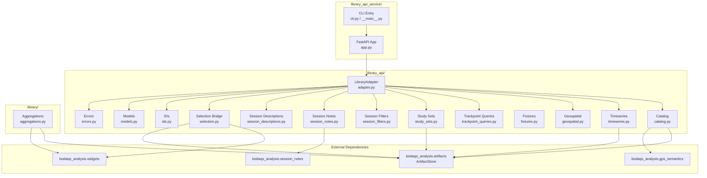
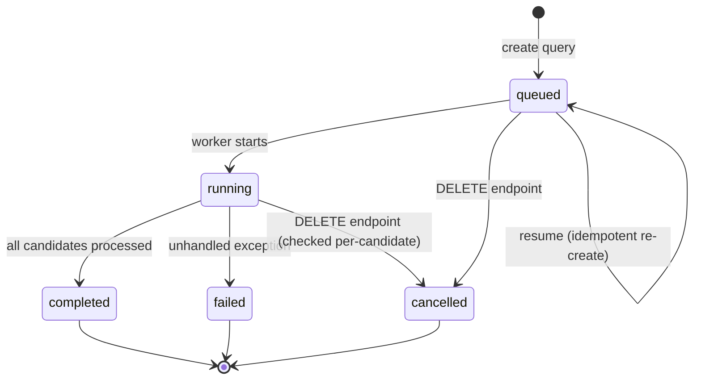

# Design: Library API & Service

> **Backfilled** — this design doc documents an existing system as it currently
> behaves. It is not a forward design. Code is the source of truth; this doc
> describes what the code does.

## Problem Statement

The BODAQS Library API & Service provides a local-first HTTP and Python seam
for browsing processed BODAQS bicycle-data libraries, managing root-scoped
analysis objects (study sets, tracks, geospatial policies, session filters),
serving chart-ready time-series windows and GPS data, computing session-track
geospatial matches, and running asynchronous trackpoint-crossing match queries.
It exists so that a web frontend and notebooks can consume processed analysis
artifacts without coupling to import or preprocessing internals.

## Background

The system implements the contract described in
`docs/analysis/contracts/BODAQS_Library_API_Contract_v0_draft.md` and the
aggregation layer described in
`docs/analysis/contracts/BODAQS_aggregation_library_contract_draft.md`. The
aggregation contract explicitly notes that canonical aggregation persistence was
moved out of the widget layer into the `library/` package. The Library API
contract states the first implementation is a localhost Python service wrapping
a Python library adapter, with the same resource model reusable by a future
remote service or static-bundle implementation.

Key prior decisions visible in the code:
- REST-ish JSON over HTTP, bound to `127.0.0.1`, no authentication in v0.
- JSON arrays (not binary) for first time-series payloads.
- Root-scoped objects (study sets, tracks, filters) belong to the configured
  libraries root, not to one library.
- The session catalog is kept cheap; expensive derived relationships
  (trackpoint crossings) live in async query caches.

## Goals

- Discover and list processed BODAQS libraries under a configured root.
- Build a compact, JSON-serializable session catalog from canonical artifacts.
- Serve chart-ready time-series windows with min-max downsampling and event
  overlays.
- Expose session GPS summaries and on-demand GPS point sets with source
  selection.
- Provide full CRUD for root-scoped study sets, tracks, geospatial policies,
  and session filters with optimistic concurrency control.
- Compute and persist session-track matches using geometric projection or
  catalog-summary fallback.
- Run asynchronous trackpoint-crossing match queries with status tracking,
  cancellation, and paginated results.
- Read and write session notes and session/run descriptions.
- Export static fixtures for frontend development.
- Manage canonical and local session aggregation stores.

## Non-Goals

- Import, preprocessing, event detection, or metric extraction (those remain in
  the Import Manager / Python processing domain).
- Authentication or authorization (omitted in v0).
- Remote/multi-user deployment (localhost-only in v0).
- Binary time-series encoding (JSON arrays only in v0).
- Session filter execution/evaluation against the catalog (filters are
  persisted definitions only; the adapter does not apply them to select
  sessions).
- Trackpoint match query `session_filter_ids` scope (explicitly unsupported in
  the first implementation slice).

## Open Questions

- **OQ-1**: `update_geospatial_policy` does not perform revision conflict
  checking, unlike tracks, study sets, and session filters. Is this intentional
  or an oversight? — discovered in `geospatial.py:update_geospatial_policy`.
  *(unverified intent — needs review)*
- **OQ-2**: The `LocalAggregationStore` persists to `~/.bodaqs/` (per-user
  state). The aggregation contract draft says canonical persistence should not
  be per-user. Is the local store intended to remain as a legacy/migration
  source, or should it be deprecated? — discovered in
  `library/aggregations.py:LocalAggregationStore`. *(unverified intent — needs
  review)*
- **OQ-3**: `bootstrap_canonical_from_local` silently skips aggregations whose
  members are not all valid session keys (when an artifact store is provided).
  Is silent skip the intended behavior, or should it log/report skipped
  aggregations? — discovered in
  `library/aggregations.py:bootstrap_canonical_from_local`. *(unverified intent
  — needs review)*
- **OQ-4**: The trackpoint match query worker uses bare `threading.Thread`
  daemon threads with no thread pool, no retry, and no crash recovery beyond
  marking the query as failed. Is this the intended long-term concurrency model?
  — discovered in `library_api_service/app.py:_start_trackpoint_query_worker`.
  *(unverified intent — needs review)*
- **OQ-5**: The GPS gap threshold (`GPS_GAP_THRESHOLD_S = 5.0`) and default GPS
  points max (`DEFAULT_GPS_POINTS_MAX_POINTS = 2000`) are module-level
  constants. Should these be configurable via geospatial policy or service
  config? — discovered in `library_api/catalog.py`. *(unverified intent — needs
  review)*
- **OQ-6**: Track matches use a hardcoded `max_points=25_000` when fetching GPS
  points for geometry matching, independent of the default 2000. Is this
  intentional? — discovered in `adapter.py:_build_track_match`. *(unverified
  intent — needs review)*

## System Invariants

- **INV-1**: All object IDs (library_id, track_id, policy_id, study_set_id,
  filter_id, query_id, track_match_id) are filename-safe slugs matching
  `^[a-z0-9](?:[a-z0-9-]{0,70}[a-z0-9])?$`. Enforced by `is_valid_object_id`.
- **INV-2**: Session keys are `run_id::session_id` with non-empty parts.
  Enforced by `make_session_key` / `parse_session_key`.
- **INV-3**: Session reference IDs are `library_id|||session_key`. Enforced by
  `make_session_ref_id`.
- **INV-4**: All persisted JSON payloads carry a `schema` string and integer
  `version`. Each module defines schema/version constants (e.g.
  `STUDY_SET_SCHEMA = "bodaqs.study_set"`, `STUDY_SET_VERSION = 1`).
- **INV-5**: Optimistic concurrency control via `revision` integer is enforced
  for study sets, session filters, and tracks (when `expected_revision` is
  provided). Mismatch raises `RevisionConflictError` (HTTP 409). Geospatial
  policies do NOT enforce revision conflict (see OQ-1).
- **INV-6**: All file writes are atomic: write to `.tmp` file, then
  `os.replace` to final path. Used consistently across study sets, session
  filters, tracks, geospatial policies, trackpoint queries, trackpoint results,
  session notes, and aggregation stores.
- **INV-7**: The `LibraryAdapter` caches the library list in
  `_libraries_cache` and per-library catalogs in `_catalog_cache`. Cache is
  invalidated on refresh, on writes that mutate session data (notes,
  descriptions), and on libraries-root changes.
- **INV-8**: The default geospatial policy (`default-geospatial-policy`) is
  always available. `list_geospatial_policies` inserts it if no override file
  exists. `load_geospatial_policy` falls back to the in-memory default.
  Deleting the default policy returns `default_restored: True` without error.
- **INV-9**: Study set validation requires all session references to exist in
  some discovered library. Enforced by `_libraries_session_ref_ids` which
  enumerates all runs/sessions across all libraries.
- **INV-10**: Trackpoint station_m must lie within `[0, track_length_m]`.
  Enforced in `_normalized_trackpoint`.
- **INV-11**: Track path must be a GeoJSON `LineString` with at least 2
  coordinate positions. CRS defaults to `EPSG:4326`, distance model defaults to
  `geodesic`.
- **INV-12**: Aggregation store validation requires non-empty
  `member_session_keys`, valid session key format, and policy values in
  `{union, intersection, strict}`. Enforced by `validate_aggregation_definition`.
- **INV-13**: The FastAPI service binds to `127.0.0.1` by default (via CLI
  `--host` default). CORS allows localhost dev origins
  (`http://localhost:5173`, `http://127.0.0.1:5173`) by default.
- **INV-14**: All `LibraryApiError` subclasses carry a `code` string, an HTTP
  `status_code`, a `message`, and a `details` dict. The FastAPI error handler
  serializes these to `{"error": {"code", "message", "details"}}`.
- **INV-15**: Time-series windows use min-max bucket downsampling when source
  points exceed `target_points` (default 2000). Each bucket contributes first,
  last, min, and max positions. Mode is reported as `"raw"` or
  `"min_max_bucket"`.
- **INV-16**: GPS source selection prefers explicit `gps_sources` metadata when
  present; otherwise falls back to a `legacy_heuristic` that scans stream
  directory names for "gps". *(legacy behavior — may be removed in future
  cleanup)*
- **INV-17**: Trackpoint match query results are stored as JSONL (one JSON
  object per line) with offset-based cursor pagination (max 500 per page).

## High-Level Architecture

The `LibraryAdapter` is a facade that delegates to module-level functions in
`library_api/`. Each module owns one resource domain (catalog, timeseries,
geospatial, etc.). The FastAPI app in `library_api_service/app.py` is a thin
HTTP wrapper that parses JSON bodies and calls adapter methods. The `library/`
package is a separate concern (aggregation stores) that does not participate in
the HTTP API but shares the `ArtifactStore` dependency.

## Data Model

### Libraries Root

A local directory containing one or more processed BODAQS libraries. Discovered
by scanning `libraries/` subdirectory first, then the root itself. Each library
directory must contain either a `library_definition.json` or a `runs/`
subdirectory.

### Session Catalog

Built on-demand per library from `ArtifactStore`. Each row contains:
`session_ref_id`, `session_key`, `run_id`, `session_id`, display labels,
timestamps, note status/fields, QC summary, session summary, provenance, event
schema, available signals, GPS summary, event summary, metric summary.

### Root-Scoped Objects (JSON files on disk)

| Object | Directory | Schema |
|--------|-----------|--------|
| Track | `tracks/` | `bodaqs.track` v1 |
| Geospatial Policy | `geospatial_policies/` | `bodaqs.geospatial_policy` v1 |
| Study Set | `study_sets/` (legacy: `library/study_sets/`) | `bodaqs.study_set` v1 |
| Session Filter | `session_filters/` | `bodaqs.session_filter` v1 |
| Trackpoint Match Query | `trackpoint_match_queries/` | `bodaqs.trackpoint_match_query` v1 |
| Trackpoint Match Results | `trackpoint_match_results/` | `bodaqs.trackpoint_match_query_results` v1 (JSONL) |
| Track Match (cached) | `track_matches/` | `bodaqs.session_track_match` v1 |

### Aggregation Stores

| Store | Default Path | Schema |
|-------|-------------|--------|
| LocalAggregationStore | `~/.bodaqs/session_aggregations_v1.json` | `bodaqs.session_aggregations.store` v1 |
| CanonicalAggregationStore | `ArtifactStore.path_canonical_aggregations()` | `bodaqs.library_aggregations.store` v1 |

### Trackpoint Match Query State Machine

## Component Contracts

### LibraryAdapter — `library_api/adapter.py`

**Contract shape**: Accepts a `libraries_root` path. Methods return JSON-serializable dicts/lists. Raises `LibraryApiError` subclasses on failure.
**Behavioral guarantees**: Caches library list and per-library catalogs. Validates session references via `_normalized_session_ref_request` (enforces run_id/session_id/session_key/session_ref_id consistency). Delegates all persistence to module functions.
**State ownership**: `_libraries_cache` (list), `_catalog_cache` (dict keyed by library_id).
**Error semantics**: Raises `LibraryNotFoundError`, `SessionNotFoundError`, `InvalidRequestError`, `InvalidStudySetError`, and delegates errors from sub-modules.

### FastAPI Service — `library_api_service/app.py`

**Contract shape**: `create_app(libraries_root, allow_origins=None) -> FastAPI`. All endpoints under `/api/v1/`. JSON in/out.
**Behavioral guarantees**: Registers `LibraryApiError` exception handler that maps to `{status_code, error envelope}`. CORS middleware with configurable origins. Trackpoint query worker spawned as daemon thread on create. `set_libraries_root` endpoint hot-swaps adapter and clears thread registry.
**State ownership**: `app.state.config` (LibraryApiServiceConfig), `app.state.adapter` (LibraryAdapter), `app.state.trackpoint_query_threads` (dict).
**Error semantics**: `LibraryApiError` → JSON error envelope. Non-`LibraryApiError` exceptions → FastAPI default 500. Payload validation helpers raise `InvalidRequestError`.

### Catalog — `library_api/catalog.py`

**Contract shape**: `discover_libraries(root) -> list[dict]`, `build_session_catalog(root, library_id) -> dict`, `get_session_gps_points(root, ref, ...) -> dict`.
**Behavioral guarantees**: Discovers libraries by scanning for `library_definition.json` or `runs/`. Builds catalog rows from `ArtifactStore` run/session manifests, meta, notes, events, metrics, GPS. GPS source selection prefers explicit `gps_sources` metadata, falls back to `legacy_heuristic`. GPS quality: `absent` (0 points), `limited` (<3 points or coverage <0.85), `usable` (coverage >=0.85).
**State ownership**: Stateless (reads from disk on each call).
**Error semantics**: `InvalidRequestError` for missing/invalid root. `SessionNotFoundError` raised by adapter (not catalog itself).

### Timeseries — `library_api/timeseries.py`

**Contract shape**: `get_timeseries_window(root, request, library_id) -> dict`.
**Behavioral guarantees**: Resolves time column from session meta (checks `time_column`, `time_col`, `primary_time_column`, then signal metadata with quantity/domain "time", then hardcoded candidates). Resolves signals by column name or selector match. Min-max bucket downsampling when source > target_points. Optional event overlays. Returns warnings if requested window exceeds session bounds.
**State ownership**: Stateless.
**Error semantics**: `InvalidRequestError` for bad request shape. `SessionNotFoundError` if session dir missing. `SignalNotFoundError` if column/selector doesn't match. `TimeseriesUnavailableError` if dataframe unreadable, no time column, or empty window.

### Geospatial — `library_api/geospatial.py`

**Contract shape**: CRUD for tracks, geospatial policies, track matches. `build_session_track_match(...)` computes matches.
**Behavioral guarantees**: Tracks require `LineString` path with >=2 coords, CRS defaults EPSG:4326. Trackpoints sorted by station_m, must be within track length. Geospatial policies merged with defaults (deep merge per sub-policy). Default policy always available. Track matching: projects lon/lat to local XY using equirectangular projection around centroid, finds nearest track projections within `max_point_distance_m`, computes trackpoint cutline crossings. Falls back to catalog-summary matching if no GPS points or geometry fails. Coverage ratio >=0.85 → `matched`, else `partial`.
**State ownership**: Stateless (reads/writes JSON files).
**Error semantics**: `TrackNotFoundError`, `GeospatialPolicyNotFoundError`, `InvalidTrackError`, `InvalidGeospatialPolicyError`, `RevisionConflictError` (tracks only, when expected_revision provided), `TrackMatchNotFoundError`.

### Trackpoint Queries — `library_api/trackpoint_queries.py`

**Contract shape**: CRUD for async trackpoint match queries. Results stored as JSONL with offset pagination.
**Behavioral guarantees**: Query ID derived from track+policy+trackpoints+mode+scope (deterministic, idempotent). Re-creating an active query returns existing. Status transitions: queued→running→completed/failed/cancelled. Results paginated via integer cursor, max 500/page. `os.replace` has retry loop (5 attempts) for PermissionError on Windows.
**State ownership**: Stateless (reads/writes JSON/JSONL files).
**Error semantics**: `TrackpointMatchQueryNotFoundError`, `InvalidRequestError` for bad IDs, unknown trackpoints, invalid match_mode/min_count/tolerance.

### Study Sets — `library_api/study_sets.py`

**Contract shape**: CRUD for study sets with revision-based optimistic concurrency.
**Behavioral guarantees**: Validates all session refs exist in discovered libraries. Supports groupings (session_ref_id lists), bookmarks (time_s or time_window), track refs (from/to trackpoint pairs). Legacy `library/study_sets/` directory still read; writes go to `study_sets/` and legacy file is deleted. Atomic write via tmp+replace.
**State ownership**: Stateless.
**Error semantics**: `StudySetNotFoundError`, `InvalidStudySetError` (schema, version, ID format, duplicate sessions, invalid groupings/bookmarks/tracks, unknown session refs), `RevisionConflictError`.

### Session Filters — `library_api/session_filters.py`

**Contract shape**: CRUD for persisted session filter definitions with revision-based optimistic concurrency.
**Behavioral guarantees**: Predicate tree with group ops (`and`, `or`) and leaf ops (`eq`, `in`, `contains`, `present`, `matches`). Supported fields: bike, event.schema, firmware, gps.present, gps.quality, gps.source, note.status, preprocessing.profile, qc.level, rider, signals, source.archive, trackpoint.crossing. `trackpoint.crossing` requires `matches` op with track_id, trackpoint_ids, match_mode, tolerance_m. Filters are definitions only — not evaluated by the adapter.
**State ownership**: Stateless.
**Error semantics**: `SessionFilterNotFoundError`, `InvalidSessionFilterError` (bad predicate, unsupported field/op, invalid trackpoint match value), `RevisionConflictError`.

### Session Notes — `library_api/session_notes.py`

**Contract shape**: `load_session_note(root, ref)`, `save_session_note(root, ref, payload)`.
**Behavioral guarantees**: Load returns default editable document if none exists (present=False). Save normalizes document, preserves created_at from previous, updates updated_at. Template summary resolved via `make_session_note_template_store`. Default template: `web_session_note` v1.0.
**State ownership**: Stateless.
**Error semantics**: `InvalidRequestError` for bad payload/session ref.

### Session Descriptions — `library_api/session_descriptions.py`

**Contract shape**: `update_session_descriptions(root, ref, payload)`.
**Behavioral guarantees**: Writes run_description and/or session_description to manifests via `ArtifactStore`. Returns updated values. At least one of run_description/session_description required.
**State ownership**: Stateless.
**Error semantics**: `InvalidRequestError` for missing fields.

### Selection Bridge — `library_api/selection.py`

**Contract shape**: `study_set_to_selection_snapshot(root, study_set, include_groupings) -> dict`.
**Behavioral guarantees**: Converts study set to widget-compatible `EntitySelectionSnapshot` and `SelectionSnapshot`. Builds `ScopeEntity` list from sessions and groupings. `make_study_set_selector_handle` creates an ipywidgets UI for notebook interactivity. Only supports single-library study sets (enforced by adapter).
**State ownership**: Stateless (returns snapshot objects).
**Error semantics**: `InvalidStudySetError` for bad session refs, multi-library study sets, missing fields.

### Fixtures — `library_api/fixtures.py`

**Contract shape**: `export_library_fixture(root, library_id, fixture_dir, ...) -> dict`.
**Behavioral guarantees**: Exports capabilities, libraries, library, catalog, study set, timeseries window as static JSON files with a manifest. Synthesizes a study set from first catalog row if none exists. Refuses non-empty output dir unless `overwrite=True`.
**State ownership**: Stateless.
**Error semantics**: `InvalidRequestError` for existing dir, missing catalog rows, missing signals.

### Aggregation Stores — `library/aggregations.py`

**Contract shape**: `AggregationStore` Protocol (load, save, list, get, create, update, delete). `JsonAggregationStore` is the concrete base. `LocalAggregationStore` and `CanonicalAggregationStore` are subclasses.
**Behavioral guarantees**: JSON file persistence with schema validation. `validate_store` checks schema, version, aggregation list, duplicate keys. `validate_aggregation_definition` checks key, title, non-empty members, valid session keys, policy values. `add` rejects duplicate keys. `update` merges patch, preserves key, re-validates. `delete` returns bool. `save` backs up to `.bak` before atomic write. `load` on corrupt file copies to `.corrupt` and raises `AggregationStoreError`. `bootstrap_canonical_from_local` migrates local→canonical if canonical is empty, skipping aggregations with invalid members (when artifact store provided). `build_aggregation_catalog_df` returns a DataFrame with resolved/missing member counts.
**State ownership**: `JsonAggregationStore._data` (in-memory dict, loaded from file).
**Error semantics**: `AggregationStoreError` (load failure, update missing key), `AggregationStoreValidationError` (invalid schema/version/aggregation/duplicate key/policy).

### IDs — `library_api/ids.py`

**Contract shape**: `derive_object_id(display_name, fallback, max_length)`, `make_unique_object_id(display_name, existing_ids, ...)`, `make_session_key(run_id, session_id)`, `make_session_ref_id(library_id, session_key)`, `is_valid_object_id(value)`, `parse_session_key(session_key)`.
**Behavioral guarantees**: Slugify: lowercase, NFKD normalize, ASCII-only, non-alphanumeric → hyphen, collapse hyphens, trim, max 72 chars. Unique IDs append `-2`, `-3`, etc. Object ID regex: `^[a-z0-9](?:[a-z0-9-]{0,70}[a-z0-9])?$`.
**State ownership**: Stateless.
**Error semantics**: `ValueError` for empty run_id/session_id/library_id/session_key, invalid session_key format, inability to derive unique ID after 9998 attempts.

### Models — `library_api/models.py`

**Contract shape**: `default_capabilities() -> dict`, `library_payload(library_id, display_name, root, definition) -> dict`.
**Behavioral guarantees**: Capabilities schema `bodaqs.library_api_capabilities` v1. Reports service name, API version "0", implementation "python-library-adapter". Required capabilities: read_processed_library, read_parquet, list_sessions, serve_timeseries_windows, read_session_notes. Features include write/delete study sets, read/write notes, descriptions, GPS summaries, tracks, policies, track matches, trackpoint queries, filters. `export_static_bundle` and `run_processing_jobs` are False.
**State ownership**: Stateless.
**Error semantics**: None (pure builders).

## Failure Modes

| Failure Mode | Trigger | Current Behavior | Handled? |
|-------------|---------|-----------------|----------|
| Libraries root does not exist | `discover_libraries` with missing path | `InvalidRequestError` (400) | YES |
| Libraries root is not a directory | `discover_libraries` with file path | `InvalidRequestError` (400) | YES |
| Duplicate library_id under root | Two dirs resolve to same library_id | `InvalidRequestError` (400) | YES |
| Library not found | `get_library` with unknown ID | `LibraryNotFoundError` (404) | YES |
| Session not found in catalog | `_catalog_row_for_session` no match | `SessionNotFoundError` (404) | YES |
| Study set not found | `load_study_set` missing file | `StudySetNotFoundError` (404) | YES |
| Study set JSON corrupt | `_read_json_object` parse failure | `InvalidStudySetError` (400) | YES |
| Revision conflict | `expected_revision` != current | `RevisionConflictError` (409) | YES |
| Track not found | `load_track` missing file | `TrackNotFoundError` (404) | YES |
| Geospatial policy not found | `load_geospatial_policy` missing + not default | `GeospatialPolicyNotFoundError` (404) | YES |
| Trackpoint query not found | `load_trackpoint_match_query` missing | `TrackpointMatchQueryNotFoundError` (404) | YES |
| Trackpoint query JSON corrupt | `_read_json_object` parse failure | `TrackpointMatchQueryNotFoundError` (404) | YES |
| Session dataframe unreadable | `pd.read_parquet` throws | `TimeseriesUnavailableError` (404) | YES |
| No time column resolvable | No time column in meta or columns | `TimeseriesUnavailableError` (404) | YES |
| Empty time-series window | Window filters out all rows | `TimeseriesUnavailableError` (404) | YES |
| Signal not found | Column/selector doesn't match | `SignalNotFoundError` (404) | YES |
| GPS source read failure | `pd.read_parquet` throws for GPS | Source skipped, warning `gps_source_read_failed` | YES |
| GPS points read failure | `pd.read_parquet` throws for points | Returns error sampling mode, warning | YES |
| Trackpoint query worker crash | Unhandled exception in worker thread | Query marked `failed` with error message | YES |
| Trackpoint query worker killed mid-run | Process killed | Query stuck in `running` forever | NO |
| Aggregation store corrupt | `load` parse failure | Copies to `.corrupt`, raises `AggregationStoreError` | YES |
| Aggregation store write conflict | `os.replace` PermissionError (Windows) | Retry 5 times with backoff (trackpoint queries only) | PARTIAL |
| Non-`LibraryApiError` in HTTP handler | Unexpected exception | FastAPI default 500 (no error envelope) | NO |
| Concurrent trackpoint query worker for same ID | Two threads for same query_id | Second thread skipped if first alive | YES |
| `set_libraries_root` during active query | Hot-swap adapter while query running | Thread registry cleared; running thread may fail silently | NO |
| Session filter references unknown field | Predicate with unsupported field | `InvalidSessionFilterError` (400) | YES |
| Study set references unknown session | Session not in any library | `InvalidStudySetError` (400) | YES |
| Multi-library study set selection snapshot | `study_set_to_selection_snapshot` with mixed libraries | `InvalidStudySetError` (400) | YES |

## Cross-Cutting Concerns

### Security
- No authentication or authorization. Service binds to `127.0.0.1` by default.
- CORS allows localhost dev origins. `allow_credentials=False`.
- Object IDs are validated as filename-safe slugs, preventing path traversal.
- No input sanitization beyond ID validation and type checking.

### Observability
- No structured logging in the adapter or service. Errors are communicated via
  HTTP status codes and error envelopes.
- Trackpoint queries carry status, processed/matched/failed counts, and error
  messages for progress monitoring.
- No metrics, tracing, or health-check depth beyond a simple `{"status": "ok"}`
  endpoint.

### Backwards Compatibility
- Study sets: legacy `library/study_sets/` directory is still read; writes go
  to `study_sets/` and legacy files are deleted on write.
- GPS source selection: `legacy_heuristic` fallback for sessions without
  explicit `gps_sources` metadata. *(legacy behavior — may be removed in future
  cleanup)*
- Aggregation stores: `LocalAggregationStore` (per-user `~/.bodaqs/`) remains
  as a migration source via `bootstrap_canonical_from_local`.
- Session filter `trackpoint.crossing` value accepts both camelCase
  (`trackpointIds`, `matchMode`) and snake_case (`trackpoint_ids`,
  `match_mode`) keys.
- Study set track refs accept both `from_point_id`/`to_point_id` (legacy) and
  `from_trackpoint_id`/`to_trackpoint_id` (current), normalizing to the latter.

### Concurrency
- `LibraryAdapter` caches are not thread-safe. The FastAPI service is async but
  adapter methods are synchronous (called from sync route handlers).
- Trackpoint query workers run as daemon threads. Each worker creates its own
  `LibraryAdapter` instance. Cancellation is checked per-candidate by
  re-reading the query status from disk.
- File writes are atomic (tmp + `os.replace`), but there is no file-level
  locking. Concurrent writes to the same study set/track/filter could lose
  updates (mitigated by revision conflict checking).
