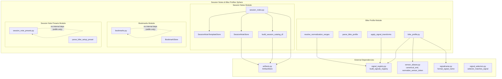
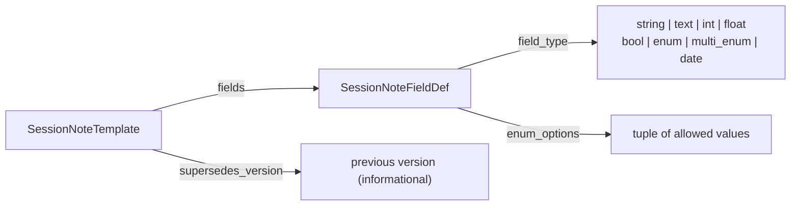
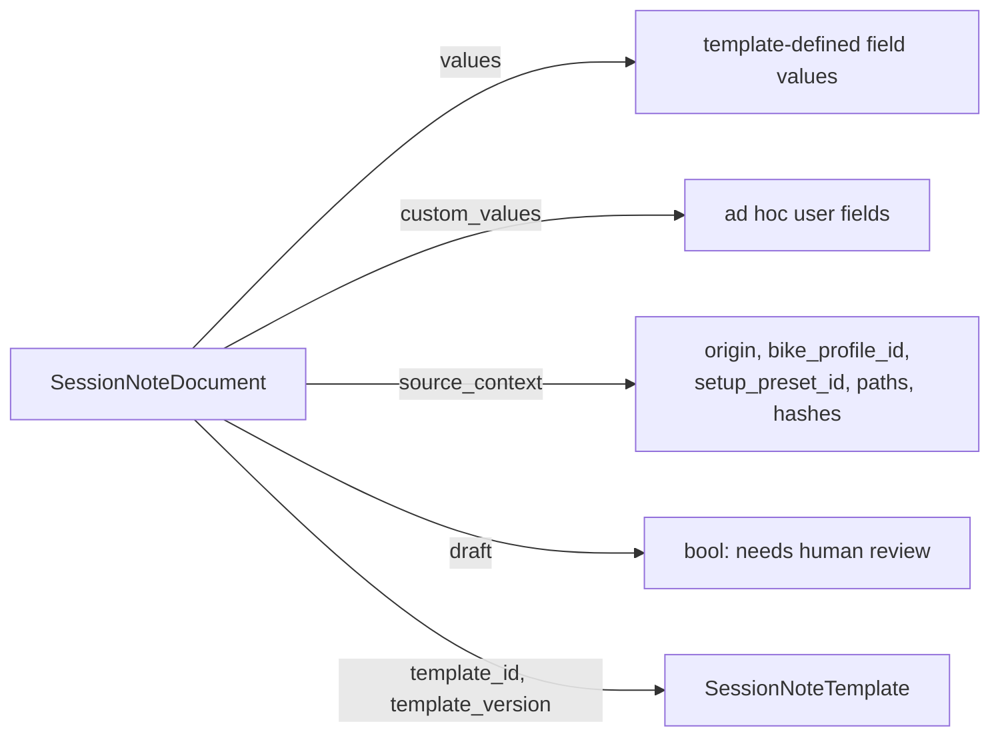
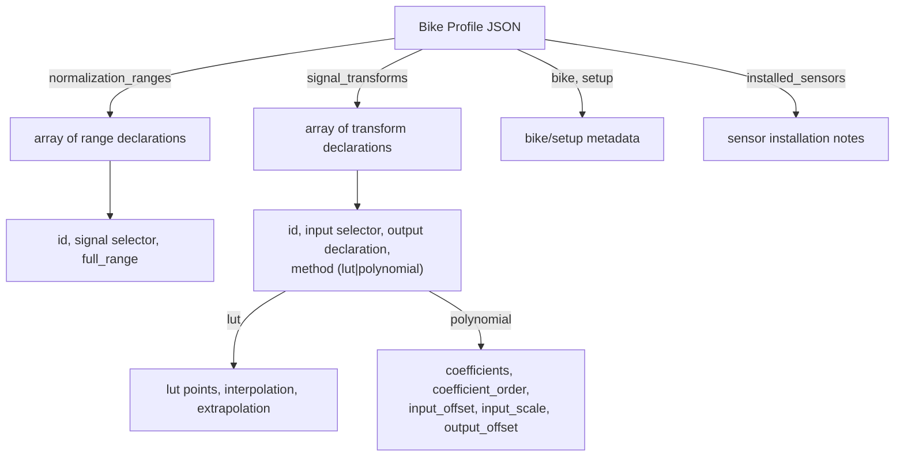
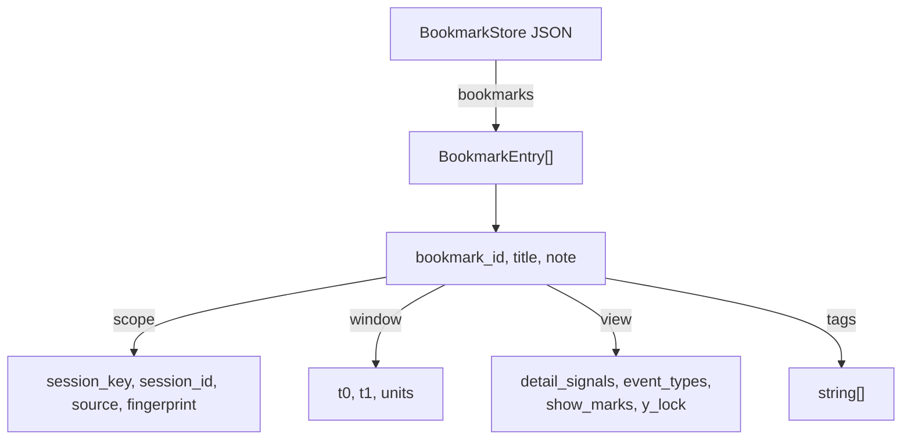
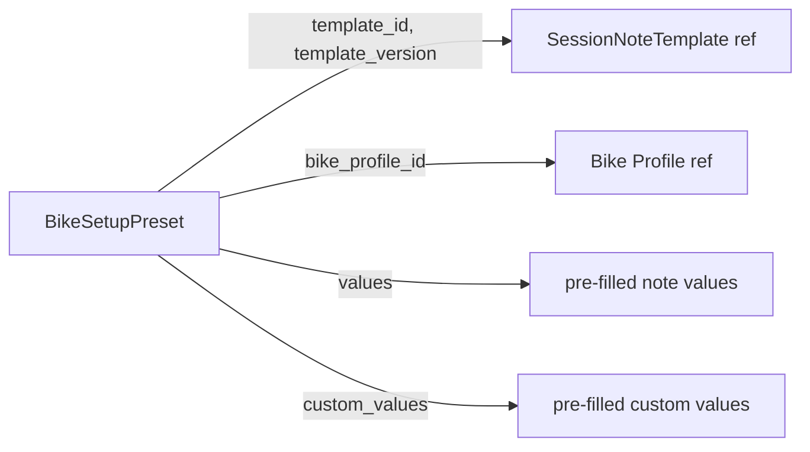

# Design: Session Notes & Bike Profiles

> **Backfilled** — this design doc documents an existing system as it currently
> behaves. It is not a forward design. Code is the source of truth; this doc
> describes what the code does.

## Problem Statement

BODAQS analysis sessions need structured, queryable setup notes (suspension
settings, spring rates, damper positions) that are separate from pipeline-derived
metadata and from per-user UI state. The system also needs bike-specific
configuration — normalization ranges and signal transforms — that describes how
logged signals should be interpreted for a particular bike installation.
Bookmarks provide per-user "interesting window" persistence with view-state
restoration. Bike setup presets bundle a template reference with pre-filled
values for repeatable note creation. Together, these four modules form the
session-annotation and bike-configuration layer of the analysis tooling.

## Background

The system evolved from several contract drafts documented in
`docs/analysis/contracts/`:

- **BODAQS_session_notes_and_catalog_contract_draft.md** — defines the canonical
  session-note layer: templates, documents, stores, catalog projection. The
  implementation in `session_notes.py` closely follows this contract.
- **BODAQS_Bike_Profile_Contract_v0_draft.md** — defines bike profile structure:
  normalization ranges, signal transforms (LUT/polynomial), validation rules. The
  implementation in `bike_profile.py` follows this contract with additional runtime
  behavior (transform application, range resolution).
- **bodaqs_bookmarks_spec_v1.md** — defines the per-user bookmark store with CRUD,
  drift detection, and view restoration. The implementation in `bookmarks.py`
  follows this spec closely but omits some features (tag filtering, repo-local
  store path).

The `session_note_presets.py` module has no prior contract document; it was added
to support the import agent's note-creation workflow.

## Goals

- **Structured session notes**: Provide typed, template-driven note documents
  attached to sessions, with field validation and custom-field support.
- **Reusable templates**: Support versioned note templates with stable field
  identities, loaded from filesystem with multi-root fallback.
- **Catalog projection**: Build a flat DataFrame catalog of all sessions with
  projected note fields, supporting multiple projection policies.
- **Bike profile validation**: Parse and validate bike profile JSON documents
  against the contract (schema, version, ranges, transforms).
- **Signal transforms**: Apply LUT and polynomial transforms to session
  dataframes, with conflict policies for existing output signals.
- **Normalization range resolution**: Resolve semantic normalization ranges to
  concrete dataframe columns via the signal registry.
- **Per-user bookmarks**: Provide a JSON-backed bookmark store with atomic saves,
  CRUD operations, drift detection, and view-state restoration.
- **Bike setup presets**: Parse and validate preset documents that bundle a
  template reference with pre-filled note values.

## Non-Goals

- **Run-level note inheritance**: Sessions do not inherit notes from runs.
- **Automatic template migration**: No automatic migration between template
  versions; projection policies handle version differences.
- **Team-shared bookmarks**: Bookmarks are per-user local state; no sync or
  sharing.
- **Server-side bookmark storage**: Bookmarks are JSON files on disk only.
- **Bike profile authoring UI**: No UI for creating or editing bike profiles;
  they are JSON files authored externally.
- **Note editing in plotting widgets**: Note editing is a separate concern from
  plotting; the catalog service is the intended integration point.
- **Tag-based bookmark filtering**: The implementation does not support tag
  filtering despite the contract spec mentioning it.

## Open Questions

- **OQ-1**: `get_latest_template` uses string sort for `template_version`, so
  "10.0" sorts before "2.0". Is this intentional (expecting zero-padded
  versions) or a bug? — discovered in `session_notes.py:419`
- **OQ-2**: `update_note` cannot clear `title` or `free_text_notes` to None
  because passing `None` means "keep existing". Is there a sentinel pattern
  intended for explicit clearing? — discovered in `session_notes.py:507`
- **OQ-3**: `build_session_catalog_df` catches `SessionNotesError` for projection
  failures but not `SessionNoteValidationError`. Should invalid notes be flagged
  in the catalog? — discovered in `session_notes.py:680`
- **OQ-4**: `add_from_view` silently swaps `t0`/`t1` if reversed, but
  `validate_entry` requires `t0 <= t1`. Should the swap be removed in favor of
  validation? — discovered in `bookmarks.py:265`
- **OQ-5**: `check_drift` does not verify `window.units == "s"`. Should it warn
  on non-second units? — discovered in `bookmarks.py:325`
- **OQ-6**: `BookmarkStore.list` does not support tag filtering despite the
  contract spec specifying it. Was this intentionally deferred? — discovered in
  `bookmarks.py:196`
- **OQ-7**: `BookmarkStore.update` does a shallow patch, replacing nested objects
  like `scope` and `view` entirely. Is deep merge intended? — discovered in
  `bookmarks.py:231`
- **OQ-8**: `resolve_normalization_ranges` raises if no ranges match when
  `require_at_least_one=True` (the default). Should a bike profile with zero
  normalization ranges be valid? — discovered in `bike_profile.py:430`
- **OQ-9**: `apply_signal_transforms` rebuilds the signal registry after each
  transform via `build_signals_registry(session, strict=False)`. Is this
  performance concern intentional for chained transforms? — discovered in
  `bike_profile.py:230`
- **OQ-10**: `session_note_presets.py` has no contract document. Should one be
  created? — discovered in `session_note_presets.py` (entire file)

## System Invariants

### Session Notes

- **INV-1**: Template schema must equal `"bodaqs.session_notes.template"`.
- **INV-2**: Template version must equal `1`.
- **INV-3**: Note document schema must equal `"bodaqs.session_notes.document"`.
- **INV-4**: Note document version must equal `1`.
- **INV-5**: `session_key` must equal `run_id::session_id`.
- **INV-6**: Field IDs must be unique within a template.
- **INV-7**: Note `values` may only contain keys that are known template field IDs.
- **INV-8**: Note `custom_values` are rejected if `template.allow_custom_fields` is `False`.
- **INV-9**: Field values must match their declared `field_type` (string, text, int, float, bool, enum, multi_enum, date).
- **INV-10**: Required fields must have non-None values.
- **INV-11**: Template store deduplicates by `(template_id, template_version)` across all roots.
- **INV-12**: `get_latest_template` returns the highest `template_version` by string sort. *(unverified intent — needs review)*
- **INV-13**: Template load errors are caught, logged as warnings, and stored in `_template_errors` — they do not prevent other templates from loading.
- **INV-14**: `create_note_from_template` creates a document but does not persist it; the caller must call `save_note`. *(unverified intent — needs review)*
- **INV-15**: `save_note` validates the note against its template before writing.
- **INV-16**: `update_note` merges values by default (`replace_values=False`); setting `replace_values=True` replaces the entire values dict.
- **INV-17**: `update_note` cannot clear `title` or `free_text_notes` to None — passing `None` preserves the existing value. *(unverified intent — needs review)*
- **INV-18**: Float fields accept `None` as a valid value (via `_is_float_like`), even when not explicitly required. *(unverified intent — needs review)*
- **INV-19**: Float fields accept `int` values (via `_is_float_like`), since `int` is a subtype of `float` in the check.
- **INV-20**: Catalog projection catches `SessionNotesError` (e.g., template missing) and sets `projection_status = "template_missing"`, but does not catch `SessionNoteValidationError`.

### Bike Profile

- **INV-21**: Bike profile schema must equal `"bodaqs.bike_profile"`.
- **INV-22**: Bike profile version must equal `1`.
- **INV-23**: `bike_profile_id` must be a non-empty string.
- **INV-24**: `display_name` must be a non-empty string.
- **INV-25**: Normalization range IDs must be unique within `normalization_ranges`.
- **INV-26**: `full_range` must be a finite number greater than zero.
- **INV-27**: Signal transform IDs must be unique within the bike profile.
- **INV-28**: Transform `method` must be `"lut"` or `"polynomial"`.
- **INV-29**: LUT transforms must have at least 2 points with strictly increasing `input` values.
- **INV-30**: Polynomial transforms must have at least 1 numeric coefficient.
- **INV-31**: LUT `interpolation` must be `"linear"` (default) or `"nearest"`.
- **INV-32**: LUT `extrapolation` must be `"clamp"` (default), `"linear"`, or `"error"`.
- **INV-33**: Polynomial `coefficient_order` must be `"ascending"` (default) or `"descending"`.
- **INV-34**: Default `output_conflict_policy` is `"prefer_existing"` — transforms are skipped if an equivalent logger-originated output signal already exists.
- **INV-35**: If a signal selector matches zero signals, the transform/range is skipped with a warning (not an error).
- **INV-36**: If a signal selector matches multiple signals, a `ValueError` is raised.
- **INV-37**: Transforms are applied sequentially; later transforms can consume signals generated by earlier transforms (signal registry is rebuilt after each transform). *(unverified intent — needs review)*
- **INV-38**: `resolve_normalization_ranges` raises `ValueError` if no ranges resolve and `require_at_least_one=True` (the default).
- **INV-39**: Conflicting `full_range` values for the same column raise `ValueError`.
- **INV-40**: Transform application records provenance in `session['qc']['bike_profile']` and `session['qc']['transforms']`.
- **INV-41**: `apply_signal_transforms` validates the bike profile before applying transforms.
- **INV-42**: `resolve_normalization_ranges` validates the bike profile before resolving ranges.
- **INV-43**: Signals marked `semantic_selection_excluded` are never matched by selectors.
- **INV-44**: Polynomial evaluation applies `y = polyval(coeffs, (x - input_offset) * input_scale) + output_offset`.
- **INV-45**: LUT evaluation handles NaN inputs by producing NaN outputs (only finite values are interpolated).

### Bookmarks

- **INV-46**: Store schema must equal `"bodaqs.bookmarks.store"`.
- **INV-47**: Store version must equal `1`.
- **INV-48**: `bookmark_id` must be a non-empty string and unique within the store.
- **INV-49**: `scope.session_key` must be a non-empty string.
- **INV-50**: `window.t0` and `window.t1` must be finite numbers.
- **INV-51**: `window.t0` must be less than or equal to `window.t1`.
- **INV-52**: Unknown fields in bookmark entries are preserved on round-trip (tolerant read/write).
- **INV-53**: Saves are atomic (write temp file + `os.replace`).
- **INV-54**: A `.bak` backup is created before each save.
- **INV-55**: On corrupt file load, a `.corrupt` copy is made and an empty store is initialized.
- **INV-56**: Duplicate `bookmark_id` entries are deduplicated on load (first occurrence wins).
- **INV-57**: `add_from_view` silently swaps `t0`/`t1` if `t1 < t0`. *(unverified intent — needs review)*
- **INV-58**: `add` auto-generates `bookmark_id` (UUID-based), `created_at_utc`, and `updated_at_utc` if missing.
- **INV-59**: `add` sets `private` to `True` if not provided.
- **INV-60**: `update` does a shallow patch — nested objects like `scope` and `view` are replaced entirely, not merged. *(unverified intent — needs review)*
- **INV-61**: `list` sorts bookmarks by `created_at_utc` descending (newest first).
- **INV-62**: `list` supports `session_key` filtering but not `tag` filtering. *(unverified intent — needs review)*
- **INV-63**: `check_drift` returns warning strings (not exceptions); empty list means no drift.
- **INV-64**: `coerce_restore_view` only filters `detail_signals` and `event_types`; `show_marks` and `y_lock` are passed through unchanged.

### Session Note Presets

- **INV-65**: Preset schema must equal `"bodaqs.session_note_preset"`.
- **INV-66**: Preset version must equal `1`.
- **INV-67**: `preset_id` must be a non-empty string.
- **INV-68**: `display_name` must be a non-empty string.
- **INV-69**: `template_id` must be a non-empty string.
- **INV-70**: `values` must be a Mapping (object).
- **INV-71**: `custom_values` must be a Mapping (object).
- **INV-72**: `template_version` is optional (None means "use latest").
- **INV-73**: `bike_profile_id` is optional.
- **INV-74**: Presets do not validate `values` against the referenced template — validation happens when a note is created from the preset.

## High-Level Architecture

## Data Model

### Session Note Template

Templates are stored as JSON files at `<template_root>/<template_id>/<version>.json`.
The template store supports multiple roots with fallback: the primary root is
searched first, then `extra_roots`. Templates are deduplicated by
`(template_id, template_version)`.

### Session Note Document

Documents are stored at
`artifacts/runs/<run_id>/sessions/<session_id>/annotations/session_notes.json`.

### Bike Profile

### Bookmark Store

### Bike Setup Preset

## Component Contracts

### SessionNoteTemplateStore — `session_notes.py`

**Contract shape**: Accepts a root path and optional `extra_roots`. Returns
`SessionNoteTemplate` objects.

**Behavioral guarantees**:
- Scans `<root>/*/*.json` in all roots (primary first, then extras).
- Deduplicates by `(template_id, template_version)` — first occurrence wins.
- Template load errors are caught, logged as warnings, and recorded in
  `_template_errors`; they do not prevent other templates from loading.
- `get_template(id, version)` searches roots in order for
  `<id>/<version>.json`.
- `get_latest_template(id)` returns the highest version by string sort.
- `template_load_errors()` triggers a `list_templates()` call if cache is empty.

**State ownership**: In-memory `_template_errors` cache, reset on each
`list_templates()` call.

**Error semantics**:
- `get_template`: raises `SessionNotesError` if not found.
- `get_latest_template`: raises `SessionNotesError` if no valid templates found;
  includes load error details if available.
- `load_template_file`: raises `SessionNoteValidationError` on parse failure.

### SessionNoteStore — `session_notes.py`

**Contract shape**: Accepts an `ArtifactStore` and optional
`SessionNoteTemplateStore`. Returns `SessionNoteDocument` objects.

**Behavioral guarantees**:
- `load_note`: returns `None` if the note file doesn't exist.
- `save_note`: validates the note against its template, then writes via
  `ArtifactStore.write_json` (atomic write with sorted keys).
- `create_note_from_template`: creates a document with default field values;
  does NOT persist it. Validates against the template.
- `update_note`: merges values by default or replaces entirely with
  `replace_values=True`. Always updates `updated_at_utc`. Validates against
  template.

**State ownership**: None beyond the `ArtifactStore` and `SessionNoteTemplateStore`
references.

**Error semantics**:
- `save_note`: raises `SessionNoteValidationError` if note doesn't match template.
- `create_note_from_template`: raises `SessionNotesError` if template not found;
  raises `SessionNoteValidationError` if defaults fail validation.
- `update_note`: raises `SessionNotesError` if template not found; raises
  `SessionNoteValidationError` if updated values fail validation.

### build_session_catalog_df — `session_notes.py`

**Contract shape**: Accepts `artifacts_dir`, optional `template_root`, and
optional `projection_configs`. Returns a `pd.DataFrame`.

**Behavioral guarantees**:
- Iterates all runs and sessions via `list_runs` / `list_sessions`.
- For each session, loads the note (if present) and projects fields using the
  configured policy.
- Missing manifests are handled gracefully (empty dict via `_read_json_safe`).
- Projection status: `"ok"`, `"missing_note"`, `"template_missing"`, `"mismatch"`.
- `source_context` fields are extracted into top-level columns:
  `note_origin`, `note_bike_profile_id`, `note_setup_preset_id`.

**State ownership**: None (pure function).

**Error semantics**:
- `SessionNotesError` during projection is caught → `projection_status = "template_missing"`.
- `SessionNoteValidationError` is NOT caught — would propagate and abort the
  entire catalog build. *(unverified intent — needs review)*

### Bike Profile Parser/Validator — `bike_profile.py`

**Contract shape**: `parse_bike_profile` accepts a Mapping, JSON text/bytes, or
a Path. Returns a `Dict[str, Any]` (the parsed profile). `validate_bike_profile`
accepts a Mapping and raises on invalid input.

**Behavioral guarantees**:
- Validates schema, version, bike_profile_id, display_name.
- Validates normalization_ranges (unique IDs, positive finite full_range, non-empty
  signal).
- Validates signal_transforms (unique IDs, valid method, LUT/polynomial-specific
  rules).
- Returns a deep-copied dict (not a dataclass) — the profile is treated as
  untyped JSON.

**State ownership**: None.

**Error semantics**: All validation failures raise `ValueError` with a
descriptive message including the optional path label.

### apply_signal_transforms — `bike_profile.py`

**Contract shape**: Accepts a session dict, bike profile Mapping, and optional
`bike_profile_path` / `output_conflict_policy`. Returns the mutated session dict.

**Behavioral guarantees**:
- Validates the bike profile before applying transforms.
- Ensures the signal registry is built (`build_signals_registry` with
  `strict=False`).
- For each enabled transform:
  - Resolves the input selector against `session['meta']['signals']`.
  - If zero matches: skip with warning.
  - If multiple matches: raise `ValueError`.
  - Checks for existing output signals with matching semantics.
  - If `output_conflict_policy == "prefer_existing"` (default): skip if
    logger-originated output signal exists.
  - If `output_conflict_policy == "prefer_analysis"`: exclude logger-originated
    signals from semantic selection, then overwrite.
  - If output column already exists in df: skip unless `prefer_analysis` and the
    existing column is logger-originated.
  - Evaluates the transform (LUT or polynomial) and writes the output column.
  - Merges channel info into `session['meta']['channel_info']`.
  - Rebuilds the signal registry after each transform (for chaining).
- Records provenance in `session['qc']['transforms']['bike_profile_signal_transforms']`
  and `session['qc']['bike_profile']`.

**State ownership**: Mutates `session['df']`, `session['meta']`, `session['source']`,
`session['qc']`.

**Error semantics**:
- `ValueError` for invalid `output_conflict_policy`.
- `ValueError` if `session['df']` is not a DataFrame.
- `ValueError` if a selector matches multiple signals.
- `ValueError` if LUT extrapolation mode is `"error"` and input is outside range.
- Unmatched selectors are warnings, not errors.

### resolve_normalization_ranges — `bike_profile.py`

**Contract shape**: Accepts a session dict, bike profile Mapping, and optional
flags. Returns `Dict[str, float]` mapping column names to full_range values.

**Behavioral guarantees**:
- Validates the bike profile before resolving.
- Ensures the signal registry is built.
- For each range declaration, resolves the signal selector to exactly one column.
- If zero matches: skip with warning (if `warn_unmatched=True`).
- If multiple matches: raise `ValueError`.
- If the same column resolves with different full_range values: raise `ValueError`.
- If `require_at_least_one=True` and no ranges resolved: raise `ValueError`.
- Records provenance in `session['qc']['bike_profile']` and `session['qc']['warnings']`.

**State ownership**: Mutates `session['source']`, `session['meta']`, `session['qc']`.

**Error semantics**: `ValueError` for multiple matches, conflicting ranges, or
no ranges resolved (when required).

### BookmarkStore — `bookmarks.py`

**Contract shape**: Accepts an optional path. Provides CRUD methods returning
dicts.

**Behavioral guarantees**:
- Default path: `~/.bodaqs/bookmarks_v1.json`.
- `load`: if file doesn't exist, initializes empty store. If file exists, parses
  and validates. On parse error, copies to `.corrupt`, initializes empty store,
  re-raises `BookmarkError`.
- `load`: deduplicates bookmark entries by `bookmark_id` (first wins).
- `save`: validates store and all entries, creates `.bak` backup, writes
  atomically.
- `list`: returns bookmarks sorted by `created_at_utc` descending. Optional
  `session_key` filter.
- `get`: returns entry or `None`.
- `add`: validates, auto-generates ID/timestamps if missing, rejects duplicate IDs.
- `update`: shallow patch, updates `updated_at_utc`, validates.
- `delete`: returns `True` if deleted, `False` if not found.
- `add_from_view`: builds entry from session dict and view state, auto-swaps
  t0/t1 if reversed.

**State ownership**: In-memory `_data` dict, loaded lazily.

**Error semantics**:
- `BookmarkError` for corrupt file load or bookmark not found on update.
- `BookmarkValidationError` for duplicate ID on add or invalid entry.

### check_drift — `bookmarks.py`

**Contract shape**: Accepts a bookmark entry dict and a session dict. Returns
`List[str]` of warning strings.

**Behavioral guarantees**:
- Checks row count against fingerprint.
- Checks if bookmark window is outside original time range (from fingerprint).
- Checks if bookmark window is outside current session time range.
- Returns empty list if no drift detected.
- All checks are best-effort — exceptions are swallowed.

**State ownership**: None.

**Error semantics**: Never raises — returns warning strings.

### coerce_restore_view — `bookmarks.py`

**Contract shape**: Accepts a bookmark entry dict and available signals/events.
Returns a filtered view dict.

**Behavioral guarantees**:
- Returns empty dict if no view state.
- Filters `detail_signals` to only those in `available_signals`.
- Filters `event_types` to only those in `available_event_types`.
- Passes through `show_marks` and `y_lock` unchanged.

**State ownership**: None.

**Error semantics**: Never raises.

### Bike Setup Preset Parser — `session_note_presets.py`

**Contract shape**: `parse_bike_setup_preset` accepts a Mapping, JSON text/bytes,
or a Path. Returns a `BikeSetupPreset` dataclass.

**Behavioral guarantees**:
- Validates schema, version, preset_id, display_name, template_id.
- `values` and `custom_values` must be Mappings.
- `template_version` is optional (None means "use latest").
- `bike_profile_id` is optional.
- Does NOT validate values against the referenced template.

**State ownership**: None.

**Error semantics**: All validation failures raise `ValueError`.

## Failure Modes

| Failure Mode | Trigger | Current Behavior | Handled? |
|-------------|---------|-----------------|----------|
| Template file not found | `get_template` with non-existent ID/version | Raises `SessionNotesError` | YES |
| Template file corrupt | `list_templates` encounters invalid JSON | Error caught, logged as warning, recorded in `_template_errors` | YES |
| Note file not found | `load_note` for session without notes | Returns `None` | YES |
| Note validation failure | `save_note` with values not matching template | Raises `SessionNoteValidationError` | YES |
| Template missing during projection | `build_session_catalog_df` with missing template | `projection_status = "template_missing"` | YES |
| Note validation failure during catalog | `build_session_catalog_df` with invalid note | Exception propagates, aborts catalog build | NO |
| Bike profile file not found | `load_bike_profile` with non-existent path | Raises `FileNotFoundError` | YES |
| Bike profile invalid | `parse_bike_profile` with invalid JSON | Raises `ValueError` | YES |
| Transform input unmatched | `apply_signal_transforms` with selector matching zero signals | Transform skipped, warning logged | YES |
| Transform input ambiguous | `apply_signal_transforms` with selector matching multiple signals | Raises `ValueError` | YES |
| LUT extrapolation error | LUT with `extrapolation="error"` and input outside range | Raises `ValueError` | YES |
| Normalization range unmatched | `resolve_normalization_ranges` with selector matching zero signals | Range skipped, warning logged | YES |
| No normalization ranges resolved | `resolve_normalization_ranges` with `require_at_least_one=True` | Raises `ValueError` | YES |
| Conflicting normalization ranges | Two ranges resolve to same column with different full_range | Raises `ValueError` | YES |
| Bookmark file not found | `load` on non-existent file | Initializes empty store | YES |
| Bookmark file corrupt | `load` on invalid JSON | Copies to `.corrupt`, raises `BookmarkError`, initializes empty store | YES |
| Duplicate bookmark ID on add | `add` with existing `bookmark_id` | Raises `BookmarkValidationError` | YES |
| Bookmark not found on update | `update` with non-existent `bookmark_id` | Raises `BookmarkError` | YES |
| Preset file not found | `load_bike_setup_preset` with non-existent path | Raises `FileNotFoundError` | YES |
| Preset invalid | `parse_bike_setup_preset` with invalid JSON | Raises `ValueError` | YES |
| Preset values don't match template | Preset with values not in template | Not validated at preset parse time | NO |
| Session df missing | `apply_signal_transforms` with no df in session | Raises `ValueError` | YES |
| Signal registry not built | `apply_signal_transforms` / `resolve_normalization_ranges` with no signals | Auto-builds via `build_signals_registry(strict=False)` | YES |

## Cross-Cutting Concerns

### Observability

- **Session notes**: Uses Python `logging` module (`logger = logging.getLogger(__name__)`).
  Template load errors are logged at WARNING level.
- **Bike profile**: Uses Python `logging` module. Transform/range matching is
  logged at INFO level. Warnings are also recorded in `session['qc']['warnings']`
  and `session['qc']['bike_profile']['warnings']`.
- **Bookmarks**: No logging — errors are raised as exceptions.
- **Presets**: No logging — errors are raised as exceptions.

### Atomicity

- **Session notes**: `ArtifactStore.write_json` writes to a temp file then
  `os.replace` — atomic on POSIX.
- **Bookmarks**: `_atomic_write` writes to a temp file then `path.replace` —
  atomic on POSIX. Additionally creates a `.bak` backup before writing.

### Backwards Compatibility

- **Session notes**: Missing `draft` field in note documents is interpreted as
  `False` (via `bool(data.get("draft", False))`).
- **Bookmarks**: Unknown fields in bookmark entries are preserved on round-trip
  (the store reads and writes the full dict, not a subset).
- **Bike profile**: `normalization_ranges` and `signal_transforms` default to
  empty lists if absent (`profile.get("normalization_ranges", [])`).

### Security

- No authentication or authorization — all modules operate on local files.
- Bookmark store path is user-controlled (`~/.bodaqs/` by default).
- No input sanitization beyond structural validation (no path traversal checks,
  no injection prevention — not relevant for local file processing).

### Concurrency

- No locking or concurrency control in any module.
- `BookmarkStore` is not thread-safe — concurrent `save` calls could lose data.
- `SessionNoteStore` is not thread-safe — concurrent `save_note` calls could
  lose data.
- `SessionNoteTemplateStore` caches `_template_errors` in instance state —
  concurrent `list_templates` calls could race on the cache.
