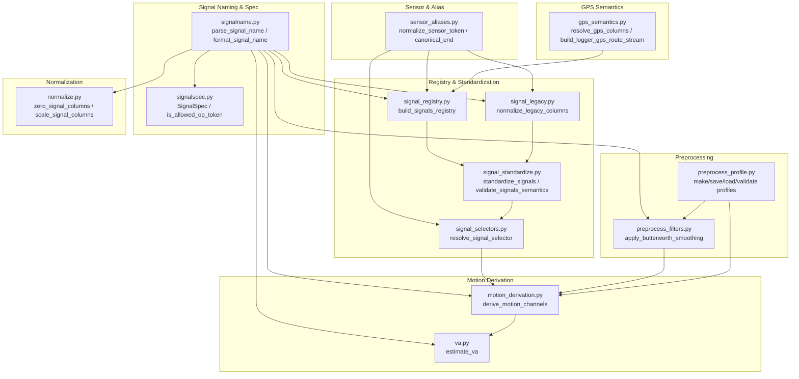

# Design: Signal Processing

> **Backfilled** — this design doc documents an existing system as it currently
> behaves. It is not a forward design. Code is the source of truth; this doc
> describes what the code does.

## Problem Statement

BODAQS loggers produce raw sensor data in ad-hoc column names that vary across
firmware versions and logger configurations. Downstream analysis — event
detection, segment extraction, metrics, and visualization — needs to resolve
signals by **semantic meaning** (e.g., "rear suspension displacement in mm")
rather than by fragile column-name string matching. The Signal Processing
sphere provides the naming grammar, registry, standardization pipeline,
preprocessing filters, and motion-derivation stages that transform raw logger
output into analysis-ready, semantically annotated signals.

## Background

The system evolved from early notebook-era code that used informal column naming
conventions. As the analysis package matured, a formal signal naming spec (v0.2)
was introduced with a parser (`signalname.py`), a specification of allowed
domains/ops (`signalspec.py`), and a registry builder (`signal_registry.py`).
Legacy column names are handled by `signal_legacy.py`, which rewrites them to
canonical form. A standardization pass (`signal_standardize.py`) orchestrates
the rename → rebuild → validate sequence.

Preprocessing was initially limited to zeroing and normalization (`normalize.py`)
plus legacy Butterworth smoothing (`preprocess_filters.py`). A motion-derivation
stage (`motion_derivation.py`) was later added to generate filtered
displacement/velocity/acceleration analysis channels with full provenance. A
standalone velocity/acceleration estimator (`va.py`) predates motion derivation
and remains for backward compatibility.

GPS data from logger async snapshots and optional Garmin FIT imports is handled
by `gps_semantics.py`, which resolves GPS columns, builds route streams, and
manages source preference policy.

Preprocess profiles (`preprocess_profile.py`) provide a persisted JSON document
that captures reusable preprocessing configuration, documented in
`docs/analysis/contracts/BODAQS_Preprocess_Profile_Contract_v0_draft.md`.

Related contracts:
- `docs/analysis/contracts/BODAQS_Minimum_Signal_Registry_Semantics_v0_1_1.md`
- `docs/analysis/contracts/BODAQS_Preprocess_Profile_Contract_v0_draft.md`

## Goals

- Parse and format canonical signal column names with a formal grammar
- Build a signal registry that maps every numeric DataFrame column to semantic
  metadata (kind, unit, domain, sensor, end, quantity, op_chain)
- Standardize legacy column names to canonical form without data loss
- Validate signal semantics (unit↔quantity consistency, required fields)
- Resolve semantic signal selectors to exactly one DataFrame column
- Zero, normalize, and scale physical displacement signals
- Apply Butterworth lowpass smoothing to displacement signals
- Derive filtered displacement/velocity/acceleration analysis channels with
  full provenance (Butterworth + Savitzky-Golay)
- Manage persisted preprocessing profiles (create, save, load, validate, discover)
- Resolve GPS columns from metadata and build logger GPS route streams
- Normalize sensor tokens and infer bike-end (front/rear) from sensor names

## Non-Goals

- Event detection (owned by `detect.py`)
- Segment extraction (owned by `segment.py`)
- Metrics computation (owned by `metrics.py`)
- Bike profile parsing and signal transforms (owned by `bike_profile.py`)
- FIT file parsing and binding (owned by `io_fit.py`)
- Logger CSV/BDQ loading (owned by `io_logger.py`, `io_bdq.py`)
- Timebase estimation and stream registration (owned by `timebase.py`, though
  `gps_semantics.py` calls `register_stream_metadata` as a consumer)
- Resampling (owned by `resample.py`)
- Pipeline orchestration (owned by `pipeline.py`)

## Open Questions

- **OQ-1**: In `signal_legacy.py`, the legacy suffix `_scaled` maps to op token
  `cal` with a comment "adjust if you prefer 'scale'". The intended token is
  unclear. — discovered in `signal_legacy.py:LEGACY_OP_SUFFIXES`
- **OQ-2**: In `signal_legacy.py`, `DEFAULT_EXEMPT_COLUMNS` has a missing comma
  between `"timestamp_ms"` and `"sample_id"`, causing Python string
  concatenation to produce `"timestamp_mssample_id"` instead of two separate
  entries. This appears to be a bug but may be unintentionally relied upon.
  — discovered in `signal_legacy.py:DEFAULT_EXEMPT_COLUMNS`
- **OQ-3**: In `signal_standardize.py`, the unit↔quantity consistency check for
  `disp_norm` (should have unit `'1'`) is commented out. It is unclear whether
  this was intentionally disabled or is an unfinished edit.
  — discovered in `signal_standardize.py:validate_signals_semantics`
- **OQ-4**: `zero_signal_columns()` zeroes in-place (modifies base columns),
  while `normalize_and_scale()` creates explicit `_op_zeroed` columns. The
  intended canonical behavior for the pipeline is unclear.
  — discovered in `normalize.py`
- **OQ-5**: `normalize.py` mutates a module-level global `TIME_COL_CANDIDATES`
  inside `zero_signal_columns()` and `normalize_and_scale()`. This is a
  thread-safety concern in concurrent environments.
  — discovered in `normalize.py`
- **OQ-6**: `estimate_va()` in `va.py` processes all numeric columns (excluding
  time-like names) without validating they are displacement signals. It will
  attempt velocity/acceleration derivation on any numeric column.
  — discovered in `va.py:estimate_va`
- **OQ-7**: `normalize_gps_source_policy()` silently falls back to
  `"logger_then_fit"` for unrecognized `preferred_source` values instead of
  raising an error. It is unclear whether this is intentional leniency.
  — discovered in `gps_semantics.py:normalize_gps_source_policy`
- **OQ-8**: `_name_zeroed_norm()` in `normalize.py` is defined but never called
  by any code in the module. It may be dead code.
  — discovered in `normalize.py:_name_zeroed_norm`
- **OQ-9**: `DEFAULT_PREPROCESS_PROFILE_CONFIG` includes `activity_detection`
  and `gps_source_policy` blocks that are not documented in the Preprocess
  Profile Contract v0 draft. The validator checks `activity_detection` but the
  contract does not mention it.
  — discovered in `preprocess_profile.py`
- **OQ-10**: `standardize_signals(derive_va=True)` raises `ValueError` with a
  deprecation message. VA derivation is now owned by `va.py`. The parameter
  remains in the signature for backward compatibility.
  — discovered in `signal_standardize.py:standardize_signals`

## System Invariants

- **INV-1**: Every numeric column in `session['df']` (excluding timebase columns
  and explicitly non-signal columns) MUST have a corresponding entry in
  `session['meta']['signals']` keyed by the exact column name.
- **INV-2**: Each signal registry entry MUST contain keys: `kind`, `unit`,
  `domain`, `op_chain`. Additional keys (`sensor`, `end`, `quantity`, etc.) are
  added by the registry builder.
- **INV-3**: `kind` MUST be one of `""` (engineered), `"raw"`, or `"qc"`.
- **INV-4**: Engineered signals (`kind == ""`) MUST have a non-empty `unit`.
- **INV-5**: Raw signals (`kind == "raw"`) SHOULD have unit `"counts"`.
- **INV-6**: Engineered physical signals (unit in `{mm, mm/s, mm/s^2, 1}`) MUST
  have non-empty `sensor` and `quantity` fields.
- **INV-7**: `quantity` MUST be one of `{disp, vel, acc, disp_norm, raw}`.
- **INV-8**: Unit↔quantity consistency is enforced: `disp` → `mm` or `1`,
  `vel` → `mm/s`, `acc` → `mm/s^2`. *(unverified intent — needs review)*: The
  `disp_norm` → `1` check is commented out.
- **INV-9**: `op_chain` MUST be a list of strings (possibly empty).
- **INV-10**: Signal selectors MUST match at most one signal. If a selector
  matches multiple signals, `resolve_signal_selector()` raises `ValueError`.
- **INV-11**: Butterworth filter cutoff frequency MUST be below Nyquist
  (`0.5 * sample_rate_hz`).
- **INV-12**: Savitzky-Golay window MUST be odd and greater than `poly_order`.
- **INV-13**: Motion derivation source MUST be an engineered displacement signal
  with `kind == ""` and `unit == "mm"`.
- **INV-14**: Preprocess profile `schema` MUST be exactly
  `"bodaqs.preprocess_profile"` and `version` MUST be `1`.
- **INV-15**: Preprocess profile MUST NOT contain runtime binding fields
  (`bike_profile_path`, `fit_dir`, `bindings_path`, etc.).
- **INV-16**: Legacy column normalization MUST NOT create duplicate column
  names. If renames would collide, `ValueError` is raised.
- **INV-17**: `canonical_end()` accepts only `"front"` and `"rear"` as valid
  bike-end tokens. All other values return empty string.
- **INV-18**: Signal names with `semantic_selection_excluded == True` are
  ignored by signal selector matching.
- **INV-19**: GPS route stream building requires both latitude and longitude
  columns to be resolvable from session metadata.
- **INV-20**: If `active_signal_disp_selector` is `null`, then
  `active_signal_vel_selector` MUST also be `null`.

## High-Level Architecture



## Data Model

### Session Object

The central data structure is the `session` dict, typed informally as:

```python
session = {
    "session_id": str,
    "source": dict,           # path, filename, created_local, timezone
    "df": pd.DataFrame,        # primary analysis dataframe
    "df_raw": pd.DataFrame,    # original unmodified dataframe (optional)
    "meta": {
        "signals": dict,       # {column_name: SignalInfo}
        "channel_info": dict,  # logger-supplied hints
        "streams": dict,       # per-stream timebase metadata
        "secondary_streams": dict,  # GPS and other secondary streams
        "gps_sources": dict,   # GPS source preference metadata
    },
    "qc": {
        "naming": {"legacy_renames": list},
        "signals": dict,
        "gps": dict,
    },
    "stream_dfs": dict,        # {stream_name: pd.DataFrame}
}
```

### SignalInfo Entry

Each entry in `session['meta']['signals']` has the shape:

```python
{
    "kind": str,               # "" | "raw" | "qc"
    "unit": str | None,        # e.g. "mm", "mm/s", "counts", "1"
    "domain": str | None,      # e.g. "suspension", "wheel", "bike", "world"
    "op_chain": list[str],     # e.g. ["zeroed", "norm"]
    "sensor": str | None,      # e.g. "rear_shock"
    "end": str | None,         # "front" | "rear" | None
    "quantity": str | None,    # "disp" | "vel" | "acc" | "disp_norm" | "raw"
    "notes": str,              # diagnostics
    # Optional provenance fields:
    "source": list[str],
    "source_columns": list[str],
    "processing_role": str,    # "primary_analysis" | "secondary_analysis"
    "motion_source_id": str,
    "motion_profile_id": str,
    "derivation": dict,
    "origin": str,             # "logger" | "analysis"
    "semantic_selection_excluded": bool,
    "semantic_selection_exclusion_reason": str,
}
```

### Signal Name Grammar

```
<base><kind><domain> [unit]_op_<t1>_<t2>...

base:    snake_case identifier (required)
kind:    "" | "_raw" | "_qc"
domain:  "" | "_dom_<domain>"
unit:    "" | " [<unit>]"
ops:     "" | "_op_<token1>_<token2>..."

Examples:
  rear_shock_dom_suspension [mm]
  rear_shock_dom_suspension [mm]_op_zeroed
  rear_shock_dom_suspension [1]_op_zeroed_norm
  battery_v_raw [counts]
  is_valid_qc
  rear_wheel_disp_dom_wheel [mm]
```

### Preprocess Profile Document

```json
{
  "schema": "bodaqs.preprocess_profile",
  "version": 1,
  "profile_id": "suspension_default",
  "description": "...",
  "config": { ... }
}
```

## Component Contracts

### SignalNameParser — `signalname.py`

**Contract shape**: `parse_signal_name(name: str, spec: SignalSpec) -> SignalNameParts`;
`format_signal_name(parts: SignalNameParts, spec: SignalSpec) -> str`

**Behavioral guarantees**: Parses canonical signal column names into structured
parts (base, kind, domain, unit, ops). Coalesces multi-token composite op tags
(e.g., `Butterworth_3Hz_4Order`). Normalizes Butterworth residual ops by
replacing the `Butterworth_*` token with `diff`. Raises `SignalNameError` on
malformed names (missing base, unclosed unit bracket, repeated `_op_` prefix,
unknown op tokens when `strict_ops=True`, unknown domains when
`strict_domains=True`).

**State ownership**: Stateless. `SignalNameParts` is a frozen dataclass.

**Error semantics**: `SignalNameError` (subclass of `ValueError`) for all parse
and format failures. No silent recovery — callers must catch and handle.

### SignalSpec — `signalspec.py`

**Contract shape**: `SignalSpec` frozen dataclass; `is_allowed_op_token(token,
spec) -> bool`

**Behavioral guarantees**: Defines allowed domains (`suspension`, `wheel`,
`bike`, `world`), allowed op tokens (`zeroed`, `norm`, `clip`, `filt`, `fill`,
`smooth`, `detrend`, `cal`, `resamp`, `diff`), and allowed op patterns
(`Butterworth_<x>Hz_<y>Order`, `Savgol<x>ms<y>Poly`). `DEFAULT_SPEC` has
`strict_ops=True` and `strict_domains=True`.

**State ownership**: `DEFAULT_SPEC` is a module-level constant. `SignalSpec` is
frozen.

**Error semantics**: No errors raised — returns bool. Callers raise
`SignalNameError` when strict validation fails.

### SensorAliases — `sensor_aliases.py`

**Contract shape**: `normalize_sensor_token(value) -> str`;
`canonical_sensor_id(sensor) -> str`; `canonical_end(value) -> str`;
`end_from_sensor(value) -> str`; `sensors_match(left, right) -> bool`;
`ends_match(left, right) -> bool`

**Behavioral guarantees**: Normalizes sensor/source names to lowercase
snake_case (replacing spaces and hyphens with underscores, collapsing repeated
underscores). `canonical_end()` accepts only `"front"` and `"rear"` — all other
values return empty string. `end_from_sensor()` infers end from known sensor
prefixes (`front_shock`, `rear_shock`, `front_wheel`, `rear_wheel`). Does NOT
apply semantic aliases (e.g., `fork` → `front_shock` is not performed).

**State ownership**: Stateless.

**Error semantics**: No exceptions raised. Returns empty string for invalid/empty
input.

### SignalRegistry — `signal_registry.py`

**Contract shape**: `build_signals_registry(session, spec, strict,
non_signal_columns) -> session`

**Behavioral guarantees**: Iterates all DataFrame columns, skipping timebase
columns (`time_s`, `time_ms`, `timestamp`, `timestamp_ms`) and non-signal
columns. For each numeric column, parses the signal name and builds a
`SignalInfo` dict with `kind`, `unit`, `domain`, `op_chain`, `sensor`, `end`,
`quantity`. Applies `channel_info` hints from `session['meta']['channel_info']`
when available (logger-supplied metadata overrides parsed values). In
`strict=False` mode, unparseable numeric columns are still registered with
`kind=""`, `unit=None`, and a note. Boolish columns (0/1 or bool dtype) are
treated as `kind="qc"`.

**State ownership**: Mutates `session['meta']['signals']` in place.

**Error semantics**: `ValueError` if session missing `df` or `meta`. In
`strict=True` mode, `SignalNameError` propagates for unparseable columns. In
`strict=False` mode, unparseable columns are registered with notes.

### SignalStandardize — `signal_standardize.py`

**Contract shape**: `standardize_signals(session, spec, ...) -> session`;
`canonicalize_signal_names(session, spec, ...) -> session`;
`rebuild_and_validate_signal_registry(session, spec, ...) -> session`;
`validate_signals_semantics(session, spec) -> None`

**Behavioral guarantees**: `standardize_signals()` is the backward-compatible
wrapper that calls `canonicalize_signal_names()` then
`rebuild_and_validate_signal_registry()`. `canonicalize_signal_names()` renames
legacy columns and records the rename report in `session['qc']['naming']`.
`rebuild_and_validate_signal_registry()` calls `build_signals_registry()`,
`validate_signals_registry_shape()`, then `validate_signals_semantics()`.
`validate_signals_semantics()` enforces unit↔quantity consistency, required
sensor/quantity for physical signals, and kind validity.

**State ownership**: Mutates `session['df']` (column renames),
`session['meta']['signals']` (registry rebuild), `session['qc']` (rename
report).

**Error semantics**: `SignalSemanticsError` for semantic validation failures
(collected as a list of errors). `ValueError` for `derive_va=True` (deprecated).
`ValueError` from `normalize_legacy_columns()` on rename collisions.

### SignalLegacy — `signal_legacy.py`

**Contract shape**: `normalize_legacy_columns(df, spec, units_by_base,
domain_by_base, exempt_columns) -> (df, list[RenameRecord])`

**Behavioral guarantees**: Renames legacy column names to canonical form.
Strategy: (1) if column already parses canonically, keep it (optionally enrich
with domain/unit hints); (2) raw columns missing unit get `[counts]` appended;
(3) legacy suffixes after unit (`_zeroed`, `_norm`, `_filtered`, etc.) are
translated to `_op_` chains; (4) engineered columns missing unit get unit from
`units_by_base` hint; (5) unrecognized patterns are left unchanged with a
`"warn"` status. Detects duplicate column names after rename and raises
`ValueError`.

**State ownership**: Returns a new DataFrame (copy). Does not mutate input.

**Error semantics**: `ValueError` if `df` is not a DataFrame. `ValueError` if
renames would create duplicate columns. `RenameRecord` entries with
`status="warn"` for unrecognized patterns (no exception).

### SignalSelectors — `signal_selectors.py`

**Contract shape**: `selector_matches_signal(signal_info, selector) -> bool`;
`resolve_signal_selector(session, selector, purpose, allow_missing) -> str |
None`

**Behavioral guarantees**: `selector_matches_signal()` checks each selector
field (`end`, `quantity`, `domain`, `unit`, `processing_role`,
`motion_source_id`, `motion_profile_id`) against the signal info. `end` is
compared via `canonical_end()`. Other fields are compared case-insensitively
(exact string match). Signals with `semantic_selection_excluded=True` never
match. `resolve_signal_selector()` finds all matching columns; returns the
single match, `None` if no match (when `allow_missing=True`), or raises
`ValueError` if multiple matches.

**State ownership**: Stateless. Reads `session['meta']['signals']`.

**Error semantics**: `ValueError` if selector is not a non-empty mapping.
`ValueError` if selector matches multiple signals. `None` return if no match
and `allow_missing=True`.

### Normalize — `normalize.py`

**Contract shape**: `zero_signal_columns(df, ranges, ...) -> df | (df, meta)`;
`scale_signal_columns(df, ranges, ...) -> df | (df, meta)`;
`normalize_and_scale(df, ranges, ...) -> df | (df, meta)`

**Behavioral guarantees**: `zero_signal_columns()` finds the minimum-window
average offset in a sliding time window and subtracts it in-place from the base
column. `scale_signal_columns()` creates dimensionless normalized output columns
(`_op_norm` or `_op_zeroed_norm`). `normalize_and_scale()` is a legacy
convenience helper that zeroes (creating explicit `_op_zeroed` columns) then
scales. Zeroing uses a sliding window of `zero_window_s` seconds, requiring at
least `min_samples` samples. Falls back to first value if no valid window found.
Supports per-segment zeroing when `segment_col` is present.

**State ownership**: Returns a new DataFrame (copy). Does not mutate input.
*(unverified intent — needs review)*: Mutates module-level global
`TIME_COL_CANDIDATES`.

**Error semantics**: `ValueError` if zeroing expects engineered signal but kind
is not `""` or unit is missing. Missing/non-numeric columns are recorded in meta
with `status="missing"` or `"non_numeric_or_empty"` (no exception).

### PreprocessFilters — `preprocess_filters.py`

**Contract shape**: `ButterworthSmoothingConfig` frozen dataclass;
`normalize_butterworth_smoothing_configs(configs) -> list`;
`apply_butterworth_smoothing(df, sample_rate_hz, configs, generate_residuals,
spec) -> (df, meta)`

**Behavioral guarantees**: `normalize_butterworth_smoothing_configs()` validates
each config (cutoff_hz > 0, order positive integer) and rejects duplicates after
canonicalization to op tag. `apply_butterworth_smoothing()` applies Butterworth
lowpass filter to all eligible displacement signals (kind=`""`, unit=`mm`). Uses
`scipy.signal.butter` + `sosfiltfilt`. Generates residual columns
(`_resid` suffix) when `generate_residuals=True`. Skips columns with too few
valid samples or uninterpolatable NaNs.

**State ownership**: Returns a new DataFrame (copy). Does not mutate input.

**Error semantics**: `ValueError` for invalid configs (non-numeric, non-positive,
duplicates). `ValueError` if cutoff >= Nyquist. `ImportError` if scipy is
unavailable. Skipped columns recorded in meta (no exception).

### PreprocessProfile — `preprocess_profile.py`

**Contract shape**: `default_preprocess_config(**overrides) -> dict`;
`make_preprocess_profile(profile_id, config, description, version) -> dict`;
`save_preprocess_profile(profile, path) -> Path`;
`load_preprocess_profile(path) -> dict`;
`discover_preprocess_profiles(directory) -> list`;
`validate_preprocess_profile(profile) -> None`;
`validate_preprocess_config(config) -> None`;
`resolve_preprocess_config_paths(config, base_dir) -> dict`

**Behavioral guarantees**: Creates, validates, saves, loads, and discovers
preprocess profile JSON documents. Validates schema (`bodaqs.preprocess_profile`),
version (1), required config keys, forbidden runtime binding keys, motion
derivation config, activity detection config, and signal selectors. Path
resolution is explicit via `resolve_preprocess_config_paths()` — not automatic.

**State ownership**: Stateless. Reads/writes JSON files.

**Error semantics**: `ValueError` for invalid profiles (wrong schema, wrong
version, missing required keys, forbidden keys, invalid types). `FileNotFoundError`
if profile file doesn't exist. `FileExistsError` if saving without overwrite.

### MotionDerivation — `motion_derivation.py`

**Contract shape**: `MaterializedSavgolWindow` frozen dataclass;
`build_savgol_op_tag(window_ms, poly_order) -> str`;
`sg_window_samples(window_ms, fs_hz, poly_order, signal_length, strict) ->
MaterializedSavgolWindow`;
`derive_motion_channels(session, motion_derivation, sample_rate_hz, strict,
overwrite_existing_primary, spec) -> (df, meta)`

**Behavioral guarantees**: `sg_window_samples()` converts a user-facing window
duration in ms to valid sample counts (odd, > poly_order, <= signal_length).
`derive_motion_channels()` generates filtered displacement, velocity, and
acceleration channels for each source/profile combination. Pipeline per profile:
(1) Butterworth lowpass on displacement source; (2) Savitzky-Golay 1st
derivative for velocity; (3) Savitzky-Golay 2nd derivative for acceleration;
(4) Butterworth lowpass on velocity; (5) Butterworth lowpass on acceleration.
Primary profile uses `processing_role="primary_analysis"` and no suffix.
Secondary profiles use `processing_role="secondary_analysis"` and a suffix
(e.g., `lp20hz`). Does NOT mutate session — returns new df and metadata.

**State ownership**: Returns a new DataFrame (copy) and metadata dict. Does not
mutate session.

**Error semantics**: `ValueError` for non-positive params, cutoff >= Nyquist,
source not engineered displacement [mm]. In `strict=False` mode, failed
derivations are recorded as skipped (no exception). `ImportError` if scipy is
unavailable for Butterworth.

### VelocityAcceleration — `va.py`

**Contract shape**: `estimate_va(df, cols, sample_rate_hz, time_col,
window_points, poly_order, ...) -> df | (df, meta)`;
`name_vel(col) -> str`; `name_acc(col) -> str`

**Behavioral guarantees**: `estimate_va()` applies Savitzky-Golay differentiation
to compute velocity (1st derivative) and acceleration (2nd derivative) for all
numeric columns (excluding time-like names). Uses scipy if available, falls back
to NumPy implementation. Infers dt from explicit sample rate, time column, or
DatetimeIndex. `name_vel()` and `name_acc()` generate canonical column names
from engineered [mm] displacement columns. *(unverified intent — needs review)*:
Processes all numeric columns without validating they are displacement signals.

**State ownership**: Returns a new DataFrame (copy). Does not mutate input.

**Error semantics**: `ValueError` if window_points is even, poly_order >=
window_points, poly_order < 1, or dt cannot be inferred. `ValueError` if
`name_vel`/`name_acc` called on non-engineered or non-mm signal.

### GPSSemantics — `gps_semantics.py`

**Contract shape**: `GPSColumnSet` frozen dataclass;
`normalize_gps_source_policy(value) -> dict`;
`resolve_gps_columns(metadata, known_columns, require_logger_source) ->
GPSColumnSet | None`;
`build_logger_gps_route_stream(session, gps_source_policy) -> session`;
`refresh_gps_source_metadata(session, gps_source_policy) -> session`;
`preferred_gps_source_name(session, fallback) -> str | None`;
`gps_source_kind(source_id, metadata, latitude_col) -> str`

**Behavioral guarantees**: `resolve_gps_columns()` resolves latitude, longitude,
and optional quality columns from session metadata (channel_info or signals).
Pairs lat/lon by sensor/source group key. `build_logger_gps_route_stream()`
extracts GPS snapshots from the primary DataFrame, filters invalid positions,
deduplicates by seq or fresh flag, sorts by time, and stores as a secondary
stream. `refresh_gps_source_metadata()` scans all streams for GPS data and
selects a preferred source based on policy. *(unverified intent — needs review)*:
Invalid `preferred_source` values silently fall back to `"logger_then_fit"`.

**State ownership**: Mutates `session['stream_dfs']`, `session['meta']['streams']`,
`session['meta']['secondary_streams']`, `session['meta']['gps_sources']`,
`session['qc']['gps']`.

**Error semantics**: No exceptions raised for missing GPS data — returns `None`
or unmodified session. `ValueError` only from `register_stream_metadata()` for
unsupported stream kind.

## Failure Modes

| Failure Mode | Trigger | Current Behavior | Handled? |
|-------------|---------|-----------------|----------|
| Unparseable signal name | Column name doesn't match canonical grammar | `strict=True`: `SignalNameError` raised. `strict=False`: registered with `notes` field. | YES |
| Missing unit on engineered signal | `kind=""` but `unit` is None or empty | `SignalSemanticsError` during semantic validation. | YES |
| Raw signal with wrong unit | `kind="raw"` but `unit != "counts"` | `SignalSemanticsError` during semantic validation. | YES |
| QC signal not boolish | `kind="qc"` but values not 0/1 or bool | `SignalSemanticsError` (unless `processing_role="qc_metric"`). | YES |
| Physical signal missing sensor | `kind=""`, unit in physical set, but `sensor` is None | `SignalSemanticsError` during semantic validation. | YES |
| Unit↔quantity mismatch | e.g., `quantity="vel"` but `unit="mm"` | `SignalSemanticsError` during semantic validation. | YES |
| `disp_norm` unit mismatch | `quantity="disp_norm"` but `unit != "1"` | Check is commented out — NOT enforced. *(unverified intent — needs review)* | NO |
| Legacy rename collision | Two columns would rename to the same canonical name | `ValueError` from `normalize_legacy_columns()`. | YES |
| Selector matches multiple signals | Semantic selector matches >1 column | `ValueError` from `resolve_signal_selector()`. | YES |
| Selector matches no signals | Semantic selector matches 0 columns | Returns `None` if `allow_missing=True`, else `ValueError`. | YES |
| Butterworth cutoff >= Nyquist | `cutoff_hz >= 0.5 * sample_rate_hz` | `ValueError` raised. | YES |
| scipy unavailable | `scipy.signal` import fails | `ImportError` for Butterworth/motion derivation. `va.py` falls back to NumPy. | PARTIAL |
| Signal too short for S-G | `signal_length < 3` or `< poly_order` | `strict=True`: `ValueError`. `strict=False`: window reduced, `np.gradient` fallback. | YES |
| Zeroing no valid window | All-NaN column or < min_samples in window | Falls back to first valid value. | YES |
| GPS columns not resolvable | No lat/lon columns in metadata | `resolve_gps_columns()` returns `None`. Stream not built. | YES |
| Invalid GPS source policy | Unrecognized `preferred_source` value | Silently falls back to `"logger_then_fit"`. *(unverified intent — needs review)* | PARTIAL |
| Preprocess profile wrong schema | `schema != "bodaqs.preprocess_profile"` | `ValueError` from `validate_preprocess_profile()`. | YES |
| Preprocess profile missing required key | Required config key absent | `ValueError` listing missing keys. | YES |
| Runtime binding field in profile | Forbidden key (e.g., `bike_profile_path`) present | `ValueError` listing forbidden keys. | YES |
| Motion derivation source not displacement | Source column is not `kind=""` + `unit="mm"` | `ValueError` from `_derive_profile_for_source()`. | YES |
| Motion derivation output column exists | Generated column name already in DataFrame | Primary disp: annotated as existing. Others: skipped. | YES |
| `DEFAULT_EXEMPT_COLUMNS` bug | Missing comma causes string concatenation | `"timestamp_ms"` and `"sample_id"` not individually exempt. *(unverified intent — needs review)* | NO |
| Global `TIME_COL_CANDIDATES` mutation | Concurrent calls to zeroing functions | Race condition on global variable. *(unverified intent — needs review)* | NO |

## Cross-Cutting Concerns

### Backwards Compatibility

- `standardize_signals(derive_va=True)` raises `ValueError` with a deprecation
  message. VA derivation is now owned by `va.py`.
- `normalize_and_scale()` is a legacy convenience helper. `zero_signal_columns()`
  and `scale_signal_columns()` are the current preferred API.
- `normalize_preprocess_config_keys()` migrates the old
  `ignore_on_logger_transformations` field name to
  `prefer_postprocessing_transformations`.
- `va.py` provides a NumPy fallback for Savitzky-Golay when scipy is unavailable.
- `motion_derivation.py` provides a `np.gradient` fallback for very short signals.
- Legacy Butterworth smoothing (`preprocess_filters.py`) is retained for pipeline
  compatibility but is expected to be superseded by `motion_derivation`.

### Observability

- Zeroing metadata is returned when `return_meta=True` (per-column offsets,
  method used, window info).
- Scaling metadata includes source column, norm column name, and clip status.
- Butterworth smoothing metadata includes eligible columns, generated columns,
  skipped columns, and warnings.
- Motion derivation metadata includes generated channels, skipped sources,
  warnings, and per-channel derivation provenance.
- Legacy rename report is stored in `session['qc']['naming']['legacy_renames']`.
- GPS QC is stored in `session['qc']['gps']`.

### Error Collection

- `validate_signals_semantics()` collects all errors into a single
  `SignalSemanticsError` message rather than failing on the first error.
- Preprocess profile validation fails fast on the first error.

### Dependency on scipy

- `preprocess_filters.py` and `motion_derivation.py` require scipy for
  Butterworth filtering. `ImportError` is raised if unavailable.
- `va.py` optionally uses scipy for Savitzky-Golay, with a NumPy fallback.
- `motion_derivation.py` optionally uses scipy for Savitzky-Golay, with a
  NumPy fallback (via `va.py`'s `_savgol_numpy`).
