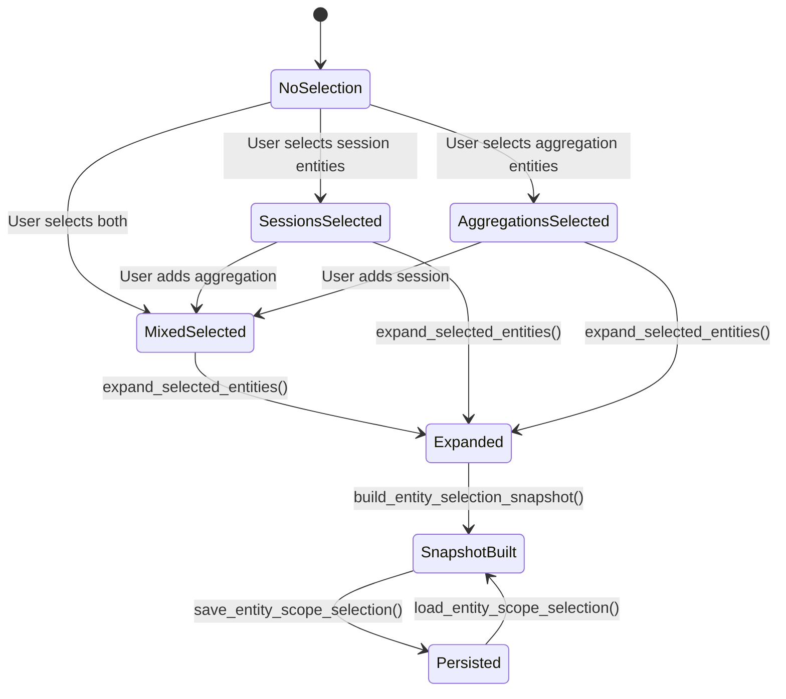

# Design: Widgets & Dashboards

> **Backfilled** — this design doc documents an existing system as it currently
> behaves. It is not a forward design. Code is the source of truth; this doc
> describes what the code does.

## Problem Statement

BODAQS analysis produces per-session artifact directories containing time-series
data, event tables, metric tables, signal registries, and event schemas. Analysts
need interactive JupyterLab widgets to select sessions (individually or as named
aggregations), browse event-triggered signal windows, compare metrics across
sessions via scatter plots and histograms, visualize GPS routes alongside
altitude profiles, and compose multi-widget dashboards. The widgets & dashboards
sphere provides this interactive layer: a typed contract system that decouples
session selection from visualization, a set of consumer widgets that operate on
selector-produced scope snapshots, and dashboard builders that compose widgets
with shared state.

## Background

The system evolved from notebook-embedded plotting code into a modular package.
Key historical decisions visible in the code:

- **Session key identity**: `{run_id}::{session_id}` was adopted as a globally
  unique identifier to disambiguate sessions across ingestion runs.
- **Entity scope model**: Originally session-only, expanded to support
  "aggregations" (named session groups) and a `study_set_grouping` entity kind.
  The `aggregation` kind is marked as legacy in the contract doc; new consumers
  should use `study_set_grouping`.
- **Schema-mediated sensor resolution**: Event rows carry a `signal_col` token
  that must be resolved to a sensor end (front/rear) via the event schema's
  trigger definitions and the session's signal registry. This indirection was
  introduced because signal column names vary across sessions.
- **Rebuilder pattern**: Rather than implementing live observer-based updates
  inside widgets, the system recreates widgets from fresh selector scope on each
  selection change. This trades selection preservation for robustness.
- **Registry policy**: Multi-session signal registry differences are handled via
  `union`, `intersection`, or `strict` policies.
- **Session aggregations module** (`session_aggregations.py`) is a compatibility
  wrapper that delegates to `bodaqs_analysis.library.aggregations`.

Related docs:
- `docs/analysis/contracts/BODAQS_session_selector_consumer_widgets_contract.md`
- `docs/analysis/contracts/BODAQS_Session_Filter_Contract_v0_draft.md`

## Goals

- Provide a stable, typed contract layer (`contracts.py`) that decouples session
  selection from widget consumption
- Support multi-session entity selection (physical sessions + named aggregations)
  with overlap deduplication
- Enable interactive event browsing with schema-mediated signal extraction
- Provide metric comparison via scatter plots and histograms across selected
  entities
- Visualize GPS routes and altitude profiles with linked time selection
- Support dashboard composition with shared cross-widget state
- Persist entity scope selections per-user for multi-notebook workflows
- Validate registry and event-schema policies across selected sessions

## Non-Goals

- The system does not provide a web application UI — all widgets are
  JupyterLab/ipywidgets-based
- The system does not implement ad-hoc table filtering or persisted session
  filters (those are defined in the Session Filter Contract but not implemented
  in this sphere)
- The system does not perform data acquisition or preprocessing — it consumes
  already-processed artifact directories
- The system does not manage artifact ingestion or library CRUD — that is
  handled by `bodaqs_analysis.artifacts` and `bodaqs_analysis.library`
- The event browser does not synthesize continuous timelines for aggregation
  entities — it renders faceted per-member views

## Open Questions

- **OQ-1**: The `study_set_grouping` entity kind is defined in contracts but no
  widget or selector currently creates entities of this kind. The selector only
  produces `session` and `aggregation` entities. — discovered in
  `contracts.py:EntityKind` and `session_selector.py:_rebuild_entity_options`
- **OQ-2**: The `RegistryResolutionConfig` dataclass includes an `include_qc`
  field, but no widget reads it. — discovered in `contracts.py:98`
- **OQ-3**: The `SnapshotWidgetBuilder` protocol is defined but never used by
  any widget or rebuilder. — discovered in `contracts.py:342`
- **OQ-4**: The `SelectedEventsLoader` and `SelectedMetricsLoader` protocols
  define a different call signature `(store, *, key_to_ref)` than the actual
  loader functions which use keyword-only `key_to_ref`. — discovered in
  `contracts.py:200-207` vs `loaders.py:79`
- **OQ-5**: The `show_ids_cb` key in the selector handle is always `None` — the
  selector uses `show_ids=True` internally for labels but does not expose a
  toggle widget. — discovered in `session_selector.py` return dict

## System Invariants

- **INV-1**: `session_key` format is always `{run_id}::{session_id}`, generated
  by `make_session_key(run_id, session_id)`.
- **INV-2**: `get_events_index_df()` must be consistent with `get_key_to_ref()`:
  `sorted(get_events_index_df()["session_key"].unique()) == sorted(get_key_to_ref().keys())`.
- **INV-3**: When both explicit session entities and grouped entities are
  selected, explicit sessions take precedence — overlapping members are removed
  from grouped-entity effective-member sets, and a warning is surfaced.
- **INV-4**: Widget constructors (`make_<widget>_for_loader`) are pure — they
  return a handle including `root`/`ui` and do not call `display()` internally
  unless `auto_display=True` is passed.
- **INV-5**: `event_browser` and `session_window_browser` accept exactly one
  selected entity at a time for time-series visualization. If the selected
  entity is an aggregation, per-member views are rendered (no synthetic
  continuous timeline).
- **INV-6**: Events/metrics joins use the stable composite key
  `(session_key, schema_id, event_id)`.
- **INV-7**: Registry policy must be one of `union`, `intersection`, `strict`.
  `strict` fails fast on signal-set mismatch; `strict` event-schema policy also
  requires matching schema hashes per schema_id.
- **INV-8**: Aggregations are persisted canonically in
  `artifacts/library/aggregations_v1.json` with atomic writes, unique
  `aggregation_key`, and non-empty `member_session_keys`.
- **INV-9**: Persisted entity scope selection stores `entity_key`s (not
  pre-expanded session sets) at `~/.bodaqs/entity_scope_selection_v1.json`.
  Restore is validated against current artifacts root and aggregation
  definitions; missing entities are dropped with warnings.
- **INV-10**: Frozen per-session event schemas are authoritative. A configured
  fallback is used only when no frozen schema is available. Multiple differing
  schema hashes across selected sessions raise an error.
- **INV-11**: The rebuilder pattern recreates widgets from fresh selector scope
  on each selection change — widget-local selections are not preserved across
  rebuilds.
- **INV-12**: `attach_refresh` uses a re-entrancy guard (`in_fire` flag) to
  prevent observer loops when rebuild functions trigger further selector changes.
- **INV-13**: `SessionTimeSelection` uses `traitlets.HasTraits` for cross-widget
  linking. Widgets publish and observe `session_key`, `window_t0_s`,
  `window_t1_s`, and `selected_time_s` traits. A `source` field identifies the
  originating widget to prevent echo loops.
- **INV-14**: Entity scope store uses schema `bodaqs.entity_scope_selection.store`
  version 1 with atomic writes (temp file + rename) and backup-on-write.
- **INV-15**: The `aggregation` entity kind is legacy. New Study Set grouping
  consumers should use `study_set_grouping`. *(legacy behavior — may be removed
  in future cleanup)*

## High-Level Architecture

```mermaid
graph TD
    subgraph "Contract Layer"
        contracts[contracts.py<br/>Typed contracts, protocols, handle types]
    end

    subgraph "Selection Layer"
        selector[session_selector.py<br/>make_session_selector<br/>make_session_aggregation_editor]
        scope[entity_scope.py<br/>Entity expansion + policy validation]
        scope_store[entity_scope_store.py<br/>Per-user persistence<br/>Persisted scope handle]
        agg_compat[session_aggregations.py<br/>Compatibility wrapper]
    end

    subgraph "Scope Resolution"
        registry[registry_scope.py<br/>Signal universe + policy]
        schema_res[event_schema_resolution.py<br/>Frozen schema resolution]
    end

    subgraph "Data Loading"
        loaders[loaders.py<br/>Session/events/metrics loaders]
    end

    subgraph "Consumer Widgets"
        event_browser[event_browser.py<br/>Time-series event browser]
        metric_scatter[metric_scatter_widget.py<br/>Metric scatter + regression]
        metric_hist[metric_histogram_widget.py<br/>Metric histogram/CDF]
        signal_hist[signal_histogram_widget.py<br/>Signal sample histogram]
        session_window[session_window_browser_widget.py<br/>Plotly rangeslider browser]
        gps_browser[gps_browser_widget.py<br/>ipyleaflet map + altitude]
    end

    subgraph "Shared Helpers"
        hist_core[histogram_core.py]
        metric_data[metric_widget_data.py]
        eb_scope[event_browser_scope.py]
        eb_options[event_browser_options.py]
        eb_render[event_browser_render.py]
        eb_semantics[event_semantics.py]
        sig_scope[signal_histogram_scope.py]
        sw_data[session_window_data.py]
        sw_plot[session_window_plot.py]
        sw_bookmarks[session_window_bookmarks.py]
        gps_data[gps_data.py]
        time_sel[time_selection.py]
    end

    subgraph "Dashboards"
        gps_dash[dashboards/gps_browser.py<br/>Session + GPS linked dashboard]
        susp_dash[dashboards/simple_suspension_metrics.py<br/>Suspension metrics tile dashboard]
    end

    subgraph "UI Modules"
        agg_mgr[ui/aggregation_manager.py]
        fit_editor[ui/fit_bindings_editor.py]
        lib_mgr[ui/library_manager.py]
        preprocess[ui/preprocess_*.py]
    end

    contracts --> selector
    contracts --> scope
    contracts --> loaders
    contracts --> event_browser
    contracts --> metric_scatter
    contracts --> metric_hist
    contracts --> signal_hist
    contracts --> session_window
    contracts --> gps_browser

    selector --> scope
    selector --> scope_store
    selector --> agg_compat
    scope --> registry
    scope --> schema_res

    loaders --> event_browser
    loaders --> metric_scatter
    loaders --> metric_hist
    loaders --> signal_hist
    loaders --> session_window
    loaders --> gps_browser

    event_browser --> eb_scope
    event_browser --> eb_options
    event_browser --> eb_render
    event_browser --> eb_semantics
    metric_scatter --> metric_data
    metric_hist --> metric_data
    metric_hist --> hist_core
    signal_hist --> sig_scope
    signal_hist --> hist_core
    session_window --> sw_data
    session_window --> sw_plot
    session_window --> sw_bookmarks
    session_window --> time_sel
    gps_browser --> gps_data
    gps_browser --> time_sel

    gps_dash --> session_window
    gps_dash --> gps_browser
    susp_dash --> metric_scatter
```



## Data Model

### Identity Model

```
SessionKey = str  # "{run_id}::{session_id}"
SessionRef = tuple[RunId, SessionId]
EntityKey = str
AggregationKey = str
EntityKind = "session" | "aggregation" | "study_set_grouping"
```

### Entity Selection State Machine



### ScopeEntity

A selectable entity — either a physical session or a named grouping:

| Field | Type | Description |
|-------|------|-------------|
| `entity_key` | `str` | Stable identifier (session_key or aggregation_key) |
| `kind` | `EntityKind` | `"session"`, `"aggregation"`, or `"study_set_grouping"` |
| `label` | `str` | Display label |
| `member_session_keys` | `tuple[str, ...]` | Physical session keys in this entity |

### EntitySelectionSnapshot

Resolved entity selection consumed by widget builders:

| Field | Type | Description |
|-------|------|-------------|
| `selected_entities` | `list[ScopeEntity]` | User-selected entities |
| `entity_to_effective_members` | `dict[str, list[str]]` | Entity → effective session keys (after dedup) |
| `expanded_session_keys` | `list[str]` | All unique physical session keys |
| `key_to_ref` | `dict[str, tuple[str, str]]` | session_key → (run_id, session_id) |
| `events_index_df` | `pd.DataFrame` | Index DF with `session_key, run_id, session_id` |

### SessionTimeSelection

Cross-widget shared state for time-linked dashboards:

| Trait | Type | Description |
|-------|------|-------------|
| `session_key` | `str \| None` | Currently active session |
| `window_t0_s` | `float \| None` | Visible window start (seconds) |
| `window_t1_s` | `float \| None` | Visible window end (seconds) |
| `selected_time_s` | `float \| None` | Pinned/clicked time point |
| `source` | `str` | Originating widget name (prevents echo) |

### WidgetHandle

Return shape from widget constructors:

| Key | Type | Required | Description |
|-----|------|----------|-------------|
| `root` | `Widget` | Recommended | Top-level UI for display |
| `ui` | `Widget` | Optional | Alternative UI handle |
| `out` | `Output` | Recommended | Output area for plotting |
| `viz_df` | `DataFrame` | Optional | Joined/filtered debug DF |
| `refresh` | `Callable` | Recommended | Recompute + rerender |
| `controls` | `dict` | Optional | Widget control references |
| `state` | `dict` | Optional | Internal state for debugging |

### RebuilderHandle

Return shape from rebuilder constructors:

| Key | Type | Description |
|-----|------|-------------|
| `out` | `Output` | Output area the widget renders into |
| `rebuild` | `Callable` | Recreate widget from fresh selector scope |
| `state` | `dict` | Holds `handles` key with most recent widget handles |

## Component Contracts

### contracts.py — Typed Contracts

**Contract shape**: Defines frozen dataclasses, TypedDicts, Protocols, and
helper functions for selector/widget composition.
**Behavioral guarantees**: Provides stable interface shapes that can be adopted
incrementally. `entity_snapshot_from_handle()` falls back to projecting session
selection to session entities if `get_entity_snapshot` is not available.
`selection_snapshot_from_handle()` delegates to entity snapshot when available,
otherwise requires `get_key_to_ref` and `get_events_index_df`.
**State ownership**: Stateless — pure type definitions and conversion functions.
**Error semantics**: Raises `ValueError` for missing required callables or
invalid return types. Does not catch or suppress errors from delegate calls.

### session_selector.py — Session Selector

**Contract shape**: `make_session_selector(...) -> SessionSelectorHandle` and
`make_session_aggregation_editor(...) -> dict`.
**Behavioral guarantees**: Discovers runs/sessions from artifact store. Loads
persisted aggregations. Provides live getters reflecting current UI state.
Supports autosave (default on). `attach_refresh` observes `run_dd`,
`entities_sel`, `show_ids_cb`, `refresh_signal` and calls rebuild functions on
change with re-entrancy guard.
**State ownership**: Maintains `_selected`, `_selected_entities`,
`_entity_snapshot`, `_key_to_ref`, `_events_index_df` as closure-captured state
updated on UI changes.
**Error semantics**: Aggregation CRUD errors are caught and displayed in the
output area. Selection save/load errors are caught and displayed. Unknown
sessions in aggregations raise `ValueError` during validation.

### entity_scope.py — Entity Scope Expansion

**Contract shape**: `expand_selected_entities(...) -> ExpandedEntityScope` and
`build_entity_selection_snapshot(...) -> EntitySelectionSnapshot`.
**Behavioral guarantees**: Explicit session entities take precedence over
grouped entities. Overlapping members are removed from grouped-entity effective
sets. `ExpandedEntityScope.reduced_members_by_entity` records which members were
removed. Events index DF is filtered to expanded session keys.
**State ownership**: Stateless — pure functions.
**Error semantics**: No errors raised — invalid session keys are silently
filtered against `key_to_ref`.

### entity_scope_store.py — Persisted Entity Scope

**Contract shape**: `EntityScopeStore` class, `save_entity_scope_selection()`,
`load_entity_scope_selection()`, `make_persisted_entity_scope_handle()`.
**Behavioral guarantees**: Persists to `~/.bodaqs/entity_scope_selection_v1.json`
with schema `bodaqs.entity_scope_selection.store` v1. Atomic writes via temp
file + rename. Backup-on-write to `.bak`. On load, validates schema version and
selection shape. On restore, resolves entity keys against current artifacts and
aggregations; missing entities are dropped with warnings. Fully unresolved
restore is an error. Artifacts root mismatch is a warning (non-strict) or error
(strict).
**State ownership**: `EntityScopeStore` manages in-memory `_data` dict loaded
from disk.
**Error semantics**: `EntityScopeStoreError` for load failures (corrupt file is
backed up to `.corrupt`). `EntityScopeStoreValidationError` for invalid
selection/store shape. Corrupt file is copied to `.corrupt` before resetting to
empty.

### loaders.py — Data Loaders

**Contract shape**: `make_session_loader(store, key_to_ref) -> SessionLoader`,
`load_all_events_for_selected/store(...)`, `load_all_metrics_for_selected/store(...)`.
**Behavioral guarantees**: Session loader returns `{"df", "meta"}` from
`load_session_artifacts`. Events loader scans `events/<schema_id>/events.parquet`
per session, stamps identity columns (`session_key`, `run_id`, `session_id`).
Entity-aware variants also stamp `entity_key`, `entity_kind`,
`source_session_key`. Metrics loader scans `metrics/<schema_id>/metrics.parquet`.
**State ownership**: Stateless — factory functions returning closures.
**Error semantics**: Missing events/metrics directories are silently skipped
(continue to next session). Empty DataFrames are skipped. `_read_events_df_robust`
handles fastparquet NAType errors by excluding known problematic columns as a
fallback. Returns empty DataFrame if no data found.

### registry_scope.py — Registry Scope

**Contract shape**: `compute_signal_universe(...)`, `load_signal_registries_for_sessions(...)`,
`apply_registry_policy_to_registries(...)`.
**Behavioral guarantees**: Loads signal registries from `session['meta']['signals']`.
`union` returns all signals across sessions. `intersection` returns common
signals. `strict` requires identical signal sets — raises `ValueError` on
mismatch. Signals are sorted by unit then name.
**State ownership**: Stateless.
**Error semantics**: `ValueError` for invalid policy or strict-mode mismatch.

### event_schema_resolution.py — Event Schema Resolution

**Contract shape**: `resolve_event_schema_for_selection(sel) -> EventSchemaResolution`
and `resolve_event_schema_for_sessions(store, key_to_ref) -> EventSchemaResolution`.
**Behavioral guarantees**: Frozen per-session schemas (in `events/<schema_id>/schema.yaml`)
are authoritative. If no frozen schemas found, uses fallback path if provided.
Raises error if multiple differing schema hashes found across selected sessions.
Returns warnings for partitions missing frozen schema files.
**State ownership**: Stateless.
**Error semantics**: `EventSchemaResolutionError` for empty scope, missing
frozen schemas without fallback, multiple schema versions, or parse failures.

### event_browser.py — Event Browser Widget

**Contract shape**: `make_event_browser_widget_for_loader(schema, events_df, ...) -> WidgetHandle`
and `make_event_browser_rebuilder(sel, schema, ...) -> RebuilderHandle`.
**Behavioral guarantees**: Multi-session scope selection. Schema-mediated sensor
resolution: event row → (schema_id, signal_col) → schema triggers → registry →
end/context. Segment extraction via `extract_segments` with configurable pre/post
window. Supports secondary trigger markers, metrics display, stats, and resolve
info. Prev/next event navigation. Session caching to avoid re-loading.
**State ownership**: Maintains `_session_cache`, `_scope_resolution`, and widget
controls as closure state.
**Error semantics**: Empty events_df raises `ValueError`. Missing required
columns raises `ValueError`. Scope resolution errors are displayed in the output
area. Invalid segments show reason text.

### metric_scatter_widget.py — Metric Scatter Widget

**Contract shape**: `make_metric_scatter_widget_for_loader(...) -> WidgetHandle`
and `make_metric_scatter_rebuilder(sel, schema, ...) -> RebuilderHandle`.
**Behavioral guarantees**: Loads events + metrics, joins on
  `(session_key, schema_id, event_id)`. Schema-mediated sensor resolution.
  Entity comparison by default. Linear regression with R² per series. Optional
  diagonal line, equal axes, grid, stats. Sensor and metric options rebuild on
  event type change.
**State ownership**: Maintains `viz_df`, `metric_cols`, scope entity column, and
widget controls as closure state.
**Error semantics**: Empty events/metrics/schema raise `ValueError`. No resolved
sensors raise `ValueError`. No numeric x/y pairs after filtering shows "No
numeric x/y pairs" message.

### metric_histogram_widget.py — Metric Histogram Widget

**Contract shape**: `make_metric_histogram_widget_for_loader(...) -> WidgetHandle`
and `make_metric_histogram_rebuilder(sel, schema, ...) -> RebuilderHandle`.
**Behavioral guarantees**: Same data loading as metric scatter. Histogram or CDF
mode. Normalized or count mode. Entity and end comparison. Summary stats per
series. Metric options rebuild on event type change.
**State ownership**: Maintains `viz_df` and widget controls as closure state.
**Error semantics**: Same as metric scatter. No numeric values after filtering
shows placeholder text.

### signal_histogram_widget.py — Signal Histogram Widget

**Contract shape**: `make_signal_histogram_widget_for_loader(events_df, ...) -> WidgetHandle`
and `make_signal_histogram_rebuilder(sel, ...) -> RebuilderHandle`.
**Behavioral guarantees**: Discovers entities from `events_df[session_key_col]`.
Resolves signal universe per-session from registry, combined by policy. Signal
values extracted from session `df` with optional `active_mask_qc` filtering.
Histogram or CDF mode. Trimmed quantile metrics (Q25, Q50, Q75, Q90, Q95, IQR,
skew). Default signal selection prefers signals common to all selected entities.
**State ownership**: Maintains `session_cache`, signal policy error state, and
widget controls as closure state.
**Error semantics**: Empty entities raises `ValueError`. Registry policy errors
(strict mismatch) are displayed in output area. No numeric values shows
placeholder text.

### session_window_browser_widget.py — Session Window Browser

**Contract shape**: `make_session_window_browser_widget_for_loader(...) -> WidgetHandle`
and `make_session_window_browser_rebuilder(sel, ...) -> RebuilderHandle`.
**Behavioral guarantees**: Single Plotly FigureWidget with native rangeslider.
Enforces single active session. Event trigger overlays with hover metrics (joined
events↔metrics 1:1). Mark overlays from session df `mark` column. Bookmark
persistence via `BookmarkStore` (per-user local JSON). Min/max downsampling for
detail view (preserves narrow peaks). Linked time selection via
`SessionTimeSelection`. Stable signal colors via FNV-1a hash.
**State ownership**: Maintains session df, events/metrics, event color map,
bookmark store, selection model, and updating guard as closure state.
**Error semantics**: Empty events_index_df raises `ValueError`. Missing
session_key column raises `ValueError`. Bookmark save/load errors are caught and
displayed in bookmark status area.

### gps_browser_widget.py — GPS Browser Widget

**Contract shape**: `make_gps_browser_widget_for_loader(...) -> WidgetHandle`
and `make_gps_browser_rebuilder(sel, ...) -> RebuilderHandle`.
**Behavioral guarantees**: ipyleaflet Map + Plotly altitude chart. GPS data
extracted from preferred stream (default `gps_fit`) or primary df. Route
segments built from consecutive lat/lon points. Speed coloring with fixed bins
(0-10, 10-20, 20-30, 30-40, 40+ km/h). Route downsampling (default max 8000
points). Altitude interpolation from primary df if stream lacks altitude. Linked
time selection via `SessionTimeSelection`. Multiple basemap options. Click-to-pin
on altitude chart.
**State ownership**: Maintains GPS view data, segment df, selection model, map
layers, and updating guard as closure state.
**Error semantics**: Empty session_keys raises `ValueError`. No GPS data shows
status message and clears visuals. Missing altitude shows route-only status.

### time_selection.py — Session Time Selection

**Contract shape**: `SessionTimeSelection(HasTraits)` class and
`make_session_time_selection() -> SessionTimeSelection`.
**Behavioral guarantees**: Traitlets-based observable with `session_key`,
`window_t0_s`, `window_t1_s`, `selected_time_s`, `source` traits.
`update_state()` batches updates with `hold_trait_notifications`. Window values
are normalized (min/max ordered). `source` identifies originating widget to
prevent echo loops.
**State ownership**: Owns all five traits.
**Error semantics**: No errors raised — invalid values are silently ignored or
coerced.

### dashboards/gps_browser.py — GPS Dashboard

**Contract shape**: `make_session_gps_dashboard(sel, ...) -> DashboardHandle`.
**Behavioral guarantees**: Composes session window browser + GPS browser with
shared `SessionTimeSelection`. GPS browser's session control is hidden (driven
by session browser). Both sub-widgets rebuild on selector change via
`attach_refresh`. `DashboardHandle` extends `dict` with custom `_ipython_display_`
to avoid double-display.
**State ownership**: Owns shared selection model, sub-widget rebuilder handles,
and refresh handle.
**Error semantics**: Sub-widget rebuild errors are caught by `attach_refresh`'s
re-entrancy guard and printed.

### dashboards/simple_suspension_metrics.py — Suspension Metrics Dashboard

**Contract shape**: `make_simple_suspension_metrics_dashboard(sel, ...) -> DashboardHandle`.
**Behavioral guarantees**: Tile-based dashboard with 5 rows × 2 columns:
displacement histograms, velocity histograms, event summaries, compression
scatter, rebound scatter — for front and rear suspension. Signal selectors
resolve displacement (normalized + engineering mm) and velocity sources per
session. Shared y-axis across displacement tiles and velocity tiles. Cross-tile
regression line overlay (front↔rear). Engineering units toggle. Event counts by
schema_id per entity. All tiles rebuild on selector change.
**State ownership**: Owns tile handles, shared y-axis dicts, overlay fit caches,
session description cache, and signal selectors.
**Error semantics**: Tile rebuild errors are caught and displayed as tile
messages. Missing signals show "No matching signal found" message.

### ui/aggregation_manager.py — Aggregation Library Manager

**Contract shape**: `make_aggregation_library_manager(...) -> dict`.
**Behavioral guarantees**: Catalog-based session grid with filter. Canonical
aggregation CRUD with validation (registry policy + event schema policy).
Aggregation grid shows title, members, missing count, policies, updated timestamp.
Grid↔hidden SelectMultiple sync with re-entrancy guards.
**State ownership**: Maintains catalog DataFrames, label mappings, grid index
mappings, and syncing state flags.
**Error semantics**: CRUD errors are caught and displayed in output area.

### ui/fit_bindings_editor.py — FIT Bindings Editor

**Contract shape**: `make_fit_bindings_editor(sessions_by_id, fit_import) -> dict`.
**Behavioral guarantees**: Builds FIT candidate summary (overlapping FIT files
per session). Session dropdown for ambiguous matches. Candidate dropdown with
overlap duration. Save binding to JSON file. Refresh button.
**State ownership**: Maintains summary DataFrame and candidates by session.
**Error semantics**: Missing time anchor shows "missing_anchor" status. Binding
save errors are caught and displayed.

### ui/library_manager.py — Library Manager

**Contract shape**: `make_library_manager(...) -> dict`.
**Behavioral guarantees**: Library adapter-backed session catalog with filter.
Session note editing (template-based fields, custom values, free text). Run/session
description editing. Study Set CRUD (create, load, update, delete with revision
checks). Grouping management within Study Sets. Manifest/meta viewers. Grid↔hidden
sync with re-entrancy guards. Save confirmation for multi-session note application.
**State ownership**: Maintains catalog DataFrame, note state, template state,
field widgets, study set state, grouping state, and editor staging state.
**Error semantics**: Note load errors are caught and displayed. Study Set
revision conflicts raise `RevisionConflictError`. Save errors are caught and
displayed.

### ui/preprocess_controls.py — Preprocess Controls

**Contract shape**: `PreprocessControls(disp_cols_all, sessions_by_id, ...) -> dict`.
**Behavioral guarantees**: Accordion UI for preprocessing parameters (zeroing,
clipping, Butterworth smoothing, active masking, FIT import). Produces validated
config dict for `preprocess_session()`.
**State ownership**: Maintains widget controls and defaults.
**Error semantics**: Invalid values are coerced with safe fallbacks.

### ui/preprocess_file_selector.py — Preprocess Log Selector

**Contract shape**: `PreprocessLogSelector(...) -> dict`.
**Behavioral guarantees**: File grid with processed status (SHA256-based
deduplication against artifact manifests). Filter, select all, clear selection.
Persists last directory. Optional ipydatagrid support.
**State ownership**: Maintains file rows, selection model, and selector state.
**Error semantics**: File read errors are silently skipped.

### ui/preprocess_profile_editor.py — Preprocess Profile Editor

**Contract shape**: `PreprocessProfileEditor(...) -> dict` and
`make_preprocess_profile_editor(...) -> dict`.
**Behavioral guarantees**: Discovers, loads, creates, updates, and deletes
persisted preprocess profiles. JSON editing for Butterworth configs, FIT import,
motion derivation. Profile validation before save.
**State ownership**: Maintains profile list, current profile, and widget controls.
**Error semantics**: Invalid JSON raises `ValueError`. Profile validation errors
are displayed.

### ui/runtime_settings_editor.py — Runtime Settings Editor

**Contract shape**: `PreprocessRuntimeSettingsEditor(...) -> dict` and
`make_preprocess_runtime_settings_editor(...) -> dict`.
**Behavioral guarantees**: Run-level settings (log directories, bike profile,
output directory). Persists to `.bodaqs_preprocess_runtime_settings.json`.
Binds to log selector for file count display.
**State ownership**: Maintains settings state and widget controls.
**Error semantics**: File read/write errors are silently caught (best-effort).

## Failure Modes

| Failure Mode | Trigger | Current Behavior | Handled? |
|-------------|---------|-----------------|----------|
| Empty selector scope | No sessions in artifacts dir | Selector shows empty grid; getters return empty | YES |
| Missing events directory | Session has no `events/` dir | Loader skips session silently | YES |
| Missing metrics directory | Session has no `metrics/` dir | Loader skips session silently | YES |
| Corrupt events parquet | fastparquet NAType in integer columns | `_read_events_df_robust` excludes known problematic columns | YES |
| Empty events/metrics after load | All sessions have no events/metrics | Widget constructors raise `ValueError` | YES |
| Registry policy mismatch (strict) | Selected sessions have different signal sets | `ValueError` raised with sample mismatched sessions | YES |
| Event schema mismatch (strict) | Selected sessions have different schema hashes | `ValueError` raised with schema_id and sessions | YES |
| Multiple frozen schema versions | Selected sessions have different schema hashes | `EventSchemaResolutionError` raised | YES |
| No frozen schema + no fallback | No schema.yaml in selected sessions | `EventSchemaResolutionError` raised | YES |
| Aggregation with unknown sessions | Aggregation references deleted sessions | `ValueError` during validation | YES |
| Persisted scope references missing entities | Entity no longer in artifacts/aggregations | Entity dropped with warning | YES |
| Persisted scope fully unresolved | All entities missing | `EntityScopeStoreError` raised | YES |
| Artifacts root mismatch on restore | Different artifacts dir than save time | Warning (non-strict) or error (strict) | YES |
| Corrupt entity scope store file | Invalid JSON or schema | File backed up to `.corrupt`, reset to empty | YES |
| No GPS data in session | Session lacks GPS/FIT stream | GPS browser shows status message, clears visuals | YES |
| No resolved sensors (schema+registry) | Schema triggers don't match registry | Widget constructor raises `ValueError` | YES |
| Observer loop | Widget change triggers selector change triggers rebuild | `in_fire` re-entrancy guard in `attach_refresh` | YES |
| Grid↔hidden sync loop | Grid selection triggers hidden update triggers grid update | `syncing_grid`/`syncing_hidden` guard flags | YES |
| Bookmark save failure | BookmarkStore write error | Error caught, displayed in bookmark status | YES |
| Session loader returns non-dict | Corrupt session artifacts | `ValueError` from `require_session` | YES |
| Missing `time_s` column in session df | Session df lacks time column | `ValueError` from `require_session` | YES |
| Plotly FigureWidget not available | Missing plotly/anywidget dependency | Import error at module load | NO |
| ipyleaflet not available | Missing ipyleaflet dependency | Import error at module load | NO |
| ipydatagrid not available | Missing ipydatagrid dependency | Import error at module load | NO |
| Large route dataset (>8000 points) | GPS session with many trackpoints | Route downsampled to max_points | YES |
| Large detail dataset (>8000 points) | Session df with many samples | Min/max downsampling preserves peaks | YES |

## Cross-Cutting Concerns

### Observability

- Python `logging` module used in `loaders.py`, `metric_scatter_widget.py`, and
  `metric_histogram_widget.py` (logger named `__name__`).
- Widget output areas (`ipywidgets.Output`) serve as in-notebook status/debug
  displays.
- No structured logging or metrics collection — observability is notebook-visual
  only.

### Error Display

- Selector and aggregation editor display errors in dedicated `Output` widgets.
- Widget constructors raise `ValueError` for invalid inputs (empty scope, missing
  schema, etc.).
- Rebuilders catch constructor errors and display messages in their output areas.
- `attach_refresh` catches rebuild errors and prints them with `[attach_refresh]`
  prefix.

### Backwards Compatibility

- `session_aggregations.py` is a compatibility wrapper delegating to
  `bodaqs_analysis.library.aggregations`.
- `entity_snapshot_from_handle()` falls back to projecting session selection to
  session entities if `get_entity_snapshot` is not available.
- `selection_snapshot_from_handle()` delegates to entity snapshot when available.
- Signal histogram widget supports both `session_key` and `session_id` column
  modes via `loader_key_resolver`.
- Event browser detects `event_type` column, falling back to `schema_id`.
- `WidgetHandle` TypedDict uses `total=False` to allow incremental adoption.

### Performance

- Session caching in event browser (`_session_cache`) and signal histogram
  (`session_cache`) avoids re-loading sessions.
- Route downsampling in GPS browser (default max 8000 points).
- Min/max downsampling in session window browser preserves narrow peaks.
- Events/metrics loaded once per widget construction (not per render).
- `hold_trait_notifications` batches `SessionTimeSelection` updates.
- `fig.batch_update()` used in Plotly widgets to minimize re-renders.

### Concurrency

- The system is designed for single-threaded JupyterLab notebook use.
- No locking or thread-safety mechanisms.
- `traitlets.HasTraits` observers fire synchronously in the kernel thread.
- Re-entrancy guards (`in_fire`, `updating`, `syncing_*`) prevent recursive
  observer loops within the same thread.
