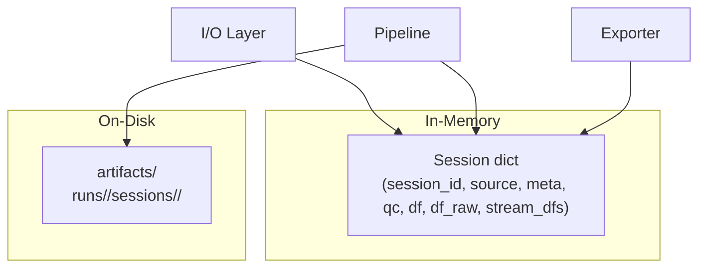

# Specification: Analysis Data Pipeline

**Created**: 2026-06-20
**Status**: Draft
**Design Docs**: [docs/design/analysis-data-pipeline.md](../../design/analysis-data-pipeline.md)

## Scope

**What part of the design is being implemented:**
This spec documents the existing Analysis Data Pipeline as it currently behaves.
It covers data I/O (BDQ, CSV, FIT), the Session model, pipeline orchestration
(load → canonicalize → FIT enrich → preprocess → detect → metrics), artifact
persistence, session archives, timebase estimation, resampling, and the
data.syn.bike exporter.

**Out of scope for this spec:**
- Event detection algorithms (`detect.py`) — covered by event schema spec
- Metrics computation (`metrics.py`) — covered by metrics table contract
- Signal standardization internals (`signal_standardize.py`, `signal_registry.py`)
- Bike profile transforms (`bike_profile.py`) — covered by preprocess profile contract
- Import agent (`import_agent*.py`) — separate sphere
- Library preprocessing batch orchestration (`library_preprocessing.py`)
- UI widgets and dashboards

## Design Context

### Relevant Invariants

- **INV-1**: `session["df"]` must have a `time_s` column (or index) that is finite and monotonic non-decreasing.
- **INV-2**: `session["meta"]["streams"]` must be present and non-empty when `df` is present.
- **INV-3**: `session["meta"]["streams"]["primary"]` must exist and be `kind == "uniform"`.
- **INV-4**: Uniform streams must have `sample_rate_hz`, `dt_s`, `jitter_frac` (finite, positive).
- **INV-5**: Zeroing is never implicit; all zeroing recorded in `qc.transforms.zeroed`.
- **INV-6**: All preprocessing transforms recorded in `qc.transforms`.
- **INV-7**: Events satisfy `start_idx <= trigger_idx <= end_idx`.
- **INV-8**: Events satisfy `start_time_s <= trigger_time_s <= end_time_s`.
- **INV-9**: `(session_id, event_id)` pairs are unique in `events_df`.
- **INV-10**: `metrics_df` must not contain window/trigger columns.
- **INV-11**: `metrics_df` columns must be identity, `m_*`, or `d_*`.
- **INV-12**: BDQ files validate CRC32 on header and every chunk.
- **INV-13**: Session ZIP archives contain exactly one CSV + one JSON with matching stems.
- **INV-14**: FIT timestamps are coerced to UTC.
- **INV-15**: Resampling uses linear interpolation, no extrapolation by default.
- **INV-16**: Artifact JSON writes are atomic (tmp + os.replace).
- **INV-17**: Run/session artifact directories protected from overwrite unless `force=True`.
- **INV-18**: Session sidecars must describe every CSV column; generic sidecars skip unknowns.

### Relevant Contracts

- Session Schema v0 (`BODAQS_Session_Schema_v0_1.md`)
- Time Handling Contract v0 (`BODAQS_Time_Handling_Contract_v0.md`)
- Analysis Artifacts v0.2 (`BODAQS_analysis_artifacts_specification_v0_2.md`)
- Event Schema Spec v1 (`BODAQS_Event_Schema_Spec_v1_Full.md`)
- Metrics Table Contract v0.2 (`BODAQS_Metrics_Table_Contract_v0_2.md`)

### Relevant Failure Modes

- BDQ corrupt chunk → parsing stops, error recorded
- CSV no time column → `ValueError`
- CSV non-monotonic time → repaired (sorted, deduplicated, first row dropped)
- Session sidecar unknown column → `ValueError`
- FIT no overlapping files → QC warning
- FIT multiple overlapping, no binding → `ValueError` or QC warning
- High timebase jitter → QC warning
- Artifact overwrite → `ArtifactOverwriteError`
- Validation failure → `ValueError`, preprocessing aborts

---

## Component Specifications

### io_bdq — `analysis/bodaqs_analysis/io_bdq.py`

**Design doc reference:** [BDQ Binary Reader contract](../../design/analysis-data-pipeline.md#io_bdqpy--bdq-binary-reader)
**Depends on:** None (standard library + pandas)

#### Interface Signatures

```python
def is_bdq_path(path: str | Path) -> bool: ...

def read_bdq(path: str | Path) -> BdqReadResult: ...

def iter_bdq_rows(path: str | Path) -> Iterator[dict[str, Any]]: ...

def bdq_to_dataframe(input_path: str | Path) -> pd.DataFrame: ...

def bdq_to_log_metadata(info: BdqReadResult) -> dict[str, Any]: ...

def bdq_to_csv(input_path: str | Path, output_path: str | Path) -> None: ...

def summary_lines(info: BdqReadResult) -> list[str]: ...

def main(argv: Sequence[str] | None = None) -> int: ...
```

#### Validation Rules

| Field | Rule | Error |
|-------|------|-------|
| File magic | Must be `BDQLOG\x00\x01` | `ValueError("BDQ file has the wrong magic bytes")` |
| Chunk magic | Must be `BDQC` | Recorded as detected error, parsing stops |
| Chunk version | Must be `1` | Recorded as detected error, parsing stops |
| Chunk CRC32 | Must match payload CRC32 | Recorded as detected error, parsing stops |
| Storage type | Must be `uint16`, `int32`, `uint32`, or `float32` | `ValueError("unsupported BDQ storage type")` |
| Metadata chunk | Required for `bdq_to_dataframe` | `ValueError("BDQ file has no metadata chunk")` |
| Channel schema | Required for `bdq_to_dataframe` | `ValueError("BDQ file has no channel schema chunk")` |
| Sample count | Must be > 0 for `bdq_to_dataframe` | `ValueError("BDQ file has no decodable samples")` |
| Sample period | Must be derivable from metadata or schema | `ValueError("BDQ file has no usable sample period")` |

#### Error Specifications

| Error | When | Payload | Caller must |
|-------|------|---------|-------------|
| `ValueError` | Bad magic, missing chunks, unsupported storage type | Human-readable message | Treat as unrecoverable |
| `detected_errors` (in `BdqReadResult`) | CRC mismatch, truncated chunk, bad chunk magic | Tuple of error strings | Log warnings, continue with valid chunks |

#### Acceptance Criteria

- **AC1:** Given a valid BDQ file, When `read_bdq` is called, Then it returns a `BdqReadResult` with `valid_chunk_count > 0` and `sample_count > 0`.
- **AC2:** Given a BDQ file with a corrupt chunk, When `read_bdq` is called, Then `detected_errors` is non-empty and parsing stops at the corrupt chunk.
- **AC3:** Given a valid BDQ file, When `bdq_to_dataframe` is called, Then the returned DataFrame has `time_s`, `sample_id`, and signal columns with canonical names (`<field>_dom_<domain> [<unit>]`).
- **AC4:** Given a valid BDQ file, When `bdq_to_log_metadata` is called, Then the returned dict has `contract.name == "bdq.v1"`, `streams.primary.type == "uniform"`, and `columns` mapping every channel.
- **AC5:** Given a BDQ file with no metadata chunk, When `bdq_to_dataframe` is called, Then it raises `ValueError`.

#### Integration Points

| Dependency | Call | Expected response | Error handling |
|------------|------|-------------------|----------------|
| Filesystem | `Path(path).read_bytes()` | File bytes | `FileNotFoundError` propagates |
| `struct` | `unpack_from` | Parsed header fields | `ValueError` on short data |

#### Performance Constraints

| Metric | Target | How verified |
|--------|--------|--------------|
| File read | Entire file read into memory | N/A (design constraint) |

---

### io_logger — `analysis/bodaqs_analysis/io_logger.py`

**Design doc reference:** [Logger CSV Reader contract](../../design/analysis-data-pipeline.md#io_loggerpy--logger-csv-reader)
**Depends on:** `sensor_aliases`, `signalname`

#### Interface Signatures

```python
def infer_log_metadata_path(path: str) -> Optional[str]: ...

def parse_logger_log_metadata(value: Mapping[str, Any] | str | bytes | Path) -> dict[str, Any]: ...

def load_logger_log_metadata(path: str) -> dict[str, Any]: ...

def load_logger_csv(
    path: str,
    *,
    delimiter: Optional[str] = None,
    preferred_time_cols: Optional[Sequence[Any]] = None,
    preferred_time_hints: Optional[Sequence[dict[str, Any]]] = None,
    header: Optional[bool] = None,
) -> pd.DataFrame: ...

def canonicalize_logger_dataframe(
    df: pd.DataFrame,
    *,
    preferred_time_cols: Optional[Sequence[Any]] = None,
    preferred_time_hints: Optional[Sequence[dict[str, Any]]] = None,
) -> pd.DataFrame: ...

def load_logger_csv_with_log_metadata(
    path: str,
    *,
    log_metadata_path: Optional[str | Path] = None,
    generic_log_metadata_paths: Optional[Sequence[str | Path]] = None,
    sidecar_path: Optional[str | Path] = None,
    generic_sidecar_paths: Optional[Sequence[str | Path]] = None,
) -> tuple[pd.DataFrame, Optional[dict[str, Any]], Optional[str]]: ...

def prepare_logger_dataframe(
    df: pd.DataFrame,
    *,
    log_metadata: Mapping[str, Any] | str | bytes | Path | None = None,
    log_metadata_path: Optional[str | Path] = None,
    selected_as_generic: bool = False,
) -> tuple[pd.DataFrame, Optional[dict[str, Any]]]: ...

def parse_run_stats_footer(path: str) -> dict: ...
```

#### Validation Rules

| Field | Rule | Error |
|-------|------|-------|
| Log metadata `contract` | Must be a dict with `name` and `version` strings | `ValueError` |
| Log metadata `streams` | Must be a non-empty dict | `ValueError` |
| Log metadata `columns` | Must be a non-empty dict | `ValueError` |
| Session sidecar columns | Every CSV column must be described | `ValueError` |
| Required sidecar column | Must exist in CSV | `ValueError` |
| Time column | At least one usable time source must exist | `ValueError("No usable time column found")` |
| `log_metadata_path` + `sidecar_path` | Cannot both be provided | `ValueError` |

#### Error Specifications

| Error | When | Payload | Caller must |
|-------|------|---------|-------------|
| `ValueError` | No time column, unknown session columns, bad clock format | Human-readable message | Fix input or provide sidecar |
| `FileNotFoundError` | Generic sidecar configured but none found | Configured paths | Provide valid path or remove config |
| `ValueError` | Multiple generic sidecars found | Candidate paths | Select one explicitly |

#### Acceptance Criteria

- **AC1:** Given a CSV with `timestamp_ms` column, When `load_logger_csv` is called, Then the returned DataFrame has a `time_s` column in seconds from first sample.
- **AC2:** Given a CSV with a clock string `timestamp` column (`HH:MM:SS.mmm`), When `load_logger_csv` is called, Then `time_s` is computed from datetime deltas with midnight rollover handling.
- **AC3:** Given a CSV with non-monotonic time, When `canonicalize_logger_dataframe` is called, Then rows are stable-sorted, deduplicated, and the first row is dropped *(legacy behavior)*.
- **AC4:** Given a session sidecar that doesn't describe a CSV column, When `load_logger_csv_with_log_metadata` is called, Then it raises `ValueError`.
- **AC5:** Given a generic sidecar with unknown CSV columns, When `load_logger_csv_with_log_metadata` is called, Then unknown columns are skipped and warnings are recorded in the binding.
- **AC6:** Given a CSV with `# run_stats_begin/end` footer, When `parse_run_stats_footer` is called, Then it returns a dict of parsed key/value pairs with numeric coercion.

#### Integration Points

| Dependency | Call | Expected response | Error handling |
|------------|------|-------------------|----------------|
| `pandas.read_csv` | CSV parsing | DataFrame | Bad lines skipped |
| `sensor_aliases.canonical_end` | End normalization | `"front"`/`"rear"`/`""` | None |
| `signalname.format_signal_name` | Signal name formatting | Canonical column name | `SignalNameError` caught, falls back to column_id |

---

### io_fit — `analysis/bodaqs_analysis/io_fit.py`

**Design doc reference:** [FIT File Parser contract](../../design/analysis-data-pipeline.md#io_fitpy--fit-file-parser)
**Depends on:** `fitparse` (optional), `resample`

#### Interface Signatures

```python
def inspect_fit_file(
    path: str | Path,
    *,
    field_allowlist: Optional[Sequence[str]] = None,
) -> dict[str, Any]: ...

def inspect_fit_stream(
    fit_input: str | Path | bytes | bytearray | memoryview,
    *,
    field_allowlist: Optional[Sequence[str]] = None,
    source_name: Optional[str] = None,
) -> dict[str, Any]: ...

def find_overlapping_fit_candidates(
    candidates: Sequence[Mapping[str, Any]],
    *,
    session_start_datetime: str,
    session_end_datetime: str,
    partial_overlap: str = "allow",
) -> list[dict[str, Any]]: ...

def find_overlapping_fit_files(
    *,
    fit_dir: str | Path,
    session_start_datetime: str,
    session_end_datetime: str,
    field_allowlist: Optional[Sequence[str]] = None,
    partial_overlap: str = "allow",
) -> list[dict[str, Any]]: ...

def select_fit_candidate(
    *,
    session_id: Optional[str],
    csv_path: Optional[str],
    csv_sha256: Optional[str],
    candidates: Sequence[dict[str, Any]],
    ambiguity_policy: str = "require_binding",
    bindings: Optional[...] = None,
    bindings_path: Optional[str] = None,
) -> Optional[dict[str, Any]]: ...

def parse_fit_stream(
    fit_input: str | Path | bytes | bytearray | memoryview,
    *,
    session_start_datetime: str,
    field_allowlist: Optional[Sequence[str]] = None,
    source_name: Optional[str] = None,
) -> tuple[pd.DataFrame, dict[str, Any]]: ...

def load_fit_stream(
    fit_path: str | Path,
    *,
    session_start_datetime: str,
    field_allowlist: Optional[Sequence[str]] = None,
) -> tuple[pd.DataFrame, dict[str, Any]]: ...

def parse_fit_bindings(value: ...) -> list[dict[str, Any]]: ...
def load_fit_bindings(path: str | Path) -> list[dict[str, Any]]: ...
def write_fit_bindings(path: str | Path, bindings: Sequence[Mapping[str, Any]]) -> None: ...
def upsert_fit_binding(...) -> dict[str, Any]: ...
```

#### Validation Rules

| Field | Rule | Error |
|-------|------|-------|
| FIT timestamps | At least one usable record timestamp required | `ValueError` |
| `session_end_datetime` | Must be >= `session_start_datetime` | `ValueError` |
| `ambiguity_policy` | Must be `require_binding`, `latest_start`, or `largest_overlap` | `ValueError` |
| Bindings + bindings_path | Cannot both be provided | `ValueError` |
| Multiple matching bindings | Only one binding may match a session | `ValueError` |

#### Error Specifications

| Error | When | Payload | Caller must |
|-------|------|---------|-------------|
| `ImportError` | `fitparse` not installed | Install message | Install `fitparse` |
| `ValueError` | No usable timestamps, no matching binding | Human-readable message | Provide valid FIT or binding |
| `TypeError` | Invalid input type for `parse_fit_stream` | — | Provide path or bytes |

#### Acceptance Criteria

- **AC1:** Given a FIT file with records, When `inspect_fit_file` is called, Then it returns `start_datetime`, `end_datetime`, `available_fields`, and `field_units`.
- **AC2:** Given a session time window and FIT directory, When `find_overlapping_fit_files` is called, Then it returns only FIT files with time overlap > 0 (or containing the session instant).
- **AC3:** Given multiple overlapping FIT candidates and `ambiguity_policy="require_binding"`, When `select_fit_candidate` is called without bindings, Then it raises `ValueError`.
- **AC4:** Given a FIT file and session start datetime, When `parse_fit_stream` is called, Then the returned DataFrame has `time_s` (relative to session start), `timestamp` (UTC), and canonical GPS columns with semicircles converted to degrees.
- **AC5:** Given a FIT file with <2 records, When `parse_fit_stream` is called, Then it raises `ValueError` if no allowed numeric fields are yielded.

#### Integration Points

| Dependency | Call | Expected response | Error handling |
|------------|------|-------------------|----------------|
| `fitparse.FitFile` | FIT record parsing | Record messages | `ImportError` if not installed |
| `hashlib.sha256` | File hashing | Hex digest | None |

---

### pipeline — `analysis/bodaqs_analysis/pipeline.py`

**Design doc reference:** [Pipeline Orchestration contract](../../design/analysis-data-pipeline.md#pipelinepy--pipeline-orchestration)
**Depends on:** `io_logger`, `io_bdq`, `io_fit`, `model`, `timebase`, `resample`, `schema`, `detect`, `metrics`, `segment`, `normalize`, `va`, `signal_standardize`, `signal_registry`, `signal_selectors`, `gps_semantics`, `preprocess_filters`, `motion_derivation`, `bike_profile`, `preprocess_profile`, `sensor_aliases`, `signalname`

#### Interface Signatures

```python
def load_session(
    csv_path: str,
    *,
    timezone: Optional[str] = None,
    sidecar_path: Optional[str] = None,
    generic_sidecar_paths: Optional[Sequence[str | Path]] = None,
    log_metadata_path: Optional[str | Path] = None,
    generic_log_metadata_paths: Optional[Sequence[str | Path]] = None,
) -> Dict[str, Any]: ...

def build_session_from_dataframe(
    df_raw: pd.DataFrame,
    *,
    session_id: Optional[str] = None,
    source_name: Optional[str] = None,
    source_path: Optional[str | Path] = None,
    timezone: Optional[str] = None,
    log_metadata: Optional[Mapping[str, Any]] = None,
    log_metadata_path: Optional[str | Path] = None,
    firmware_stats: Optional[Mapping[str, Any]] = None,
) -> Dict[str, Any]: ...

def load_bdq_session(
    bdq_path: str | Path,
    *,
    timezone: Optional[str] = None,
) -> Dict[str, Any]: ...

def load_and_canonicalize(
    csv_path: str,
    *,
    timezone: Optional[str] = None,
    sidecar_path: Optional[str] = None,
    generic_sidecar_paths: Optional[Sequence[str | Path]] = None,
    log_metadata_path: Optional[str | Path] = None,
    generic_log_metadata_paths: Optional[Sequence[str | Path]] = None,
) -> Dict[str, Any]: ...

def attach_fit_stream(
    session: Dict[str, Any],
    *,
    fit_df: pd.DataFrame,
    fit_meta: Mapping[str, Any],
    stream_name: str = "gps_fit",
) -> Dict[str, Any]: ...

def enrich_session_with_fit(
    session: Dict[str, Any],
    *,
    fit_import: Optional[Mapping[str, Any]],
    fit_stream: Optional[Mapping[str, Any]] = None,
    fit_candidates: Optional[Sequence[Mapping[str, Any]]] = None,
    fit_bindings: Optional[...] = None,
) -> Dict[str, Any]: ...

def preprocess_resolved(
    session: Mapping[str, Any],
    *,
    schema: Optional[Mapping[str, Any] | str | bytes | Path] = None,
    preprocess_profile: Optional[Mapping[str, Any]] = None,
    preprocess_config: Optional[Mapping[str, Any]] = None,
    fit_import: Optional[Mapping[str, Any]] = None,
    ...
) -> Dict[str, Any]: ...

def preprocess_session(
    session_or_path: str | Path | Mapping[str, Any],
    schema_path: Optional[str | Path] = None,
    *,
    preprocess_profile_path: Optional[str | Path] = None,
    ...
) -> Dict[str, Any]: ...
```

#### Validation Rules

| Field | Rule | Error |
|-------|------|-------|
| `df_raw` | Must be a pandas DataFrame | `TypeError` |
| `normalize_ranges` or `bike_profile` | At least one required for preprocessing | `ValueError` |
| `preprocess_profile_path` + `preprocess_profile` + `preprocess_config` | Only one may be provided | `ValueError` |
| `log_metadata_path` + `sidecar_path` | Cannot both be provided | `ValueError` |
| Session (post-preprocess) | Must pass `validate_session` | `ValueError` |
| Metrics (post-compute) | Must pass `validate_metrics_df` | `ValueError` |

#### Error Specifications

| Error | When | Payload | Caller must |
|-------|------|---------|-------------|
| `ValueError` | Missing normalize_ranges and bike_profile | — | Provide one |
| `ValueError` | Multiple preprocess config sources | — | Provide only one |
| `ValueError` | `validate_session` failure | Human-readable message | Fix session data/config |
| `ValueError` | `validate_metrics_df` failure | Human-readable message | Fix schema or data |
| QC warning | FIT enrichment failure (`failure_policy=warn`) | `fit_import_failed` | Review FIT config |
| QC warning | No absolute time anchor for FIT | `fit_import_skipped_missing_absolute_time_anchor` | Provide timezone/anchor |

#### Acceptance Criteria

- **AC1:** Given a CSV path with a same-stem JSON sidecar, When `load_session` is called, Then the returned Session has `df`, `df_raw`, `meta.channels`, `qc.parse.log_metadata_used == True`.
- **AC2:** Given a BDQ file path, When `load_bdq_session` is called, Then the returned Session has `source.input_format == "bdq"` and `qc.parse.bdq_used == True`.
- **AC3:** Given a loaded session with `normalize_ranges`, When `_preprocess_loaded_session` is called, Then `qc.transforms` contains `zeroed`, `scaled`, `filtered`, `va`, `motion_derivation`, `logger_transform_policy`, and `session["meta"]["streams"]["primary"]` is uniform.
- **AC4:** Given a session with no absolute time anchor and `fit_import.enabled=True`, When `enrich_session_with_fit` is called, Then QC warning `fit_import_skipped_missing_absolute_time_anchor` is appended and FIT data is not attached.
- **AC5:** Given a preprocessed session and event schema, When `preprocess_resolved` is called, Then the result contains `session`, `schema`, `events`, `segments`, `metrics` and metrics pass `validate_metrics_df`.
- **AC6:** Given a session with `firmware_stats.samples_dropped > 0`, When `build_session_from_dataframe` is called, Then QC warning `firmware_samples_dropped:N` is appended.

#### Integration Points

| Dependency | Call | Expected response | Error handling |
|------------|------|-------------------|----------------|
| `io_logger.load_logger_csv_with_log_metadata` | CSV + sidecar load | `(DataFrame, sidecar, path)` | Propagates |
| `io_bdq.read_bdq` / `bdq_to_dataframe` / `bdq_to_log_metadata` | BDQ load | DataFrame + metadata | Propagates |
| `io_fit.find_overlapping_fit_files` / `select_fit_candidate` / `parse_fit_stream` | FIT enrichment | DataFrame + meta | QC warning if `failure_policy=warn` |
| `model.validate_session` | Session validation | None or `ValueError` | Aborts preprocessing |
| `model.validate_metrics_df` | Metrics validation | None or `ValueError` | Aborts preprocessing |
| `timebase.register_stream_timebase` | Timebase registration | `TimebaseInfo` | Propagates |
| `resample.resample_to_time_grid` | FIT resampling | `(DataFrame, meta)` | Propagates |

---

### model — `analysis/bodaqs_analysis/model.py`

**Design doc reference:** [Session Model & Validation contract](../../design/analysis-data-pipeline.md#modelpy--session-model--validation)
**Depends on:** pandas, numpy

#### Interface Signatures

```python
def validate_session(session: Dict[str, Any], *, require_df: bool = True) -> None: ...

def validate_signals_registry_shape(session: Dict[str, Any]) -> None: ...

def validate_segments(segments_df: pd.DataFrame) -> None: ...

def validate_events(events_df: pd.DataFrame) -> None: ...

def validate_events_df(events_df: pd.DataFrame, *, df: Optional[pd.DataFrame] = None) -> None: ...

def validate_metrics_df(
    metrics_df: pd.DataFrame,
    *,
    events_df: Optional[pd.DataFrame] = None,
    strict: bool = True,
    require_metric_cols_in_strict: bool = False,
) -> None: ...
```

#### Validation Rules

| Field | Rule | Error |
|-------|------|-------|
| Session required keys | `session_id`, `source`, `meta`, `qc` must exist | `ValueError` |
| `df` | Must be a DataFrame (when `require_df=True`) | `ValueError` |
| `time_s` | Must exist as column or index name | `ValueError` |
| `meta.streams` | Must be non-empty dict | `ValueError` |
| `meta.streams.primary` | Must exist, be uniform | `ValueError` |
| Uniform stream fields | `sample_rate_hz`, `dt_s`, `jitter_frac` required, finite, positive | `ValueError` |
| Time vector | Finite, monotonic non-decreasing, >=2 samples (uniform) | `ValueError` |
| Events `(session_id, event_id)` | Must be unique | `ValueError` |
| Events ordering | `start_idx <= trigger_idx <= end_idx` | `ValueError` |
| Metrics forbidden columns | No `start_idx`, `end_idx`, `start_time_s`, `end_time_s`, `trigger_idx` | `ValueError` |
| Metrics column classes | Must be identity, `m_*`, or `d_*` | `ValueError` |

#### Acceptance Criteria

- **AC1:** Given a valid session with uniform primary stream, When `validate_session` is called, Then it returns without error.
- **AC2:** Given a session with non-monotonic `time_s`, When `validate_session` is called, Then it raises `ValueError` with "must be monotonic non-decreasing".
- **AC3:** Given an events_df with `trigger_idx > end_idx`, When `validate_events_df` is called, Then it raises `ValueError`.
- **AC4:** Given a metrics_df with a `start_idx` column, When `validate_metrics_df` is called, Then it raises `ValueError` with "forbidden window/trigger columns".
- **AC5:** Given an empty events_df, When `validate_events_df` is called, Then it returns without error (empty is allowed).

---

### schema — `analysis/bodaqs_analysis/schema.py`

**Design doc reference:** [Event Schema contract](../../design/analysis-data-pipeline.md#schemapy--event-schema)
**Depends on:** pyyaml, pandas

#### Interface Signatures

```python
def parse_event_schema(
    value: Mapping[str, Any] | str | bytes | Path,
    *,
    return_meta: bool = False,
) -> Union[Dict[str, Any], Tuple[Dict[str, Any], dict]]: ...

def load_event_schema(
    path: str | Path,
    *,
    return_meta: bool = False,
) -> Union[Dict[str, Any], Tuple[Dict[str, Any], dict]]: ...

def basic_validate(schema: Dict[str, Any]) -> List[str]: ...

def summarize_events(schema: Dict[str, Any]) -> pd.DataFrame: ...
```

#### Acceptance Criteria

- **AC1:** Given a YAML schema path, When `parse_event_schema` is called, Then it returns a dict with `events` list.
- **AC2:** Given a schema with `return_meta=True`, When `parse_event_schema` is called, Then it returns `(schema, meta)` where meta contains `sha256` and `source_path`.
- **AC3:** Given a schema with missing `events` list, When `basic_validate` is called, Then it returns a list containing "Missing or empty 'events' list."
- **AC4:** Given a schema with deprecated `debounce_s`, When `basic_validate` is called, Then it returns a deprecation warning.

---

### artifacts — `analysis/bodaqs_analysis/artifacts.py`

**Design doc reference:** [ArtifactStore contract](../../design/analysis-data-pipeline.md#artifactspy--artifactstore)
**Depends on:** pandas, hashlib

#### Interface Signatures

```python
@dataclass(frozen=True)
class ArtifactStore:
    root: Path = Path("artifacts")
    # ... path methods, write_json, read_json, write_df, read_df ...

def make_run_id(*, tz_label: str = "AWST", git_sha: Optional[str] = None) -> str: ...
def list_runs(store: ArtifactStore) -> List[str]: ...
def list_sessions(store: ArtifactStore, run_id: str) -> List[str]: ...
def list_all_sessions(store) -> List[Dict[str, Any]]: ...
def save_session_artifacts(store, *, run_id, session_id, session_df, session_meta, ...) -> None: ...
def load_session_artifacts(store, *, run_id, session_id) -> Dict[str, Any]: ...
def write_run_manifest(store, *, run_id, session_ids, ...) -> None: ...
def write_session_manifest(store, *, run_id, session_id, ...) -> None: ...
def write_events_partitioned_by_schema_id(*, store, run_id, session_id, events_df, schema_path) -> list[str]: ...
def write_metrics_partitioned_by_schema_id(*, store, run_id, session_id, metrics_df) -> list[str]: ...
def copy_raw_input_to_source(*, store, run_id, session_id, input_path, dest_name="input.csv") -> str: ...
def ensure_run_is_new(store, *, run_id, force=False) -> None: ...
def ensure_session_is_new(store, *, run_id, session_id, force=False) -> None: ...
```

#### Validation Rules

| Field | Rule | Error |
|-------|------|-------|
| Run directory | Must not exist or be empty (unless `force=True`) | `ArtifactOverwriteError` |
| Session df.parquet | Must not exist (unless `force=True`) | `ArtifactOverwriteError` |
| Events/Metrics required columns | `session_id`, `event_id`, `schema_id` | `ValueError` |

#### Acceptance Criteria

- **AC1:** Given an `ArtifactStore`, When `save_session_artifacts` is called, Then `session/df.parquet` and `session/meta.json` are written.
- **AC2:** Given an existing non-empty run directory, When `ensure_run_is_new` is called without `force=True`, Then it raises `ArtifactOverwriteError`.
- **AC3:** Given an events_df with multiple `schema_id` values, When `write_events_partitioned_by_schema_id` is called, Then events are partitioned into separate directories and the schema YAML is copied alongside each.
- **AC4:** Given a raw input file, When `copy_raw_input_to_source` is called, Then the file is copied to `source/input.csv` and a `.sha256` sidecar is written.

---

### session_archive — `analysis/bodaqs_analysis/session_archive.py`

**Design doc reference:** [Session Archive contract](../../design/analysis-data-pipeline.md#session_archivepy--session-archive)
**Depends on:** `io_bdq`

#### Interface Signatures

```python
def sha256_file(path: str | Path, *, chunk_size: int = 1024 * 1024) -> str: ...
def sha256_bytes(data: bytes) -> str: ...
def sha256_jsonable(value: Any) -> str: ...
def is_session_archive_path(path: str | Path) -> bool: ...
def is_session_input_path(path: str | Path) -> bool: ...
def raw_session_identity(*, csv_sha256: str, log_metadata_sha256: str) -> str: ...
def bdq_session_identity(*, bdq_sha256: str) -> str: ...
def read_session_archive_contract(archive_path: str | Path) -> SessionArchiveContract: ...
def session_input_identity(path: str | Path) -> SessionInputIdentity: ...
def extract_session_archive(archive_path, target_dir, *, contract=None) -> PreparedSessionInput: ...

@contextmanager
def prepare_session_input(path: str | Path, *, work_dir: Optional[str | Path] = None) -> Iterator[PreparedSessionInput]: ...
```

#### Acceptance Criteria

- **AC1:** Given a valid session ZIP (1 CSV + 1 JSON, matching stems), When `read_session_archive_contract` is called, Then it returns a `SessionArchiveContract` with `csv_sha256` and `log_metadata_sha256`.
- **AC2:** Given a ZIP with 3 members, When `read_session_archive_contract` is called, Then it raises `ValueError`.
- **AC3:** Given a BDQ file path, When `session_input_identity` is called, Then it returns `SessionInputIdentity` with `input_kind="bdq"` and `source_identity_kind="bdq_session_identity"`.
- **AC4:** Given a ZIP archive path, When `prepare_session_input` is called, Then it yields a `PreparedSessionInput` with extracted CSV and JSON paths in a temp directory.

---

### timebase — `analysis/bodaqs_analysis/timebase.py`

**Design doc reference:** [Timebase Estimation contract](../../design/analysis-data-pipeline.md#timebasepy--timebase-estimation)
**Depends on:** numpy, pandas

#### Interface Signatures

```python
def estimate_uniform_timebase(
    df: pd.DataFrame,
    *,
    time_col: str = "time_s",
    sample_rate_hz: Optional[float] = None,
) -> TimebaseInfo: ...

def ensure_session_streams_meta(session: Dict[str, Any]) -> Dict[str, Any]: ...

def register_stream_metadata(
    session: Dict[str, Any],
    *,
    stream_name: str,
    kind: str,
    time_col: str,
    sample_rate_hz: Optional[float] = None,
    dt_s: Optional[float] = None,
    jitter_frac: Optional[float] = None,
    notes: Optional[str] = None,
    jitter_tol_frac: float = 0.05,
) -> Dict[str, Any]: ...

def register_stream_timebase(
    session: Dict[str, Any],
    *,
    stream_name: str,
    df_stream: pd.DataFrame,
    time_col: str = "time_s",
    sample_rate_hz: Optional[float] = None,
    jitter_tol_frac: float = 0.05,
) -> TimebaseInfo: ...
```

#### Acceptance Criteria

- **AC1:** Given a DataFrame with uniform `time_s` and no `sample_rate_hz`, When `estimate_uniform_timebase` is called, Then it returns `TimebaseInfo` with `dt_s` from median diff and `jitter_frac` from std/median.
- **AC2:** Given a DataFrame and `sample_rate_hz=100.0`, When `estimate_uniform_timebase` is called, Then it returns `TimebaseInfo` with `dt_s=0.01` and `jitter_frac=0.0`.
- **AC3:** Given a session and stream with `jitter_frac > 0.05`, When `register_stream_metadata` is called, Then a QC warning is appended to `session["qc"]["time"]["warnings"]`.
- **AC4:** Given a DataFrame with <2 samples, When `estimate_uniform_timebase` is called, Then it raises `ValueError`.

---

### resample — `analysis/bodaqs_analysis/resample.py`

**Design doc reference:** [Resampling contract](../../design/analysis-data-pipeline.md#resamplepy--resampling)
**Depends on:** numpy, pandas

#### Interface Signatures

```python
def resample_to_time_grid(
    df_src: pd.DataFrame,
    *,
    src_time_col: str,
    target_time_s: np.ndarray,
    columns: Optional[Sequence[str]] = None,
    method: str = "linear",
    allow_extrapolation: bool = False,
    max_gap_s: Optional[float] = None,
) -> Tuple[pd.DataFrame, Dict[str, Any]]: ...

def resample_stream_onto_trigger_grid(
    session: Dict[str, Any],
    *,
    stream_name: str,
    df_stream: pd.DataFrame,
    trigger_time_s: np.ndarray,
    stream_time_col: str = "time_s",
    columns: Optional[Sequence[str]] = None,
    method: str = "linear",
) -> pd.DataFrame: ...
```

#### Acceptance Criteria

- **AC1:** Given a source DataFrame and target time grid, When `resample_to_time_grid` is called, Then out-of-range targets produce NaN (no extrapolation).
- **AC2:** Given `max_gap_s=5.0` and a source gap > 5s, When `resample_to_time_grid` is called, Then interpolation is suppressed across the gap and `n_gap_rejected` is recorded.
- **AC3:** Given a non-monotonic source time, When `resample_to_time_grid` is called, Then the source is stable-sorted before interpolation.
- **AC4:** Given `method="cubic"`, When `resample_to_time_grid` is called, Then it raises `ValueError("Unsupported resample method")`.

---

### exporters/data_syn_bike — `analysis/bodaqs_analysis/exporters/data_syn_bike.py`

**Design doc reference:** [Data Syn Bike Export contract](../../design/analysis-data-pipeline.md#exportersdata_syn_bikepy--data-syn-bike-export)
**Depends on:** `gps_semantics`, `resample`

#### Interface Signatures

```python
def default_data_syn_bike_export_config(**overrides: Any) -> dict[str, Any]: ...

def export_data_syn_bike_resolved(
    session: Mapping[str, Any],
    *,
    export_config: Optional[Mapping[str, Any]] = None,
) -> dict[str, Any]: ...

def write_data_syn_bike_exports(
    export_result: Mapping[str, Any],
    output_dir: str | Path,
    *,
    filename_template: Optional[str] = None,
) -> dict[str, Any]: ...

def data_syn_bike_manual_settings(
    *,
    bike_profile: Optional[Mapping[str, Any]] = None,
    export_config: Optional[Mapping[str, Any]] = None,
    session: Optional[Mapping[str, Any]] = None,
) -> dict[str, Any]: ...

def render_data_syn_bike_manual_settings_text(
    settings: Mapping[str, Any],
    *,
    export_result: Optional[Mapping[str, Any]] = None,
) -> str: ...
```

#### Acceptance Criteria

- **AC1:** Given a processed session with front/rear raw signals, When `export_data_syn_bike_resolved` is called, Then it returns exports with columns: Sample Time, Front Raw, Rear Raw, Long, Lat, Speed.
- **AC2:** Given `drop_inactive=True` and an `active_mask_qc` column, When `export_data_syn_bike_resolved` is called, Then inactive rows are dropped from the export.
- **AC3:** Given `split_by_activity=True`, When `export_data_syn_bike_resolved` is called, Then one export per activity region is produced with `export_id="activity_NNN"`.
- **AC4:** Given an export result, When `write_data_syn_bike_exports` is called, Then headerless CSV files are written to the output directory.
- **AC5:** Given a session with GPS in a secondary stream, When `export_data_syn_bike_resolved` is called, Then GPS columns are resampled onto the region time grid.

---

## Implementation Approach

### High-Level Architecture

The pipeline is a single-process, in-memory, batch-oriented system. Data flows
from file I/O through a Session dict, which is mutated in place during
preprocessing. The Session dict is the central data structure — all components
read from and write to it.



### Key Decisions

| Decision | Choice | Rationale |
|----------|--------|-----------|
| Session model | Plain dict (v0) | Flexibility as firmware/analysis evolve; no class hierarchy commitment |
| Time model | Option A (trigger grid) | Each event type uses its triggering signal's timebase; no global master grid |
| DataFrame format | Parquet (zstd) | Columnar, compressed, no index stored |
| Metadata format | JSON (sorted keys) | Human-readable, deterministic |
| Schema format | YAML | Preserves comments/ordering |
| FIT parsing | `fitparse` (optional) | Avoids hard dependency; FIT is optional enrichment |
| Resampling | Linear interpolation, no extrapolation | Conservative; NaN for out-of-range |
| Artifact writes | Atomic (tmp + rename) | Crash-safe |
| Overwrite protection | `ArtifactOverwriteError` by default | Prevents accidental data loss |

### Alternatives Considered

| Alternative | Why not chosen |
|-------------|----------------|
| Class-based Session model | Committed to in v0 contract as dict-based for flexibility |
| Global master time grid (Option B) | v0 uses Option A (trigger grid); Option B is a future possibility |
| SQLite/DuckDB for artifacts | v0.2 uses files; catalog is a future extension |
| Database for session catalog | File-based manifests are sufficient for current scale |

## Dependencies

### Design Dependencies

- [BODAQS Session Schema v0.1](../../analysis/contracts/BODAQS_Session_Schema_v0_1.md)
- [BODAQS Time Handling Contract v0](../../analysis/contracts/BODAQS_Time_Handling_Contract_v0.md)
- [BODAQS Analysis Artifacts v0.2](../../analysis/contracts/BODAQS_analysis_artifacts_specification_v0_2.md)

### Spec Dependencies

- None (this is a backfill of existing code)

### Package Dependencies

- `pandas` — DataFrame operations
- `numpy` — Numeric operations
- `pyyaml` — Schema parsing
- `fitparse` (optional) — FIT file parsing
- `pyarrow` — Parquet I/O (via pandas)

## Open Questions

| # | Question | Blocks | Resolution |
|---|----------|--------|------------|
| 1 | `update_manifest_description` references undefined `store` — is this dead code? | Nothing (appears unused) | UNRESOLVED — needs review |
| 2 | `_freeze_schema_yaml_for_event_type` references undefined `store`/`SCHEMA_PATH` — is this dead code? | Nothing (appears unused) | UNRESOLVED — needs review |
| 3 | First-row drop in `_keep_strictly_increasing_time_rows` — should this be removed? | Nothing (legacy behavior) | UNRESOLVED — needs review |

## Risks

| Risk | Mitigation |
|------|------------|
| `update_manifest_description` / `_freeze_schema_yaml_for_event_type` will `NameError` if called | Documented as dead code; should be removed or fixed |
| First-row drop silently discards one sample per session | Documented as legacy behavior; flagged for review |
| FIT enrichment failure can abort preprocessing if `failure_policy` not set to `warn` | Documented; default is `raise` |
| Large sessions loaded entirely into memory | Design constraint; no streaming support |

## Success Criteria

- [ ] Design doc accurately describes the code as-it-behaves (validated against code)
- [ ] All 18 invariants are documented and traceable to code
- [ ] All failure modes are documented with current behavior
- [ ] All component contracts document actual behavior (not ideal behavior)
- [ ] Ambiguities are classified (intentional / legacy / unknown)
- [ ] Mermaid diagrams show the current architecture
