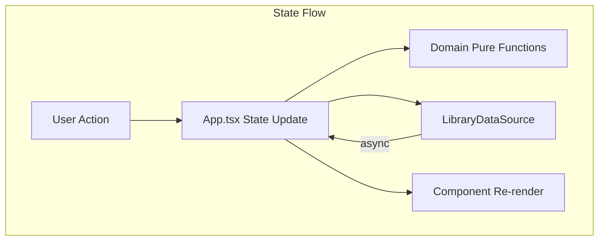

# Specification: Cohort Workbench Prototype

**Created**: 2026-06-02
**Status**: Draft
**Design Docs**: [docs/design/cohort-workbench.md](../../design/cohort-workbench.md)

## Scope

**What part of the design is being implemented:**
This spec documents the existing Cohort Workbench Prototype React/TypeScript
application in its entirety. It covers the domain layer, data layer, component
layer, and the `App.tsx` orchestrator. The application is a backfilled
prototype — this spec describes what the code currently does, not what it
should do.

**Out of scope for this spec:**
- The BODAQS Python Library API service (documented separately in
  `docs/analysis/web-app/Python_Library_Adapter_Implementation_Plan.md`)
- The BODAQS analysis Python package
- Firmware, hardware, or mechanical components
- Future phases described in the roadmap (charting, event/metric exploration,
  static bundles, remote services)

## Design Context

### Relevant Invariants

- **INV-1**: Session identity is `libraryId|||sessionKey`.
- **INV-2**: Session key is `runId::sessionId`.
- **INV-3**: Study Set save requires trimmed display name + ≥1 session.
- **INV-4**: Groupings are Study Set-local, may overlap, pruned when empty.
- **INV-5**: Tracks are reusable library objects, referenced by ID.
- **INV-6**: "Analyze now" creates a temporary one-session Study Set.
- **INV-7**: Dirty tracking via `JSON.stringify` of normalized Study Sets.
- **INV-8**: Revision increments on each save (starts at 1).
- **INV-9**: Prototype-origin filters cannot be deleted.
- **INV-10**: Column normalization prepends locked columns (currently empty).
- **INV-11**: Data source fallback is one-directional (API → fixture).
- **INV-12**: `beforeunload` intercepted when Study Set is dirty.
- **INV-13**: Library root change blocked when Study Set is dirty.
- **INV-14**: Filtering pipeline: library scope → saved filters → table filters → search → sort.
- **INV-15**: Selection gestures: click (replace), Ctrl/Cmd (toggle), Shift (range).

### Relevant Contracts

- `LibraryDataSource` interface — required and optional methods
- `LocalApiDataSource` — HTTP client mapping snake_case API to domain types
- `FixtureLibraryDataSource` — in-memory mock with revision tracking
- Domain pure functions in `src/domain/` — no side effects, no I/O

### Relevant Failure Modes

- Local API unavailable → fixture fallback (handled)
- Trackpoint query polling timeout → silent stop in App.tsx (unhandled)
- MapLibre init failure → uncaught crash (unhandled)
- Revision conflict → error message, state preserved (partial)

---

## Component Specifications

### App Orchestrator — `src/App.tsx`

**Design doc reference:** [App.tsx — Main Orchestrator](../../design/cohort-workbench.md#apptsx--main-orchestrator)
**Depends on:** LibraryDataSource, FixtureLibraryDataSource, LocalApiDataSource, all domain modules, all components

#### Interface Signatures

The App component is the default export. It takes no props and manages all
state internally.

```typescript
export default function App(): JSX.Element
```

Internal types:

```typescript
type PendingStudySetAction =
  | { kind: 'load'; studySet: StudySet }
  | { kind: 'analyze-now'; session: SessionRecord }
  | { kind: 'clear' }

type GeoFilterQueryState = {
  key: string
  label: string
  status: 'queued' | 'running' | 'completed' | 'cancelled' | 'failed'
  candidateSessionCount: number
  processedSessionCount: number
  matchedSessionCount: number
  matchedSessionIds: string[]
  error: string
}
```

#### Validation Rules

| Field | Rule | Error |
|-------|------|-------|
| Study Set display name | Must be non-empty after trim before save | Status message: "Name the Study Set before saving." |
| Study Set sessions | Must have ≥1 session before save | Status message: "Add at least one session before saving a Study Set." |
| Library root input | Must be non-empty before apply | Status message: "Enter a local libraries root path before selecting a root." |
| Study Set dirty state | Must not be dirty when changing library root | Status message: "Save, discard, or clear the current Study Set before changing library roots." |
| Primary session | Must exist before "Analyze now" | Status message: "Choose a primary session before using Analyze now." |

#### Error Specifications

| Error | When | Payload | Caller must |
|-------|------|---------|-------------|
| Local API unavailable | `getHealth()` or `fetchWorkbenchData()` throws | Error message string | Fall back to fixture data source |
| Study Set save failure | `saveStudySet()` throws | Error message string | Show in status bar, preserve current state |
| Library root change failure | `setLibrariesRoot()` or `fetchWorkbenchData()` throws | Error message string | Show in status bar, preserve current state |
| Trackpoint query failure | `createTrackpointMatchQuery()` or polling throws | Error message string | Set query state to 'failed' with error |
| Track match preview failure | `listTrackMatches()` throws | Error message string | Show in status bar, clear track matches |

#### Acceptance Criteria

- **AC1:** Given the app starts with a reachable local API, when `getHealth()`
  succeeds, then libraries/sessions/tracks/studySets are loaded from the API
  and `connectionMode` is `'local-api'`.
- **AC2:** Given the app starts with an unreachable local API, when
  `getHealth()` throws, then fixture data is loaded, `connectionMode` is
  `'fixture'`, and the status message includes the API error.
- **AC3:** Given a dirty Study Set, when the user attempts to load another
  Study Set, then an `UnsavedChangesDialog` is shown with Save/Discard/Cancel
  options.
- **AC4:** Given a dirty Study Set, when the user attempts to navigate away
  (beforeunload), then the browser shows a confirmation prompt.
- **AC5:** Given a dirty Study Set, when the user attempts to change the
  library root, then the operation is blocked with a status message.
- **AC6:** Given sessions are selected in the catalog, when "Add to Study Set"
  is clicked, then those sessions are appended to the current Study Set
  (duplicates skipped) and the Study Set is marked dirty.
- **AC7:** Given a primary session exists, when "Analyze now" is clicked, then
  a temporary one-session Study Set is created and the analyze modal opens.
- **AC8:** Given the current Study Set has a name and sessions, when "Save" is
  clicked, then `saveStudySet` is called, the saved Study Set replaces the
  current one, `lastCommittedStudySet` is updated, and the saved Study Sets
  list is refreshed.
- **AC9:** Given active trackpoint crossing filters, when the data source
  supports trackpoint queries, then queries are created, polled at 500 ms
  intervals (max 120 attempts), and matched session IDs are collected via
  paged results.
- **AC10:** Given the data source does not support trackpoint queries, when
  trackpoint filters are active, then query states are immediately set to
  `'failed'` with an explanatory error.

#### Integration Points

| Dependency | Call | Expected response | Error handling |
|------------|------|-------------------|----------------|
| `LocalApiDataSource` | `getHealth()` | `{ libraries_root?: string }` | Fall back to fixture |
| `LocalApiDataSource` | `setLibrariesRoot(path)` | `{ libraries_root?, library_count? }` | Show error in status |
| `LibraryDataSource` | `listLibraries()` | `LibraryRecord[]` | Fall back or show error |
| `LibraryDataSource` | `listSessions()` | `SessionRecord[]` | Fall back or show error |
| `LibraryDataSource` | `listTracks()` | `TrackRecord[]` | Fall back or show error |
| `LibraryDataSource` | `listStudySets()` | `StudySet[]` | Fall back or show error |
| `LibraryDataSource` | `saveStudySet(studySet)` | `StudySet` (with id, revision) | Show error, preserve state |
| `LibraryDataSource` | `listTrackMatches?(studySet)` | `SessionTrackMatchRecord[]` | Show error, clear matches |
| `LibraryDataSource` | `createTrackpointMatchQuery?(req)` | `TrackpointMatchQueryRecord` | Set query state to 'failed' |
| `LibraryDataSource` | `loadTrackpointMatchQuery?(id)` | `TrackpointMatchQueryRecord` | Set query state to 'failed' |
| `LibraryDataSource` | `loadTrackpointMatchQueryResults?(id, cursor, limit)` | `TrackpointMatchQueryResults` | Set query state to 'failed' |

#### Performance Constraints

| Metric | Target | How verified |
|--------|--------|--------------|
| Initial load | < 3s to first data | Manual testing (no benchmark) |
| Trackpoint poll interval | 500 ms | Code inspection |
| Max trackpoint poll attempts | 120 (60 s timeout) | Code inspection |

---

### LibraryDataSource Interface — `src/data/LibraryDataSource.ts`

**Design doc reference:** [LibraryDataSource — Data Source Interface](../../design/cohort-workbench.md#librarydatasource--data-source-interface)
**Depends on:** domain/types, domain/sessionFilters

#### Interface Signatures

```typescript
export interface LibraryDataSource {
  listLibraries(): Promise<LibraryRecord[]>
  listSessions(): Promise<SessionRecord[]>
  listTracks(): Promise<TrackRecord[]>
  listStudySets(): Promise<StudySet[]>
  listSavedSessionFilters?(): Promise<SavedSessionFilterRecord[]>
  saveStudySet(studySet: StudySet): Promise<StudySet>
  saveSavedSessionFilter?(filter: SavedSessionFilterRecord): Promise<SavedSessionFilterRecord>
  deleteSavedSessionFilter?(filterId: string): Promise<void>
  saveTrack?(track: TrackRecord): Promise<TrackRecord>
  deleteTrack?(trackId: string): Promise<void>
  listTrackMatches?(studySet: StudySet): Promise<SessionTrackMatchRecord[]>
  createTrackpointMatchQuery?(request: TrackpointMatchQueryRequest): Promise<TrackpointMatchQueryRecord>
  loadTrackpointMatchQuery?(queryId: string): Promise<TrackpointMatchQueryRecord>
  loadTrackpointMatchQueryResults?(queryId: string, cursor?: string | null, limit?: number): Promise<TrackpointMatchQueryResults>
  cancelTrackpointMatchQuery?(queryId: string): Promise<TrackpointMatchQueryRecord>
  loadSessionGpsPoints?(session: SessionRecord, sourceId?: string | null): Promise<SessionGpsPointSet>
  loadSessionNote?(session: SessionRecord): Promise<SessionNoteRecord>
  saveSessionNote?(note: SessionNoteRecord): Promise<SessionNoteRecord>
}
```

#### Validation Rules

| Field | Rule | Error |
|-------|------|-------|
| Optional methods | Feature-detected with `if (dataSource.method)` before call | UI gracefully disables feature |
| `saveStudySet` input | Study Set must have displayName and sessions (enforced by caller) | Caller shows status message |

#### Acceptance Criteria

- **AC1:** Given a data source that implements all optional methods, when any
  method is called, then the domain-typed response is returned.
- **AC2:** Given a data source that omits optional methods, when the UI checks
  for the method, then the feature is disabled (e.g., no save button, no
  trackpoint query).
- **AC3:** Given `saveStudySet` is called with a Study Set having `id: null`,
  then the data source creates a new Study Set and returns it with an ID and
  revision 1.

---

### LocalApiDataSource — `src/data/LocalApiDataSource.ts`

**Design doc reference:** [LocalApiDataSource — HTTP Client](../../design/cohort-workbench.md#localapidatasource--http-client)
**Depends on:** LibraryDataSource, domain/types, domain/studySets, domain/sessionFilters, domain/geospatial

#### Interface Signatures

```typescript
export class LocalApiDataSource implements LibraryDataSource {
  readonly baseUrl: string
  constructor(baseUrl?: string)
  async getHealth(): Promise<{ libraries_root?: string }>
  async setLibrariesRoot(librariesRoot: string): Promise<{ libraries_root?: string; library_count?: number }>
  // ... all LibraryDataSource methods
}
```

#### Validation Rules

| Field | Rule | Error |
|-------|------|-------|
| Base URL | From `VITE_BODAQS_LIBRARY_API_URL` env or `http://127.0.0.1:8765` | N/A |
| HTTP response | Non-OK status throws Error | Error message from API `error.message` or HTTP status |
| API object mapping | All fields mapped with fallbacks (`textValue`, `numberValue`) | Missing fields default to empty/0 |

#### Error Specifications

| Error | When | Payload | Caller must |
|-------|------|---------|-------------|
| HTTP error | Response status not OK | `Error(message)` where message is API error or HTTP status | Catch and show to user |
| JSON parse error | Response body is not valid JSON | `Error` from `response.json()` | Caught in `requestJson` try/catch, falls back to HTTP status |

#### Acceptance Criteria

- **AC1:** Given the API is reachable, when `listLibraries()` is called, then
  `GET /api/v1/libraries` is called and the response is mapped to
  `LibraryRecord[]`.
- **AC2:** Given `listSessions()` is called, then all library catalogs are
  fetched in parallel via `Promise.all` and sessions are extracted from
  `catalog.rows`.
- **AC3:** Given `saveStudySet` is called with `id: null`, then `POST
  /api/v1/study-sets` is used. Given `id` is set, then `PUT
  /api/v1/study-sets/{id}` is used with `expected_revision`.
- **AC4:** Given a non-OK HTTP response, when the body contains
  `{ error: { message: "..." } }`, then the thrown Error message is the API
  error message.
- **AC5:** Given a non-OK HTTP response with unparseable body, then the thrown
  Error message is `{status} {statusText}`.

#### Integration Points

| Dependency | Call | Expected response | Error handling |
|------------|------|-------------------|----------------|
| BODAQS Library API | `GET /api/v1/health` | `{ libraries_root?: string }` | Throw Error |
| BODAQS Library API | `POST /api/v1/config/libraries-root` | `{ libraries_root?, library_count? }` | Throw Error |
| BODAQS Library API | `GET /api/v1/libraries` | `ApiObject[]` | Throw Error |
| BODAQS Library API | `GET /api/v1/libraries/{id}/catalog` | `{ rows: ApiObject[] }` | Throw Error |
| BODAQS Library API | `GET /api/v1/study-sets` | `ApiObject[]` (summaries) | Throw Error |
| BODAQS Library API | `GET /api/v1/study-sets/{id}` | `ApiObject` (full) | Throw Error |
| BODAQS Library API | `POST /api/v1/study-sets` | `ApiObject` (created) | Throw Error |
| BODAQS Library API | `PUT /api/v1/study-sets/{id}` | `ApiObject` (updated) | Throw Error |
| BODAQS Library API | `GET /api/v1/tracks` | `ApiObject[]` | Throw Error |
| BODAQS Library API | `POST/PUT /api/v1/tracks[/{id}]` | `ApiObject` | Throw Error |
| BODAQS Library API | `DELETE /api/v1/tracks/{id}` | void | Throw Error |
| BODAQS Library API | `POST /api/v1/track-matches/query` | `{ matches: ApiObject[] }` | Throw Error |
| BODAQS Library API | `POST /api/v1/trackpoint-match-queries` | `ApiObject` | Throw Error |
| BODAQS Library API | `GET /api/v1/trackpoint-match-queries/{id}` | `ApiObject` | Throw Error |
| BODAQS Library API | `GET /api/v1/trackpoint-match-queries/{id}/results` | `ApiObject` | Throw Error |
| BODAQS Library API | `DELETE /api/v1/trackpoint-match-queries/{id}` | `ApiObject` | Throw Error |
| BODAQS Library API | `POST /api/v1/libraries/{id}/sessions/gps/points` | `ApiObject` | Throw Error |
| BODAQS Library API | `POST /api/v1/libraries/{id}/sessions/note` | `ApiObject` | Throw Error |
| BODAQS Library API | `PUT /api/v1/libraries/{id}/sessions/note` | `ApiObject` | Throw Error |
| BODAQS Library API | `GET/POST/PUT/DELETE /api/v1/session-filters[/{id}]` | `ApiObject` or void | Throw Error |

---

### FixtureLibraryDataSource — `src/data/FixtureLibraryDataSource.ts`

**Design doc reference:** [FixtureLibraryDataSource — In-Memory Mock](../../design/cohort-workbench.md#fixturelibrarydatasource--in-memory-mock)
**Depends on:** LibraryDataSource, fixtures, domain/studySets, domain/sessionFilters, domain/types

#### Interface Signatures

```typescript
export class FixtureLibraryDataSource implements LibraryDataSource {
  // All LibraryDataSource methods implemented
  // In-memory state: savedStudySets, savedFilters, trackpointQueries, sessions, notes, tracks
}
```

#### Validation Rules

| Field | Rule | Error |
|-------|------|-------|
| Study Set ID | Generated via `slugify(displayName)` + `uniqueId` | N/A |
| Track ID | Generated via `slugify(name)` + `uniqueId` or existing ID | N/A |
| Trackpoint query | Track must exist; if not, status is `'failed'` | Error: "Fixture track not found." |
| Filter delete | Only `origin: 'api_saved'` filters can be deleted (enforced by caller) | N/A |

#### Acceptance Criteria

- **AC1:** Given `saveStudySet` is called with a new Study Set, then a
  slug-based ID is generated, revision is set to 1, and the Study Set is
  stored in memory.
- **AC2:** Given `saveStudySet` is called with an existing Study Set ID, then
  revision is incremented and the stored Study Set is replaced.
- **AC3:** Given `createTrackpointMatchQuery` is called with a valid track ID,
  then the query completes synchronously with status `'completed'` using
  pre-computed `matchSummaries`.
- **AC4:** Given `createTrackpointMatchQuery` is called with an unknown track
  ID, then the query has status `'failed'` with error "Fixture track not
  found."
- **AC5:** Given `saveSessionNote` is called, then the in-memory session's
  `bike`, `rider`, and `noteStatus` fields are updated.
- **AC6:** Given `loadSessionGpsPoints` is called, then GPS points are
  returned from the session's inline `gps` array with synthetic `timeS` values
  (index-based).

---

### Domain Layer — `src/domain/`

**Design doc reference:** [Domain Layer](../../design/cohort-workbench.md#high-level-architecture)
**Depends on:** Nothing (pure functions and types)

#### types.ts

All TypeScript type definitions for the application. No runtime code — type
exports only.

Key types: `SessionRecord`, `StudySet`, `StudySessionRef`, `StudyGrouping`,
`TrackRecord`, `TrackpointRecord`, `LibraryRecord`, `SessionNoteRecord`,
`SessionGpsSummary`, `SessionGpsPointSet`, `TrackpointMatchQueryRecord`,
`TrackpointMatchQueryResults`, `ColumnId`, `ModalState`, and various enum-like
union types.

#### studySets.ts

Pure functions for Study Set manipulation:

```typescript
export function candidateId(session: SessionRecord): string
export function sessionRefId(sessionRef: StudySessionRef): string
export function sessionToStudyRef(session: SessionRecord): StudySessionRef
export function sessionByRef(sessionRef: StudySessionRef, sessions: SessionRecord[]): SessionRecord | undefined
export function emptyStudySet(): StudySet
export function cloneStudySet(studySet: StudySet): StudySet
export function hasStudySetContent(studySet: StudySet): boolean
export function isTemporaryStudySet(studySet: StudySet): boolean
export function studySetsEqual(a: StudySet, b: StudySet): boolean
export function slugify(value: string): string
export function uniqueId(base: string, existingIds: string[]): string
```

#### sessionCatalog.ts

Column definitions, presets, sorting, and search:

```typescript
export function normalizeColumnSelection(columns: ColumnId[]): ColumnId[]
export function libraryName(libraries: LibraryRecord[], libraryId: string): string
export function getColumnText(session: SessionRecord, columnId: ColumnId, libraries: LibraryRecord[]): string
export function sortSessions(input: SessionRecord[], columnId: ColumnId, direction: SortDirection, libraries: LibraryRecord[]): SessionRecord[]
export function matchesSearch(session: SessionRecord, text: string, visibleColumns: ColumnId[], libraries: LibraryRecord[]): boolean
```

Constants: `columnLabels`, `allColumns`, `lockedColumns` (empty), `defaultColumns`,
`columnGroups`, `columnPresets`.

#### sessionFilters.ts

Saved filter predicates and application logic:

```typescript
export function applySavedSessionFilters(sessions: SessionRecord[], filters: SavedSessionFilterRecord[], options?: {...}): SessionRecord[]
export function trackpointCrossingSpecsForFilters(filters: SavedSessionFilterRecord[], libraryIds: string[]): TrackpointCrossingSpec[]
export function savedFilterCategoryLabel(category: string): string
```

Constants: `prototypeSavedSessionFilters` (11 prototype filters).

Predicate operators: `contains`, `eq`, `in`, `present`, `matches` (for
trackpoint crossing). Logical operators: `and`, `or` (via `children` arrays).

#### tableFilters.ts

Table column filter application:

```typescript
export function applyTableColumnFilters(sessions: SessionRecord[], filters: TableColumnFilter[], libraries: LibraryRecord[]): SessionRecord[]
export function tableColumnFilterOptions(sessions: SessionRecord[], columnId: ColumnId, libraries: LibraryRecord[]): string[]
export function tableFilterLabel(columnId: ColumnId, libraries: LibraryRecord[], value: string): string
```

#### geospatial.ts

GPS quality and track match helpers:

```typescript
export function gpsQualityLabel(quality: GpsQuality): string
export function gpsQualityTone(quality: GpsQuality): 'good' | 'warning' | 'alert'
export function gpsSourceLabel(value: GpsSourceKind | null): string
export function gpsSummaryLine(summary: SessionGpsSummary): string
export function studySetGpsAdequacy(studySet: StudySet, sessions: SessionRecord[]): { sessionCount, usableCount, limitedCount, absentCount, averageCoverageRatio }
export function trackMatchForSession(track: TrackRecord, session: SessionRecord): SessionTrackMatchRecord | undefined
export function crossedTrackpointCount(track: TrackRecord, session: SessionRecord): number
export function formatPercent(value: number): string
```

#### routes.ts

SVG path projection for the (currently unused) `RoutePreview` component:

```typescript
export function projectPaths(paths: RoutePath[]): RoutePath[]
```

Projects GPS coordinates into a 320×260 SVG viewBox.

#### trackGeometry.ts

Haversine-based geospatial calculations:

```typescript
export function routeLengthM(points: Array<[number, number]>): number
export function pointAtStationM(points: Array<[number, number]>, stationM: number): [number, number]
```

Uses Earth radius 6,371,000 m. `pointAtStationM` interpolates along the path
by cumulative distance, clipping to the first/last point if out of range.

#### Acceptance Criteria

- **AC1:** Given two Study Sets with identical content, when
  `studySetsEqual` is called, then `true` is returned.
- **AC2:** Given a Study Set with `provenance` starting with "Temporary
  one-session Study Set", when `isTemporaryStudySet` is called, then `true`
  is returned.
- **AC3:** Given `slugify("My Study Set!")`, then the result is
  `"my-study-set"`.
- **AC4:** Given `uniqueId("my-study-set", ["my-study-set"])`, then the result
  is `"my-study-set-2"`.
- **AC5:** Given sessions filtered by `applySavedSessionFilters` with multiple
  active filters, then only sessions matching ALL filters (AND logic) are
  returned.
- **AC6:** Given a trackpoint crossing filter with pending query status, when
  `applySavedSessionFilters` is called, then all sessions pass the trackpoint
  predicate (permissive while pending).
- **AC7:** Given `sortSessions` with `columnId: 'started'` and `direction:
  'desc'`, then sessions are sorted by formatted start time in descending
  order using `localeCompare` with `numeric: true`.

---

### SessionTable — `src/components/SessionTable.tsx`

**Design doc reference:** [SessionTable — Catalog Table](../../design/cohort-workbench.md#sessiontable--catalog-table)
**Depends on:** @tanstack/react-table, domain/sessionCatalog, domain/studySets, domain/tableFilters, SessionInfoButtons

#### Interface Signatures

```typescript
export type SessionSelectionGesture = {
  extendRange: boolean
  toggle: boolean
}

export function SessionTable(props: {
  sessions: SessionRecord[]
  filterBaseSessions: SessionRecord[]
  libraries: LibraryRecord[]
  visibleColumns: ColumnId[]
  tableColumnFilters: TableColumnFilter[]
  selectedIds: string[]
  primaryId: string | null
  sortColumn: ColumnId
  sortDirection: SortDirection
  onTableColumnFilterChange: (columnId: ColumnId, values: string[]) => void
  onClearTableColumnFilter: (columnId: ColumnId) => void
  onSort: (columnId: ColumnId) => void
  onSelect: (session: SessionRecord, gesture: SessionSelectionGesture) => void
  onInspect: (session: SessionRecord, tab: SessionInspectionTab) => void
}): JSX.Element
```

#### Acceptance Criteria

- **AC1:** Given visible sessions, when a column header sort button is clicked,
  then `onSort` is called with that column ID.
- **AC2:** Given a column filter menu is open, when the user clicks outside the
  menu, then the menu closes.
- **AC3:** Given a row is clicked, then `onSelect` is called with
  `{ extendRange: false, toggle: false }`.
- **AC4:** Given Ctrl/Cmd is held and a row is clicked, then `onSelect` is
  called with `{ extendRange: false, toggle: true }`.
- **AC5:** Given Shift is held and a row is clicked, then `onSelect` is called
  with `{ extendRange: true, toggle: false }`.
- **AC6:** Given the "Info" cell is clicked, then the row's `onSelect` is not
  triggered (event propagation stopped).

---

### GeospatialWorkbench — `src/components/GeospatialWorkbench.tsx`

**Design doc reference:** [GeospatialWorkbench — Track & Trackpoint Manager](../../design/cohort-workbench.md#geospatialworkbench--track--trackpoint-manager)
**Depends on:** domain/geospatial, domain/studySets, domain/trackGeometry, LibraryDataSource, Common, StatusBadges, GpsRoutePreview

#### Interface Signatures

```typescript
export function GeospatialWorkbench(props: {
  primarySession: SessionRecord | null
  currentStudySet: StudySet
  sessions: SessionRecord[]
  tracks: TrackRecord[]
  selectedTrackIds: string[]
  currentStudyTracks: TrackRecord[]
  dataSource: LibraryDataSource
  onToggleTrack: (trackId: string) => void
  onAttachSelectedTracks: () => void
  onInspectTrack: (track: TrackRecord) => void
  onTrackSaved: (track: TrackRecord) => void
  onTrackDeleted: (trackId: string) => void
}): JSX.Element
```

#### Acceptance Criteria

- **AC1:** Given a primary session with GPS data and a data source that
  supports `loadSessionGpsPoints` and `saveTrack`, when "Create from primary
  GPS" is clicked, then GPS points are loaded, route length is calculated, and
  a new track is saved with source metadata.
- **AC2:** Given an active track, when a trackpoint is added with a station
  distance, then the station is clipped to `[0, track.lengthM]`, the position
  is interpolated via `pointAtStationM`, and the trackpoint is inserted in
  station-sorted order.
- **AC3:** Given an active track with trackpoints, when "Run trackpoint query"
  is clicked, then a query is created with `matchMode: 'all'` and
  `toleranceM: 5`, polled at 300 ms intervals (max 40 attempts), and results
  are displayed.
- **AC4:** Given the data source does not support trackpoint queries, when
  "Run trackpoint query" is clicked, then a message is shown: "Current data
  source cannot run trackpoint match queries."

---

### GpsRoutePreview / MapRoutePreview — `src/components/GpsRoutePreview.tsx`, `src/components/MapRoutePreview.tsx`

**Design doc reference:** [GpsRoutePreview / MapRoutePreview — Map Components](../../design/cohort-workbench.md#gpsroutepreview--maproutepreview--map-components)
**Depends on:** maplibre-gl, domain/geospatial, domain/types, LibraryDataSource, MapRoutePreview

#### Acceptance Criteria

- **AC1:** Given a session with GPS data and a data source supporting
  `loadSessionGpsPoints`, when the component mounts, then GPS points are
  loaded and displayed on the MapLibre map.
- **AC2:** Given `loadSessionGpsPoints` is unavailable or fails, when GPS
  points are requested, then the component falls back to the session's inline
  `gps` array and shows an error status.
- **AC3:** Given a session with multiple GPS sources, when the source selector
  is changed, then GPS points are reloaded for the selected source.
- **AC4:** Given the map is rendered, when the resize handle is dragged, then
  the map height changes between 220 px and 720 px and the MapLibre map
  resizes via `map.resize()`.
- **AC5:** Given no session or track is selected, when the component renders,
  then an empty-state message is shown: "Select a session or track to preview
  GPS context."

---

### SessionNoteEditorModal — `src/components/SessionNoteEditorModal.tsx`

**Design doc reference:** [SessionNoteEditorModal — Note Editor](../../design/cohort-workbench.md#sessionnoteeditormodal--note-editor)
**Depends on:** LibraryDataSource, domain/studySets, domain/types, Common, StatusBadges

#### Acceptance Criteria

- **AC1:** Given a session and a data source with `loadSessionNote`, when the
  modal mounts, then the note is loaded and displayed in the editor.
- **AC2:** Given `loadSessionNote` is unavailable or fails, when the modal
  mounts, then a fallback note is generated from the session data and an error
  is shown.
- **AC3:** Given the note has template fields, when rendered, then fields are
  grouped by section in a fixed order: overview, bike, front, rear, notes,
  custom.
- **AC4:** Given a field of type `bool`, when rendered, then a checkbox is
  shown. Given `enum`, a select. Given `multi_enum`, checkboxes. Given `text`,
  a textarea. Given `int`/`float`, a numeric input. Given `date`, a date
  input. Given `string`, a text input.
- **AC5:** Given the user clicks "Save note", when `saveSessionNote` succeeds,
  then the saved note replaces the draft, `onSaved` is called with the updated
  session record (bike, rider, noteStatus), and a success message is shown.
- **AC6:** Given the save fails, when the error is caught, then the draft is
  preserved and an error message is shown.

---

### FilterManagerModal — `src/components/FilterManagerModal.tsx`

**Design doc reference:** [FilterManagerModal — Filter Builder](../../design/cohort-workbench.md#filtermanagermodal--filter-builder)
**Depends on:** domain/sessionFilters, domain/types, lucide-react

#### Acceptance Criteria

- **AC1:** Given the visual builder is active, when conditions are added, then
  each condition maps to a `SessionFilterField` with field-specific operators
  and value inputs.
- **AC2:** Given a trackpoint crossing condition, when configured, then track,
  trackpoints, match mode, tolerance, and min count are captured.
- **AC3:** Given the advanced JSON mode, when invalid JSON is entered, then a
  parse error is shown and the filter is not saved.
- **AC4:** Given mode switching from visual to advanced, when the switch
  occurs, then the current visual builder state is serialized to JSON.
- **AC5:** Given mode switching from advanced to visual, when the JSON is too
  complex for the visual builder, then the mode stays advanced with a message:
  "That JSON is too complex for this visual builder."
- **AC6:** Given the user clicks "Save filter", when the filter is new, then
  it is saved with `origin: 'api_saved'` and `revision: 0`. When existing, it
  is saved with the existing ID and origin.

---

## Implementation Approach

### High-Level Architecture

The application follows a single-orchestrator pattern where `App.tsx` owns all
state and passes props to child components. The domain layer contains pure
functions with no side effects. The data layer provides a swappable interface
with two implementations (local API and fixture). Components are presentational
with callbacks for user actions.



### Key Decisions

| Decision | Choice | Rationale |
|----------|--------|-----------|
| State management | Single orchestrator (App.tsx) | Explicit data flow, no library dependency, simple for prototype |
| Data source boundary | Interface with optional methods | Allows fixture to omit capabilities; feature-detected at call sites |
| Table rendering | TanStack Table with manual sorting | Leverages table library for row model while keeping sort logic in domain |
| Map rendering | MapLibre GL with OSM raster | Free, no API key, WebGL-accelerated, supports GeoJSON sources |
| Dirty tracking | JSON.stringify comparison | Simple deep comparison without external library |
| Filter predicates | Recursive union type (and/or/leaf) | Supports complex nested predicates; visual builder handles common cases |
| API mapping | Dedicated map* functions per entity | Explicit snake_case → camelCase conversion with fallbacks |

### Research

- The BODAQS Library API contract is documented in
  `docs/analysis/contracts/BODAQS_Library_API_Contract_v0_draft.md`.
- The prototype handoff doc
  (`docs/analysis/web-app/BODAQS_Web_Application_Prototype_Handoff.md`)
  describes the initial setup and intended structure.
- The roadmap
  (`docs/analysis/web-app/BODAQS_Web_Application_Roadmap.md`) describes future
  phases including charting, event/metric exploration, and deployment modes.

### Alternatives Considered

| Alternative | Why not chosen |
|-------------|----------------|
| Redux/Zustand for state | Overkill for prototype; single orchestrator is simpler |
| React Context for data source | Adds indirection; prop drilling is manageable at this scale |
| Server-side rendering | Not needed for local-first prototype |
| CSS-in-JS | Plain CSS files used; simpler for prototype |
| D3 for table rendering | TanStack Table provides better table primitives |
| Observable Plot for maps | MapLibre GL provides better map interaction (pan, zoom, layers) |

## Dependencies

### Design Dependencies

- [docs/design/cohort-workbench.md](../../design/cohort-workbench.md) — this spec's design doc

### Spec Dependencies

- None — this is a backfill of existing code

### Package Dependencies

| Package | Version | Purpose |
|---------|---------|---------|
| `react` | ^19.2.6 | UI framework |
| `react-dom` | ^19.2.6 | React DOM renderer |
| `@tanstack/react-table` | ^8.21.3 | Table rendering and row model |
| `maplibre-gl` | ^5.24.0 | Interactive map rendering |
| `lucide-react` | ^1.17.0 | Icon set |
| `d3` | ^7.9.0 | Installed but not directly imported in src/ (available for future charting) |
| `uplot` | ^1.6.32 | Installed but not directly imported in src/ (available for future time-series) |
| `@observablehq/plot` | ^0.6.17 | Installed but not directly imported in src/ (available for future charting) |
| `@turf/turf` | ^7.3.5 | Installed but not directly imported in src/ (available for future geospatial) |
| `vite` | ^8.0.12 | Build tool and dev server |
| `typescript` | ~6.0.2 | Type checking |
| `eslint` | ^10.3.0 | Linting |

## Open Questions

| # | Question | Blocks | Resolution |
|---|----------|--------|------------|
| 1 | Trackpoint poll timeout in App.tsx (120 attempts, no user message) — intentional? | None | UNRESOLVED (unverified intent — needs review) |
| 2 | Trackpoint poll timeout in GeospatialWorkbench (40 attempts) — different from App.tsx | None | UNRESOLVED (unverified intent — needs review) |
| 3 | RoutePreview.tsx (SVG) appears unused — legacy? | None | UNRESOLVED (unverified intent — needs review) |
| 4 | lockedColumns is empty — placeholder for future? | None | UNRESOLVED (unverified intent — needs review) |
| 5 | eslint-disable for react-hooks/incompatible-library in SessionTable — safe? | None | UNRESOLVED (unverified intent — needs review) |
| 6 | d3, uplot, @observablehq/plot, @turf/turf installed but unused — intended for future phases? | None | UNRESOLVED (likely intentional per handoff doc) |

## Risks

| Risk | Mitigation |
|------|------------|
| App.tsx is ~1750 lines with ~40 state vars — hard to maintain | Future refactor could extract state into custom hooks or context |
| No test framework installed — regressions not caught | Add Vitest for domain functions; Playwright for UI |
| MapLibre init failure crashes component | Add error boundary around map components |
| Trackpoint poll timeout is silent | Add user-facing timeout message |
| JSON.stringify dirty comparison is O(n) per render | Acceptable for prototype; could use structural sharing later |
| No retry logic for API calls | Acceptable for prototype; could add retry with backoff |

## Success Criteria

This is a backfill spec documenting existing behavior. Success criteria verify
the docs match the code:

- [x] Design doc accurately describes the component architecture (verified against source)
- [x] All 15 invariants match code behavior (verified against source)
- [x] All failure modes match code behavior (verified against source)
- [x] All component contracts match actual interfaces (verified against source)
- [x] Data model matches type definitions in types.ts (verified against source)
- [x] API endpoint mapping in LocalApiDataSource matches actual fetch calls (verified against source)
- [x] Filtering pipeline order matches App.tsx render logic (verified against source)
- [x] Study Set state machine matches App.tsx state transitions (verified against source)
- [x] 5 ambiguities classified as "Unknown" (unverified intent — needs review)
