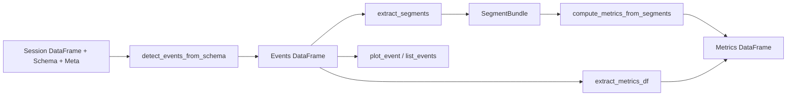

# Specification: Event Detection & Metrics

**Created**: 2025-01-23
**Status**: Draft
**Design Docs**: [docs/design/event-detection-metrics.md](../../design/event-detection-metrics.md)

## Scope

**What part of the design is being implemented:**
This spec documents the existing Event Detection & Metrics system as it
currently behaves. It covers four components in `analysis/bodaqs_analysis/`:

- `detect.py` — Event detection from schemas (trigger engines, expansion,
  conditions, debounce, inline metrics, event row emission)
- `segment.py` — Segment extraction from sessions (role resolution, index
  computation, array materialization)
- `metrics.py` — Metrics extraction and computation (legacy projection,
  SegmentBundle-based computation)
- `event_view.py` — Event visualization and listing (notebook-oriented)

**Out of scope for this spec:**
- Signal preprocessing (filtering, resampling, motion derivation) — handled by
  `pipeline.py`, `preprocess_filters.py`, `motion_derivation.py`
- Artifact persistence — handled by `artifacts.py`
- Cross-session aggregation — handled by `library/aggregations.py`
- Schema parsing and validation — handled by `schema.py` (documented as a
  dependency)
- Event/metrics DataFrame validation — handled by `model.py` (documented as a
  dependency)

## Design Context

### Relevant Invariants

- **INV-1**: Every event row has a unique `(session_id, event_id)` pair.
- **INV-2**: `start_idx <= trigger_idx <= end_idx` for every event row.
- **INV-3**: `start_time_s <= trigger_time_s <= end_time_s` for every event row.
- **INV-4**: `session_id` must be present in `meta` and injected into every event row.
- **INV-5**: Each semantic input role must resolve to exactly one signal.
- **INV-6**: Events must define semantic `inputs`.
- **INV-7**: SegmentBundle data arrays have shape `(n_valid_segments, n_samples)`.
- **INV-8**: Metrics DataFrame columns are prefixed `m_` or `d_`; forbidden columns excluded.
- **INV-9**: `time_s` must be present, numeric, finite, and monotonic non-decreasing.
- **INV-10**: `extract_segments` processes one schema_id at a time.
- **INV-11**: Role resolution in segment extraction is per-event-row.
- **INV-12**: Ambiguous role resolution raises `ValueError`.
- **INV-13**: Metric conditions fail closed.
- **INV-14**: Events DataFrame sorted by `["schema_id", "trigger_idx"]`.
- **INV-15**: `params_hash` is SHA-256 of resolved event definition + schema version.
- **INV-16**: `detector_version` is always `"schema/v0"`.

### Relevant Contracts

- Event Table Contract v0.1.2 — output schema of `detect_events_from_schema()`
- Metrics Table Contract v0.2 — output schema of metrics computation
- SegmentBundle Contract v0.1.1 — intermediate data structure from
  `extract_segments()`
- Event Schema Specification v0.2.0 — input schema grammar

### Relevant Failure Modes

- Missing `session_id` → hard failure (ValueError)
- Unresolvable input role → event skipped with warning
- Ambiguous input role → hard failure (ValueError)
- Unknown trigger type → event skipped with warning
- Invalid dt → degraded time-based features
- Unresolvable/ambiguous segment role → hard failure (ValueError)
- Non-monotonic `time_s` → hard failure (ValueError)
- Missing triggers in strict metrics mode → hard failure (ValueError)
- `event_view.py` legacy columns missing → runtime KeyError (unhandled)

---

## Component Specifications

### detect_events_from_schema — `analysis/bodaqs_analysis/detect.py`

**Design doc reference:** [Component Contract: detect_events_from_schema](../../design/event-detection-metrics.md#detect_events_from_schema--detectpy)
**Depends on:** `schema.py` (schema parsing), `model.py` (validation), `signal_selectors.py` (semantic matching)

#### Interface Signatures

```python
def detect_events_from_schema(
    df: Optional[pd.DataFrame] = None,
    schema: Optional[Dict[str, Any]] = None,
    *,
    meta: Optional[Dict[str, Any]] = None,
    event_ids: Optional[list[str]] = None,
) -> pd.DataFrame:
```

#### Validation Rules

| Field | Rule | Error |
|-------|------|-------|
| `df` | Must contain `time_s` column | `ValueError` (via `_series_get`) |
| `schema` | Must be a dict with `events` list | `ValueError` (via `_require_inputs`) |
| `meta` | Must contain `session_id` | `ValueError` |
| `meta["signals"]` | Must be a non-empty dict for semantic input resolution | `KeyError` |
| `event_ids` | If provided, filters events by id | No error (empty result if no match) |

#### Error Specifications

| Error | When | Payload | Caller must |
|-------|------|---------|-------------|
| `ValueError` | `meta` missing `session_id` | Message string | Provide `session_id` in meta |
| `ValueError` | Ambiguous input role (multiple matches) | Message with selector and matches | Fix schema or registry |
| `KeyError` | Input role matches zero signals | Message with selector | Skip is automatic; error only if raised |
| `ValueError` | `validate_events_df` fails | Message with violated invariant | Fix detection logic or schema |
| `ValueError` | `session_id` mismatch between existing and meta | Message | Ensure consistent session_id |

#### Acceptance Criteria

- **AC1:** Given a valid session DataFrame, schema, and meta with `session_id`,
  When `detect_events_from_schema` is called,
  Then it returns a DataFrame conforming to Event Table Contract v0.1.2 with
  `session_id` injected into every row.
- **AC2:** Given a schema event with `expand: {end: [rear, front]}`,
  When detection runs,
  Then two event instances are produced (one per expansion context), each with
  inputs resolved to the correct semantic context.
- **AC3:** Given an event whose input role matches zero signals in the registry,
  When detection runs,
  Then that event instance is skipped with a warning log, and other events
  proceed normally.
- **AC4:** Given an event whose input role matches multiple signals,
  When detection runs,
  Then `ValueError` is raised.
- **AC5:** Given `event_ids=["rebounds"]`,
  When detection runs,
  Then only events with `id == "rebounds"` (after expansion) are processed.
- **AC6:** Given a valid Events DataFrame,
  When `validate_events_df` is called at the end,
  Then all invariants (INV-1 through INV-3) pass.
- **AC7:** Given the output DataFrame,
  Then it is sorted by `["schema_id", "trigger_idx"]` and index is reset.

#### Integration Points

| Dependency | Call | Expected response | Error handling |
|------------|------|-------------------|----------------|
| `signal_selectors.selector_matches_signal` | Match signal info against selector | `bool` | Propagated in `_event_input_matches_signal` |
| `model.validate_events_df` | Validate output DataFrame | `None` or raises `ValueError` | `ValueError` propagated to caller |
| `metrics.extract_metrics_df` | Imported but not called during detection | N/A | N/A |

#### Performance Constraints

| Metric | Target | How verified |
|--------|--------|--------------|
| Trigger detection | O(n) per event definition for threshold/phased; O(n) for extrema with SciPy | Code inspection |
| Memory | Proportional to DataFrame size × number of event definitions | Code inspection |

---

### Trigger Engines — `analysis/bodaqs_analysis/detect.py`

**Design doc reference:** [Component Contract: Trigger Engines](../../design/event-detection-metrics.md#trigger-engines--detectpy)
**Depends on:** `detect.py` helpers (`_resolve_search_window`, `_series_get`, `_to_seconds`, `_sec_to_samples_opt`)

#### Interface Signatures

```python
def _trigger_threshold_crossing(
    df: pd.DataFrame, dt: float, ev: dict, base_t0_sec: float | None = None
) -> list[dict]:

def _trigger_local_extrema(
    df: pd.DataFrame, dt: float, ev: dict, base_t0_sec: float | None = None
) -> list[dict]:

def _trigger_phased_threshold_crossing(
    df: pd.DataFrame, dt: float, ev: dict, base_t0_sec: float | None = None
) -> list[dict]:

def _trigger_zero_crossing(
    df: pd.DataFrame, dt: float, ev: dict, base_t0_sec: float | None = None
) -> list[dict]:
```

#### Validation Rules

| Field | Rule | Error |
|-------|------|-------|
| `ev["trigger"]["signal"]` | Must be a key in `ev["inputs"]` | `KeyError` (via `_series_get`) |
| `ev["inputs"][signal]` | Must be a column in `df` | `KeyError` |
| `df["time_s"]` | Must exist and be numeric | `ValueError` (via `_to_seconds`) |

#### Error Specifications

| Error | When | Payload | Caller must |
|-------|------|---------|-------------|
| `KeyError` | Signal name is None | "Series name is None" | Fix trigger.signal config |
| `KeyError` | Series column not in DataFrame | Column name | Fix input resolution |
| (none) | Empty series | Returns `[]` | N/A |

#### Acceptance Criteria

- **AC1 (threshold_crossing):** Given signal `[−3, −1, 1, 3, 2]`, `value=0`,
  `dir="rising"`, `hysteresis=0`,
  When `_trigger_threshold_crossing` runs,
  Then one crossing is detected at index 2 with `trigger_strength=2.0`.
- **AC2 (threshold_crossing hysteresis):** Given `hysteresis=1`,
  When signal rises above value, fires, then dips to `value - 0.5` and rises
  again,
  Then the second rise does NOT fire (not re-armed until `≤ value - hysteresis`).
- **AC3 (local_extrema):** Given signal `[1, 3, 7, 5, 2, 4, 1]`, `kind="max"`,
  When `_trigger_local_extrema` runs with SciPy available,
  Then maxima detected at indices 2 and 5.
- **AC4 (local_extrema fallback):** Given SciPy is unavailable,
  When `_trigger_local_extrema` runs,
  Then the fallback algorithm detects the same extrema using sign-change detection.
- **AC5 (phased_threshold_crossing):** Given signal
  `[−8, −7, −6, −3, −1, 1, 3, 6, 7]`, bands neg.max=−5, zero.min=−2,
  zero.max=2, pos.min=5, `dir="rising"`, dwell_samples=1,
  When `_trigger_phased_threshold_crossing` runs,
  Then one trigger is detected with `t0_index` at the zero band midpoint.
- **AC6 (phased direct sequence):** Given `phase_sequence="neg_pos"` and signal
  stepping directly from neg to pos without landing in zero,
  Then trigger fires with `t0_index` at first sample of final (pos) band.
- **AC7 (search window):** Given `base_t0_sec=5.0`, `search.min_delay_s=−1.0`,
  `search.max_delay_s=1.0`,
  When a secondary trigger runs,
  Then only candidates in `[4.0, 6.0]` seconds are considered.
- **AC8 (edge_ignore):** Given `edge_ignore_s=0.1`, `dt=0.01`,
  When triggers are detected,
  Then triggers within 10 samples of the signal boundaries are discarded.

#### Integration Points

| Dependency | Call | Expected response | Error handling |
|------------|------|-------------------|----------------|
| `scipy.signal.find_peaks` | Peak detection | `(indices, props)` | Fallback algorithm if import fails |
| `_resolve_search_window` | Index bounds for search | `(i0, i1)` tuple | Empty range if invalid |
| `_to_seconds` | Convert time column to seconds | `np.ndarray` float64 | `ValueError` if non-numeric |

---

### Debounce & Secondary Selection — `analysis/bodaqs_analysis/detect.py`

**Design doc reference:** [Component Contract: Debounce & Selection](../../design/event-detection-metrics.md#debounce--selection--detectpy)
**Depends on:** None (pure functions)

#### Interface Signatures

```python
def _debounce_and_select(
    cands: list[dict],
    dt: float,
    min_gap_s: float,
    prefer_key: str = "trigger_strength",
    prefer_abs: bool = False,
    prefer_max: bool = True,
) -> list[dict]:

def _pick_secondary_candidate(
    st_cands: list[dict],
    base_t0_sec: float | None,
    search_cfg: dict,
) -> dict | None:
```

#### Acceptance Criteria

- **AC1 (debounce clustering):** Given candidates at indices [420, 460, 480],
  `gap_s=0.1`, `dt=0.01` (gap_samples=10),
  When `_debounce_and_select` runs,
  Then all three are clustered (gaps < 10), and one winner is selected by
  `prefer_key`/`prefer_max`.
- **AC2 (debounce no-op):** Given `gap_s=0` or `dt ≤ 0`,
  When `_debounce_and_select` runs,
  Then all candidates are returned unchanged.
- **AC3 (secondary forward):** Given candidates at 4.2s, 4.6s, 4.8s,
  `base_t0_sec=5.0`, `direction="forward"`, window `[−1, 0]`,
  When `_pick_secondary_candidate` runs,
  Then the earliest candidate (4.2s) is selected.
- **AC4 (secondary backward):** Same candidates, `direction="backward"`,
  Then the latest candidate (4.8s) is selected.
- **AC5 (secondary auto mixed):** Window `[−1, 1]` (crosses zero),
  `direction="auto`,
  Then the closest candidate to base_t0_sec is selected.
- **AC6 (secondary no candidates):** Given empty `st_cands`,
  Then `None` is returned.

---

### Conditions Evaluation — `analysis/bodaqs_analysis/detect.py`

**Design doc reference:** [Component Contract: Conditions Evaluation](../../design/event-detection-metrics.md#conditions-evaluation--detectpy)
**Depends on:** `detect.py` helpers (`_sec_to_samples_opt`, `_clip_bounds`)

#### Interface Signatures

```python
def _apply_conditions(
    df: pd.DataFrame, dt: float, ev: dict, t0_idx: int, inputs_map: dict
) -> bool:
```

#### Acceptance Criteria

- **AC1 (precondition pass):** Given a precondition with `all_of: [{type: range,
  signal: vel, min: -50, max: 50}]` and all velocity samples in range,
  When `_apply_conditions` runs,
  Then `True` is returned.
- **AC2 (precondition fail):** Given a precondition with `any_of: [{type: peak,
  signal: disp, kind: min, cmp: "<=", value: 0.02}]` and min displacement = 0.05,
  When `_apply_conditions` runs,
  Then `False` is returned.
- **AC3 (delta test):** Given `type: delta, signal: disp, cmp: ">=", value: 5`,
  When displacement change from trigger value to window max is 3.0,
  Then `False` is returned.
- **AC4 (missing signal):** Given a test referencing a signal not in
  `inputs_map`,
  When `_apply_conditions` runs,
  Then `False` is returned (test fails).
- **AC5 (missing cmp):** Given a test without `cmp` key,
  When `_apply_conditions` runs,
  Then `ValueError` is raised.

---

### extract_segments — `analysis/bodaqs_analysis/segment.py`

**Design doc reference:** [Component Contract: Segment Extraction](../../design/event-detection-metrics.md#segment-extraction--segmentpy)
**Depends on:** `sensor_aliases.canonical_end`, session DataFrame, events DataFrame, signal registry

#### Interface Signatures

```python
def extract_segments(
    df: pd.DataFrame,
    events: pd.DataFrame,
    *,
    meta: Mapping[str, Any],
    schema: Optional[Mapping[str, Any]] = None,
    request: Optional[SegmentRequest] = None,
) -> SegmentBundle:
```

Supporting dataclasses:

```python
@dataclass(frozen=True)
class WindowSpec:
    mode: Literal["time", "samples"] = "time"
    pre_s: float = 0.0
    post_s: float = 0.0
    pre_n: int = 0
    post_n: int = 0

@dataclass(frozen=True)
class OutputSpec:
    pad: PadMode = "nan"
    include_time_s: bool = True
    include_t_rel_s: bool = True
    include_primary_signal: bool = True
    dtype: Any = np.float32

@dataclass(frozen=True)
class GridSpec:
    mode: GridMode = "native"
    dt_s: Optional[float] = None

@dataclass(frozen=True)
class RoleSpec:
    role: str
    prefer: Mapping[str, Any] = field(default_factory=dict)

@dataclass(frozen=True)
class SegmentRequest:
    event_name: Optional[str] = None
    schema_id: Optional[str] = None
    tags_any: Optional[Sequence[str]] = None
    anchor: Optional[AnchorField] = None
    window: Optional[WindowSpec] = None
    roles: Optional[Sequence[RoleSpec]] = None
    grid: Optional[GridSpec] = None
    output: OutputSpec = field(default_factory=OutputSpec)
```

#### Validation Rules

| Field | Rule | Error |
|-------|------|-------|
| `df["time_s"]` | Must exist, be numeric, finite, monotonic non-decreasing, ≥2 samples | `ValueError` |
| `events` | Must contain `signal_col` for role binding | `ValueError` |
| `schema_id` | Must be unique in events (one at a time) | `ValueError` |
| `roles` | Must be non-empty (from schema or request) | `ValueError` |
| `RoleSpec.prefer` | Must be non-empty dict with non-empty `quantity` | `ValueError` |
| `window.pre_s/post_s` | Must be ≥ 0 (time mode) | `ValueError` |
| `grid.dt_s` | Must be >0 for resample mode | `ValueError` |

#### Error Specifications

| Error | When | Payload | Caller must |
|-------|------|---------|-------------|
| `ValueError` | `time_s` missing or invalid | Message | Fix session DataFrame |
| `ValueError` | Role unresolvable | Message with role, event_row, context | Fix schema or registry |
| `ValueError` | Role ambiguous (tied) | Message with candidates | Fix registry or selector |
| `ValueError` | Multiple schema_ids | Message with ids | Filter with SegmentRequest |
| `ValueError` | No roles resolved | Message | Provide roles in schema or request |
| `ValueError` | Resolved column not in DataFrame | Message | Fix registry or DataFrame |

#### Acceptance Criteria

- **AC1:** Given a valid session DataFrame, events DataFrame, meta with signals
  registry, and schema with `segment_defaults`,
  When `extract_segments` is called,
  Then a SegmentBundle is returned with `data` arrays of shape
  `(n_valid_segments, n_expected)`.
- **AC2:** Given events from two different schema_ids,
  When `extract_segments` is called without filtering,
  Then `ValueError` is raised.
- **AC3:** Given a `SegmentRequest(schema_id="rebounds")`,
  When `extract_segments` is called,
  Then only events with `schema_id == "rebounds"` are processed.
- **AC4:** Given a segment window that extends past DataFrame bounds,
  When `extract_segments` is called with `pad="nan"`,
  Then the out-of-bounds region is filled with NaN.
- **AC5:** Given a role that matches zero registry entries,
  When `extract_segments` is called,
  Then `ValueError` is raised with the role name and event context.
- **AC6:** Given a role that matches two entries with identical scores,
  When `extract_segments` is called,
  Then `ValueError` is raised with the candidate column names.
- **AC7:** Given `anchor="trigger_time_s"` and `window.pre_s=0.5, post_s=0.5`,
  When segments are extracted,
  Then `t_rel_s` ranges from approximately −0.5 to +0.5 relative to the anchor.
- **AC8:** Given an empty events DataFrame,
  When `extract_segments` is called,
  Then an empty SegmentBundle is returned (no error).
- **AC9:** Given `OutputSpec.include_t_rel_s=True`,
  Then `data["t_rel_s"]` is a 2D array of shape `(n_valid, n_expected)`.
- **AC10:** Given `grid.mode="resample"` and `grid.dt_s=0.001`,
  Then `n_expected = round((pre_s + post_s) / dt_s) + 1`.

#### Integration Points

| Dependency | Call | Expected response | Error handling |
|------------|------|-------------------|----------------|
| `sensor_aliases.canonical_end` | Normalize end field | `str \| None` | Propagated |
| `meta["signals"]` | Registry lookup | `dict[str, dict]` | `ValueError` if missing |
| `df["time_s"]` | Timebase for index computation | `np.ndarray` | `ValueError` if invalid |

---

### compute_metrics_from_segments — `analysis/bodaqs_analysis/metrics.py`

**Design doc reference:** [Component Contract: Metrics Computation](../../design/event-detection-metrics.md#compute_metrics_from_segments-segmentbundle-path)
**Depends on:** SegmentBundle from `segment.py`, event schema

#### Interface Signatures

```python
def compute_metrics_from_segments(
    bundle: Mapping[str, Any],
    *,
    schema: Mapping[str, Any],
    strict: bool = True,
) -> pd.DataFrame:

# Alias
compute_metrics = compute_metrics_from_segments

@dataclass(frozen=True)
class MetricsContext:
    events: pd.DataFrame
    segments: pd.DataFrame
    data: Mapping[str, np.ndarray]
    t_rel_s: np.ndarray
    dt_s: float
```

#### Validation Rules

| Field | Rule | Error |
|-------|------|-------|
| `bundle["events"]` | Must be a DataFrame | `ValueError` |
| `bundle["segments"]` | Must be a DataFrame with `valid` and `event_row` columns | `ValueError` |
| `bundle["data"]` | Must be a dict | `ValueError` |
| `bundle["data"]["t_rel_s"]` | Must be 2D numpy array, first dim = n_valid_segments | `ValueError` |
| `bundle["events"]` | Must contain `session_id` | `ValueError` |
| Role arrays | Must have shape `(n_seg, n_samp)` matching `t_rel_s` | `ValueError` |
| `t_rel_s` grid | Must be 1D with ≥3 samples (from first row) | `ValueError` |
| `dt_s` | Must be positive and finite | `ValueError` |

#### Error Specifications

| Error | When | Payload | Caller must |
|-------|------|---------|-------------|
| `ValueError` | Invalid bundle structure | Message | Fix bundle |
| `ValueError` (strict) | Missing trigger column | Message with column name | Fix events or use non-strict |
| `ValueError` (strict) | Unsupported metric type | Message with type | Fix schema |
| `ValueError` (strict) | Non-prefixed column returned | Message with column name | Fix metric implementation |
| `ValueError` | Schema event def not found | Message | Fix schema or bundle |
| `NaN` (non-strict) | Missing trigger | NaN values | Handle NaN downstream |

#### Acceptance Criteria

- **AC1 (peak max):** Given a SegmentBundle with `data["vel"]` and a metric spec
  `{type: peak, signal: vel, kind: max}`,
  When `compute_metrics_from_segments` runs,
  Then a column `m_{id}` is produced with `np.nanmax` per segment.
- **AC2 (peak return_time):** Given `return_time: true`,
  Then an additional column `m_{id}_t_rel_s` is produced with the time index of
  the extremum.
- **AC3 (interval_stats mean):** Given triggers at `trigger_time_s` and
  `{tid}_time_s`, and metric `{type: interval_stats, signal: vel,
  start_trigger: compression_start, end_trigger: compression_end, ops: [mean]}`,
  Then `m_{id}_mean` is produced with the mean of velocity between the triggers.
- **AC4 (interval_stats swapped):** Given `t1_rel < t0_rel`,
  Then times are swapped (not an error in either mode).
- **AC5 (interval_stats min_delay):** Given `min_delay_s=0.01`,
  Then `t0_rel` is shifted by `min_delay_s`; if shifted start ≥ end, the metric
  is NaN.
- **AC6 (interval_stats smoothing):** Given `smooth_ms=10.0`,
  Then a moving average filter is applied to the full signal before interval
  slicing.
- **AC7 (trigger_delta seconds):** Given
  `{type: trigger_delta, start_trigger: compression_start, end_trigger: compression_end, quantity: seconds}`,
  Then `m_{id}` = `end_time_s - start_time_s`.
- **AC8 (trigger_delta abs):** Given `abs: true`,
  Then `m_{id}` = `|end - start|`.
- **AC9 (trigger_delta signal rejected):** Given `signal` field in spec and
  `strict=True`,
  Then `ValueError` is raised.
- **AC10 (strict missing trigger):** Given a missing `{tid}_time_s` column and
  `strict=True`,
  Then `ValueError` is raised.
- **AC11 (non-strict missing trigger):** Given a missing `{tid}_time_s` column
  and `strict=False`,
  Then NaN values are produced.
- **AC12 (output shape):** Given `n_valid` valid segments,
  Then `len(metrics_df) == n_valid`.
- **AC13 (identity columns):** Given events with `session_id`, `event_id`,
  `schema_id`, etc.,
  Then these columns are copied to `metrics_df` in preferred order.

#### Integration Points

| Dependency | Call | Expected response | Error handling |
|------------|------|-------------------|----------------|
| `bundle["data"][role]` | Role array lookup | `np.ndarray` 2D | `ValueError` if missing or wrong shape |
| `bundle["events"][col]` | Trigger time/idx lookup | `np.ndarray` | `ValueError` (strict) or NaN (non-strict) |
| `bundle["segments"]["trigger_time_s"]` | Alignment time | `np.ndarray` | `ValueError` if missing |

---

### extract_metrics_df — `analysis/bodaqs_analysis/metrics.py`

**Design doc reference:** [Component Contract: extract_metrics_df](../../design/event-detection-metrics.md#extract_metrics_df-legacy-path)
**Depends on:** Events DataFrame

#### Interface Signatures

```python
def extract_metrics_df(
    events_df: pd.DataFrame,
    *,
    id_cols: Optional[Sequence[str]] = None,
) -> pd.DataFrame:
```

#### Acceptance Criteria

- **AC1:** Given an events DataFrame with `m_` and `d_` columns,
  When `extract_metrics_df` is called,
  Then a DataFrame with only identity + `m_*`/`d_*` columns is returned.
- **AC2:** Given an events DataFrame missing `session_id`,
  Then `ValueError` is raised.
- **AC3:** Given an empty events DataFrame,
  Then an empty DataFrame is returned.
- **AC4:** Given forbidden columns (`start_idx`, `end_idx`, etc.) in the events
  DataFrame,
  Then they are excluded from the output.

---

### plot_event / list_events — `analysis/bodaqs_analysis/event_view.py`

**Design doc reference:** [Component Contract: Event Visualization](../../design/event-detection-metrics.md#event-visualization--event_viewpy)
**Depends on:** Global variables `EVENTS_DF`, `event_analysis_df`, `EVENT_SCHEMA`, matplotlib

*(legacy behavior — may be removed in future cleanup)*

#### Interface Signatures

```python
def plot_event(
    *,
    row_index: Optional[int] = None,
    event_id: Optional[str] = None,
    occurrence: int = 0,
    extra_series: Sequence[str] = (),
    show_metrics: bool = True,
    share_x: bool = True,
    ylimits: Dict[str, Tuple[Optional[float], Optional[float]]] = None,
    fig_width: float = DEFAULT_FIG_WIDTH,
    height_per_ax: float = DEFAULT_HEIGHT_PER_AX,
    save_path: Optional[str] = None,
) -> pd.Series:

def list_events(
    events: Optional[pd.DataFrame] = None,
    max_rows: int = 20,
) -> None:
```

#### Acceptance Criteria

- **AC1:** Given globals `EVENTS_DF`, `event_analysis_df`, `EVENT_SCHEMA` are set,
  When `plot_event(row_index=0)` is called,
  Then a matplotlib figure is produced with panels for available disp/vel/acc
  signals.
- **AC2:** Given globals are not set,
  When `plot_event` is called,
  Then `RuntimeError` is raised.
- **AC3:** Given an event with secondary triggers,
  When `plot_event` is called,
  Then dashed vertical lines are drawn at secondary trigger time offsets.
- **AC4:** Given `show_metrics=True` and metric columns exist,
  Then metric values are printed to stdout.
- **AC5:** Given `save_path="/tmp/plot.png"`,
  Then the figure is saved to that path.

---

## Implementation Approach

### High-Level Architecture

The system follows a pipeline architecture:



### Key Decisions

| Decision | Choice | Rationale |
|----------|--------|-----------|
| Semantic input resolution | Registry-first via `meta["signals"]` | Decouples schema from column names; supports sensor renaming |
| Event expansion | `expand` field with cartesian product | One schema definition covers multiple semantic contexts (rear/front) |
| Trigger detection | Sample-by-sample Python iteration | Simplicity; SciPy used only for `local_extrema` |
| Debounce | Post-detection clustering + scoring | Flexible; allows different selection strategies per trigger |
| Segment role resolution | Per-event-row with context inheritance | Each event may have different semantic context (e.g., rear vs front) |
| Metrics path | Dual: inline (detect.py) + SegmentBundle (metrics.py) | Historical evolution; SegmentBundle path is the recommended path |
| Strict mode | Parameter on `compute_metrics_from_segments` | Allows both validation-heavy and permissive usage |

### Research

- SciPy `find_peaks` provides prominence-based filtering that the fallback
  algorithm cannot fully replicate. The fallback uses a local window baseline
  estimation as an approximation.
- `np.trapezoid` (NumPy 2.0+) is used in `detect.py` while `np.trapz`
  (deprecated) is used in `metrics.py`. *(unverified intent — needs review)*

### Alternatives Considered

| Alternative | Why not chosen |
|-------------|----------------|
| Vectorized trigger detection (NumPy) | Not implemented; current sample-by-sample approach is simpler for stateful triggers (phased threshold crossing) |
| Single metrics path | Two paths exist historically; SegmentBundle path is recommended but inline path supports additional metric types |
| String-form roles in segment_defaults | Rejected by validation; dict-form with `prefer` required for deterministic registry resolution |

## Dependencies

### Design Dependencies

- [Event Schema Specification v0.2.0](../../analysis/contracts/BODAQS_Event_Schema_Spec_v1_Full.md)
- [Event Table Contract v0.1.2](../../analysis/contracts/BODAQS_Event_Table_Contract_v0_1_3_draft.md)
- [Metrics Table Contract v0.2](../../analysis/contracts/BODAQS_Metrics_Table_Contract_v0_2.md)
- [SegmentBundle Contract v0.1.1](../../analysis/contracts/BODAQS_SegmentBundle_Contract_v0_1_1.md)

### Spec Dependencies

None — this is a backfill of existing code.

### Package Dependencies

- `numpy` — array operations, `nanargmax`/`nanargmin`, `trapz`/`trapezoid`,
  `searchsorted`, `convolve`
- `pandas` — DataFrame operations, `to_datetime`, `to_numeric`
- `scipy` (optional) — `scipy.signal.find_peaks` for `local_extrema` trigger
- `matplotlib` — event visualization in `event_view.py`
- `yaml` — schema parsing in `schema.py`
- Internal: `bodaqs_analysis.signal_selectors`, `bodaqs_analysis.sensor_aliases`,
  `bodaqs_analysis.model`

## Open Questions

| # | Question | Blocks | Resolution |
|---|----------|--------|------------|
| 1 | Which metric path is canonical: inline (`detect.py:_compute_metrics`) or SegmentBundle (`metrics.py:compute_metrics_from_segments`)? | Understanding of system behavior | UNRESOLVED *(unverified intent — needs review)* |
| 2 | Which NumPy version is targeted? `detect.py` uses `np.trapezoid` (2.0+), `metrics.py` uses `np.trapz` (deprecated in 2.0) | Compatibility | UNRESOLVED *(unverified intent — needs review)* |
| 3 | Is `SKIP_EVENTS` global still used? | Understanding of detection flow | UNRESOLVED *(unverified intent — needs review)* |
| 4 | Is `event_view.py` still actively used or superseded? | Maintenance priority | UNRESOLVED *(legacy behavior — may be removed in future cleanup)* |
| 5 | Should `detector_version` be configurable instead of hardcoded `"schema/v0"`? | Provenance tracking | UNRESOLVED *(unverified intent — needs review)* |
| 6 | `detect.py:_compute_metrics` supports `integral`, `time_above` metric types and `peak`, `time_above` interval_stats ops not in the SegmentBundle path or schema spec. Are these intentional? | Feature parity between paths | UNRESOLVED *(unverified intent — needs review)* |

## Risks

| Risk | Mitigation |
|------|------------|
| Two parallel metric paths may diverge in behavior | Document both paths; recommend SegmentBundle path for new work |
| `event_view.py` uses legacy column names that don't match current contract | Mark as legacy; do not rely on for production use |
| SciPy fallback algorithm has weaker noise rejection | Document limitation; recommend SciPy for production use |
| Sample-by-sample trigger detection may be slow for long sessions | Document performance characteristics; no current mitigation |
| `np.trapz` deprecation may break `metrics.py` on NumPy 2.0+ | Document; needs resolution |

## Success Criteria

- [ ] Design doc accurately describes the four components' behavior as
  implemented (maps to INV-1 through INV-16)
- [ ] All trigger engines documented with their state machines and edge cases
- [ ] Segment extraction role resolution and scoring algorithm documented
- [ ] Both metric computation paths documented with their differences
- [ ] All failure modes from the design doc's failure modes table are
  reflected in the spec
- [ ] Legacy behaviors flagged with `(legacy behavior — may be removed in
  future cleanup)`
- [ ] Ambiguous behaviors flagged with `(unverified intent — needs review)`
