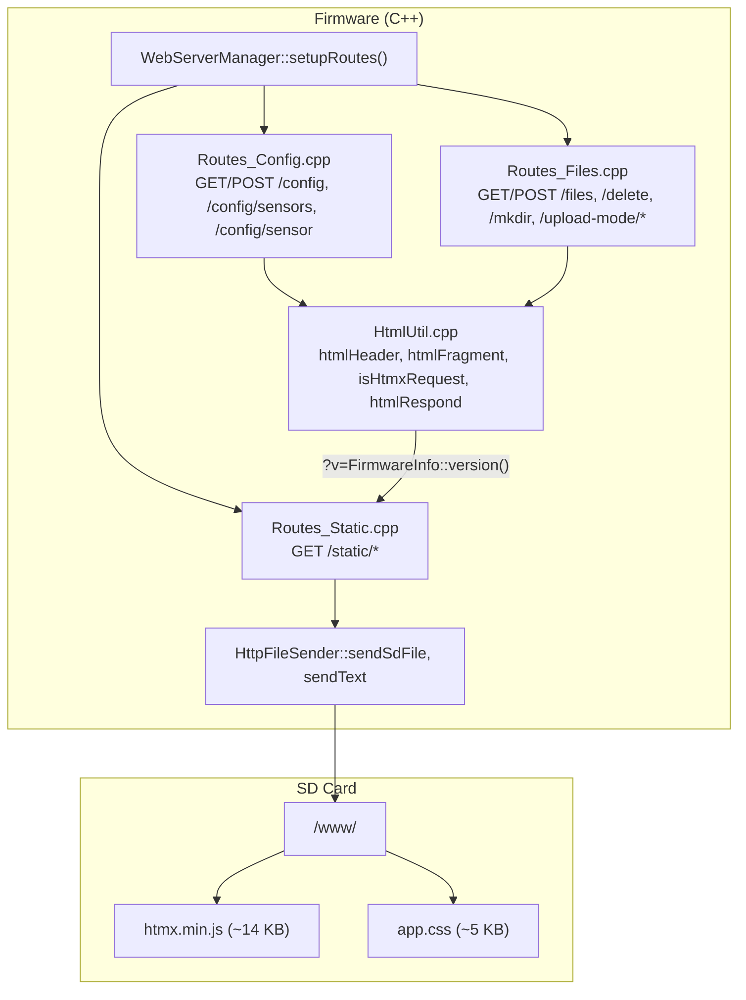

# Specification: htmx Web UI Migration

**Created**: 2025-06-23
**Status**: Draft
**Design Docs**: [docs/design/htmx-web-ui-migration.md](../../design/htmx-web-ui-migration.md)

## Scope

**What part of the design is being implemented:**

All 5 delivery phases from the design doc:

1. Static Asset Infrastructure — new `/static/*` route, `app.css`, `htmx.min.js` on SD card, `htmlHeader()` modified
2. Config Page htmx — `/config` POST returns fragments, form gets `hx-*` attributes
3. Sensor Pages htmx — `/config/sensors` and `/config/sensor` POST handlers return fragments
4. Files Page htmx — `/files` file operations use htmx swaps
5. CSS Polish — responsive layout, htmx loading indicators, mobile optimization

**Components covered:**
- Static Asset Server (new) — `firmware/src/Routes_Static.cpp`
- Fragment Responder (new helpers) — `firmware/src/HtmlUtil.cpp` / `HtmlUtil.h`
- HtmlUtil (modified) — `firmware/src/HtmlUtil.cpp`
- Route Handlers (modified) — `firmware/src/Routes_Config.cpp`, `firmware/src/Routes_Files.cpp`
- WebServerManager (modified) — `firmware/src/WebServerManager.cpp` (route registration only)
- Static assets — `htmx.min.js`, `app.css` (placed on SD card at `/www/`)

**Out of scope for this spec:**
- OLED menu system (`MenuSystem.cpp`) — unaffected
- `/api/*` JSON endpoints (`Routes_Api.cpp`, `Routes_Transforms.cpp`) — unchanged
- gzip compression — future optimization
- SPIFFS partition — not used (SD card chosen per resolved question 1)

## Design Context

### Relevant Invariants

- **INV-1:** Every page is fully functional without JavaScript. htmx enhances; it does not replace. Forms POST normally and the server returns full pages when `HX-Request` header is absent.
- **INV-2:** Static assets served with `Cache-Control: max-age=31536000` and `?v=<firmware-version>` query string. Browser caches indefinitely for a given firmware version. Cache invalidates automatically on firmware update.
- **INV-3:** No response exceeds the existing memory envelope. Fragment responses use the same 2 KB chunked streaming as full-page responses. No response body is buffered in full in heap.
- **INV-4:** Config editing remains locked during logging or upload mode. htmx requests receive a 200 response with `.alert-warn` fragment (htmx v2.0 does not swap 4xx bodies by default); non-htmx requests receive 423 plain text (current behavior).
- **INV-5:** The server handles one request at a time. htmx is configured with `hx-sync` where needed to prevent overlapping requests.

### Relevant Contracts

- Static Asset Server: serves `/static/<filename>` from `/www/<filename>` on SD card with 1-year cache, query string stripping, path traversal protection
- Fragment Responder: `isHtmxRequest()` detects `HX-Request: true` header; `htmlFragment()` returns body-only HTML
- HtmlUtil: `htmlHeader()` includes `<script>` and `<link>` tags with `?v=<version>`; no inline `<style>` block; all CSS in `app.css`
- Route Handlers: POST handlers return fragments when `HX-Request: true`, full pages otherwise; same form fields, same validation, same persistence

### Relevant Failure Modes

- SD card absent → static assets 404 → forms work as normal POSTs with browser default styles (INV-1)
- htmx.js fails to load → no partial swaps → forms degrade to normal POSTs (INV-1)
- Browser fires overlapping requests → WebServer queues → `hx-sync="this:replace"` on forms (INV-5)
- Config lock during htmx request → 200 with `.alert-warn` fragment (htmx); 423 plain text (non-htmx) → htmx swaps warn fragment into target div (INV-4)

---

## Component Specifications

### Static Asset Server — `firmware/src/Routes_Static.cpp` (new)

**Design doc reference:** [Static Asset Server contract](../../design/htmx-web-ui-migration.md#static-asset-server--firmwaresrcroutes_staticcpp-new)
**Depends on:** `HttpFileSender`, `SD_MMC`, `ConfigManager` (for SD card detection)

#### Interface Signatures

```cpp
// Routes_Static.h
#pragma once
#include <WebServer.h>

// Registers GET handler for /static/* path prefix
void registerStaticRoutes(WebServer& srv);
```

```cpp
// Routes_Static.cpp — internal helpers (file-scope)

// Extract filename from URL path, stripping /static/ prefix and query string
// Returns empty string if path is invalid (contains .., /, or \ after prefix)
static String extractStaticFilename_(const String& uri);

// Map file extension to Content-Type
static String contentTypeFor_(const String& filename);
```

#### Validation Rules

| Field | Rule | Error |
|-------|------|-------|
| URI path | Must start with `/static/` | 404 Not Found |
| Filename (after `/static/` strip) | Must not contain `..` | 404 Not Found |
| Filename | Must not contain `/` (no subdirectories) | 404 Not Found |
| Filename | Must not contain `\` (no backslash) | 404 Not Found |
| Filename | Must not be empty | 404 Not Found |
| Query string | Stripped before file lookup — `?v=0.4.1` ignored | N/A |
| SD card | Must be mounted (`SD_MMC.cardType() != CARD_NONE`) | 404 Not Found |
| File | Must exist at `/www/<filename>` on SD card | 404 Not Found |

#### Error Specifications

| Error | When | Payload | Caller must |
|-------|------|---------|-------------|
| 404 Not Found | SD card not mounted, file not found, or invalid path | `text/plain`: "Not found" | Browser falls back to no-JS mode |

#### Acceptance Criteria

- **AC1:** Given SD card with `/www/htmx.min.js` mounted, when GET `/static/htmx.min.js?v=0.4.1`, then 200 with `Content-Type: application/javascript`, `Cache-Control: max-age=31536000`, `Accept-Ranges: bytes`, and file contents
- **AC2:** Given SD card with `/www/app.css` mounted, when GET `/static/app.css?v=0.4.1`, then 200 with `Content-Type: text/css` and `Cache-Control: max-age=31536000`
- **AC3:** Given no SD card mounted, when GET `/static/htmx.min.js`, then 404 with `text/plain`
- **AC4:** Given SD card mounted, when GET `/static/../etc/passwd`, then 404 (path traversal blocked)
- **AC5:** Given SD card mounted, when GET `/static/subdir/file.js`, then 404 (subdirectories blocked)
- **AC6:** Given SD card with `/www/htmx.min.js`, when GET `/static/htmx.min.js` (no query string), then 200 (query string is optional)
- **AC7:** Given GET `/static/htmx.min.js?v=0.4.1` with `Range: bytes=0-1023` header, then 206 with `Content-Range: bytes 0-1023/<total>` (Range support delegated to `sendSdFile`)

#### Integration Points

| Dependency | Call | Expected response | Error handling |
|------------|------|-------------------|----------------|
| `SD_MMC` | `SD_MMC.cardType()` | `CARD_NONE` or card type enum | If `CARD_NONE`, return 404 |
| `SD_MMC` | `SD_MMC.open("/www/<filename>")` | `File` object or falsy | If falsy, return 404 |
| `HttpFileSender` | `sendSdFile(srv, "/www/<filename>", contentType, "", "max-age=31536000")` | Streams file with Range support | If returns false, return 404 |

#### Performance Constraints

| Metric | Target | How verified |
|--------|--------|--------------|
| Response start latency | < 50ms | Manual testing — file open + first chunk |
| Memory | No heap allocation beyond existing `sendSdFile` pattern | `ESP.getFreeHeap()` before/after |

---

### Fragment Responder — `firmware/src/HtmlUtil.cpp` / `HtmlUtil.h` (modified)

**Design doc reference:** [Fragment Responder contract](../../design/htmx-web-ui-migration.md#fragment-responder--firmwaresrchtmlutilcpp-modified)
**Depends on:** `WebServer` (for header access)

#### Interface Signatures

```cpp
// HtmlUtil.h — new additions to namespace HtmlUtil

namespace HtmlUtil {

  // Existing functions (unchanged signatures):
  // String htmlHeader(const String& title);
  // String htmlFooter();
  // String htmlEscape(const String& in);
  // ... etc

  // NEW: Returns true if the request has HX-Request: true header
  bool isHtmxRequest(WebServer& srv);

  // NEW: Returns an HTML fragment (body only, no <html>/<head>/<script>/<link>)
  // Suitable for htmx swap responses.
  // Includes a minimal <div> wrapper with the page title as a data attribute
  // so htmx can update document.title if desired.
  String htmlFragment(const String& body);

  // NEW: Convenience — returns fragment if isHtmxRequest, full page otherwise.
  // title is used for <title> in full page mode.
  String htmlRespond(WebServer& srv, const String& title, const String& body);
}
```

#### Validation Rules

| Field | Rule | Error |
|-------|------|-------|
| `HX-Request` header | Case-insensitive comparison with `true` | N/A — returns false if absent or not `true` |

#### Error Specifications

| Error | When | Payload | Caller must |
|-------|------|---------|-------------|
| N/A | Pure functions — no errors | N/A | N/A |

#### Acceptance Criteria

- **AC1:** Given request with header `HX-Request: true`, when `isHtmxRequest(srv)`, then returns `true`
- **AC2:** Given request without `HX-Request` header, when `isHtmxRequest(srv)`, then returns `false`
- **AC3:** Given request with header `HX-Request: false`, when `isHtmxRequest(srv)`, then returns `false`
- **AC4:** Given `isHtmxRequest()` returns true, when `htmlRespond(srv, "Config", "<p>Saved.</p>")`, then output contains `<p>Saved.</p>` and does NOT contain `<html>`, `<head>`, `<script>`, or `<link>`
- **AC5:** Given `isHtmxRequest()` returns false, when `htmlRespond(srv, "Config", "<p>Saved.</p>")`, then output contains `<html>`, `<head>`, `<title>Config</title>`, `<script src='/static/htmx.min.js?v=`, `<link rel='stylesheet' href='/static/app.css?v=`, and `<p>Saved.</p>`
- **AC6:** Given `htmlFragment("<div class='alert-ok'>Saved.</div>")`, then output is exactly `<div class='alert-ok'>Saved.</div>` (no wrapping tags beyond the body content)

#### Integration Points

| Dependency | Call | Expected response | Error handling |
|------------|------|-------------------|----------------|
| `WebServer` | `srv.hasHeader("HX-Request")` | `bool` | If false, not an htmx request |
| `WebServer` | `srv.header("HX-Request")` | `String` | Compare case-insensitively with `true` |
| `FirmwareInfo` | `FirmwareInfo::version()` | `const char*` (e.g., `"0.4.1"`) | Used in `?v=` query string |
| `ConfigManager` | `ConfigManager::get()` | `const LoggerConfig&` | For logger name in nav bar (full page only) |
| `WiFiManager` | `WiFiManager::status()` | `WiFiStatus` | For network info in nav bar (full page only) |

#### Performance Constraints

| Metric | Target | How verified |
|--------|--------|--------------|
| Fragment response size | < 2 KB typical | Manual testing — check response body size |
| Header check overhead | < 1ms | Trivial string comparison |

---

### HtmlUtil (modified) — `firmware/src/HtmlUtil.cpp`

**Design doc reference:** [HtmlUtil contract](../../design/htmx-web-ui-migration.md#htmlutil-modified--firmwaresrchtmlutilcpp)
**Depends on:** `ConfigManager`, `WiFiManager`, `FirmwareInfo`

#### Interface Signatures

```cpp
// htmlHeader() — MODIFIED signature (same, but output changes)
String htmlHeader(const String& title);

// htmlFooter() — UNCHANGED
String htmlFooter();

// NEW functions (see Fragment Responder section above)
bool isHtmxRequest(WebServer& srv);
String htmlFragment(const String& body);
String htmlRespond(WebServer& srv, const String& title, const String& body);
```

#### Validation Rules

N/A — HTML generation functions, no input validation beyond existing `htmlEscape`.

#### Error Specifications

| Error | When | Payload | Caller must |
|-------|------|---------|-------------|
| N/A | Pure HTML generation | N/A | N/A |

#### Acceptance Criteria

- **AC1:** Given `htmlHeader("Config")` is called, then output contains `<script src='/static/htmx.min.js?v=0.4.1' defer></script>` in `<head>` (where `0.4.1` is the current `FirmwareInfo::version()`)
- **AC2:** Given `htmlHeader("Config")` is called, then output contains `<link rel='stylesheet' href='/static/app.css?v=0.4.1'>` in `<head>`
- **AC3:** Given `htmlHeader("Config")` is called, then output does NOT contain a `<style>` block (no inline CSS)
- **AC4:** Given `htmlHeader("Config")` is called, then output still contains the title bar (`BODAQS data logger: <name>`), network bar, and nav bar (Files / General / Sensors) — same as current behavior
- **AC5:** Given `htmlFooter()` is called, then output is `</body></html>` (unchanged)
- **AC6:** Given SD card is absent and `app.css` returns 404, when page loads in browser, then page renders with browser default styles — forms are visible and functional (labels, inputs, fieldsets, buttons all work)

#### Integration Points

| Dependency | Call | Expected response | Error handling |
|------------|------|-------------------|----------------|
| `FirmwareInfo` | `FirmwareInfo::version()` | `const char*` | Embedded in `?v=` query string |
| `ConfigManager` | `ConfigManager::get()` | `const LoggerConfig&` | For logger name in title bar |
| `WiFiManager` | `WiFiManager::status()` | `WiFiStatus` | For network info in net bar |

#### Performance Constraints

| Metric | Target | How verified |
|--------|--------|--------------|
| `htmlHeader()` output size | < 2 KB (reduced from current ~1.5 KB by removing inline CSS) | String length check |
| Flash code size delta | < 2 KB (net reduction due to CSS removal, offset by new functions) | `firmware.bin` size comparison |

---

### Route Handlers: Config Page — `firmware/src/Routes_Config.cpp` (modified)

**Design doc reference:** [Route Handlers contract](../../design/htmx-web-ui-migration.md#route-handlers-modified--firmwaresrcroutes_configcpp-firmwaresrcroutes_filescpp)
**Depends on:** `HtmlUtil`, `ConfigManager`, `HttpFileSender`, `WebServer`

#### Interface Signatures

No new functions. Existing route handlers are modified internally:

```cpp
// GET /config — UNCHANGED (full page render, same as today)
// The form tag gets hx-* attributes added inline

// POST /config — MODIFIED
// If isHtmxRequest(srv): return 200 with HTML fragment (no redirect)
// If !isHtmxRequest(srv): return 303 redirect to /config?ok=1 (current behavior)

// GET /config/sensors — UNCHANGED (full page render)
// POST /config/sensors — MODIFIED (same pattern as POST /config)

// GET /config/sensor?id=N — UNCHANGED (full page render)
// Form tag gets hx-* attributes
```

#### Validation Rules

No change to form field validation. All existing validation rules apply identically for htmx and non-htmx requests:

| Field | Rule | Error response (htmx) | Error response (non-htmx) |
|-------|------|----------------------|---------------------------|
| `wifi_ap_password` | 8-63 characters | 200 with `<div class='alert-err'>AP password must be 8-63 characters</div>` | 303 redirect to `/config?err=wifi_ap_password_length` |
| `wifi_static_ip` | IP/gateway/subnet required if enabled | 200 with `<div class='alert-err'>Static IP requires ip/gateway/subnet</div>` | 303 redirect to `/config?err=wifi_static_ip_incomplete` |
| Config lock | `configEditLocked_()` returns true | 200 with `<div class='alert-warn'>Configuration is locked while logging is active.</div>` | 423 with plain text (current behavior) |

#### Error Specifications

| Error | When | htmx response | Non-htmx response |
|-------|------|---------------|-------------------|
| 423 Locked | Logging or upload mode active | 200, `text/html`, `<div class='alert-warn'>Configuration is locked while <reason>.</div>` (htmx v2.0 does not swap 4xx bodies by default) | 423, `text/plain`, `Configuration is locked while <reason>.` (current) |
| Validation error | Field validation fails | 200, `text/html`, `<div class='alert-err'>Error: <message></div>` | 303 redirect to `/config?err=<code>` (current) |
| 500 Save failure | `ConfigManager::save()` returns false | 200, `text/html`, `<div class='alert-err'>Failed to save config</div>` | 500, `text/plain`, `Failed to save config` (current) |
| Success | Config saved | 200, `text/html`, `<div class='alert-ok'>Configuration saved.</div>` | 303 redirect to `/config?ok=1` (current) |

#### Acceptance Criteria

- **AC1:** Given htmx request (`HX-Request: true`), when POST `/config` with valid form data, then 200 with `text/html` containing `<div class='alert-ok'>Configuration saved.</div>` and no `<html>` tag
- **AC2:** Given non-htmx request, when POST `/config` with valid form data, then 303 redirect to `/config?ok=1` (current behavior unchanged)
- **AC3:** Given htmx request, when POST `/config` with `wifi_ap_password` of 3 characters, then 200 with `<div class='alert-err'>` containing password length error message
- **AC4:** Given htmx request, when POST `/config` while logging is active, then 200 with `<div class='alert-warn'>` containing lock message
- **AC5:** Given htmx request, when POST `/config` and `ConfigManager::save()` fails, then 200 with `<div class='alert-err'>Failed to save config</div>`
- **AC6:** Given the `/config` GET page, when rendered, then the `<form>` tag contains `hx-post="/config"`, `hx-target="#save-result"`, `hx-swap="innerHTML"`, and `hx-sync="this:replace"`
- **AC7:** Given the `/config` GET page, when rendered, then a `<div id="save-result"></div>` exists before the form (htmx swap target)
- **AC8:** Given the `/config` GET page, when rendered, then the submit button contains `<span class="htmx-indicator">Saving...</span>`
- **AC9:** Given non-htmx request, when POST `/config/sensors` with `delete_sensor_idx`, then 303 redirect (current behavior unchanged)
- **AC10:** Given htmx request, when POST `/config/sensors` with `delete_sensor_idx`, then 200 with `<div class='alert-ok'>Sensor deleted. Restart the logger to rebuild the live sensor set.</div>`
- **AC11:** Given htmx request, when POST `/config/sensors` with `add_sensor`, then 200 with `<div class='alert-ok'>Sensor added. Restart the logger to rebuild the live sensor set.</div>`
- **AC12:** Given the `/config/sensor?id=N` GET page, when rendered, then the `<form>` tag contains `hx-post="/config/sensors"`, `hx-target="#sensor-result"`, `hx-swap="innerHTML"`
- **AC13:** Given htmx request, when POST `/config/sensors` with sensor field data (save), then 200 with `<div class='alert-ok'>Saved.</div>`

#### Integration Points

| Dependency | Call | Expected response | Error handling |
|------------|------|-------------------|----------------|
| `HtmlUtil` | `isHtmxRequest(srv)` | `bool` | Determines response format |
| `HtmlUtil` | `htmlFragment(body)` | `String` | Used for htmx responses |
| `ConfigManager` | `save(tmp)` | `bool` | If false, return error fragment/page |
| `ConfigManager` | `get()` | `const LoggerConfig&` | Read current config for display |
| `HttpFileSender` | `sendText(srv, 200, "text/html", fragment, "no-store")` | Streams response | N/A |

#### Performance Constraints

| Metric | Target | How verified |
|--------|--------|--------------|
| Fragment response size | < 500 bytes (success/error banners) | String length check |
| Config POST processing time | Same as current (fragment vs redirect is negligible overhead) | Manual timing |

---

### Route Handlers: Files Page — `firmware/src/Routes_Files.cpp` (modified)

**Design doc reference:** [Route Handlers contract](../../design/htmx-web-ui-migration.md#route-handlers-modified--firmwaresrcroutes_configcpp-firmwaresrcroutes_filescpp)
**Depends on:** `HtmlUtil`, `SD_MMC`, `HttpFileSender`, `WebServer`

#### Interface Signatures

No new functions. Existing route handlers modified:

```cpp
// GET /files — form tags get hx-* attributes for upload mode enter/exit
// POST /upload-mode/enter — MODIFIED: return fragment if htmx, redirect if not
// POST /upload-mode/exit — MODIFIED: return fragment if htmx, redirect if not
// GET /delete?path= — MODIFIED: return fragment if htmx (with hx-get for OOB swap), redirect if not
// POST /delete_multi — MODIFIED: return fragment if htmx, redirect if not
// POST /mkdir — MODIFIED: return fragment if htmx, redirect if not
// POST /upload — UNCHANGED (multipart upload, redirect always)
// GET /download — UNCHANGED (direct file download, no htmx)
// POST /download_zip — UNCHANGED (binary response, no htmx)
```

#### Validation Rules

No change to path validation. All existing `safeRelPath()`, `manualFileMutationBlocked_()` checks apply identically.

#### Error Specifications

| Error | When | htmx response | Non-htmx response |
|-------|------|---------------|-------------------|
| 409 Mutation blocked | Logging or upload mode active | 200, `text/html`, `<div class='alert-warn'>Manual file changes are disabled while <reason>.</div>` | 409, `text/plain` (current) |
| 404 Not found | File not found | 200, `text/html`, `<div class='alert-err'>File not found.</div>` | 404, `text/plain` (current) |
| Success (delete) | File deleted | 200, `text/html`, `<div class='alert-ok'>Deleted.</div>` + `HX-Redirect: /files?path=<dir>` header | 303 redirect (current) |
| Success (upload mode) | Mode entered/exited | 200, `text/html`, `<div class='alert-ok'>Upload mode active.</div>` + `HX-Redirect: /files` header | 303 redirect (current) |

#### Acceptance Criteria

- **AC1:** Given htmx request, when POST `/upload-mode/enter`, then 200 with `<div class='alert-ok'>Upload mode active.</div>` and `HX-Redirect: /files` response header
- **AC2:** Given non-htmx request, when POST `/upload-mode/enter`, then 303 redirect to `/files` (current behavior)
- **AC3:** Given htmx request, when GET `/delete?path=/file.csv`, then 200 with `<div class='alert-ok'>Deleted.</div>` and `HX-Redirect: /files?path=/` response header
- **AC4:** Given non-htmx request, when GET `/delete?path=/file.csv`, then 303 redirect to `/files?path=/` (current behavior)
- **AC5:** Given htmx request, when GET `/delete` while logging active, then 200 with `<div class='alert-warn'>` containing lock message
- **AC6:** Given the `/files` GET page, when rendered, then upload mode enter/exit forms contain `hx-post` and `hx-target` attributes
- **AC7:** Given the `/files` GET page, when rendered, then delete links can be converted to htmx via `hx-get` with `hx-target` (or remain as regular links that redirect — implementation choice)
- **AC8:** Given htmx request, when POST `/mkdir` with valid name, then 200 with `<div class='alert-ok'>Folder created.</div>` and `HX-Redirect: /files?path=<dir>` header

#### Integration Points

| Dependency | Call | Expected response | Error handling |
|------------|------|-------------------|----------------|
| `HtmlUtil` | `isHtmxRequest(srv)` | `bool` | Determines response format |
| `SD_MMC` | `SD_MMC.remove(path)` | `bool` | If false, return error fragment |
| `SD_MMC` | `SD_MMC.mkdir(path)` | `bool` | If false, return error fragment |
| `UploadModeManager` | `enter()` / `exit()` | `bool` | If false, return error fragment |
| `HttpFileSender` | `sendText(srv, 200, "text/html", fragment, "no-store")` | Streams response | N/A |

#### Performance Constraints

| Metric | Target | How verified |
|--------|--------|--------------|
| Fragment response size | < 500 bytes | String length check |
| File list refresh after delete | htmx `HX-Redirect` triggers full page reload (file table is too complex for partial swap) | Manual testing |

---

### WebServerManager (modified) — `firmware/src/WebServerManager.cpp`

**Design doc reference:** Route registration
**Depends on:** `Routes_Static.h`

#### Interface Signatures

No signature changes. One line added to `setupRoutes()`:

```cpp
void WebServerManager::setupRoutes() {
  g_server->on("/", HTTP_GET, handleRoot);
  registerStaticRoutes(*g_server);    // NEW
  registerFileRoutes(*g_server);
  registerConfigRoutes(*g_server);
  registerApiRoutes(*g_server);
  // ... rest unchanged
}
```

#### Acceptance Criteria

- **AC1:** Given firmware is compiled with `Routes_Static.cpp`, when `setupRoutes()` is called, then `/static/htmx.min.js` is a registered route
- **AC2:** Given `/static/*` route is registered, when GET `/static/nonexistent.js`, then 404 (does not fall through to `onNotFound`)

#### Integration Points

| Dependency | Call | Expected response | Error handling |
|------------|------|-------------------|----------------|
| `Routes_Static` | `registerStaticRoutes(*g_server)` | Registers `/static/*` handler | N/A |

---

### Static Assets — `htmx.min.js`, `app.css`

**Design doc reference:** [Design Language section](../../design/htmx-web-ui-migration.md#design-language)

#### htmx.min.js

- Downloaded from https://unpkg.com/htmx.org@2.0.3/dist/htmx.min.js (pinned to v2.0.3)
- Placed on SD card at `/www/htmx.min.js`
- ~14 KB minified, zero dependencies
- Not modified — used as-is

#### app.css

- Implements the full Design Language section from the design doc
- Placed on SD card at `/www/app.css`
- Contains:
  - CSS custom properties (`:root` block with brand palette + semantic status colors + spacing scale)
  - Typography (system-ui font stack, 14px base, 1.5 line height)
  - Page shell (titlebar, netbar, topnav)
  - Fieldsets and form rows (flex layout, 160px labels, focus glow)
  - Buttons (primary, hover, disabled)
  - Alerts (`.alert-ok`, `.alert-err`, `.alert-warn`)
  - Tables (dark header, zebra striping, hover)
  - htmx indicator (`.htmx-indicator`, `.htmx-request .htmx-indicator`)
  - Mobile responsive breakpoint (`@media (max-width: 480px)`)
- Estimated size: ~4-6 KB

#### Acceptance Criteria

- **AC1:** Given `/www/htmx.min.js` on SD card, when GET `/static/htmx.min.js`, then response body starts with `htmx` (minified JS)
- **AC2:** Given `/www/app.css` on SD card, when GET `/static/app.css`, then response body contains `--shadow-grey: #212227` and `--lavender-grey: #8693ab`
- **AC3:** Given `app.css` loaded in browser, when viewing `/config` at 375px width, then no horizontal scrolling (all fields fit)

---

## Implementation Approach

### High-Level Architecture



### Key Decisions

| Decision | Choice | Rationale |
|----------|--------|-----------|
| htmx request detection | `HX-Request` header | htmx sends this automatically; no URL scheme duplication; graceful degradation is automatic |
| Fragment response format | Raw HTML body (no wrapper) | htmx swaps `innerHTML` — just needs the content fragment |
| Error responses for htmx | 200 with `.alert-err`/`.alert-warn` div | htmx v2.0 does not swap 4xx response bodies by default; returning 200 ensures the fragment is swapped into the target div. Non-htmx requests preserve original status codes (423, 409, etc.) |
| File delete on htmx | `HX-Redirect` response header | File table is too complex for partial swap; htmx follows the redirect and reloads `/files` |
| Upload mode toggle on htmx | `HX-Redirect` response header | Same reason — upload mode panel changes state |
| Config form target | `#save-result` div before the form | Success/error banner appears above the form without scrolling |
| Sensor form target | `#sensor-result` div before the form | Same pattern |
| `hx-sync` strategy | `this:replace` | Drops in-flight request if user clicks Save again; only latest request is sent |
| htmx version | v2.0.3 (pinned) | Latest stable at time of spec; 14 KB minified; `defer` attribute for non-blocking load; pinned to prevent behavior changes |

### Research

- **htmx `HX-Request` header**: htmx automatically sends `HX-Request: true` on every request it makes. This is the standard detection mechanism documented at https://htmx.org/docs/#request-headers
- **htmx `HX-Redirect` response header**: When htmx receives a response with `HX-Redirect: <url>` header, it triggers a full page navigation to that URL. This is useful for operations that change too much state for a partial swap (file delete, upload mode toggle). Documented at https://htmx.org/headers/#hx-redirect
- **htmx `hx-sync`**: The `this:replace` strategy drops the current request if a new one comes in on the same element. This prevents queued requests on the single-threaded ESP32 WebServer. Documented at https://htmx.org/attributes/hx-sync/
- **ESP32 WebServer header access**: `srv.hasHeader(name)` and `srv.header(name)` only work for headers that have been pre-collected via `collectHeaders()`. The current `prepareServer_()` only collects `Range`. `HX-Request` must be added to the `kHeaderKeys` array in `prepareServer_()` for `hasHeader("HX-Request")` to return true at runtime.
- **`FirmwareInfo::version()`**: Returns `BODAQS_FW_VERSION` macro defined in `platformio.ini` as `-DBODAQS_FW_VERSION=\"0.4.1\"`. Available at compile time, zero runtime cost.

### Alternatives Considered

| Alternative | Why not chosen |
|-------------|----------------|
| Separate `/fragments/*` URLs for htmx responses | Doubles the route count; harder to maintain; `HX-Request` header is the standard htmx pattern |
| Query param `?fragment=1` | Less clean than header; visible in URL bar; could be bookmarked |
| JSON API + client-side rendering | Requires JSON serialization of all config; build step; larger payload; defeats the "server speaks HTML" advantage of htmx |
| OOB (out-of-band) swaps for file table updates | Too complex for the file browser; `HX-Redirect` is simpler and reliable |

### Test Strategy

#### Constraint: Tests must NOT be compiled into the firmware binary

The ESP32-S3 app partition has ~570 KB free. Test code, test frameworks, and stubs must not appear in the firmware. Tests run on the developer's host machine (macOS/Linux), compiled with standard `g++`/`clang++`, completely outside the PlatformIO build.

#### Architecture

```
firmware/
├── src/                    # Production firmware source (compiled by PlatformIO)
│   ├── HtmlUtil.cpp
│   ├── HtmlUtil.h
│   ├── Routes_Static.cpp   # NEW
│   ├── Routes_Static.h     # NEW
│   ├── Routes_Config.cpp   # MODIFIED
│   ├── Routes_Files.cpp    # MODIFIED
│   └── ...
├── test/                   # NEW — host-based test suite (NOT in firmware build)
│   ├── Makefile            # Builds and runs all tests with host g++
│   ├── stubs/              # Minimal stubs for ESP32/Arduino types
│   │   ├── Arduino.h       # Stubs: String, F(), delay(), millis(), etc.
│   │   ├── WebServer.h     # Stub: WebServer with hasHeader/header/arg/args
│   │   ├── SD_MMC.h        # Stub: SD_MMC with cardType/open/exists/remove
│   │   └── mocks.h         # Mock helpers: setRequestHeaders, setSdFiles, etc.
│   ├── test_htmlutil.cpp   # Tests: htmlHeader, htmlFragment, isHtmxRequest, htmlRespond
│   ├── test_routes_static.cpp  # Tests: extractStaticFilename_, contentTypeFor_, path traversal
│   └── test_fragments.cpp  # Tests: fragment format, alert classes, no <html> in fragments
└── platformio.ini          # UNCHANGED — PlatformIO ignores test/ directory
```

#### How tests are excluded from the firmware build

PlatformIO only compiles `src/` for the firmware target. The `test/` directory is only used when running `pio test` (which we don't use — we use our own Makefile). The `test/` directory has its own `Makefile` that compiles with host `g++`, includes the `stubs/` directory instead of the real ESP32 headers, and links against production source files selectively.

The production source files (`HtmlUtil.cpp`, `Routes_Static.cpp`) are compiled directly by the test build, but with stub headers replacing ESP32-specific includes. This works because:

1. `HtmlUtil.cpp` includes `<Arduino.h>` (for `String`, `F()`) and `ConfigManager.h` / `WiFiManager.h` — the stubs provide fake implementations
2. `Routes_Static.cpp` includes `<WebServer.h>` and `<SD_MMC.h>` — the stubs provide fake implementations
3. The test Makefile uses `-I test/stubs` before `-I src` so stubs take precedence

No `#ifdef TEST` guards in production code. The separation is purely at the build system level.

#### Stub layer

The stubs provide minimal implementations of ESP32/Arduino types needed by the code under test:

**`test/stubs/Arduino.h`** — provides:
- `String` class with the subset of methods used by `HtmlUtil` and `Routes_Static` (`length()`, `c_str()`, `indexOf()`, `substring()`, `+=`, `==`, `F()` macro)
- `delay()`, `millis()` as no-ops
- Basic types (`uint8_t`, `uint16_t`, `uint32_t`, `int8_t`, etc.)

**`test/stubs/WebServer.h`** — provides:
- `WebServer` class with `hasHeader(name)`, `header(name)`, `hasArg(name)`, `arg(name)`, `argName(i)`, `args()`, `send()`, `sendHeader()`, `setContentLength()`, `sendContent()`
- A mock setup API: `mockSetHeader(name, value)`, `mockSetArg(name, value)`, `mockReset()`
- Captured response state: `mockLastStatus`, `mockLastContentType`, `mockLastBody`, `mockHeaders` (for verifying `HX-Redirect`, `Cache-Control`, etc.)

**`test/stubs/SD_MMC.h`** — provides:
- `SD_MMC` namespace with `cardType()`, `open(path)`, `exists(path)`, `remove(path)`, `mkdir(path)`, `rmdir(path)`
- A mock file map: `mockSetFile(path, contents)`, `mockFileExists(path)`, `mockReset()`
- `File` class with `isDirectory()`, `size()`, `read()`, `write()`, `close()`, `openNextFile()`

**`test/stubs/mocks.h`** — provides:
- `FirmwareInfo::version()` returning a configurable string (default `"0.4.1"`)
- `ConfigManager::get()` returning a `LoggerConfig` with configurable fields
- `WiFiManager::status()` returning a `WiFiStatus` with configurable fields
- Reset functions to clear mock state between tests

#### Test cases

**`test_htmlutil.cpp`** — tests for `HtmlUtil`:

| Test | What it verifies |
|------|-----------------|
| `test_htmlHeader_includes_htmx_script` | `htmlHeader("Config")` output contains `<script src='/static/htmx.min.js?v=0.4.1' defer></script>` |
| `test_htmlHeader_includes_app_css_link` | `htmlHeader("Config")` output contains `<link rel='stylesheet' href='/static/app.css?v=0.4.1'>` |
| `test_htmlHeader_no_inline_style` | `htmlHeader("Config")` output does NOT contain `<style>` |
| `test_htmlHeader_includes_navbar` | `htmlHeader("Config")` output contains `Files`, `General`, `Sensors` nav links |
| `test_htmlHeader_includes_titlebar` | `htmlHeader("Config")` output contains `BODAQS data logger:` |
| `test_htmlFragment_no_html_tag` | `htmlFragment("<p>Saved.</p>")` does NOT contain `<html>`, `<head>`, `<script>`, `<link>` |
| `test_htmlFragment_returns_body_only` | `htmlFragment("<div class='alert-ok'>OK</div>")` is exactly `<div class='alert-ok'>OK</div>` |
| `test_isHtmxRequest_true` | Request with `HX-Request: true` header → returns `true` |
| `test_isHtmxRequest_false_absent` | Request without `HX-Request` header → returns `false` |
| `test_isHtmxRequest_false_other_value` | Request with `HX-Request: false` → returns `false` |
| `test_htmlRespond_fragment_mode` | htmx request → `htmlRespond()` returns fragment (no `<html>`) |
| `test_htmlRespond_full_page_mode` | non-htmx request → `htmlRespond()` returns full page (with `<html>`, `<script>`, `<link>`) |
| `test_htmlHeader_version_changes_with_firmware` | Set `FirmwareInfo::version()` to `"0.5.0"` → `htmlHeader()` output contains `?v=0.5.0` |
| `test_htmlFooter_returns_closing_tags` | `htmlFooter()` returns exactly `</body></html>` (retained from baseline) |
| `test_htmlEscape_escapes_special_chars` | `htmlEscape("a&b<c>d\"e")` returns `a&amp;b&lt;c&gt;d&quot;e` (retained from baseline) |

**`test_routes_static.cpp`** — tests for `Routes_Static`:

| Test | What it verifies |
|------|-----------------|
| `test_static_serves_js` | SD card has `/www/htmx.min.js` → GET `/static/htmx.min.js?v=0.4.1` → 200, `application/javascript`, `Cache-Control: max-age=31536000` |
| `test_static_serves_css` | SD card has `/www/app.css` → GET `/static/app.css?v=0.4.1` → 200, `text/css`, `Cache-Control: max-age=31536000` |
| `test_static_no_query_string` | GET `/static/htmx.min.js` (no `?v=`) → 200 (query string is optional) |
| `test_static_path_traversal_blocked` | GET `/static/../etc/passwd` → 404 |
| `test_static_subdirectory_blocked` | GET `/static/subdir/file.js` → 404 |
| `test_static_backslash_blocked` | GET `/static\..\file` → 404 |
| `test_static_empty_filename` | GET `/static/` → 404 |
| `test_static_file_not_found` | SD card has no `/www/missing.js` → GET `/static/missing.js` → 404 |
| `test_static_no_sd_card` | `SD_MMC.cardType() == CARD_NONE` → GET `/static/htmx.min.js` → 404 |
| `test_static_content_type_js` | `.js` extension → `Content-Type: application/javascript` |
| `test_static_content_type_css` | `.css` extension → `Content-Type: text/css` |
| `test_static_cache_control_header` | All responses include `Cache-Control: max-age=31536000` |

**`test_fragments.cpp`** — tests for fragment response format:

| Test | What it verifies |
|------|-----------------|
| `test_fragment_success_format` | Success fragment is `<div class='alert-ok'>Configuration saved.</div>` |
| `test_fragment_error_format` | Error fragment is `<div class='alert-err'>Error: <message></div>` |
| `test_fragment_warn_format` | Warning fragment is `<div class='alert-warn'>Configuration is locked while <reason>.</div>` |
| `test_fragment_no_html_wrapper` | No fragment contains `<html>`, `<head>`, `<body>`, `<script>`, or `<link>` |
| `test_fragment_size_under_2kb` | All fragment responses are < 2 KB (INV-3) |

#### Running tests

```bash
cd firmware
make -C test test
```

The Makefile:
1. Compiles `test/stubs/*.h` + production source files (`HtmlUtil.cpp`, `Routes_Static.cpp`) with host `g++`
2. Compiles `test/test_*.cpp` test files
3. Links into a single test binary
4. Runs the binary, exits non-zero on any test failure

No external test framework dependency. Tests use simple `assert()` + a tiny `TEST()` macro that prints pass/fail. This keeps the test suite self-contained with zero install requirements beyond a C++ compiler.

#### What is NOT tested on host

| What | Why | How it's tested instead |
|------|-----|------------------------|
| Actual HTTP request/response cycle | Requires a running ESP32 | Manual testing on hardware |
| SD card file I/O | Hardware-specific | Mocked in stubs; verified on hardware |
| WiFi connection / AP mode | Hardware-specific | Manual testing |
| htmx client-side behavior | Browser-side | Manual testing in browser |
| CSS rendering at 375px | Browser-side | Design artifact HTML files |
| Config persistence (`ConfigManager::save`) | Touches NVS on ESP32 | Mocked; verified on hardware |
| File upload (multipart) | Complex HTTP parsing | Manual testing |
| ZIP download streaming | Binary response | Manual testing |

#### CI integration (future)

The Makefile-based test suite is CI-ready. A future GitHub Actions workflow can:
1. Install `g++`
2. Run `make -C firmware/test test`
3. Fail the build if any test fails

No PlatformIO, no ESP32 toolchain, no hardware required for CI.

## Dependencies

### Design Dependencies

- [docs/design/htmx-web-ui-migration.md](../../design/htmx-web-ui-migration.md) — the design doc this spec implements

### Spec Dependencies

- None — this is the first spec for this system

### Package Dependencies

- `firmware/src/HtmlUtil.cpp` / `HtmlUtil.h` — modified (CSS removal, new functions)
- `firmware/src/HttpFileSender.cpp` / `HttpFileSender.h` — used as-is (`sendSdFile`, `sendText`)
- `firmware/src/ConfigManager.cpp` / `ConfigManager.h` — used as-is (config read/write)
- `firmware/src/FirmwareInfo.h` — used as-is (`version()`)
- `firmware/src/WebServerManager.cpp` — modified (one line: `registerStaticRoutes` call)
- `firmware/src/Routes_Config.cpp` — modified (htmx fragment responses)
- `firmware/src/Routes_Files.cpp` — modified (htmx fragment responses)
- New file: `firmware/src/Routes_Static.cpp` / `Routes_Static.h`
- New static assets: `/www/htmx.min.js`, `/www/app.css` (on SD card)

## Resolved Questions

| # | Question | Decision | Rationale |
|---|----------|----------|-----------|
| 1 | Should `/files` delete links use `hx-get` (partial swap) or `HX-Redirect` (full reload)? | **HX-Redirect** | Simpler and reliable. File table is complex — full reload guarantees fresh state. The slight reload cost is acceptable for a delete operation. |
| 2 | Should sensor editor "Apply Type" button use htmx or full page reload? | **Full page reload** | Apply Type rebuilds the entire form structure. The response would be large (entire sensor editor). Full reload is expected behavior when form structure changes. htmx is used for "Save Sensor" only. |
| 3 | Should WiFi slot fieldsets be individually swappable or single target? | **Single target** | One `#save-result` for the entire form. Simpler, consistent with the rest of the config page. Per-slot targets would require restructuring the form into 5 separate forms. |

## Risks

| Risk | Mitigation |
|------|------------|
| htmx v2.0.3 `HX-Request` header behavior changes in future versions | Pin htmx version on SD card (v2.0.3); version-keyed cache means updates are deliberate |
| `app.css` file on SD card becomes stale after firmware update | `?v=<firmware-version>` query string forces browser to fetch fresh CSS on firmware update |
| ESP32 WebServer `hasHeader()` not collecting `HX-Request` | `HX-Request` must be added to `kHeaderKeys` in `prepareServer_()` — `hasHeader()` only works for pre-collected headers |
| Fragment responses for sensor editor are too large (many fields) | Sensor editor save returns only `<div class='alert-ok'>Saved.</div>` (~40 bytes) — the form itself is not re-rendered |
| `HX-Redirect` not supported by older htmx versions | Use htmx v2.0.3 (pinned) which supports `HX-Redirect`; version-keyed cache prevents accidental upgrades |

## Success Criteria

- [ ] **G1:** Submit any form on `/config` or `/config/sensor` — browser URL does not change, scroll position is preserved, no white flash (maps to design goal G1)
- [ ] **G2:** First page load fetches `htmx.min.js?v=0.4.1` and `app.css?v=0.4.1`; subsequent page loads use cache (zero requests for static assets) (maps to design goal G2, INV-2)
- [ ] **G3:** Disable JavaScript in browser, navigate to `/config`, submit form — form POSTs normally and page reloads with result (maps to design goal G3, INV-1)
- [ ] **G4:** `ESP.getFreeHeap()` before and after a config page load is within ±2 KB of baseline (maps to design goal G4, INV-3)
- [ ] **G5:** `firmware.bin` size delta < 20 KB (maps to design goal G5)
- [ ] **G6:** Open `/config` in browser DevTools at 375px width — no horizontal scroll, all fields tappable (maps to design goal G6)
- [ ] **INV-4:** Config editing locked during logging — htmx request receives 200 with `.alert-warn` fragment; non-htmx receives 423 plain text
- [ ] **INV-5:** No overlapping requests — `hx-sync="this:replace"` on all forms prevents queued requests
- [ ] **T1:** `make -C firmware/test test` passes all host-based unit tests with zero failures
- [ ] **T2:** Test binary is NOT included in `firmware.bin` — `firmware.bin` size does not increase by more than the production code delta (< 20 KB per G5)
- [ ] **T3:** All `test_htmlutil.cpp` tests pass (15 tests covering htmlHeader, htmlFooter, htmlEscape, htmlFragment, isHtmxRequest, htmlRespond)
- [ ] **T4:** All `test_routes_static.cpp` tests pass (12 tests covering path validation, content types, cache headers, SD card absent)
- [ ] **T5:** All `test_fragments.cpp` tests pass (5 tests covering fragment format, alert classes, size constraints)
