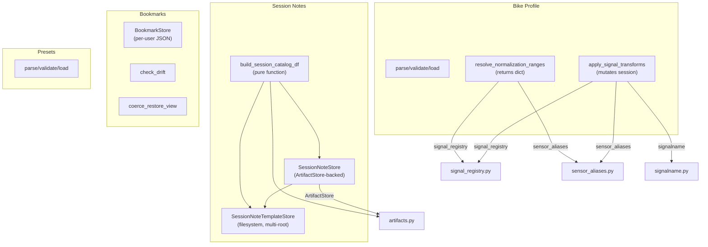

# Specification: Session Notes & Bike Profiles

**Created**: 2025-01-24
**Status**: Draft
**Design Docs**: [docs/design/session-notes-bike-profiles.md](../../design/session-notes-bike-profiles.md)

## Scope

**What part of the design is being implemented:**
This spec documents the existing implementation of four modules in
`analysis/bodaqs_analysis/`:

- `session_notes.py` — Session note templates, documents, stores, catalog building
- `bike_profile.py` — Bike profile parsing, validation, signal transforms, normalization range resolution
- `bookmarks.py` — Per-user bookmark store with CRUD, drift checking, view restoration
- `session_note_presets.py` — Bike setup preset parsing and validation

All four modules are fully implemented and this spec documents their as-built
behavior.

**Out of scope for this spec:**
- The import agent's use of these modules (session note creation during import,
  bike profile resolution from import sources)
- The library management UI that consumes the catalog service
- The preprocessing pipeline's integration with bike profiles (transform/range
  application orchestration)
- Template authoring workflows
- Bookmark UI integration in the Session Window Browser

## Design Context

### Relevant Invariants

- **INV-1**: Template schema must equal `"bodaqs.session_notes.template"`.
- **INV-2**: Template version must equal `1`.
- **INV-3**: Note document schema must equal `"bodaqs.session_notes.document"`.
- **INV-4**: Note document version must equal `1`.
- **INV-5**: `session_key` must equal `run_id::session_id`.
- **INV-6**: Field IDs must be unique within a template.
- **INV-7**: Note `values` may only contain known template field IDs.
- **INV-8**: Note `custom_values` are rejected if `template.allow_custom_fields` is `False`.
- **INV-9**: Field values must match their declared `field_type`.
- **INV-10**: Required fields must have non-None values.
- **INV-11**: Template store deduplicates by `(template_id, template_version)`.
- **INV-12**: `get_latest_template` returns highest `template_version` by string sort. *(unverified intent — needs review)*
- **INV-13**: Template load errors are caught, logged, and stored — they don't block other templates.
- **INV-14**: `create_note_from_template` does not persist; caller must call `save_note`. *(unverified intent — needs review)*
- **INV-15**: `save_note` validates against template before writing.
- **INV-16**: `update_note` merges values by default; `replace_values=True` replaces.
- **INV-17**: `update_note` cannot clear `title`/`free_text_notes` to None. *(unverified intent — needs review)*
- **INV-18**: Float fields accept `None` as valid. *(unverified intent — needs review)*
- **INV-19**: Float fields accept `int` values.
- **INV-20**: Catalog projection catches `SessionNotesError` but not `SessionNoteValidationError`.
- **INV-21**: Bike profile schema must equal `"bodaqs.bike_profile"`.
- **INV-22**: Bike profile version must equal `1`.
- **INV-23**: `bike_profile_id` must be non-empty string.
- **INV-24**: `display_name` must be non-empty string.
- **INV-25**: Normalization range IDs must be unique.
- **INV-26**: `full_range` must be finite and > 0.
- **INV-27**: Signal transform IDs must be unique.
- **INV-28**: Transform `method` must be `"lut"` or `"polynomial"`.
- **INV-29**: LUT must have ≥ 2 points with strictly increasing inputs.
- **INV-30**: Polynomial must have ≥ 1 coefficient.
- **INV-31**: LUT `interpolation` must be `"linear"` or `"nearest"`.
- **INV-32**: LUT `extrapolation` must be `"clamp"`, `"linear"`, or `"error"`.
- **INV-33**: Polynomial `coefficient_order` must be `"ascending"` or `"descending"`.
- **INV-34**: Default `output_conflict_policy` is `"prefer_existing"`.
- **INV-35**: Zero selector matches → skip with warning.
- **INV-36**: Multiple selector matches → raise `ValueError`.
- **INV-37**: Transforms chain via signal registry rebuild. *(unverified intent — needs review)*
- **INV-38**: `resolve_normalization_ranges` raises if no ranges resolve (default).
- **INV-39**: Conflicting `full_range` for same column → raise `ValueError`.
- **INV-40**: Transform provenance recorded in `session['qc']`.
- **INV-41**: `apply_signal_transforms` validates profile before applying.
- **INV-42**: `resolve_normalization_ranges` validates profile before resolving.
- **INV-43**: Excluded signals are never matched.
- **INV-44**: Polynomial: `y = polyval(coeffs, (x - offset) * scale) + output_offset`.
- **INV-45**: LUT: NaN inputs produce NaN outputs.
- **INV-46**: Bookmark store schema must equal `"bodaqs.bookmarks.store"`.
- **INV-47**: Bookmark store version must equal `1`.
- **INV-48**: `bookmark_id` must be non-empty and unique.
- **INV-49**: `scope.session_key` must be non-empty.
- **INV-50**: `window.t0`/`t1` must be finite.
- **INV-51**: `window.t0 <= window.t1`.
- **INV-52**: Unknown fields preserved on round-trip.
- **INV-53**: Atomic saves (temp + replace).
- **INV-54**: `.bak` backup before save.
- **INV-55**: Corrupt file → `.corrupt` copy + empty store.
- **INV-56**: Duplicate IDs deduplicated on load (first wins).
- **INV-57**: `add_from_view` swaps t0/t1 if reversed. *(unverified intent — needs review)*
- **INV-58**: `add` auto-generates ID/timestamps if missing.
- **INV-59**: `add` sets `private=True` if not provided.
- **INV-60**: `update` does shallow patch. *(unverified intent — needs review)*
- **INV-61**: `list` sorts by `created_at_utc` descending.
- **INV-62**: `list` supports `session_key` filter only (no tag filter). *(unverified intent — needs review)*
- **INV-63**: `check_drift` returns warnings, never raises.
- **INV-64**: `coerce_restore_view` filters signals/events only.
- **INV-65**: Preset schema must equal `"bodaqs.session_note_preset"`.
- **INV-66**: Preset version must equal `1`.
- **INV-67**: `preset_id` must be non-empty.
- **INV-68**: `display_name` must be non-empty.
- **INV-69**: `template_id` must be non-empty.
- **INV-70**: `values` must be a Mapping.
- **INV-71**: `custom_values` must be a Mapping.
- **INV-72**: `template_version` is optional.
- **INV-73**: `bike_profile_id` is optional.
- **INV-74**: Presets don't validate values against template.

### Relevant Contracts

- SessionNoteTemplateStore: filesystem-backed template loading with multi-root fallback
- SessionNoteStore: artifact-backed note persistence with template validation
- build_session_catalog_df: flat DataFrame catalog with projection policies
- Bike Profile parser/validator: structural validation per contract
- apply_signal_transforms: LUT/polynomial evaluation with conflict policies
- resolve_normalization_ranges: semantic-to-column resolution
- BookmarkStore: per-user JSON store with atomic CRUD
- check_drift / coerce_restore_view: best-effort drift and view restoration
- Bike Setup Preset parser: structural validation without template cross-check

### Relevant Failure Modes

- Template load errors don't block other templates (INV-13)
- Catalog build catches `SessionNotesError` but not `SessionNoteValidationError` (INV-20)
- Zero selector matches → skip with warning (INV-35)
- Multiple selector matches → raise (INV-36)
- Corrupt bookmark file → `.corrupt` copy + empty store (INV-55)
- Preset values not validated against template (INV-74)

---

## Component Specifications

### SessionNoteTemplateStore — `analysis/bodaqs_analysis/session_notes.py`

**Design doc reference:** [SessionNoteTemplateStore contract](../../design/session-notes-bike-profiles.md#sessionnotetemplatestore--session_notespy)
**Depends on:** ArtifactStore (indirectly, via path resolution)

#### Interface Signatures

```python
class SessionNoteTemplateStore:
    def __init__(
        self,
        root: Optional[str | Path] = None,
        *,
        extra_roots: Sequence[str | Path] = (),
    ) -> None: ...

    def list_templates(self) -> list[SessionNoteTemplate]: ...
    def template_load_errors(self) -> dict[str, str]: ...
    def load_template_file(self, path: str | Path) -> SessionNoteTemplate: ...
    def get_template(self, template_id: str, template_version: str) -> SessionNoteTemplate: ...
    def get_latest_template(self, template_id: str) -> SessionNoteTemplate: ...
```

#### Validation Rules

| Field | Rule | Error |
|-------|------|-------|
| Template schema | Must equal `"bodaqs.session_notes.template"` | `SessionNoteValidationError` |
| Template version | Must equal `1` | `SessionNoteValidationError` |
| `template_id` | Non-empty string | `SessionNoteValidationError` |
| `template_version` | Non-empty string | `SessionNoteValidationError` |
| `title` | Non-empty string | `SessionNoteValidationError` |
| `fields` | Non-empty list of mappings | `SessionNoteValidationError` |
| Field `field_id` | Non-empty, unique within template | `SessionNoteValidationError` |
| Field `label` | Non-empty | `SessionNoteValidationError` |
| Field `field_type` | One of: string, text, int, float, bool, enum, multi_enum, date | `SessionNoteValidationError` |
| Field `default` | Must pass type validation for its `field_type` | `SessionNoteValidationError` |

#### Error Specifications

| Error | When | Payload | Caller must |
|-------|------|---------|-------------|
| `SessionNotesError` | `get_template` — file not found in any root | Message string | Handle missing template |
| `SessionNotesError` | `get_latest_template` — no valid templates for ID | Message with load errors | Handle missing template |
| `SessionNoteValidationError` | Template parse failure | Message string | Fix template or skip |

#### Acceptance Criteria

- **AC1:** Given a template root with `<id>/<version>.json`, When `list_templates()` is called, Then all valid templates are returned sorted by `(template_id, template_version)`.
- **AC2:** Given a corrupt template file alongside valid ones, When `list_templates()` is called, Then valid templates are returned and the corrupt file's error is in `template_load_errors()`.
- **AC3:** Given multiple roots with the same `(template_id, template_version)`, When `list_templates()` is called, Then the template from the first root (primary) is returned; duplicates are skipped.
- **AC4:** Given a template ID with versions "1.0" and "2.0", When `get_latest_template(id)` is called, Then the "2.0" template is returned (string sort).
- **AC5:** Given a template ID with versions "10.0" and "2.0", When `get_latest_template(id)` is called, Then the "10.0" template is returned (string sort — "10.0" < "2.0" lexicographically, so "2.0" is returned). *(unverified intent — needs review)*
- **AC6:** Given `get_template(id, version)` where the file exists in an extra root but not the primary root, Then the template is loaded from the extra root.

#### Integration Points

| Dependency | Call | Expected response | Error handling |
|------------|------|-------------------|----------------|
| Filesystem | `Path.glob("*/*.json")` | Iterable of paths | Missing root dirs are skipped |
| `parse_session_note_template` | `parse(path)` | `SessionNoteTemplate` | Exceptions caught, logged, recorded in `_template_errors` |

#### Performance Constraints

| Metric | Target | How verified |
|--------|--------|--------------|
| Template load | All templates parsed on each `list_templates()` call | N/A — no caching of parsed templates |

---

### SessionNoteStore — `analysis/bodaqs_analysis/session_notes.py`

**Design doc reference:** [SessionNoteStore contract](../../design/session-notes-bike-profiles.md#sessionnotestore--session_notespy)
**Depends on:** ArtifactStore, SessionNoteTemplateStore

#### Interface Signatures

```python
class SessionNoteStore:
    def __init__(
        self,
        *,
        store: ArtifactStore,
        template_store: Optional[SessionNoteTemplateStore] = None,
    ) -> None: ...

    def note_path(self, *, run_id: str, session_id: str) -> Path: ...
    def load_note(self, *, run_id: str, session_id: str) -> SessionNoteDocument | None: ...
    def save_note(self, note: SessionNoteDocument) -> SessionNoteDocument: ...
    def create_note_from_template(
        self,
        *,
        run_id: str,
        session_id: str,
        template_id: str,
        template_version: str | None = None,
        title: str | None = None,
        draft: bool = False,
        source_context: Optional[Mapping[str, Any]] = None,
    ) -> SessionNoteDocument: ...
    def update_note(
        self,
        note: SessionNoteDocument,
        *,
        values: Optional[Mapping[str, Any]] = None,
        custom_values: Optional[Mapping[str, Any]] = None,
        free_text_notes: Optional[str | None] = None,
        title: Optional[str | None] = None,
        draft: Optional[bool] = None,
        source_context: Optional[Mapping[str, Any] | None] = None,
        replace_values: bool = False,
    ) -> SessionNoteDocument: ...
```

#### Validation Rules

| Field | Rule | Error |
|-------|------|-------|
| Document schema | Must equal `"bodaqs.session_notes.document"` | `SessionNoteValidationError` |
| Document version | Must equal `1` | `SessionNoteValidationError` |
| `run_id`, `session_id`, `session_key` | All non-empty | `SessionNoteValidationError` |
| `session_key` | Must equal `run_id::session_id` | `SessionNoteValidationError` |
| `template_id`, `template_version` | Non-empty | `SessionNoteValidationError` |
| `values` | Must be a Mapping; keys must be known template field IDs | `SessionNoteValidationError` |
| `custom_values` | Must be a Mapping; rejected if template disallows custom fields | `SessionNoteValidationError` |
| `source_context` | Must be a Mapping or None | `SessionNoteValidationError` |
| Field values | Must match declared `field_type` | `SessionNoteValidationError` |
| Required fields | Must have non-None values | `SessionNoteValidationError` |

#### Error Specifications

| Error | When | Payload | Caller must |
|-------|------|---------|-------------|
| `SessionNotesError` | Template not found during `save_note` or `create_note_from_template` | Message string | Handle missing template |
| `SessionNoteValidationError` | Note values don't match template | Message with field details | Fix values and retry |

#### Acceptance Criteria

- **AC1:** Given a session with no note file, When `load_note(run_id, session_id)` is called, Then `None` is returned.
- **AC2:** Given a valid note document, When `save_note(note)` is called, Then the note is validated against its template and written to `annotations/session_notes.json`.
- **AC3:** Given a template ID and version, When `create_note_from_template` is called, Then a document is created with default field values, `draft` flag, and current UTC timestamp — but NOT persisted to disk.
- **AC4:** Given `create_note_from_template` with `template_version=None`, Then the latest template version is used.
- **AC5:** Given an existing note, When `update_note(note, values={"field": val})` is called, Then the new value is merged into existing values and `updated_at_utc` is refreshed.
- **AC6:** Given `update_note(note, values={"field": val}, replace_values=True)`, Then the entire values dict is replaced with just `{"field": val}`.
- **AC7:** Given `update_note(note, title=None)`, Then the existing title is preserved (None means "keep existing"). *(unverified intent — needs review)*
- **AC8:** Given a float field with value `None`, When validation runs, Then it passes (float fields accept None). *(unverified intent — needs review)*
- **AC9:** Given a float field with value `42` (int), When validation runs, Then it passes (int is accepted for float fields).

#### Integration Points

| Dependency | Call | Expected response | Error handling |
|------------|------|-------------------|----------------|
| `ArtifactStore` | `path_session_notes(run_id, session_id)` | `Path` to notes file | N/A |
| `ArtifactStore` | `read_json(path)` | `Dict[str, Any]` | Propagates on read error |
| `ArtifactStore` | `write_json(path, data)` | `None` | Atomic write (temp + replace) |
| `SessionNoteTemplateStore` | `get_template(id, version)` | `SessionNoteTemplate` | Propagates `SessionNotesError` |
| `SessionNoteTemplateStore` | `get_latest_template(id)` | `SessionNoteTemplate` | Propagates `SessionNotesError` |

---

### build_session_catalog_df — `analysis/bodaqs_analysis/session_notes.py`

**Design doc reference:** [build_session_catalog_df contract](../../design/session-notes-bike-profiles.md#build_session_catalog_df--session_notespy)
**Depends on:** ArtifactStore, SessionNoteTemplateStore, SessionNoteStore

#### Interface Signatures

```python
def build_session_catalog_df(
    *,
    artifacts_dir: str | Path = "artifacts",
    template_root: str | Path | None = None,
    projection_configs: Sequence[CatalogProjectionConfig] = (),
) -> pd.DataFrame: ...
```

#### Validation Rules

| Field | Rule | Error |
|-------|------|-------|
| `artifacts_dir` | Must be a valid path to artifacts root | Missing dirs produce empty DataFrame |
| `projection_configs` | Each config must have `template_id` and valid `policy` | Invalid policy raises `SessionNotesError` |

#### Error Specifications

| Error | When | Payload | Caller must |
|-------|------|---------|-------------|
| `SessionNotesError` | Projection policy is not one of the three valid values | Message string | Fix config |
| `SessionNoteValidationError` | Note document is structurally invalid | Message string | Not caught — aborts catalog build *(unverified intent — needs review)* |

#### Acceptance Criteria

- **AC1:** Given an artifacts dir with runs and sessions but no notes, When `build_session_catalog_df` is called, Then a DataFrame is returned with one row per session, all note columns are `None`, and `projection_status = "missing_note"`.
- **AC2:** Given a session with a valid note and matching template, When `build_session_catalog_df` is called, Then the row has `projection_status = "ok"` and projected fields prefixed with `note.`.
- **AC3:** Given a session with a note but missing template, When `build_session_catalog_df` is called, Then the row has `projection_status = "template_missing"`.
- **AC4:** Given a projection config with `policy = "exact_version"` but no `projection_version`, When projection runs, Then `SessionNotesError` is raised.
- **AC5:** Given a note with `source_context` containing `bike_profile_id`, When `build_session_catalog_df` is called, Then `note_bike_profile_id` column is populated.
- **AC6:** Given a field that exists in the stored template but not the projection template, When projection runs, Then the field is excluded from projection (not an error).
- **AC7:** Given a field with incompatible types between stored and projection templates, When projection runs, Then `projection_status = "mismatch"` and the projected value is `None`.

#### Integration Points

| Dependency | Call | Expected response | Error handling |
|------------|------|-------------------|----------------|
| `list_runs(store)` | List run IDs | `List[str]` | Empty list if no runs dir |
| `list_sessions(store, run_id)` | List session IDs | `List[str]` | Empty list if no sessions dir |
| `SessionNoteStore.load_note` | Load note | `SessionNoteDocument \| None` | `None` if no note file |
| `SessionNoteTemplateStore.get_template` | Get template | `SessionNoteTemplate` | `SessionNotesError` caught → `template_missing` |
| `ArtifactStore.read_json` | Read manifest | `Dict[str, Any]` | Errors swallowed via `_read_json_safe` |

---

### Bike Profile Parser/Validator — `analysis/bodaqs_analysis/bike_profile.py`

**Design doc reference:** [Bike Profile Parser/Validator contract](../../design/session-notes-bike-profiles.md#bike-profile-parservalidator--bike_profilepy)
**Depends on:** None (stdlib + json)

#### Interface Signatures

```python
def parse_bike_profile(value: Mapping[str, Any] | str | bytes | Path) -> Dict[str, Any]: ...
def load_bike_profile(path: str | Path) -> Dict[str, Any]: ...
def validate_bike_profile(profile: Mapping[str, Any], *, path: Optional[str | Path] = None) -> None: ...
```

#### Validation Rules

| Field | Rule | Error |
|-------|------|-------|
| `schema` | Must equal `"bodaqs.bike_profile"` | `ValueError` |
| `version` | Must equal `1` | `ValueError` |
| `bike_profile_id` | Non-empty string | `ValueError` |
| `display_name` | Non-empty string | `ValueError` |
| `normalization_ranges` | If present, must be an array | `ValueError` |
| Range `id` | Non-empty, unique within ranges | `ValueError` |
| Range `signal` | Non-empty Mapping | `ValueError` |
| Range `full_range` | Finite number > 0 | `ValueError` |
| `signal_transforms` | If present, must be an array | `ValueError` |
| Transform `id` | Non-empty, unique within profile | `ValueError` |
| Transform `input` | Non-empty Mapping | `ValueError` |
| Transform `output` | Non-empty Mapping | `ValueError` |
| Transform `method` | `"lut"` or `"polynomial"` | `ValueError` |
| LUT `lut` | ≥ 2 points, each with numeric `input`/`output` | `ValueError` |
| LUT inputs | Strictly increasing | `ValueError` |
| LUT `interpolation` | `"linear"` or `"nearest"` (default: `"linear"`) | `ValueError` |
| LUT `extrapolation` | `"clamp"`, `"linear"`, or `"error"` (default: `"clamp"`) | `ValueError` |
| Polynomial `coefficients` | ≥ 1 finite number | `ValueError` |
| Polynomial `coefficient_order` | `"ascending"` or `"descending"` (default: `"ascending"`) | `ValueError` |

#### Error Specifications

| Error | When | Payload | Caller must |
|-------|------|---------|-------------|
| `ValueError` | Any validation failure | Message with field name and optional path label | Fix profile JSON |
| `FileNotFoundError` | `load_bike_profile` — file not found | Path | Handle missing file |
| `TypeError` | `parse_bike_profile` — unsupported input type | Message | Fix caller |

#### Acceptance Criteria

- **AC1:** Given a valid bike profile Mapping, When `parse_bike_profile` is called, Then a deep-copied dict is returned.
- **AC2:** Given a bike profile with `schema = "wrong"`, When `validate_bike_profile` is called, Then `ValueError` is raised with the expected and actual schema.
- **AC3:** Given a bike profile with duplicate normalization range IDs, When `validate_bike_profile` is called, Then `ValueError` is raised.
- **AC4:** Given a bike profile with a LUT transform with non-increasing inputs, When `validate_bike_profile` is called, Then `ValueError` is raised.
- **AC5:** Given a bike profile with a polynomial transform with empty coefficients, When `validate_bike_profile` is called, Then `ValueError` is raised.
- **AC6:** Given a JSON string path that exists on disk, When `parse_bike_profile` is called with the string, Then the file is read and parsed.
- **AC7:** Given a JSON string that is not a path, When `parse_bike_profile` is called, Then the string is parsed as JSON directly.

#### Integration Points

| Dependency | Call | Expected response | Error handling |
|------------|------|-------------------|----------------|
| Filesystem | `Path.read_text()` | JSON text | `FileNotFoundError` propagated |
| `json.loads` | Parse text | `Dict[str, Any]` | `json.JSONDecodeError` propagated |

---

### apply_signal_transforms — `analysis/bodaqs_analysis/bike_profile.py`

**Design doc reference:** [apply_signal_transforms contract](../../design/session-notes-bike-profiles.md#apply_signal_transforms--bike_profilepy)
**Depends on:** signal_registry.build_signals_registry, sensor_aliases, signalname

#### Interface Signatures

```python
def apply_signal_transforms(
    session: Dict[str, Any],
    bike_profile: Mapping[str, Any],
    *,
    bike_profile_path: Optional[str | Path] = None,
    output_conflict_policy: str = "prefer_existing",
) -> Dict[str, Any]: ...
```

#### Validation Rules

| Field | Rule | Error |
|-------|------|-------|
| `output_conflict_policy` | Must be `"prefer_existing"` or `"prefer_analysis"` | `ValueError` |
| `session['df']` | Must be a `pd.DataFrame` | `ValueError` |
| `bike_profile` | Must pass `validate_bike_profile` | `ValueError` |

#### Error Specifications

| Error | When | Payload | Caller must |
|-------|------|---------|-------------|
| `ValueError` | Invalid `output_conflict_policy` | Message | Fix policy |
| `ValueError` | `session['df']` is not a DataFrame | Message | Ensure df is loaded |
| `ValueError` | Selector matches multiple signals | Message with matches | Fix selector or profile |
| `ValueError` | LUT extrapolation `"error"` and input outside range | Message | Fix data or extrapolation mode |

#### Acceptance Criteria

- **AC1:** Given a session with signals and a bike profile with one LUT transform, When `apply_signal_transforms` is called, Then the output column is added to `session['df']` and channel info is merged.
- **AC2:** Given a transform whose input selector matches zero signals, When `apply_signal_transforms` is called, Then the transform is skipped and a warning is recorded.
- **AC3:** Given a transform whose input selector matches multiple signals, When `apply_signal_transforms` is called, Then `ValueError` is raised.
- **AC4:** Given `output_conflict_policy = "prefer_existing"` and an existing logger-originated output signal, When `apply_signal_transforms` is called, Then the transform is skipped.
- **AC5:** Given `output_conflict_policy = "prefer_analysis"` and an existing logger-originated output signal, When `apply_signal_transforms` is called, Then the logger signal is excluded from semantic selection and the transform output is written.
- **AC6:** Given a polynomial transform with `coefficients = [0.0, 2.8]` and `coefficient_order = "ascending"`, When applied to input `10.0`, Then output is `28.0`.
- **AC7:** Given a LUT transform with `extrapolation = "error"` and input outside the LUT range, When applied, Then `ValueError` is raised.
- **AC8:** Given a LUT transform with `extrapolation = "clamp"` and input below the LUT range, When applied, Then the output is clamped to the first LUT output value.
- **AC9:** Given NaN values in the input column, When a transform is applied, Then NaN values in the output remain NaN.
- **AC10:** Given two transforms where the second consumes the output of the first, When `apply_signal_transforms` is called, Then both transforms are applied successfully (signal registry is rebuilt between transforms). *(unverified intent — needs review)*
- **AC11:** Given a bike profile with no signal_transforms, When `apply_signal_transforms` is called, Then no transforms are applied and an empty application record is written to `session['qc']`.

#### Integration Points

| Dependency | Call | Expected response | Error handling |
|------------|------|-------------------|----------------|
| `validate_bike_profile` | Validate profile | `None` | `ValueError` propagated |
| `build_signals_registry` | Build/refresh signal registry | `Dict[str, Any]` | `strict=False` — permissive |
| `pd.to_numeric` | Coerce input column | `pd.Series` | `errors="coerce"` — NaN for non-numeric |
| `np.interp` | LUT linear interpolation | `np.ndarray` | N/A |
| `np.polyval` | Polynomial evaluation | `np.ndarray` | N/A |
| `format_signal_name` | Format output column name | `str` | `SignalNameError` propagated |

---

### resolve_normalization_ranges — `analysis/bodaqs_analysis/bike_profile.py`

**Design doc reference:** [resolve_normalization_ranges contract](../../design/session-notes-bike-profiles.md#resolve_normalization_ranges--bike_profilepy)
**Depends on:** signal_registry.build_signals_registry, sensor_aliases

#### Interface Signatures

```python
def resolve_normalization_ranges(
    session: Dict[str, Any],
    bike_profile: Mapping[str, Any],
    *,
    bike_profile_path: Optional[str | Path] = None,
    require_at_least_one: bool = True,
    record: bool = True,
    warn_unmatched: bool = True,
) -> Dict[str, float]: ...
```

#### Validation Rules

| Field | Rule | Error |
|-------|------|-------|
| `bike_profile` | Must pass `validate_bike_profile` | `ValueError` |
| Range selector | Must match exactly one signal | Zero → skip; Multiple → `ValueError` |
| `full_range` per column | Must not conflict with existing resolution for same column | `ValueError` |

#### Error Specifications

| Error | When | Payload | Caller must |
|-------|------|---------|-------------|
| `ValueError` | Multiple signals match a range selector | Message with matches | Fix selector or profile |
| `ValueError` | Conflicting `full_range` for same column | Message with values | Fix profile |
| `ValueError` | No ranges resolved and `require_at_least_one=True` | Message | Fix profile or set `require_at_least_one=False` |

#### Acceptance Criteria

- **AC1:** Given a session with signals and a bike profile with matching ranges, When `resolve_normalization_ranges` is called, Then a dict of `{column: full_range}` is returned.
- **AC2:** Given a range selector that matches zero signals, When `resolve_normalization_ranges` is called with `warn_unmatched=True`, Then the range is skipped and a warning is recorded.
- **AC3:** Given a range selector that matches zero signals, When `resolve_normalization_ranges` is called with `warn_unmatched=False`, Then the range is skipped silently.
- **AC4:** Given two ranges that resolve to the same column with different `full_range` values, When `resolve_normalization_ranges` is called, Then `ValueError` is raised.
- **AC5:** Given a bike profile with ranges but none match session signals, When `resolve_normalization_ranges` is called with `require_at_least_one=True`, Then `ValueError` is raised.
- **AC6:** Given `require_at_least_one=False` and no ranges match, When `resolve_normalization_ranges` is called, Then an empty dict is returned.
- **AC7:** Given `record=True`, When `resolve_normalization_ranges` is called, Then provenance is recorded in `session['qc']['bike_profile']['normalization_ranges']` and `session['qc']['warnings']`.

#### Integration Points

| Dependency | Call | Expected response | Error handling |
|------------|------|-------------------|----------------|
| `validate_bike_profile` | Validate profile | `None` | `ValueError` propagated |
| `build_signals_registry` | Build/refresh signal registry | `Dict[str, Any]` | `strict=False` — permissive |

---

### BookmarkStore — `analysis/bodaqs_analysis/bookmarks.py`

**Design doc reference:** [BookmarkStore contract](../../design/session-notes-bike-profiles.md#bookmarkstore--bookmarkspy)
**Depends on:** None (stdlib only)

#### Interface Signatures

```python
class BookmarkStore:
    def __init__(self, path: Optional[Path] = None) -> None: ...

    def load(self) -> None: ...
    def save(self) -> None: ...
    def list(self, *, session_key: Optional[str] = None) -> List[Dict[str, Any]]: ...
    def get(self, bookmark_id: str) -> Optional[Dict[str, Any]]: ...
    def add(self, entry: Dict[str, Any]) -> str: ...
    def update(self, bookmark_id: str, patch: Dict[str, Any]) -> Dict[str, Any]: ...
    def delete(self, bookmark_id: str) -> bool: ...
    def add_from_view(
        self,
        *,
        session: Dict[str, Any],
        session_key: str,
        t0: float,
        t1: float,
        view: Optional[Dict[str, Any]] = None,
        title: str = "",
        note: str = "",
        private: bool = True,
        time_col: str = "time_s",
    ) -> str: ...
```

#### Validation Rules

| Field | Rule | Error |
|-------|------|-------|
| Store `schema` | Must equal `"bodaqs.bookmarks.store"` | `BookmarkValidationError` |
| Store `version` | Must equal `1` | `BookmarkValidationError` |
| Store `bookmarks` | Must be a list | `BookmarkValidationError` |
| Entry `bookmark_id` | Non-empty string, unique | `BookmarkValidationError` |
| Entry `scope.session_key` | Non-empty string | `BookmarkValidationError` |
| Entry `window.t0` | Finite number | `BookmarkValidationError` |
| Entry `window.t1` | Finite number | `BookmarkValidationError` |
| Entry `window.t0 <= t1` | t0 must be ≤ t1 | `BookmarkValidationError` |

#### Error Specifications

| Error | When | Payload | Caller must |
|-------|------|---------|-------------|
| `BookmarkError` | Corrupt file on `load` | Wrapped exception | Initialize empty store or fix file |
| `BookmarkError` | `update` — bookmark not found | Message | Check ID |
| `BookmarkValidationError` | `add` — duplicate `bookmark_id` | Message | Use unique ID |
| `BookmarkValidationError` | `save` — invalid store or entry | Message | Fix entry |

#### Acceptance Criteria

- **AC1:** Given no bookmark file exists, When `load()` is called, Then an empty store is initialized with current timestamps.
- **AC2:** Given a valid bookmark file, When `load()` is called, Then all bookmarks are loaded and deduplicated by `bookmark_id` (first wins).
- **AC3:** Given a corrupt bookmark file, When `load()` is called, Then a `.corrupt` copy is made, `BookmarkError` is raised, and an empty store is initialized.
- **AC4:** Given a store with bookmarks, When `save()` is called, Then a `.bak` backup is created and the file is written atomically.
- **AC5:** Given a store with bookmarks, When `list()` is called, Then bookmarks are returned sorted by `created_at_utc` descending.
- **AC6:** Given a store with bookmarks, When `list(session_key="key")` is called, Then only bookmarks with matching `scope.session_key` are returned.
- **AC7:** Given an entry without `bookmark_id`, When `add(entry)` is called, Then a UUID-based ID is generated and returned.
- **AC8:** Given an entry without `private`, When `add(entry)` is called, Then `private` is set to `True`.
- **AC9:** Given a bookmark ID, When `update(id, patch)` is called, Then the patch is shallow-merged and `updated_at_utc` is refreshed. *(unverified intent — needs review)*
- **AC10:** Given a non-existent bookmark ID, When `update(id, patch)` is called, Then `BookmarkError` is raised.
- **AC11:** Given a bookmark ID, When `delete(id)` is called, Then `True` is returned if deleted, `False` if not found.
- **AC12:** Given `t1 < t0`, When `add_from_view(t0, t1)` is called, Then t0 and t1 are silently swapped. *(unverified intent — needs review)*
- **AC13:** Given a session with a df, When `add_from_view` is called, Then a fingerprint with `time_col`, `time_min`, `time_max`, `n_rows` is built.
- **AC14:** Given `title=""` and `note=""`, When `add_from_view` is called, Then `title` and `note` keys are omitted from the entry.
- **AC15:** Given `view={}`, When `add_from_view` is called, Then the `view` key is omitted from the entry.

#### Integration Points

| Dependency | Call | Expected response | Error handling |
|------------|------|-------------------|----------------|
| Filesystem | `Path.read_text()` | JSON text | Caught on load → `.corrupt` + `BookmarkError` |
| `json.loads` | Parse text | `Dict[str, Any]` | Caught on load → `.corrupt` + `BookmarkError` |
| `json.dumps` | Serialize store | JSON text | N/A |
| `shutil.copy2` | Backup file | `None` | Swallowed on error |
| `pandas` (lazy import) | `pd.to_numeric` | `pd.Series` | Swallowed in `add_from_view` fingerprinting |

---

### check_drift — `analysis/bodaqs_analysis/bookmarks.py`

**Design doc reference:** [check_drift contract](../../design/session-notes-bike-profiles.md#check_drift--bookmarkspy)
**Depends on:** None (stdlib + lazy pandas/numpy import)

#### Interface Signatures

```python
def check_drift(
    entry: Dict[str, Any],
    *,
    session: Dict[str, Any],
    time_col_default: str = "time_s",
) -> List[str]: ...
```

#### Validation Rules

| Field | Rule | Error |
|-------|------|-------|
| `window.t0`, `window.t1` | Must be finite | Returns `["Invalid bookmark window"]` if not |

#### Error Specifications

| Error | When | Payload | Caller must |
|-------|------|---------|-------------|
| (none) | Never raises | N/A | N/A |

#### Acceptance Criteria

- **AC1:** Given a bookmark with `t0`/`t1` inside the current session time range and matching row count, When `check_drift` is called, Then an empty list is returned.
- **AC2:** Given a bookmark with `n_rows` differing from the current session, When `check_drift` is called, Then `"Row count differs from original session"` is in the warnings.
- **AC3:** Given a bookmark window outside the original fingerprint time range, When `check_drift` is called, Then `"Bookmark outside original time range"` is in the warnings.
- **AC4:** Given a bookmark window outside the current session time range, When `check_drift` is called, Then `"Bookmark outside current session time range"` is in the warnings.
- **AC5:** Given a session with no df or missing time column, When `check_drift` is called, Then only fingerprint-based checks are performed (no exception).
- **AC6:** Given a bookmark with non-finite `t0`/`t1`, When `check_drift` is called, Then `["Invalid bookmark window"]` is returned.

#### Integration Points

| Dependency | Call | Expected response | Error handling |
|------------|------|-------------------|----------------|
| `pandas` (lazy import) | `pd.to_numeric` | `pd.Series` | Swallowed |
| `numpy` (lazy import) | `np.isfinite` | `np.ndarray` | Swallowed |

---

### coerce_restore_view — `analysis/bodaqs_analysis/bookmarks.py`

**Design doc reference:** [coerce_restore_view contract](../../design/session-notes-bike-profiles.md#coerce_restore_view--bookmarkspy)
**Depends on:** None

#### Interface Signatures

```python
def coerce_restore_view(
    entry: Dict[str, Any],
    *,
    available_signals: List[str],
    available_event_types: List[str],
) -> Dict[str, Any]: ...
```

#### Validation Rules

| Field | Rule | Error |
|-------|------|-------|
| `view` | Must be a dict; otherwise returns `{}` | N/A |

#### Error Specifications

| Error | When | Payload | Caller must |
|-------|------|---------|-------------|
| (none) | Never raises | N/A | N/A |

#### Acceptance Criteria

- **AC1:** Given a bookmark with no `view`, When `coerce_restore_view` is called, Then `{}` is returned.
- **AC2:** Given a bookmark with `detail_signals = ["a", "b", "c"]` and `available_signals = ["a", "c"]`, When `coerce_restore_view` is called, Then `detail_signals = ["a", "c"]` in the result.
- **AC3:** Given a bookmark with `event_types = ["x", "y"]` and `available_event_types = ["y"]`, When `coerce_restore_view` is called, Then `event_types = ["y"]` in the result.
- **AC4:** Given a bookmark with `show_marks = True` and `y_lock = {"enabled": True}`, When `coerce_restore_view` is called, Then `show_marks` and `y_lock` are passed through unchanged.

#### Integration Points

| Dependency | Call | Expected response | Error handling |
|------------|------|-------------------|----------------|
| (none) | N/A | N/A | N/A |

---

### Bike Setup Preset Parser — `analysis/bodaqs_analysis/session_note_presets.py`

**Design doc reference:** [Bike Setup Preset Parser contract](../../design/session-notes-bike-profiles.md#bike-setup-preset-parser--session_note_presetspy)
**Depends on:** None (stdlib + json)

#### Interface Signatures

```python
@dataclass(frozen=True)
class BikeSetupPreset:
    preset_id: str
    display_name: str
    template_id: str
    template_version: str | None
    bike_profile_id: str | None
    title: str | None
    values: Dict[str, Any]
    custom_values: Dict[str, Any]
    free_text_notes: str | None

def parse_bike_setup_preset(value: Mapping[str, Any] | str | bytes | Path) -> BikeSetupPreset: ...
def validate_bike_setup_preset(
    value: Mapping[str, Any] | str | bytes | Path,
    *,
    path: Optional[str | Path] = None,
) -> None: ...
def load_bike_setup_preset(path: str | Path) -> BikeSetupPreset: ...
```

#### Validation Rules

| Field | Rule | Error |
|-------|------|-------|
| `schema` | Must equal `"bodaqs.session_note_preset"` | `ValueError` |
| `version` | Must equal `1` | `ValueError` |
| `preset_id` | Non-empty string | `ValueError` |
| `display_name` | Non-empty string | `ValueError` |
| `template_id` | Non-empty string | `ValueError` |
| `values` | Must be a Mapping | `ValueError` |
| `custom_values` | Must be a Mapping | `ValueError` |
| `template_version` | Optional (None or non-empty string) | N/A |
| `bike_profile_id` | Optional (None or non-empty string) | N/A |
| `title` | Optional (None or non-empty string) | N/A |
| `free_text_notes` | Optional (None or string) | N/A |

#### Error Specifications

| Error | When | Payload | Caller must |
|-------|------|---------|-------------|
| `ValueError` | Any validation failure | Message with field name | Fix preset JSON |
| `TypeError` | `parse_bike_setup_preset` — unsupported input type | Message | Fix caller |

#### Acceptance Criteria

- **AC1:** Given a valid preset Mapping, When `parse_bike_setup_preset` is called, Then a `BikeSetupPreset` dataclass is returned.
- **AC2:** Given a preset with `schema = "wrong"`, When `parse_bike_setup_preset` is called, Then `ValueError` is raised.
- **AC3:** Given a preset with missing `preset_id`, When `parse_bike_setup_preset` is called, Then `ValueError` is raised.
- **AC4:** Given a preset with `template_version = None`, When `parse_bike_setup_preset` is called, Then `BikeSetupPreset.template_version` is `None`.
- **AC5:** Given a preset with `values = {"front_spring_rate": 38.0}`, When `parse_bike_setup_preset` is called, Then `BikeSetupPreset.values` contains the key-value pair.
- **AC6:** Given a preset with values that don't match the referenced template, When `parse_bike_setup_preset` is called, Then no error is raised (validation deferred to note creation).
- **AC7:** Given `validate_bike_setup_preset(value)` is called, Then it delegates to `parse_bike_setup_preset` and returns `None` on success.
- **AC8:** Given a JSON file path, When `load_bike_setup_preset(path)` is called, Then the file is read and parsed.

#### Integration Points

| Dependency | Call | Expected response | Error handling |
|------------|------|-------------------|----------------|
| Filesystem | `Path.read_text()` | JSON text | `FileNotFoundError` propagated |
| `json.loads` | Parse text | `Dict[str, Any]` | `json.JSONDecodeError` propagated |

---

## Implementation Approach

### High-Level Architecture



### Key Decisions

| Decision | Choice | Rationale |
|----------|--------|-----------|
| Template storage | Filesystem JSON files at `<root>/<id>/<version>.json` | Simple, versioned, git-trackable |
| Template multi-root | Primary root + extra_roots fallback | Library templates override defaults |
| Note storage | `annotations/session_notes.json` per session | Canonical, session-attached |
| Bike profile return type | `Dict[str, Any]` (not dataclass) | Profiles are flexible JSON; no rigid schema needed |
| Bookmark storage | Per-user JSON at `~/.bodaqs/bookmarks_v1.json` | Local, no server dependency |
| Bookmark ID generation | UUID-based (`bkmk_` + hex) | Simple, no dependency on ULID library |
| Preset return type | Frozen dataclass `BikeSetupPreset` | Structured, typed access |
| Float validation | Accepts `None` and `int` | Permissive — allows optional fields and numeric coercion |
| Transform chaining | Rebuild signal registry after each transform | Enables later transforms to consume earlier outputs |
| Conflict policy default | `prefer_existing` | Conservative — don't overwrite logger data |

### Research

No external research was conducted. The implementation follows the contract
drafts in `docs/analysis/contracts/`.

### Alternatives Considered

| Alternative | Why not chosen |
|-------------|----------------|
| Dataclass for bike profile | Profiles are flexible JSON with optional sections; a dataclass would be too rigid |
| ULID for bookmark IDs | UUID is stdlib; ULID would require an external dependency |
| Deep merge for `update_note` | Shallow merge is simpler and sufficient for the current use case |
| Tag filtering for bookmarks | Not implemented in the current code; deferred |

## Dependencies

### Design Dependencies

- [docs/design/session-notes-bike-profiles.md](../../design/session-notes-bike-profiles.md)

### Spec Dependencies

None — this is a backfill of existing code.

### Package Dependencies

- `pandas` — used by `session_notes.py` (catalog DataFrame) and `bike_profile.py` (session df)
- `numpy` — used by `bike_profile.py` (transform evaluation) and `bookmarks.py` (lazy import for drift checks)
- `bodaqs_analysis.artifacts` — `ArtifactStore`, `list_runs`, `list_sessions`
- `bodaqs_analysis.signal_registry` — `build_signals_registry`
- `bodaqs_analysis.sensor_aliases` — `canonical_end`, `normalize_sensor_token`
- `bodaqs_analysis.signalname` — `SignalNameParts`, `format_signal_name`

## Open Questions

| # | Question | Blocks | Resolution |
|---|----------|--------|------------|
| 1 | `get_latest_template` uses string sort — is this intentional? | Template versioning | UNRESOLVED — *(unverified intent — needs review)* |
| 2 | `update_note` can't clear `title`/`free_text_notes` to None | Note editing API | UNRESOLVED — *(unverified intent — needs review)* |
| 3 | Catalog build doesn't catch `SessionNoteValidationError` | Catalog robustness | UNRESOLVED — *(unverified intent — needs review)* |
| 4 | `add_from_view` silently swaps t0/t1 | Bookmark creation | UNRESOLVED — *(unverified intent — needs review)* |
| 5 | `check_drift` doesn't verify `window.units` | Drift checking | UNRESOLVED — *(unverified intent — needs review)* |
| 6 | `list` doesn't support tag filtering | Bookmark querying | UNRESOLVED — *(unverified intent — needs review)* |
| 7 | `update` does shallow patch | Bookmark editing | UNRESOLVED — *(unverified intent — needs review)* |
| 8 | `resolve_normalization_ranges` raises if no ranges match | Range resolution | UNRESOLVED — *(unverified intent — needs review)* |
| 9 | Signal registry rebuilt after each transform | Transform performance | UNRESOLVED — *(unverified intent — needs review)* |
| 10 | No contract document for `session_note_presets.py` | Preset documentation | UNRESOLVED |

## Risks

| Risk | Mitigation |
|------|------------|
| String-sort version comparison breaks for multi-digit versions | Document the limitation; recommend zero-padded versions |
| Catalog build aborts on invalid note | Add try/catch for `SessionNoteValidationError` in catalog builder |
| No concurrency control on bookmark store | Document single-threaded usage; add file locking if needed |
| Transform chaining rebuilds registry (performance) | Profile with many transforms; cache if needed |
| Preset values not validated against template | Validate at note creation time; document the deferred validation |

## Success Criteria

- [ ] All four modules are documented with their actual behavior (maps to design doc goals)
- [ ] All 74 invariants are documented and traceable to code (maps to design doc invariants)
- [ ] All failure modes are documented with current handling status (maps to design doc failure modes)
- [ ] All 10 open questions are classified as "Unknown" (unverified intent — needs review)
- [ ] Component contracts match actual code behavior (validated against source)
- [ ] Mermaid diagrams accurately represent the architecture
