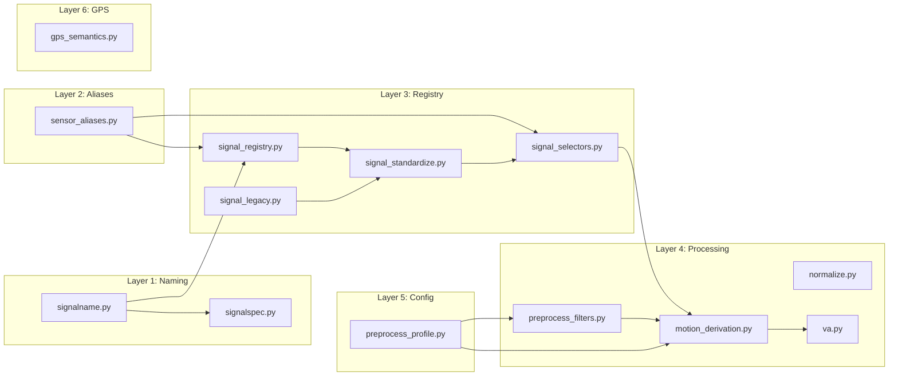

# Specification: Signal Processing

**Created**: 2025-01-23
**Status**: Draft
**Design Docs**: `docs/design/signal-processing.md`

## Scope

**What part of the design is being implemented:**
This spec documents the existing Signal Processing sphere in `analysis/bodaqs_analysis/`.
It covers all 13 Python modules that handle signal naming, registry, standardization,
normalization, preprocessing, motion derivation, and GPS semantics. This is a backfill
spec — it documents what the code currently does, not what it should do.

**Out of scope for this spec:**
- Event detection (`detect.py`)
- Segment extraction (`segment.py`)
- Metrics computation (`metrics.py`)
- Bike profile parsing and transforms (`bike_profile.py`)
- FIT file I/O (`io_fit.py`)
- Logger CSV/BDQ I/O (`io_logger.py`, `io_bdq.py`)
- Timebase estimation (`timebase.py`) — consumed but not owned
- Resampling (`resample.py`)
- Pipeline orchestration (`pipeline.py`)

## Design Context

### Relevant Invariants

- **INV-1**: Every numeric column in `session['df']` (excluding timebase and non-signal columns) MUST have a registry entry.
- **INV-2**: Each registry entry MUST contain `kind`, `unit`, `domain`, `op_chain`.
- **INV-3**: `kind` MUST be `""`, `"raw"`, or `"qc"`.
- **INV-4**: Engineered signals MUST have non-empty `unit`.
- **INV-5**: Raw signals SHOULD have unit `"counts"`.
- **INV-6**: Physical signals MUST have non-empty `sensor` and `quantity`.
- **INV-7**: `quantity` MUST be in `{disp, vel, acc, disp_norm, raw}`.
- **INV-8**: Unit↔quantity consistency enforced (except `disp_norm` check is commented out).
- **INV-9**: `op_chain` MUST be a list of strings.
- **INV-10**: Selectors MUST match at most one signal.
- **INV-11**: Butterworth cutoff MUST be below Nyquist.
- **INV-12**: S-G window MUST be odd and > `poly_order`.
- **INV-13**: Motion derivation source MUST be engineered displacement [mm].
- **INV-14**: Profile `schema` MUST be `"bodaqs.preprocess_profile"`, `version` MUST be `1`.
- **INV-15**: Profile MUST NOT contain runtime binding fields.
- **INV-16**: Legacy normalization MUST NOT create duplicate columns.
- **INV-17**: `canonical_end()` accepts only `"front"` and `"rear"`.
- **INV-18**: Excluded signals are ignored by selectors.
- **INV-19**: GPS route building requires resolvable lat/lon columns.
- **INV-20**: If disp selector is null, vel selector MUST be null.

### Relevant Contracts

- Signal name grammar: `<base><kind><domain> [unit]_op_<t1>_<t2>...`
- Signal registry shape: `{column_name: SignalInfo}`
- Preprocess profile document: `{schema, version, profile_id, description?, config}`
- Signal selector: `{end?, quantity?, domain?, unit?, processing_role?, motion_source_id?, motion_profile_id?}`

### Relevant Failure Modes

- Unparseable signal names (handled per strict mode)
- Missing units on engineered signals (raises `SignalSemanticsError`)
- Legacy rename collisions (raises `ValueError`)
- Selector multi-match (raises `ValueError`)
- Butterworth cutoff >= Nyquist (raises `ValueError`)
- scipy unavailable (raises `ImportError` or falls back to NumPy)
- Motion derivation source not displacement (raises `ValueError`)
- Invalid preprocess profile (raises `ValueError`)

---

## Component Specifications

### SignalNameParser — `analysis/bodaqs_analysis/signalname.py`

**Design doc reference:** [SignalNameParser component contract](docs/design/signal-processing.md#signalnameparser--signalnamepy)
**Depends on:** SignalSpec (`signalspec.py`)

#### Interface Signatures

```python
class SignalNameError(ValueError): ...

@dataclass(frozen=True)
class SignalNameParts:
    base: str
    kind: str = ""           # "", "raw", "qc"
    domain: Optional[str] = None
    unit: Optional[str] = None
    ops: tuple[str, ...] = ()

    @property
    def is_engineered_default(self) -> bool: ...
    @property
    def is_raw(self) -> bool: ...
    @property
    def is_qc(self) -> bool: ...

def parse_signal_name(name: str, spec: SignalSpec = DEFAULT_SPEC) -> SignalNameParts: ...
def format_signal_name(parts: SignalNameParts, spec: SignalSpec = DEFAULT_SPEC) -> str: ...
```

#### Validation Rules

| Field | Rule | Error |
|-------|------|-------|
| `name` | Must be non-empty string | `SignalNameError` |
| `base` | Must be non-empty after stripping kind/domain | `SignalNameError` |
| `unit` | If bracket present, must be non-empty | `SignalNameError` |
| `ops` | If `_op_` present, must have tokens | `SignalNameError` |
| `ops` | No repeated `_op_` prefix | `SignalNameError` |
| `ops` | Each token must be allowed (when `strict_ops=True`) | `SignalNameError` |
| `domain` | Must be in allowed set (when `strict_domains=True`) | `SignalNameError` |
| `parts.base` | Must be non-empty string | `SignalNameError` |
| `parts.kind` | Must be `""`, `"raw"`, or `"qc"` | `SignalNameError` |

#### Error Specifications

| Error | When | Payload | Caller must |
|-------|------|---------|-------------|
| `SignalNameError` | Malformed name, unknown op/domain, missing base | Message string | Catch and handle (register with notes or re-raise) |

#### Acceptance Criteria

- **AC1:** Given `"rear_shock_dom_suspension [mm]"`, When `parse_signal_name`, Then returns `base="rear_shock"`, `kind=""`, `domain="suspension"`, `unit="mm"`, `ops=()`.
- **AC2:** Given `"rear_shock [mm]_op_zeroed_norm"`, When `parse_signal_name`, Then returns `ops=("zeroed", "norm")`.
- **AC3:** Given `"battery_v_raw [counts]"`, When `parse_signal_name`, Then returns `kind="raw"`, `unit="counts"`.
- **AC4:** Given `"rear_shock [mm]_op_Butterworth_3Hz_4Order"`, When `parse_signal_name`, Then coalesces to `ops=("Butterworth_3Hz_4Order",)`.
- **AC5:** Given `"rear_shock [mm]_op_Butterworth_3Hz_4Order_resid"`, When `parse_signal_name`, Then returns `ops=("zeroed", "diff")` (Butterworth removed, `diff` added).
- **AC6:** Given `SignalNameParts(base="x", kind="raw", unit="counts")`, When `format_signal_name`, Then returns `"x_raw [counts]"`.
- **AC7:** Given `"rear_shock [mm]_op__zeroed"` (double underscore), When `parse_signal_name`, Then raises `SignalNameError` (repeated `_op_`).

#### Integration Points

| Dependency | Call | Expected response | Error handling |
|------------|------|-------------------|----------------|
| `signalspec` | `is_allowed_op_token(token, spec)` | `bool` | Used for strict op validation |
| `signalspec` | `DEFAULT_SPEC` | `SignalSpec` constant | Used as default |

---

### SignalSpec — `analysis/bodaqs_analysis/signalspec.py`

**Design doc reference:** [SignalSpec component contract](docs/design/signal-processing.md#signalspec--signalspecpy)
**Depends on:** None

#### Interface Signatures

```python
KIND_SUFFIX_RAW = "_raw"
KIND_SUFFIX_QC = "_qc"
DOMAIN_PREFIX = "_dom_"
OP_PREFIX = "_op_"
RAW_UNIT_DEFAULT = "counts"

@dataclass(frozen=True)
class SignalSpec:
    allowed_domains: FrozenSet[str]
    allowed_ops: FrozenSet[str]
    allowed_op_patterns: Tuple[Pattern[str], ...] = ()
    raw_unit_default: str = RAW_UNIT_DEFAULT
    strict_ops: bool = True
    strict_domains: bool = True

DEFAULT_SPEC: SignalSpec

def is_allowed_op_token(token: str, spec: SignalSpec = DEFAULT_SPEC) -> bool: ...
```

#### Validation Rules

| Field | Rule | Error |
|-------|------|-------|
| `token` | Must be in `allowed_ops` OR match an `allowed_op_patterns` regex | Returns `False` (no exception) |

#### Acceptance Criteria

- **AC1:** Given `"zeroed"`, When `is_allowed_op_token`, Then returns `True`.
- **AC2:** Given `"Butterworth_3Hz_4Order"`, When `is_allowed_op_token`, Then returns `True` (matches pattern).
- **AC3:** Given `"Savgol20ms3Poly"`, When `is_allowed_op_token`, Then returns `True` (matches pattern).
- **AC4:** Given `"unknown_op"`, When `is_allowed_op_token`, Then returns `False`.
- **AC5:** `DEFAULT_SPEC.allowed_domains` contains `{"suspension", "wheel", "bike", "world"}`.

---

### SensorAliases — `analysis/bodaqs_analysis/sensor_aliases.py`

**Design doc reference:** [SensorAliases component contract](docs/design/signal-processing.md#sensoraliases--sensor_aliasespy)
**Depends on:** None

#### Interface Signatures

```python
def normalize_sensor_token(value: Any) -> str: ...
def canonical_sensor_id(sensor: Any) -> str: ...
def canonical_sensor_from_text(value: Any) -> str: ...
def canonicalize_signal_base(base: Any) -> str: ...
def sensors_match(left: Any, right: Any) -> bool: ...
def canonical_end(value: Any) -> str: ...
def end_from_sensor(value: Any) -> str: ...
def ends_match(left: Any, right: Any) -> bool: ...
def sensor_side(value: Any) -> str: ...
def sensor_matches_side(value: Any, side: Any) -> bool: ...
```

#### Validation Rules

| Field | Rule | Error |
|-------|------|-------|
| `value` | None/empty → returns `""` | No exception |
| `end` | Must be `"front"` or `"rear"` for `canonical_end` | Returns `""` for others |

#### Acceptance Criteria

- **AC1:** Given `"Front Shock"`, When `normalize_sensor_token`, Then returns `"front_shock"`.
- **AC2:** Given `"front_shock"`, When `canonical_sensor_from_text`, Then returns `"front_shock"`.
- **AC3:** Given `"front"`, When `canonical_end`, Then returns `"front"`.
- **AC4:** Given `"center"`, When `canonical_end`, Then returns `""` (not a valid end).
- **AC5:** Given `"rear_shock"`, When `end_from_sensor`, Then returns `"rear"`.
- **AC6:** Given `"gps"`, When `end_from_sensor`, Then returns `""` (no end for GPS).
- **AC7:** Given `"front_shock"` and `"FrontShock"`, When `sensors_match`, Then returns `True`.

---

### SignalRegistry — `analysis/bodaqs_analysis/signal_registry.py`

**Design doc reference:** [SignalRegistry component contract](docs/design/signal-processing.md#signalregistry--signal_registrypy)
**Depends on:** SignalNameParser, SignalSpec, SensorAliases

#### Interface Signatures

```python
DEFAULT_NON_SIGNAL_COLUMNS: Set[str]

def build_signals_registry(
    session: Dict[str, Any],
    *,
    spec: SignalSpec = DEFAULT_SPEC,
    strict: bool = False,
    non_signal_columns: Optional[Iterable[str]] = None,
) -> Dict[str, Any]: ...
```

#### Validation Rules

| Field | Rule | Error |
|-------|------|-------|
| `session` | Must contain `"df"` and `"meta"` keys | `ValueError` |
| `session["df"]` | Must be a pandas DataFrame | `ValueError` |
| Column | Must be numeric dtype (or bool) to be registered | Skipped silently |
| Column | Must not be in `TIMEBASE_COLUMNS` or `non_signal_columns` | Skipped silently |

#### Error Specifications

| Error | When | Payload | Caller must |
|-------|------|---------|-------------|
| `ValueError` | Session missing `df` or `meta` | Message string | Fix session structure |
| `SignalNameError` | Unparseable column in `strict=True` mode | Message string | Catch or pre-standardize |

#### Acceptance Criteria

- **AC1:** Given a session with numeric column `"rear_shock_dom_suspension [mm]"`, When `build_signals_registry`, Then registry entry has `kind=""`, `unit="mm"`, `domain="suspension"`, `sensor="rear_shock"`, `end="rear"`, `quantity="disp"`.
- **AC2:** Given a session with unparseable column `"weird_column"` and `strict=False`, When `build_signals_registry`, Then entry has `kind=""`, `unit=None`, `notes` containing "unparsed numeric column".
- **AC3:** Given a session with boolish column `"is_valid"` (0/1 values), When `build_signals_registry`, Then entry has `kind="qc"`.
- **AC4:** Given a session with `"time_s"` column, When `build_signals_registry`, Then `"time_s"` is NOT in the registry.
- **AC5:** Given `channel_info` with `{"unit": "mm", "sensor": "rear_shock"}` for a column, When `build_signals_registry`, Then registry entry uses the hinted values.
- **AC6:** Given a raw column `"battery_v_raw"` missing unit, When `build_signals_registry`, Then entry has `unit="counts"` and `kind="raw"`.

#### Integration Points

| Dependency | Call | Expected response | Error handling |
|------------|------|-------------------|----------------|
| `signalname` | `parse_signal_name(col, spec)` | `SignalNameParts` or `SignalNameError` | Catch in non-strict, re-raise in strict |
| `signalspec` | `DEFAULT_SPEC`, `RAW_UNIT_DEFAULT` | Constants | Direct use |
| `sensor_aliases` | `canonical_sensor_from_text`, `canonical_sensor_id`, `end_from_sensor`, `normalize_sensor_token`, `canonical_end` | Normalized strings | Direct use |

---

### SignalStandardize — `analysis/bodaqs_analysis/signal_standardize.py`

**Design doc reference:** [SignalStandardize component contract](docs/design/signal-processing.md#signalstandardize--signal_standardizepy)
**Depends on:** SignalRegistry, SignalLegacy, SignalNameParser, SignalSpec, model.py

#### Interface Signatures

```python
class SignalSemanticsError(ValueError): ...

@dataclass
class StandardizeReport:
    renamed: List[Dict[str, Any]]
    derived: List[str]
    notes: List[str]

def validate_signals_semantics(
    session: Dict[str, Any],
    *,
    spec: SignalSpec = DEFAULT_SPEC,
) -> None: ...

def canonicalize_signal_names(
    session: Dict[str, Any],
    *,
    spec: SignalSpec = DEFAULT_SPEC,
    units_by_base: Optional[Dict[str, str]] = None,
    domain_by_base: Optional[Dict[str, str]] = None,
) -> Dict[str, Any]: ...

def rebuild_and_validate_signal_registry(
    session: Dict[str, Any],
    *,
    spec: SignalSpec = DEFAULT_SPEC,
    strict_registry_parse: bool = True,
) -> Dict[str, Any]: ...

def standardize_signals(
    session: Dict[str, Any],
    *,
    spec: SignalSpec = DEFAULT_SPEC,
    units_by_base: Optional[Dict[str, str]] = None,
    domain_by_base: Optional[Dict[str, str]] = None,
    strict_registry_parse: bool = True,
    derive_va: bool = False,
    va_bases: Optional[Sequence[str]] = None,
) -> Dict[str, Any]: ...
```

#### Validation Rules

| Field | Rule | Error |
|-------|------|-------|
| `kind` | Must be `""`, `"raw"`, or `"qc"` | `SignalSemanticsError` |
| `unit` (engineered) | Must be non-empty string | `SignalSemanticsError` |
| `unit` (raw) | Must be `"counts"` | `SignalSemanticsError` |
| `unit` (qc) | Should be `None` | No error |
| `sensor` (physical) | Must be non-empty | `SignalSemanticsError` |
| `quantity` (physical) | Must be non-empty and in allowed set | `SignalSemanticsError` |
| `quantity="disp"` | Unit must be `"mm"` or `"1"` | `SignalSemanticsError` |
| `quantity="vel"` | Unit must be `"mm/s"` | `SignalSemanticsError` |
| `quantity="acc"` | Unit must be `"mm/s^2"` | `SignalSemanticsError` |
| `quantity="disp_norm"` | Unit should be `"1"` | NOT enforced (commented out) *(unverified intent — needs review)* |
| `derive_va` | Must be `False` | `ValueError` if `True` |

#### Error Specifications

| Error | When | Payload | Caller must |
|-------|------|---------|-------------|
| `SignalSemanticsError` | Semantic validation fails | Multi-line message with all errors | Fix signal metadata or catch |
| `ValueError` | `derive_va=True` | Deprecation message | Use `va.py` instead |

#### Acceptance Criteria

- **AC1:** Given a session with engineered signal missing unit, When `validate_signals_semantics`, Then raises `SignalSemanticsError` with "engineered signal missing unit".
- **AC2:** Given a session with `quantity="vel"` but `unit="mm"`, When `validate_signals_semantics`, Then raises `SignalSemanticsError` with unit mismatch.
- **AC3:** Given a session with legacy column `"rear_shock [mm]_zeroed"`, When `canonicalize_signal_names`, Then column renamed to `"rear_shock [mm]_op_zeroed"` and rename recorded in `session['qc']['naming']['legacy_renames']`.
- **AC4:** Given `derive_va=True`, When `standardize_signals`, Then raises `ValueError` with deprecation message.
- **AC5:** Given a valid session, When `standardize_signals`, Then calls `canonicalize_signal_names` then `rebuild_and_validate_signal_registry`.
- **AC6:** Given a session with `quantity="disp_norm"` and `unit="mm"`, When `validate_signals_semantics`, Then does NOT raise error (check is commented out).

#### Integration Points

| Dependency | Call | Expected response | Error handling |
|------------|------|-------------------|----------------|
| `signal_registry` | `build_signals_registry(session, spec, strict)` | Mutated session | Propagate errors |
| `signal_legacy` | `normalize_legacy_columns(df, spec, ...)` | `(df, list[RenameRecord])` | Propagate `ValueError` on collision |
| `model` | `validate_signals_registry_shape(session)` | `None` or `ValueError` | Propagate |
| `signalname` | `parse_signal_name`, `format_signal_name` | `SignalNameParts` or `SignalNameError` | Propagate |
| `signalspec` | `is_allowed_op_token`, `DEFAULT_SPEC` | bool / constant | Direct use |

---

### SignalLegacy — `analysis/bodaqs_analysis/signal_legacy.py`

**Design doc reference:** [SignalLegacy component contract](docs/design/signal-processing.md#signallegacy--signal_legacypy)
**Depends on:** SignalNameParser, SignalSpec, SensorAliases

#### Interface Signatures

```python
LEGACY_OP_SUFFIXES: Dict[str, str]
DEFAULT_UNITS_BY_BASE: Dict[str, str]
DEFAULT_EXEMPT_COLUMNS: set[str]

@dataclass
class RenameRecord:
    old: str
    new: str
    status: str  # "ok" | "skipped" | "warn"
    reason: str

def normalize_legacy_columns(
    df: pd.DataFrame,
    *,
    spec: SignalSpec = DEFAULT_SPEC,
    units_by_base: Optional[Dict[str, str]] = None,
    domain_by_base: Optional[Dict[str, str]] = None,
    exempt_columns: Optional[Iterable[str]] = None,
) -> Tuple[pd.DataFrame, List[RenameRecord]]: ...
```

#### Validation Rules

| Field | Rule | Error |
|-------|------|-------|
| `df` | Must be a pandas DataFrame | `ValueError` |
| Renamed columns | Must not create duplicates | `ValueError` |

#### Acceptance Criteria

- **AC1:** Given `"rear_shock [mm]_zeroed"`, When `normalize_legacy_columns`, Then renamed to `"rear_shock [mm]_op_zeroed"` with `status="ok"`.
- **AC2:** Given `"battery_v_raw"` (missing unit), When `normalize_legacy_columns`, Then renamed to `"battery_v_raw [counts]"` with `status="ok"`.
- **AC3:** Given `"rear_shock_dom_suspension [mm]"` (already canonical), When `normalize_legacy_columns`, Then `status="skipped"`, reason="already canonical".
- **AC4:** Given `"unknown_weird_name"`, When `normalize_legacy_columns`, Then `status="warn"`, reason="unrecognized legacy pattern", column unchanged.
- **AC5:** Given two columns that would rename to the same name, When `normalize_legacy_columns`, Then raises `ValueError` with collision details.
- **AC6:** Given `"time_s"`, When `normalize_legacy_columns`, Then `status="skipped"`, reason="exempt column".

#### Integration Points

| Dependency | Call | Expected response | Error handling |
|------------|------|-------------------|----------------|
| `signalname` | `parse_signal_name(col, spec)` | `SignalNameParts` or `SignalNameError` | Catch `SignalNameError`, try legacy rewrite |
| `signalname` | `format_signal_name(parts, spec)` | Canonical name string | Direct use |
| `signalspec` | `DEFAULT_SPEC`, `RAW_UNIT_DEFAULT` | Constants | Direct use |
| `sensor_aliases` | `canonicalize_signal_base(base)` | Normalized base string | Direct use |

---

### SignalSelectors — `analysis/bodaqs_analysis/signal_selectors.py`

**Design doc reference:** [SignalSelectors component contract](docs/design/signal-processing.md#signalselectors--signal_selectorspy)
**Depends on:** SensorAliases

#### Interface Signatures

```python
SIGNAL_SELECTOR_FIELDS: set[str]

def selector_matches_signal(
    signal_info: Mapping[str, Any],
    selector: Mapping[str, Any],
) -> bool: ...

def resolve_signal_selector(
    session: Mapping[str, Any],
    selector: Optional[Mapping[str, Any]],
    *,
    purpose: str,
    allow_missing: bool = True,
) -> Optional[str]: ...
```

#### Validation Rules

| Field | Rule | Error |
|-------|------|-------|
| `selector` | Must be `None` or non-empty Mapping | `ValueError` if empty Mapping |
| Match count | Must be 0 or 1 | `ValueError` if >1 match |

#### Acceptance Criteria

- **AC1:** Given signal info `{end: "rear", quantity: "disp", unit: "mm"}` and selector `{end: "rear", quantity: "disp"}`, When `selector_matches_signal`, Then returns `True`.
- **AC2:** Given signal info with `semantic_selection_excluded: True`, When `selector_matches_signal`, Then returns `False` regardless of selector.
- **AC3:** Given selector `{end: "front"}` and signals with only rear entries, When `resolve_signal_selector` with `allow_missing=True`, Then returns `None`.
- **AC4:** Given selector matching 2 signals, When `resolve_signal_selector`, Then raises `ValueError`.
- **AC5:** Given `selector=None`, When `resolve_signal_selector`, Then returns `None`.
- **AC6:** Given empty selector `{}`, When `resolve_signal_selector`, Then raises `ValueError`.

#### Integration Points

| Dependency | Call | Expected response | Error handling |
|------------|------|-------------------|----------------|
| `sensor_aliases` | `canonical_end(value)` | Normalized end string | Used for end comparison |

---

### Normalize — `analysis/bodaqs_analysis/normalize.py`

**Design doc reference:** [Normalize component contract](docs/design/signal-processing.md#normalize--normalizepy)
**Depends on:** SignalNameParser, SignalSpec

#### Interface Signatures

```python
TIME_COL_CANDIDATES_DEFAULT: tuple[str, ...]

def zero_signal_columns(
    df: pd.DataFrame,
    ranges: Dict[str, float],
    *,
    time_col_candidates: Sequence[str] = TIME_COL_CANDIDATES_DEFAULT,
    zeroing_enabled: bool = True,
    zero_window_s: float = 0.4,
    zero_per_segment: bool = False,
    segment_col: str = "segment_id",
    min_samples_abs_min: int = 10,
    use_median_window: bool = True,
    return_meta: bool = False,
) -> Union[pd.DataFrame, Tuple[pd.DataFrame, Dict[str, Any]]]: ...

def scale_signal_columns(
    df: pd.DataFrame,
    ranges: Dict[str, float],
    *,
    clip_0_1: bool = False,
    zeroed_columns: Optional[Sequence[str]] = None,
    return_meta: bool = False,
) -> Union[pd.DataFrame, Tuple[pd.DataFrame, Dict[str, Any]]]: ...

def normalize_and_scale(
    df: pd.DataFrame,
    ranges: Dict[str, float],
    *,
    time_col_candidates: Sequence[str] = TIME_COL_CANDIDATES_DEFAULT,
    zeroing_enabled: bool = True,
    zero_window_s: float = 0.4,
    zero_per_segment: bool = False,
    segment_col: str = "segment_id",
    min_samples_abs_min: int = 10,
    clip_0_1: bool = False,
    output_suffix_norm: str = "_norm",
    use_median_window: bool = True,
    return_meta: bool = False,
) -> Union[pd.DataFrame, Tuple[pd.DataFrame, Dict[str, Any]]]: ...
```

#### Validation Rules

| Field | Rule | Error |
|-------|------|-------|
| Zeroing target | Must be engineered signal (`kind=""`) with unit | `ValueError` |
| `ranges` values | Must be numeric, > 0 for scaling | NaN output if invalid |
| Column in `ranges` | Must exist in DataFrame | Recorded as `status="missing"` in meta |

#### Acceptance Criteria

- **AC1:** Given a DataFrame with `"rear_shock [mm]"` and `ranges={"rear_shock [mm]": 150.0}`, When `zero_signal_columns`, Then base column values are offset-subtracted in-place.
- **AC2:** Given a zeroed column, When `scale_signal_columns`, Then creates `"rear_shock [1]_op_zeroed_norm"` column with values divided by range.
- **AC3:** Given `clip_0_1=True`, When `scale_signal_columns`, Then normalized values clipped to [0, 1].
- **AC4:** Given `zeroing_enabled=False`, When `zero_signal_columns`, Then values unchanged, meta records `method="zeroing_disabled"`.
- **AC5:** Given a column not in DataFrame, When `zero_signal_columns`, Then meta records `status="missing"` (no exception).
- **AC6:** Given `normalize_and_scale` with `zeroing_enabled=True`, When called, Then creates both `_op_zeroed` and `_op_zeroed_norm` columns.

#### Integration Points

| Dependency | Call | Expected response | Error handling |
|------------|------|-------------------|----------------|
| `signalname` | `parse_signal_name(col, spec)` | `SignalNameParts` | `ValueError` if not engineered |
| `signalname` | `format_signal_name(parts, spec)` | Canonical name | Direct use |
| `signalspec` | `DEFAULT_SPEC` | Constant | Direct use |

---

### PreprocessFilters — `analysis/bodaqs_analysis/preprocess_filters.py`

**Design doc reference:** [PreprocessFilters component contract](docs/design/signal-processing.md#preprocessfilters--preprocess_filterspy)
**Depends on:** SignalNameParser, SignalSpec

#### Interface Signatures

```python
@dataclass(frozen=True)
class ButterworthSmoothingConfig:
    cutoff_hz: float
    order: int
    op_tag: str

    def as_dict(self) -> Dict[str, Any]: ...

def build_butterworth_op_tag(cutoff_hz: float, order: int) -> str: ...

def normalize_butterworth_smoothing_configs(
    configs: Optional[Sequence[Mapping[str, Any]]],
) -> List[ButterworthSmoothingConfig]: ...

def apply_butterworth_smoothing(
    df: pd.DataFrame,
    *,
    sample_rate_hz: float,
    configs: Sequence[ButterworthSmoothingConfig],
    generate_residuals: bool = False,
    spec: SignalSpec = DEFAULT_SPEC,
) -> Tuple[pd.DataFrame, Dict[str, Any]]: ...
```

#### Validation Rules

| Field | Rule | Error |
|-------|------|-------|
| `cutoff_hz` | Must be > 0 and finite | `ValueError` |
| `order` | Must be positive integer | `ValueError` |
| `cutoff_hz` | Must be < Nyquist (`0.5 * sample_rate_hz`) | `ValueError` |
| `sample_rate_hz` | Must be > 0 and finite | `ValueError` |
| Configs | No duplicates after op_tag canonicalization | `ValueError` |

#### Error Specifications

| Error | When | Payload | Caller must |
|-------|------|---------|-------------|
| `ValueError` | Invalid config params | Message string | Fix config |
| `ValueError` | Cutoff >= Nyquist | Message with cutoff and Nyquist | Lower cutoff or raise sample rate |
| `ImportError` | scipy unavailable | Message string | Install scipy or skip smoothing |

#### Acceptance Criteria

- **AC1:** Given `cutoff_hz=3.0, order=4`, When `build_butterworth_op_tag`, Then returns `"Butterworth_3Hz_4Order"`.
- **AC2:** Given `cutoff_hz=2.5, order=4`, When `build_butterworth_op_tag`, Then returns `"Butterworth_2p5Hz_4Order"`.
- **AC3:** Given two configs with same cutoff/order, When `normalize_butterworth_smoothing_configs`, Then raises `ValueError` for duplicate.
- **AC4:** Given a DataFrame with `"rear_shock [mm]"` and valid config, When `apply_butterworth_smoothing`, Then creates `"rear_shock [mm]_op_Butterworth_3Hz_4Order"` column.
- **AC5:** Given `generate_residuals=True`, When `apply_butterworth_smoothing`, Then creates `"rear_shock [mm]_op_Butterworth_3Hz_4Order_resid"` column.
- **AC6:** Given a column with < 3 valid samples, When `apply_butterworth_smoothing`, Then column skipped with warning, no exception.
- **AC7:** Given `cutoff_hz=500` and `sample_rate_hz=100`, When `apply_butterworth_smoothing`, Then raises `ValueError` (cutoff >= Nyquist).

#### Integration Points

| Dependency | Call | Expected response | Error handling |
|------------|------|-------------------|----------------|
| `signalname` | `parse_signal_name`, `format_signal_name` | Parts / canonical name | Direct use |
| `signalspec` | `DEFAULT_SPEC` | Constant | Direct use |
| `scipy.signal` | `butter`, `sosfiltfilt` | Filter coefficients / filtered array | `ImportError` if unavailable |

---

### PreprocessProfile — `analysis/bodaqs_analysis/preprocess_profile.py`

**Design doc reference:** [PreprocessProfile component contract](docs/design/signal-processing.md#preprocessprofile--preprocess_profilepy)
**Depends on:** None (stdlib only)

#### Interface Signatures

```python
PREPROCESS_PROFILE_SCHEMA: str  # "bodaqs.preprocess_profile"
PREPROCESS_PROFILE_VERSION: int  # 1
DEFAULT_PREPROCESS_PROFILE_DIR: Path
DEFAULT_PREPROCESS_PROFILE_CONFIG: Dict[str, Any]

def default_preprocess_config(**overrides: Any) -> Dict[str, Any]: ...
def normalize_preprocess_config_keys(config: Mapping[str, Any]) -> Dict[str, Any]: ...
def make_preprocess_profile(
    profile_id: str,
    *,
    config: Optional[Mapping[str, Any]] = None,
    description: Optional[str] = None,
    version: int = PREPROCESS_PROFILE_VERSION,
    extra_fields: Optional[Mapping[str, Any]] = None,
) -> Dict[str, Any]: ...
def preprocess_profile_filename(profile_id: str, *, version: int = ...) -> str: ...
def preprocess_profile_path(profile_id: str, *, directory: ..., version: int = ...) -> Path: ...
def save_preprocess_profile(
    profile: Mapping[str, Any],
    path: str | Path,
    *,
    overwrite: bool = True,
    create_dirs: bool = True,
) -> Path: ...
def discover_preprocess_profiles(
    directory: str | Path = DEFAULT_PREPROCESS_PROFILE_DIR,
    *,
    pattern: str = "*.json",
    include_invalid: bool = False,
) -> list[Dict[str, Any]]: ...
def load_preprocess_profile(path: str | Path) -> Dict[str, Any]: ...
def load_preprocess_config(path: str | Path) -> Dict[str, Any]: ...
def preprocess_config_from_profile(profile: Mapping[str, Any]) -> Dict[str, Any]: ...
def validate_preprocess_profile(
    profile: Mapping[str, Any],
    *,
    path: Optional[str | Path] = None,
) -> None: ...
def validate_preprocess_config(
    config: Mapping[str, Any],
    *,
    label: str = "",
) -> None: ...
def resolve_preprocess_config_paths(
    config: Mapping[str, Any],
    *,
    base_dir: str | Path,
) -> Dict[str, Any]: ...
```

#### Validation Rules

| Field | Rule | Error |
|-------|------|-------|
| `schema` | Must be `"bodaqs.preprocess_profile"` | `ValueError` |
| `version` | Must be `1` | `ValueError` |
| `profile_id` | Must be non-empty string | `ValueError` |
| `config` | Must be a Mapping | `ValueError` |
| Required config keys | Must all be present | `ValueError` listing missing |
| Forbidden config keys | Must not be present | `ValueError` listing forbidden |
| `schema_path` | Must be non-empty string | `ValueError` |
| `strict` | Must be boolean | `ValueError` |
| `zeroing_enabled` | Must be boolean | `ValueError` |
| `clip_0_1` | Must be boolean | `ValueError` |
| `butterworth_smoothing` | Must be a list | `ValueError` |
| `zero_window_s` | Must be numeric | `ValueError` |
| `zero_min_samples` | Must be integer | `ValueError` |
| `active_window/padding/min_seg` | Must be non-empty string | `ValueError` |
| `active_signal_disp_selector` | If null, vel selector must also be null | `ValueError` |
| Motion derivation | If enabled, sources non-empty, primary required | `ValueError` |
| Motion derivation source ids | Must be unique | `ValueError` |
| Motion derivation cutoffs | Must be > 0 | `ValueError` |
| Motion derivation orders | Must be positive integers | `ValueError` |
| Activity detection candidates | Must have unique ids | `ValueError` |
| Activity detection candidate type | Must be in allowed set | `ValueError` |
| Signal selector fields | Must be in allowed set | `ValueError` |

#### Error Specifications

| Error | When | Payload | Caller must |
|-------|------|---------|-------------|
| `ValueError` | Invalid profile/config | Message with field name and label | Fix profile JSON |
| `FileNotFoundError` | Profile file doesn't exist | Message with path | Check path |
| `FileExistsError` | Save without overwrite | Message with path | Use `overwrite=True` |

#### Acceptance Criteria

- **AC1:** Given `default_preprocess_config()`, When called with no overrides, Then returns a dict with all required keys.
- **AC2:** Given a profile with `schema="wrong"`, When `validate_preprocess_profile`, Then raises `ValueError`.
- **AC3:** Given a config missing `"strict"`, When `validate_preprocess_config`, Then raises `ValueError` listing `"strict"` as missing.
- **AC4:** Given a config with `"bike_profile_path"`, When `validate_preprocess_config`, Then raises `ValueError` listing forbidden key.
- **AC5:** Given a valid profile, When `save_preprocess_profile` then `load_preprocess_profile`, Then loaded profile matches saved.
- **AC6:** Given a directory with 3 valid and 1 invalid JSON, When `discover_preprocess_profiles` with `include_invalid=False`, Then returns 3 records.
- **AC7:** Given `resolve_preprocess_config_paths` with `base_dir="/tmp"`, When called, Then `schema_path` resolved against base_dir.
- **AC8:** Given `active_signal_disp_selector=null` and `active_signal_vel_selector={...}`, When `validate_preprocess_config`, Then raises `ValueError`.
- **AC9:** Given motion derivation with `enabled=true` and empty `sources`, When `validate_preprocess_config`, Then raises `ValueError`.

#### Integration Points

| Dependency | Call | Expected response | Error handling |
|------------|------|-------------------|----------------|
| `json` (stdlib) | `json.load`, `json.dumps` | Parsed JSON | Propagate parse errors |
| `pathlib` (stdlib) | `Path` operations | Path objects | Direct use |

---

### MotionDerivation — `analysis/bodaqs_analysis/motion_derivation.py`

**Design doc reference:** [MotionDerivation component contract](docs/design/signal-processing.md#motionderivation--motion_derivationpy)
**Depends on:** PreprocessFilters, SignalSelectors, SignalNameParser, SignalSpec, VelocityAcceleration

#### Interface Signatures

```python
@dataclass(frozen=True)
class MaterializedSavgolWindow:
    requested_window_ms: float
    requested_samples: int
    window_points: int
    poly_order: int
    adjusted: bool
    warnings: Tuple[str, ...] = ()

    def as_dict(self) -> Dict[str, Any]: ...

def build_savgol_op_tag(window_ms: float, poly_order: int) -> str: ...

def sg_window_samples(
    window_ms: float,
    fs_hz: float,
    poly_order: int,
    *,
    signal_length: Optional[int] = None,
    strict: bool = True,
) -> MaterializedSavgolWindow: ...

def derive_motion_channels(
    session: Mapping[str, Any],
    motion_derivation: Optional[Mapping[str, Any]],
    *,
    sample_rate_hz: float,
    strict: bool = True,
    overwrite_existing_primary: bool = False,
    spec: SignalSpec = DEFAULT_SPEC,
) -> Tuple[pd.DataFrame, Dict[str, Any]]: ...
```

#### Validation Rules

| Field | Rule | Error |
|-------|------|-------|
| `window_ms` | Must be > 0 | `ValueError` |
| `fs_hz` | Must be > 0 | `ValueError` |
| `poly_order` | Must be positive integer | `ValueError` |
| `sample_rate_hz` | Must be > 0 | `ValueError` |
| Displacement cutoff | Must be < Nyquist | `ValueError` |
| Velocity cutoff | Must be < Nyquist | `ValueError` |
| Acceleration cutoff | Must be < Nyquist | `ValueError` |
| Source column | Must be `kind=""` and `unit="mm"` | `ValueError` |
| S-G window | Must be odd, > poly_order, <= signal_length | Adjusted or `ValueError` in strict |

#### Error Specifications

| Error | When | Payload | Caller must |
|-------|------|---------|-------------|
| `ValueError` | Non-positive params, cutoff >= Nyquist, wrong source type | Message string | Fix config or catch |
| `ImportError` | scipy unavailable for Butterworth | Message string | Install scipy |

#### Acceptance Criteria

- **AC1:** Given `window_ms=20.0, fs_hz=1000.0, poly_order=3`, When `sg_window_samples`, Then `requested_samples=20`, `window_points=21` (adjusted to odd).
- **AC2:** Given `window_ms=20.0, fs_hz=1000.0, poly_order=3, signal_length=10`, When `sg_window_samples` with `strict=True`, Then `window_points=9` (reduced for signal length), `adjusted=True`.
- **AC3:** Given `signal_length=2`, When `sg_window_samples` with `strict=True`, Then raises `ValueError` (too short).
- **AC4:** Given `motion_derivation.enabled=False`, When `derive_motion_channels`, Then returns `(df.copy(), {enabled: False, generated: [], ...})`.
- **AC5:** Given a valid session with rear_wheel displacement source, When `derive_motion_channels`, Then generates 3 columns: disp, vel, acc with `processing_role="primary_analysis"`.
- **AC6:** Given a secondary profile with `id="low_bandwidth"`, When `derive_motion_channels`, Then generates columns with suffix (e.g., `lp20hz`).
- **AC7:** Given `strict=False` and a source that can't be resolved, When `derive_motion_channels`, Then source recorded as skipped, no exception.
- **AC8:** Given a primary disp output column that already exists, When `derive_motion_channels` with `overwrite_existing_primary=False`, Then existing column annotated, not overwritten.

#### Integration Points

| Dependency | Call | Expected response | Error handling |
|------------|------|-------------------|----------------|
| `preprocess_filters` | `build_butterworth_op_tag(cutoff, order)` | Op tag string | Direct use |
| `signal_selectors` | `resolve_signal_selector(session, selector, ...)` | Column name or None | Skip if None |
| `signalname` | `parse_signal_name`, `format_signal_name` | Parts / canonical name | Propagate `ValueError` |
| `signalspec` | `DEFAULT_SPEC` | Constant | Direct use |
| `va` | `_effective_savgol_params`, `_savgol_numpy` | S-G params / filtered array | Fallback |
| `scipy.signal` | `butter`, `sosfiltfilt`, `savgol_filter` | Filter results | `ImportError` for Butterworth, fallback for S-G |

---

### VelocityAcceleration — `analysis/bodaqs_analysis/va.py`

**Design doc reference:** [VelocityAcceleration component contract](docs/design/signal-processing.md#velocityacceleration--vapy)
**Depends on:** SignalNameParser, SignalSpec

#### Interface Signatures

```python
def name_vel(col: str) -> str: ...
def name_acc(col: str) -> str: ...

def estimate_va(
    df: pd.DataFrame,
    cols: Optional[Sequence[str]] = None,
    sample_rate_hz: Optional[float] = None,
    time_col: str = "time_s",
    window_points: int = 11,
    poly_order: int = 3,
    vel_suffix: str = "_vel",
    acc_suffix: str = "_acc",
    *,
    return_meta: bool = False,
) -> Union[pd.DataFrame, Tuple[pd.DataFrame, Dict[str, Any]]]: ...
```

#### Validation Rules

| Field | Rule | Error |
|-------|------|-------|
| `window_points` | Must be odd | `ValueError` |
| `poly_order` | Must be < `window_points` and >= 1 | `ValueError` |
| `name_vel`/`name_acc` input | Must be engineered (`kind=""`) with `unit="mm"` | `ValueError` |
| dt inference | Must find valid time column or DatetimeIndex | `ValueError` |

#### Acceptance Criteria

- **AC1:** Given `"rear_shock [mm]"`, When `name_vel`, Then returns `"rear_shock_vel [mm/s]"`.
- **AC2:** Given `"rear_shock [mm]"`, When `name_acc`, Then returns `"rear_shock_acc [mm/s^2]"`.
- **AC3:** Given `"battery_v_raw [counts]"`, When `name_vel`, Then raises `ValueError` (not engineered).
- **AC4:** Given a DataFrame with `time_s` column and numeric data, When `estimate_va`, Then creates `_vel` and `_acc` columns for all numeric columns.
- **AC5:** Given `sample_rate_hz=1000.0`, When `estimate_va`, Then dt = 0.001s.
- **AC6:** Given `window_points=10` (even), When `estimate_va`, Then raises `ValueError`.
- **AC7:** Given scipy unavailable, When `estimate_va`, Then falls back to NumPy S-G implementation.

#### Integration Points

| Dependency | Call | Expected response | Error handling |
|------------|------|-------------------|----------------|
| `signalname` | `parse_signal_name`, `format_signal_name` | Parts / canonical name | `ValueError` for non-engineered |
| `signalspec` | `DEFAULT_SPEC` | Constant | Direct use |
| `scipy.signal` | `savgol_filter` (optional) | Filtered array | Fallback to `_savgol_numpy` |

---

### GPSSemantics — `analysis/bodaqs_analysis/gps_semantics.py`

**Design doc reference:** [GPSSemantics component contract](docs/design/signal-processing.md#gpssemantics--gps_semanticspy)
**Depends on:** timebase.py (consumer only)

#### Interface Signatures

```python
GPS_SOURCES_SCHEMA: str  # "bodaqs.gps_sources"
GPS_SOURCES_VERSION: int  # 1
DEFAULT_LOGGER_GPS_STREAM_NAME: str  # "gps_logger"

@dataclass(frozen=True)
class GPSColumnSet:
    latitude: str
    longitude: str
    altitude: Optional[str] = None
    speed: Optional[str] = None
    heading: Optional[str] = None
    distance: Optional[str] = None
    valid: Optional[str] = None
    age: Optional[str] = None
    seq: Optional[str] = None
    fresh: Optional[str] = None
    fix_type: Optional[str] = None
    satellites: Optional[str] = None
    horizontal_accuracy: Optional[str] = None
    vertical_accuracy: Optional[str] = None
    sensor: Optional[str] = None
    source: Optional[str] = None
    source_kind: str = "unknown"

    @property
    def quality_columns(self) -> dict[str, str]: ...

def normalize_gps_source_policy(value: Optional[Mapping[str, Any]]) -> dict[str, Any]: ...
def resolve_gps_columns(
    metadata: Mapping[str, Any],
    *,
    known_columns: Optional[set[str]] = None,
    require_logger_source: bool = False,
) -> Optional[GPSColumnSet]: ...
def build_logger_gps_route_stream(
    session: dict[str, Any],
    *,
    gps_source_policy: Optional[Mapping[str, Any]] = None,
) -> dict[str, Any]: ...
def refresh_gps_source_metadata(
    session: dict[str, Any],
    *,
    gps_source_policy: Optional[Mapping[str, Any]] = None,
) -> dict[str, Any]: ...
def preferred_gps_source_name(
    session: Mapping[str, Any],
    *,
    fallback: Optional[str] = None,
) -> Optional[str]: ...
def gps_source_kind(
    source_id: str,
    metadata: Mapping[str, Any],
    *,
    latitude_col: Optional[str] = None,
) -> str: ...
```

#### Validation Rules

| Field | Rule | Error |
|-------|------|-------|
| `preferred_source` | Must be in allowed set or defaults to `"logger_then_fit"` | No exception *(unverified intent — needs review)* |
| GPS resolution | Requires both lat and lon columns | Returns `None` if either missing |
| Route building | Requires `time_s` column in DataFrame | Returns session unmodified |

#### Acceptance Criteria

- **AC1:** Given metadata with lat/lon columns, When `resolve_gps_columns`, Then returns `GPSColumnSet` with paired columns.
- **AC2:** Given metadata with no lat column, When `resolve_gps_columns`, Then returns `None`.
- **AC3:** Given `preferred_source="invalid_value"`, When `normalize_gps_source_policy`, Then returns `preferred_source="logger_then_fit"` (silent fallback).
- **AC4:** Given a session with GPS data in primary df, When `build_logger_gps_route_stream`, Then creates `session['stream_dfs']['gps_logger']` with filtered route.
- **AC5:** Given a session with no GPS columns, When `build_logger_gps_route_stream`, Then returns session unmodified.
- **AC6:** Given multiple GPS sources, When `refresh_gps_source_metadata` with `preferred_source="best_coverage"`, Then selects source with most valid points.
- **AC7:** Given `require_logger_source=True` and only FIT GPS columns, When `resolve_gps_columns`, Then returns `None`.
- **AC8:** Given route with `seq` column, When `build_logger_gps_route_stream`, Then deduplicates by seq (keep first).

#### Integration Points

| Dependency | Call | Expected response | Error handling |
|------------|------|-------------------|----------------|
| `timebase` | `register_stream_metadata(session, ...)` | Stream metadata entry | Propagate `ValueError` for unsupported kind |

---

## Implementation Approach

### High-Level Architecture

The Signal Processing sphere is organized as a layered pipeline:



### Key Decisions

| Decision | Choice | Rationale |
|----------|--------|-----------|
| Signal name grammar | `<base><kind><domain> [unit]_op_<tokens>` | Encodes semantics in column name while remaining parseable |
| Registry as source of truth | `session['meta']['signals']` dict | Decouples resolution from column-name string matching |
| Strict vs permissive modes | `strict` parameter on registry builder | Allows early permissive registration, later strict validation |
| Op token coalescing | 3-token lookahead in parser | Handles composite tags like `Butterworth_3Hz_4Order` |
| S-G fallback | NumPy implementation in `va.py` | Works without scipy for basic VA estimation |
| Motion derivation provenance | `op_chain` + `derivation` dict in registry | Full filter/derivation history without encoding in column name |
| Profile path resolution | Explicit `resolve_preprocess_config_paths()` | Avoids hidden magic; caller chooses resolution base |
| GPS source preference | Policy-based with silent fallback | Lenient by default; strict via `require_logger_source` |

### Alternatives Considered

| Alternative | Why not chosen |
|-------------|----------------|
| Full semantic alias mapping (fork→front_shock) | Explicitly avoided per `sensor_aliases.py` docstring: "map those to explicit semantics in log metadata" |
| Automatic path resolution in profile loading | Deliberately a helper, not hidden magic — notebooks/CLIs choose resolution strategy |
| scipy required for all filtering | `va.py` provides NumPy fallback for S-G; Butterworth requires scipy (no fallback) |

## Dependencies

### Design Dependencies

- `docs/analysis/contracts/BODAQS_Minimum_Signal_Registry_Semantics_v0_1_1.md` — defines minimum registry shape
- `docs/analysis/contracts/BODAQS_Preprocess_Profile_Contract_v0_draft.md` — defines profile document contract

### Spec Dependencies

- None — this is a backfill spec documenting existing code

### Package Dependencies

- `pandas` — DataFrame operations
- `numpy` — numerical computations
- `scipy` (optional) — Butterworth filtering, Savitzky-Golay (falls back to NumPy for S-G in `va.py`)
- Python stdlib: `json`, `pathlib`, `re`, `dataclasses`, `decimal`, `logging`, `collections.abc`, `typing`

## Open Questions

| # | Question | Blocks | Resolution |
|---|----------|--------|------------|
| 1 | Should `_scaled` legacy suffix map to `cal` or `scale`? | SignalLegacy | UNRESOLVED *(unverified intent — needs review)* |
| 2 | Is the `DEFAULT_EXEMPT_COLUMNS` missing comma a bug? | SignalLegacy | UNRESOLVED *(unverified intent — needs review)* |
| 3 | Should `disp_norm` → `1` unit check be enabled? | SignalStandardize | UNRESOLVED *(unverified intent — needs review)* |
| 4 | Should `zero_signal_columns` create `_op_zeroed` columns or zero in-place? | Normalize | UNRESOLVED *(unverified intent — needs review)* |
| 5 | Should `TIME_COL_CANDIDATES` global mutation be removed? | Normalize | UNRESOLVED *(unverified intent — needs review)* |
| 6 | Should `estimate_va` validate columns are displacement? | VelocityAcceleration | UNRESOLVED *(unverified intent — needs review)* |
| 7 | Should invalid GPS source policy raise instead of silent fallback? | GPSSemantics | UNRESOLVED *(unverified intent — needs review)* |
| 8 | Is `_name_zeroed_norm` dead code? | Normalize | UNRESOLVED *(unverified intent — needs review)* |
| 9 | Should `activity_detection` and `gps_source_policy` be in the contract? | PreprocessProfile | UNRESOLVED *(unverified intent — needs review)* |
| 10 | Should `derive_va` parameter be removed from `standardize_signals`? | SignalStandardize | UNRESOLVED *(unverified intent — needs review)* |

## Risks

| Risk | Mitigation |
|------|------------|
| `DEFAULT_EXEMPT_COLUMNS` bug may cause unexpected column registration | Document as known issue; fix via `spec:bugfix` after backfill |
| Global `TIME_COL_CANDIDATES` mutation is not thread-safe | Document as known issue; avoid concurrent use |
| `disp_norm` unit check disabled may allow invalid data | Document as known issue; enable via `spec:bugfix` |
| scipy dependency for Butterworth may break environments without scipy | `va.py` has NumPy fallback; Butterworth does not |
| Legacy Butterworth smoothing may conflict with motion derivation | Both can run; pipeline ordering determines precedence |

## Success Criteria

- [x] Design doc created at `docs/design/signal-processing.md` with backfilled header
- [x] Spec created at `docs/specs/signal-processing/spec.md`
- [x] All 13 modules documented with interface signatures, validation rules, and acceptance criteria
- [x] All 20 invariants numbered and documented
- [x] All 10 open questions classified as "Unknown" (unverified intent — needs review)
- [x] Failure modes table includes both handled and unhandled cases
- [x] Mermaid architecture diagram included
- [x] No code changed — documentation only
